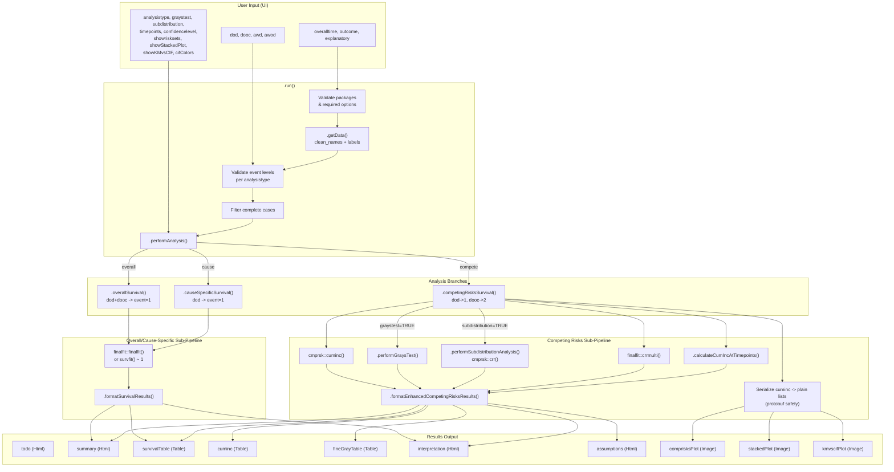

# `competingsurvival` Developer Documentation

> **Menu path:** SurvivalD > Drafts > "Survival for Different Outcomes"
> **Version:** 0.0.3 | **JAS:** 1.2 | **JRS:** 1.1 | **JUS:** 3.0

---

## 1. Overview

The `competingsurvival` analysis provides a unified interface for three flavors of time-to-event analysis on multi-outcome clinical data:

| Mode | `analysistype` value | What it does |
|---|---|---|
| **Overall Survival** | `overall` | Treats every death (disease or other cause) as an event. Standard Kaplan-Meier / Cox via `finalfit::finalfit()`. |
| **Cause-Specific Survival** | `cause` | Only disease-related deaths count as events; competing deaths are censored. Standard Cox via `finalfit::finalfit()`. |
| **Competing Risks** | `compete` | Estimates cumulative incidence functions (CIF) via `cmprsk::cuminc()`, optionally runs Gray's test and the Fine-Gray subdistribution hazard model via `cmprsk::crr()`. |

The function lives in the **Drafts** submenu because it has a TODO to validate CIF estimates, Gray's p-values, and Fine-Gray HRs against the Klein & Moeschberger BMT reference dataset before promotion to production.

**Key R dependencies:** `survival`, `survminer`, `finalfit`, `cmprsk`, `janitor`, `labelled`, `glue`, `scales`, `ggplot2`, `dplyr`.

---

## 2. UI Controls to Options Map

The `.u.yaml` defines four layout sections. Below is the complete mapping from every UI widget to its YAML option name.

### Variable Supplier Panel

| UI Widget | Widget Type | Option Name | Notes |
|---|---|---|---|
| Time Variable | VariablesListBox | `overalltime` | maxItemCount: 1, numeric only |
| Outcome Variable | VariablesListBox | `outcome` | maxItemCount: 1, factor only |
| Group Variable (Optional) | VariablesListBox | `explanatory` | maxItemCount: 1, factor only |

### Event Levels Panel

| UI Widget | Widget Type | Option Name | Parent Enable |
|---|---|---|---|
| Primary Event (e.g., Death from Disease) | LevelSelector | `dod` | `(outcome)` |
| Competing Event (e.g., Death from Other Causes) | LevelSelector | `dooc` | `(outcome)` |
| Censored with Event (e.g., Alive with Disease) | LevelSelector | `awd` | `(outcome)` |
| Censored without Event (e.g., Alive without Disease) | LevelSelector | `awod` | `(outcome)` |

### Analysis Options Panel

| UI Widget | Widget Type | Option Name |
|---|---|---|
| Analysis Type | ComboBox | `analysistype` |
| Gray's Test for Competing Risks | CheckBox | `graystest` |
| Subdistribution Hazard Model (Fine-Gray) | CheckBox | `subdistribution` |

### Display Options Panel

| UI Widget | Widget Type | Option Name | Format |
|---|---|---|---|
| Time Points for Risk Estimates | TextBox | `timepoints` | string |
| Confidence Level (0-1) | TextBox | `confidencelevel` | number |
| Show Number at Risk | CheckBox | `showrisksets` | -- |
| Show Stacked Probability Plot | CheckBox | `showStackedPlot` | -- |
| Show 1-KM vs CIF Comparison | CheckBox | `showKMvsCIF` | -- |
| CIF Color Scheme | ComboBox | `cifColors` | -- |

---

## 3. Options Reference

All 16 options defined in `competingsurvival.a.yaml`, with their types, defaults, and downstream effects.

| # | Option | Type | Default | Permitted / Range | Downstream Effect |
|---|---|---|---|---|---|
| 1 | `data` | Data | -- | data.frame | Passed to `self$data`; processed by `.getData()` |
| 2 | `explanatory` | Variable | `null` | factor (ordinal, nominal) | Optional group variable. When NULL, analyses run without group comparisons. Drives `finalfit()` explanatory arg, `cmprsk::cuminc(group=)`, and Fine-Gray covariate matrix. |
| 3 | `overalltime` | Variable | -- | numeric (continuous) | Follow-up time in months. Used as `ftime` in `cmprsk::cuminc()` and `Surv()` time component. |
| 4 | `outcome` | Variable | -- | factor (ordinal, nominal) | Multi-level outcome factor. Its levels are mapped to event codes via `dod`, `dooc`, `awd`, `awod`. |
| 5 | `dod` | Level | `null` (allowNone) | level of `outcome` | "Dead of Disease" -- coded as event=1 in all analysis types. Required for `cause` and `compete`. |
| 6 | `dooc` | Level | `null` (allowNone) | level of `outcome` | "Dead of Other Causes" -- coded as event=2 in `compete`, event=1 in `overall`, censored=0 in `cause`. Required for `compete`. |
| 7 | `awd` | Level | `null` (allowNone) | level of `outcome` | "Alive with Disease" -- always coded as censored=0. |
| 8 | `awod` | Level | `null` (allowNone) | level of `outcome` | "Alive without Disease" -- always coded as censored=0. |
| 9 | `analysistype` | List | `overall` | `overall`, `cause`, `compete` | Master switch. Determines which `.performAnalysis()` branch executes. Controls visibility of `cuminc`, `comprisksPlot`, `stackedPlot`, `kmvscifPlot` result items. |
| 10 | `graystest` | Bool | `false` | -- | When TRUE + `compete`, calls `.performGraysTest()`. Results appear in `summary` HTML. Requires `explanatory` to produce `$Tests` from `cmprsk::cuminc()`. |
| 11 | `subdistribution` | Bool | `false` | -- | When TRUE + `compete`, calls `.performSubdistributionAnalysis()`. Populates `fineGrayTable` and adds subdistribution HR row to `survivalTable`. Requires `explanatory`. |
| 12 | `timepoints` | String | `"12,24,36,60"` | comma-separated numerics | Parsed into numeric vector. Used by `.calculateCumIncAtTimepoints()` and `.formatCumulativeIncidence()` for the `cuminc` table rows. |
| 13 | `confidencelevel` | Number | `0.95` | 0.50 -- 0.99 | Used for CI calculation in Fine-Gray model, cumulative incidence at timepoints, and display labels. |
| 14 | `showrisksets` | Bool | `false` | -- | When TRUE + `compete`, appends a summary risk-set count to the `summary` HTML. Full risk table is a TODO. |
| 15 | `showStackedPlot` | Bool | `false` | -- | Controls visibility of `stackedPlot` (requires `analysistype:compete` too). |
| 16 | `showKMvsCIF` | Bool | `false` | -- | Controls visibility of `kmvscifPlot` (requires `analysistype:compete` too). |
| -- | `cifColors` | List | `default` | `default`, `colorblind`, `grayscale` | Color palette for all three competing-risks plots. Default = Red/Blue, Colorblind = Okabe-Ito, Grayscale = monochrome. |

**Note:** Options 1-8 are "core" -- changing any of them triggers a full re-analysis. Options 9-16 are "configuration" -- some only affect display or specific sub-analyses.

---

## 4. Backend Usage

### Class Hierarchy

```
jmvcore::Analysis
  └── competingsurvivalBase  (auto-generated from YAML)
        └── competingsurvivalClass  (R/competingsurvival.b.R)
```

### Private Methods (in execution order)

#### `.init()`
- **Purpose:** Clear the welcome message when both `overalltime` and `outcome` are selected.
- **Side effects:** Sets `self$results$todo` content to empty string.

#### `.getData()`
- **Purpose:** Clean column names with `janitor::clean_names()`, preserve original labels with `labelled::set_variable_labels()`, and resolve user-facing variable names to cleaned column names.
- **Returns:** A named list: `mydata_labelled`, `mytime_labelled`, `myoutcome_labelled`, `myexplanatory_labelled`.
- **Pattern:** Same label-lookup pattern used across the survival module family.

#### `.run()`
- **Purpose:** Entry point. Validates required packages (`finalfit`, `cmprsk`), shows welcome HTML when no variables selected, validates event levels per analysis type, filters complete cases, and dispatches to `.performAnalysis()`.
- **Validation rules:**
  - `overall`: needs at least one of `dod` or `dooc`
  - `cause`: needs `dod`
  - `compete`: needs both `dod` and `dooc`

#### `.performAnalysis(mydata, mytime, myoutcome, myexplanatory, analysistype, dod, dooc, awd, awod)`
- **Purpose:** Router. Dispatches to one of three analysis methods based on `analysistype`.

#### `.overallSurvival(...)`
- **Event coding:** `dod` and `dooc` both map to event=1; everything else maps to 0.
- **With explanatory:** Uses `finalfit::finalfit(dependent_os, myexplanatory)`.
- **Without explanatory:** Fits `survival::survfit(Surv ~ 1)` and reports median survival.
- **Output:** Calls `.formatSurvivalResults()` then `.generateInterpretation()`.

#### `.causeSpecificSurvival(...)`
- **Event coding:** Only `dod` maps to event=1; all others (including `dooc`) map to 0.
- **With/without explanatory:** Same pattern as `.overallSurvival()`.
- **Output:** Calls `.formatSurvivalResults()` then `.generateInterpretation()`.

#### `.competingRisksSurvival(...)`
- **Event coding:** `dod` -> 1, `dooc` -> 2, `awd`/`awod`/default -> 0.
- **Minimum event validation:** Requires at least 5 events of each type.
- **Core CIF:** `cmprsk::cuminc(ftime, fstatus, group, cencode=0)`.
- **Gray's test:** Extracted from `cuminc_result$Tests` via `.performGraysTest()`.
- **Fine-Gray:** `cmprsk::crr(ftime, fstatus, cov1, failcode=1, cencode=0)` via `.performSubdistributionAnalysis()`.
- **Traditional CR regression:** `finalfit::crrmulti()` with `fit2df()`.
- **CIF at timepoints:** `.calculateCumIncAtTimepoints()`.
- **Protobuf safety:** `cuminc` objects are manually serialized to plain lists (time/est/var vectors and Tests as data.frame) before `setState()`.
- **Plot state:** Shared across `comprisksPlot`, `stackedPlot`, and `kmvscifPlot`.

#### `.performGraysTest(cuminc_result)`
- **Input:** The `cmprsk::cuminc` result object.
- **Output:** A list with `$disease_death` and `$other_death` sub-lists, each containing `statistic`, `p_value`, `df`.
- **Requires:** An explanatory variable (otherwise `$Tests` is NULL).

#### `.performSubdistributionAnalysis(mydata, time_var, status_var, group_var, myexplanatory, conf_level)`
- **Binary factors:** Converts to 0/1 numeric.
- **Multi-level factors:** Creates dummy matrix via `model.matrix()` with treatment contrasts. Issues a warning about interpretation complexity.
- **Model:** `cmprsk::crr(failcode=1, cencode=0)`.
- **Output:** List with `hr`, `ci_lower`, `ci_upper`, `p_value`, `model`, `comparison`, `n_coef`.

#### `.calculateCumIncAtTimepoints(cuminc_result, timepoints, conf_level)`
- **Method:** For each timepoint and each group in the cuminc result, finds the closest observed time via `which.min(abs(times - tp))` and extracts estimate, SE, and Wald CI.
- **Output:** Nested list keyed by timepoint string, then by group name.

#### `.formatCumulativeIncidence(cuminc_result, timepoints)`
- **Purpose:** Populates the `cuminc` Table result with rows for each timepoint showing CIF estimates and variances for the first and last event groups.

#### `.formatEnhancedCompetingRisksResults(result_crr, cuminc_result, grays_test_result, subdist_result, cuminc_timepoints, timepoints)`
- **Purpose:** Master formatter for competing risks mode. Populates `survivalTable`, `fineGrayTable`, `summary` HTML, and calls `.formatCumulativeIncidence()` and `.generateInterpretation()`.

#### `.formatSurvivalResults(result, analysis_type)`
- **Purpose:** Populates `survivalTable` from `finalfit` output for overall and cause-specific modes.
- **HR parsing:** Uses `.parseHRText()` to extract numeric HR, CI, and p-value from finalfit's text-formatted output strings.

#### `.parseHRText(hr_text)`
- **Purpose:** Regex parser for finalfit HR text formats like `"1.23 (0.89-1.67, p=0.045)"`.
- **Handles:** Dash, "to", or comma-separated CI ranges; `p=`, `p<`, `p>` formats.

#### `.generateInterpretation(analysis_type)`
- **Purpose:** Sets `interpretation` HTML content with analysis-type-specific clinical guidance.
- **Also:** Populates `assumptions` HTML with a fixed set of competing risks caveats.

#### `.plotCompetingRisks(image, ggtheme, theme, ...)`
- **Purpose:** Render the CIF step-function plot.
- **Data source:** `image$state` (set by `.competingRisksSurvival()`).
- **Method:** Converts cuminc serialized data to a long-format data.frame, then plots with `ggplot2::geom_step()`.
- **Color palettes:** Switched by `cifColors` option.

#### `.stackedPlot(image, ggtheme, theme, ...)`
- **Purpose:** Stacked area plot showing CIF1 + CIF2 + Survival = 100%.
- **Method:** Extracts first two event-type CIF curves, interpolates CIF2 onto CIF1's time grid with `approx()`, computes `survival = 1 - CIF1 - CIF2`, then uses `ggplot2::geom_area()`.
- **Guard:** Returns FALSE if `showStackedPlot` is FALSE or `analysistype != "compete"`.

#### `.kmvscifPlot(image, ggtheme, theme, ...)`
- **Purpose:** Side-by-side comparison of naive 1-KM (biased) vs proper CIF (unbiased) for disease death.
- **Method:** Fits a standard KM treating competing events as censored, computes 1-KM, then overlays the proper CIF. Both curves interpolated to a common time grid.
- **Guard:** Returns FALSE if `showKMvsCIF` is FALSE or `analysistype != "compete"`.

#### `.escapeVar(x)`
- **Purpose:** Sanitize variable names for safe use. Replaces non-alphanumeric characters with underscores.

---

## 5. Results Definition

All 10 result items defined in `competingsurvival.r.yaml`.

| # | Name | Type | Visible | renderFun | Key clearWith triggers |
|---|---|---|---|---|---|
| 1 | `todo` | Html | always | -- | explanatory, outcome, overalltime |
| 2 | `summary` | Html | always | -- | All core + config options |
| 3 | `survivalTable` | Table (0 rows) | always | -- | All core + config options |
| 4 | `cuminc` | Table (0 rows) | `(analysistype:compete)` | -- | Core vars + timepoints |
| 5 | `comprisksPlot` | Image (700x400) | `(analysistype:compete)` | `.plotCompetingRisks` | Core vars + cifColors, showrisksets |
| 6 | `stackedPlot` | Image (700x500) | `(showStackedPlot && analysistype:compete)` | `.stackedPlot` | Core vars + cifColors, showStackedPlot |
| 7 | `kmvscifPlot` | Image (700x500) | `(showKMvsCIF && analysistype:compete)` | `.kmvscifPlot` | Core vars + cifColors, showKMvsCIF |
| 8 | `interpretation` | Html | always | -- | Core vars + config options |
| 9 | `assumptions` | Html | always | -- | overalltime, outcome, explanatory, analysistype |
| 10 | `fineGrayTable` | Table (0 rows) | `(subdistribution)` | -- | Core vars + confidencelevel, subdistribution |

### survivalTable Column Schema

| Column | Title | Type | Format | Populated by |
|---|---|---|---|---|
| `term` | Variable | text | -- | `.formatSurvivalResults()` or `.formatEnhancedCompetingRisksResults()` |
| `hr` | HR | number | -- | Hazard ratio (or median survival when no explanatory) |
| `ci_lower` | CI Lower | number | -- | Lower confidence bound |
| `ci_upper` | CI Upper | number | -- | Upper confidence bound |
| `p_value` | p-value | number | `zto,pvalue` | Wald p-value |

### cuminc Column Schema

| Column | Title | Type | Populated by |
|---|---|---|---|
| `time` | Time | number | `.formatCumulativeIncidence()` -- user-specified timepoints |
| `est_1` | CIF Disease Death | number | CIF estimate for first event group |
| `est_2` | CIF Other Death | number | CIF estimate for last event group |
| `var_1` | Variance 1 | number | Variance of CIF estimate 1 |
| `var_2` | Variance 2 | number | Variance of CIF estimate 2 |

### fineGrayTable Column Schema

| Column | Title | Type | Format | Notes |
|---|---|---|---|---|
| `term` | Term | text | -- | Covariate name from `cmprsk::crr()` summary |
| `coef` | Coefficient | number | -- | Log subdistribution HR |
| `hr` | HR | number | -- | Exponentiated coefficient |
| `hr_lower` | HR CI Lower | number | -- | Lower CI of HR |
| `hr_upper` | HR CI Upper | number | -- | Upper CI of HR |
| `se` | SE | number | -- | Standard error of coefficient |
| `z` | z | number | -- | Wald z-statistic |
| `p` | p | number | `zto,pvalue` | Wald p-value |

---

## 6. Data Flow Diagram



---

## 7. Execution Sequence

### Happy Path: Competing Risks Analysis

```
1.  .init()
      └── Clear todo content (if overalltime + outcome selected)

2.  .run()
      ├── Check requireNamespace('finalfit', 'cmprsk')
      ├── Show welcome HTML if outcome/overalltime missing → return
      ├── .getData() → labelled data + resolved column names
      ├── Validate: dod + dooc both required for "compete"
      ├── Filter NAs (include explanatory column if provided)
      └── .performAnalysis(..., analysistype="compete")

3.  .competingRisksSurvival()
      ├── Recode outcome → status_crr: dod=1, dooc=2, else=0
      ├── Validate n_disease_events >= 5, n_competing_events >= 5
      ├── cmprsk::cuminc(ftime, fstatus, group?, cencode=0)
      ├── [if graystest] .performGraysTest(cuminc_result)
      ├── [if subdistribution] .performSubdistributionAnalysis(...)
      ├── [if explanatory] finalfit::crrmulti() → fit2df()
      ├── .calculateCumIncAtTimepoints(cuminc_result, timepoints)
      ├── .formatEnhancedCompetingRisksResults(...)
      │     ├── Populate survivalTable rows
      │     ├── [if subdistribution] Populate fineGrayTable rows
      │     ├── Build summary HTML (Gray's test + CIF timepoints table)
      │     ├── .formatCumulativeIncidence() → cuminc table rows
      │     └── .generateInterpretation("Competing Risks")
      │           ├── Set interpretation HTML
      │           └── Set assumptions HTML
      ├── [if showrisksets] Append risk-set summary to summary HTML
      ├── Serialize cuminc object → plain list (protobuf safe)
      └── setState() on comprisksPlot, stackedPlot, kmvscifPlot

4.  [Deferred render] .plotCompetingRisks()
      └── Read state → build long-format df → geom_step()

5.  [Deferred render] .stackedPlot()  (if showStackedPlot)
      └── Read state → CIF1 + CIF2 + S(t) → geom_area()

6.  [Deferred render] .kmvscifPlot()  (if showKMvsCIF)
      └── Read state → fit KM → 1-KM vs CIF → geom_step()
```

---

## 8. Change Impact Guide

### Adding a New Analysis Type

1. Add option value to `analysistype` in `.a.yaml` and `.u.yaml` ComboBox.
2. Add a new branch in `.performAnalysis()`.
3. Create the new analysis method (follow `.overallSurvival()` pattern).
4. Update `.generateInterpretation()` switch statement.
5. Add visibility conditions in `.r.yaml` if new results are analysis-type-specific.

### Changing Outcome Level Handling

The outcome-to-status mapping is centralized per analysis type:
- **overall:** Lines 178-183 in `.b.R` (`death_levels <- c(dod, dooc)`)
- **cause:** Lines 220-222 (`status_dss <- ifelse(outcome == dod, 1, 0)`)
- **compete:** Lines 260-268 (`case_when` with dod=1, dooc=2, else=0)

Changes here cascade to all downstream statistics and plots. Be especially careful with the competing risks coding because `cmprsk::cuminc()` and `cmprsk::crr()` both depend on the numeric status values matching `cencode=0` and `failcode=1`.

### Modifying the CIF Plot

The plot data flow is: `.competingRisksSurvival()` serializes cuminc to `plot_state` -> `setState()` -> `.plotCompetingRisks()` reads `image$state`. Any new plot data must go through the serialization step (lines 403-434) to avoid protobuf errors.

### Adding New Time-Based Statistics

Hook into `.calculateCumIncAtTimepoints()` which already returns nested estimate/SE/CI per group per timepoint. For new metrics (e.g., restricted mean), add to this method and update `.formatEnhancedCompetingRisksResults()` accordingly.

### Fine-Gray Model: Multi-Level Factor Warning

When `explanatory` has more than 2 levels, the current code creates dummy variables but only reports the first coefficient in the `survivalTable`. The `fineGrayTable` reports all coefficients. A future enhancement could add automatic pairwise comparisons.

---

## 9. Example Usage

### Available Test Datasets

- `data/competing_survival_data.rda` -- primary test dataset
- `data/survival_competing.rda` -- alternative competing risks dataset
- `data/competing_risks_person_time.rda` -- person-time format

### R Wrapper Function Call

```r
# Load the package
library(ClinicoPath)

# Load test data
data("competing_survival_data")

# Overall survival (default)
competingsurvival(
    data = competing_survival_data,
    explanatory = "treatment_group",
    overalltime = "follow_up_months",
    outcome = "outcome_status",
    dod = "Dead of Disease",
    dooc = "Dead of Other Causes",
    awd = "Alive with Disease",
    awod = "Alive without Disease",
    analysistype = "overall"
)

# Full competing risks analysis
competingsurvival(
    data = competing_survival_data,
    explanatory = "treatment_group",
    overalltime = "follow_up_months",
    outcome = "outcome_status",
    dod = "Dead of Disease",
    dooc = "Dead of Other Causes",
    awd = "Alive with Disease",
    awod = "Alive without Disease",
    analysistype = "compete",
    graystest = TRUE,
    subdistribution = TRUE,
    timepoints = "12,24,36,60",
    confidencelevel = 0.95,
    showrisksets = TRUE,
    showStackedPlot = TRUE,
    showKMvsCIF = TRUE,
    cifColors = "colorblind"
)

# Cause-specific survival without group comparison
competingsurvival(
    data = competing_survival_data,
    overalltime = "follow_up_months",
    outcome = "outcome_status",
    dod = "Dead of Disease",
    dooc = "Dead of Other Causes",
    awd = "Alive with Disease",
    awod = "Alive without Disease",
    analysistype = "cause"
)
```

---

## 10. Appendix

### Known TODOs in Source Code

1. **Validation (HIGH priority):** Test CIF estimates, Gray's test p-values, and Fine-Gray HRs against Klein & Moeschberger BMT dataset reference values before promoting from Drafts.
2. **Risk Table (MEDIUM priority):** Implement proper risk table beneath CIF plot using `survminer::ggrisktable()` or custom annotation layer. Currently shows summary counts only.
3. **Multi-level Fine-Gray:** Only the first coefficient is reported in `survivalTable` for multi-level factors. Full coefficient table is in `fineGrayTable`.

### Protobuf Serialization Pattern

The `cmprsk::cuminc()` result object can contain environments and function references that break jamovi's protobuf serialization. The solution (lines 403-420) manually extracts `$time`, `$est`, `$var` vectors and converts `$Tests` to `data.frame` before `setState()`.

### HR Text Parsing

The `.parseHRText()` method handles finalfit's various output formats. Known patterns:
- `"1.23 (0.89-1.67, p=0.045)"` -- dash-separated CI
- `"1.23 (0.89, 1.67, p=0.045)"` -- comma-separated CI
- `"1.23 (0.89 to 1.67, p=0.045)"` -- "to"-separated CI
- `"1.23 (0.89-1.67)"` -- CI without p-value

### Referenced Packages

| Package | Used for |
|---|---|
| `survival` | `Surv()`, `survfit()` |
| `survminer` | Referenced in refs (future risk table) |
| `finalfit` | `finalfit()`, `crrmulti()`, `fit2df()` |
| `cmprsk` | `cuminc()`, `crr()` |
| `janitor` | `clean_names()` for data preparation |
| `labelled` | `set_variable_labels()`, `var_label()` |
| `glue` | HTML template generation |
| `scales` | `percent` formatter for y-axis labels |
| `ggplot2` | All three plot render functions |
| `dplyr` | `filter()`, `case_when()` in data preparation |
