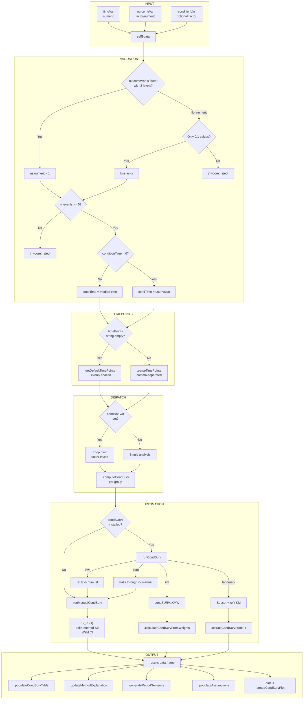
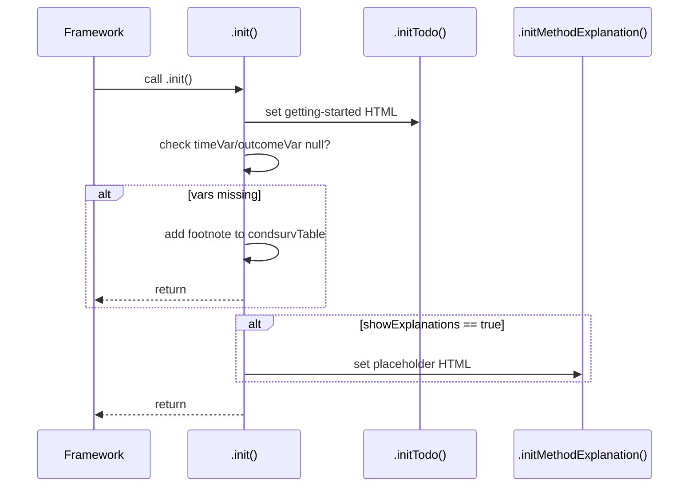
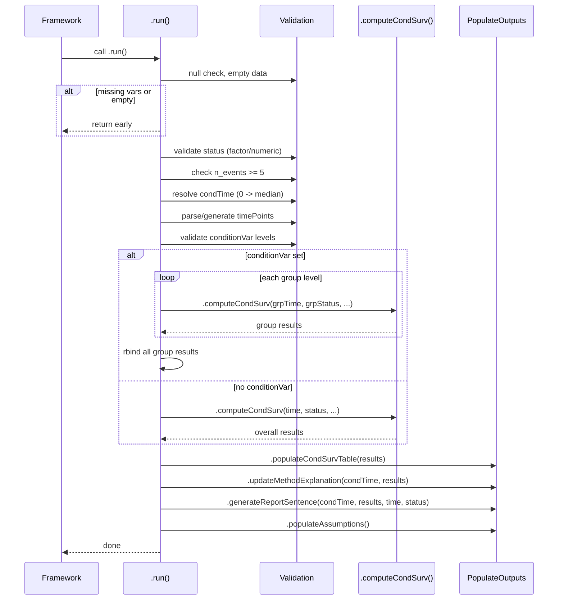
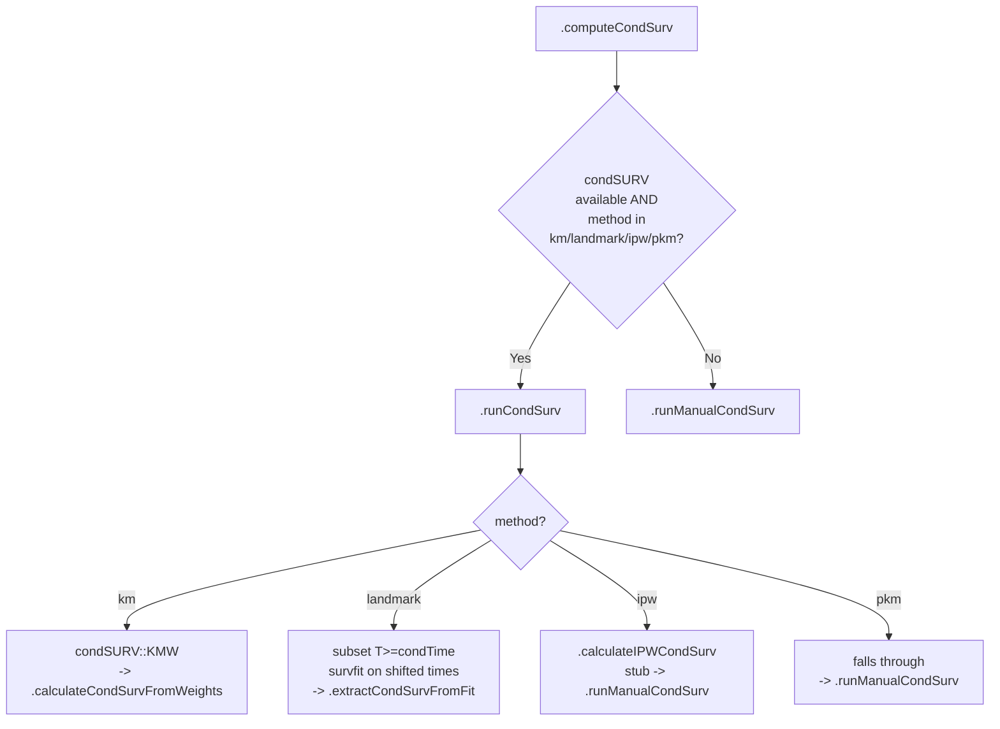
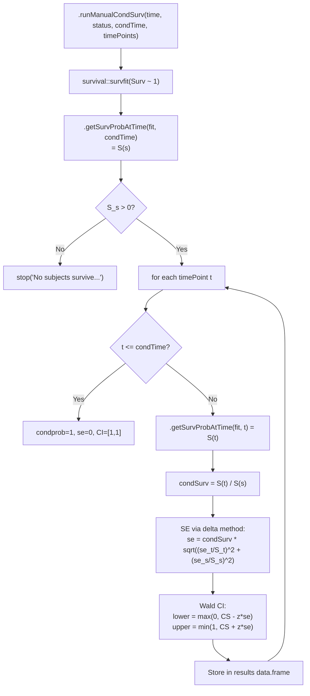
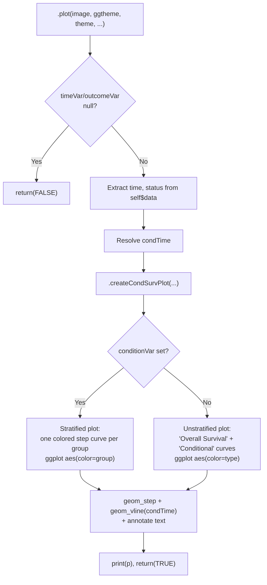

# `conditionalsurvival` Developer Documentation

> **Menu path:** SurvivalD > ClinicoPath Survival > "Conditional Survival, Landmark Analysis, Advanced Methods"
> **Version:** 0.0.1 | **JAS:** 1.2 | **JRS:** 1.1 | **JUS:** 3.0

---

## 1. Overview

The `conditionalsurvival` analysis estimates **conditional survival probabilities** -- the probability of surviving beyond a future time point *t*, given that a patient has already survived to a conditioning time point *s*. The core formula is:

```
CS(t | t0) = P(T > t) / P(T > t0)
```

This is clinically valuable for updating prognosis after a patient has survived an initial period (e.g., "What is the 5-year survival probability for a patient who has already survived 2 years?").

### Estimation Methods

| Method Key | Display Name | Implementation | Package |
|---|---|---|---|
| `km` | Kaplan-Meier Weights | `condSURV::KMW()` for weights, then weighted at-risk estimation; falls back to manual S(t)/S(t0) ratio | `condSURV` (optional), `survival` |
| `landmark` | Landmark Approach | Subsets data to subjects with T >= condTime, refits KM on shifted times | `survival` |
| `ipw` | Inverse Probability Weighting | **Stub** -- currently delegates to manual method (see `.calculateIPWCondSurv()` TODO) | `survival` |
| `pkm` | Presmoothed Kaplan-Meier | Falls through to manual method when `condSURV` is available; uses manual otherwise | `survival` |

When the `condSURV` package is not installed, all methods fall back to `.runManualCondSurv()`, which computes the S(t)/S(s) ratio from a standard `survival::survfit` object with delta-method standard errors and Wald confidence intervals.

### Key Dependencies

| Package | Role | Required? |
|---|---|---|
| `survival` | `survfit()`, `Surv()` for KM estimation | Yes |
| `condSURV` | `KMW()` for Kaplan-Meier weights method | No (optional, graceful fallback) |
| `ggplot2` | Plot rendering (`geom_step`, `geom_vline`, `annotate`) | Yes (for plots) |
| `scales` | `scales::percent` for y-axis formatting in plots | Yes (for plots) |

### Known Limitations / TODOs

- **`plotType` option** (`curves`/`probability`/`both`) is declared in the YAML but **not yet implemented** in `.plot()`. Currently always renders the `curves` view.
- **`bandwidth` option** is declared and read into a local variable but **never used**. Intended for kernel-smoothed conditional survival with the `pkm` method.
- **IPW method** (`ipw`) is a stub that delegates to the manual method. A proper IPCW estimator (Beran 1981) is not yet coded.

---

## 2. UI Controls to Options Map

The `.u.yaml` defines two layout sections: a variable supplier panel and two collapsible option panels.

### Variable Supplier Panel

| UI Widget | Widget Type | Option Name | Constraints | Notes |
|---|---|---|---|---|
| Time Variable | VariablesListBox | `timeVar` | maxItemCount: 1, isTarget: true | Numeric survival time |
| Event/Status Variable | VariablesListBox | `outcomeVar` | maxItemCount: 1, isTarget: true | 0/1 numeric or 2-level factor |
| Conditioning Variable (optional) | VariablesListBox | `conditionVar` | maxItemCount: 1, isTarget: true | Stratification variable; enables per-group analysis |

### Analysis Options Panel (CollapseBox, open by default)

| UI Widget | Widget Type | Option Name | Format |
|---|---|---|---|
| Estimation Method | ComboBox | `method` | List selection |
| Conditioning Time Point | TextBox | `conditionTime` | number |
| Bandwidth (for smoothing methods) | TextBox | `bandwidth` | number |
| Confidence Level | TextBox | `confInt` | number |
| Specific Time Points | TextBox | `timePoints` | string |

### Display Options Panel (CollapseBox, collapsed by default)

| UI Widget | Widget Type | Option Name | Format |
|---|---|---|---|
| Plot Type | ComboBox | `plotType` | List selection |
| Show Results Table | CheckBox | `showTable` | boolean |
| Show Survival Plot | CheckBox | `showPlot` | boolean |
| Show Explanations | CheckBox | `showExplanations` | boolean |

---

## 3. Options Reference

All 12 options defined in `conditionalsurvival.a.yaml` (excluding `data`), with their types, defaults, and downstream effects.

| # | Option | Type | Default | Permitted / Range | Downstream Effect |
|---|---|---|---|---|---|
| 1 | `timeVar` | Variable | `null` | numeric; suggested: continuous | Mapped to `time` vector in `.run()`. Used in `survival::Surv(time, status)`. Drives all survival computations. |
| 2 | `outcomeVar` | Variable | `null` | numeric, factor; suggested: ordinal, nominal | Converted to 0/1 status. If factor: must have exactly 2 levels (converted via `as.numeric() - 1`). If numeric: must contain only 0 and 1. |
| 3 | `conditionVar` | Variable | `null` | numeric, factor; suggested: ordinal, nominal, continuous | When set: enables stratified analysis (loop over factor levels). Must have >= 2 levels. Groups with < 3 events are skipped. Drives `group` column visibility in `condsurvTable`. |
| 4 | `conditionTime` | Number | `0` | any numeric | The time *s* to condition on. When 0 (or NA/NULL): automatically set to `median(time)`. Validated against `max(time)` -- rejected if `condTime >= maxTime`. |
| 5 | `method` | List | `km` | `km`, `landmark`, `ipw`, `pkm` | Dispatches to different estimation strategies in `.computeCondSurv()`. Affects method label in report sentence and method explanation HTML. |
| 6 | `bandwidth` | Number | `0` | any numeric | **Currently unused.** Read into local variable but not passed to any computation. Intended for kernel smoothing in `pkm` method. |
| 7 | `confInt` | Number | `0.95` | 0.01--0.99 | Used to compute z-value for Wald CI: `z = qnorm(1 - (1 - confInt)/2)`. Affects `lower`/`upper` columns and report sentence. |
| 8 | `timePoints` | String | `''` | comma-separated numbers | Parsed by `.parseTimePoints()` via `strsplit(str, ",")`. If empty: `.getDefaultTimePoints()` generates 5 evenly spaced points from `condTime` to `max(time)`. |
| 9 | `plotType` | List | `curves` | `curves`, `probability`, `both` | **Not yet implemented.** Read but not acted upon in `.plot()`. Always renders step-function curves. |
| 10 | `showTable` | Bool | `true` | -- | Controls visibility of `condsurvTable` via `visible: (showTable)`. |
| 11 | `showPlot` | Bool | `true` | -- | Controls visibility of `survplot` via `visible: (showPlot)`. |
| 12 | `showExplanations` | Bool | `true` | -- | Controls visibility of `methodExplanation` via `visible: (showExplanations)`. Also gates `.initMethodExplanation()` and `.updateMethodExplanation()` calls. |

---

## 4. Backend Usage (.b.R)

### Class Structure

```
conditionalsurvivalClass (R6)
  └── inherits conditionalsurvivalBase (auto-generated from .yaml)
        └── inherits jmvcore::Analysis
```

### Method Inventory

| Method | Called By | Purpose | Lines |
|---|---|---|---|
| `.init()` | framework | Sets todo HTML, validates required vars, inits method explanation | 5--22 |
| `.run()` | framework | Main orchestrator: validates data, dispatches computation, populates all outputs | 24--182 |
| `.computeCondSurv(time, status, condTime, timePoints, has_condsurv)` | `.run()` | Dispatcher: routes to `.runCondSurv()` or `.runManualCondSurv()` | 185--192 |
| `.runCondSurv(time, status, condTime, timePoints)` | `.computeCondSurv()` | Uses `condSURV` package: KMW for `km`, landmark subsetting, IPW stub, pkm fallback | 238--276 |
| `.runManualCondSurv(time, status, condTime, timePoints)` | `.computeCondSurv()`, `.runCondSurv()`, `.calculateIPWCondSurv()` | Core computation: S(t)/S(s) ratio with delta-method SE | 278--346 |
| `.calculateCondSurvFromWeights(time, status, weights, timePoints, condTime)` | `.runCondSurv()` | Weighted at-risk estimation from KMW weights | 348--399 |
| `.calculateIPWCondSurv(time, status, condTime, timePoints)` | `.runCondSurv()` | Stub: delegates to `.runManualCondSurv()` | 401--407 |
| `.extractCondSurvFromFit(fit, adjTimePoints, condTime)` | `.runCondSurv()` | Extracts survival probabilities from `survfit` object for landmark method | 409--444 |
| `.getSurvProbAtTime(fit, time)` | multiple | Looks up S(t) from `survfit` object at given time | 446--459 |
| `.getSurvSEAtTime(fit, time)` | `.runManualCondSurv()` | Returns SE of S(t) = `S(t) * fit$std.err` (log-transform correction) | 461--478 |
| `.parseTimePoints()` | `.run()` | Parses comma-separated `timePoints` string to numeric vector | 480--495 |
| `.getDefaultTimePoints(time, condTime)` | `.run()` | Generates 5 time points via `seq(condTime, maxTime, length.out=6)` | 497--514 |
| `.plot(image, ggtheme, theme, ...)` | framework (render) | Orchestrates plot rendering via `.createCondSurvPlot()` | 194--236 |
| `.createCondSurvPlot(time, status, condTime, ggtheme, conditionVar, data)` | `.plot()` | Builds ggplot2 step-function plot; handles stratified vs. unstratified | 544--678 |
| `.populateCondSurvTable(results, condTime)` | `.run()` | Clears rows, adds result rows, adds footnote | 516--542 |
| `.generateReportSentence(condTime, results, time, status)` | `.run()` | Generates copy-ready HTML report sentence(s) | 680--739 |
| `.populateAssumptions()` | `.run()` | Sets static HTML for assumptions panel | 741--760 |
| `.initTodo()` | `.init()` | Sets the getting-started HTML content | 762--796 |
| `.initMethodExplanation()` | `.init()` | Sets placeholder HTML for method explanation | 798--801 |
| `.updateMethodExplanation(condTime, results)` | `.run()` | Sets detailed method description with summary statistics | 803--867 |

### Data Validation Sequence (in `.run()`)

1. **Null check**: Returns early if `timeVar` or `outcomeVar` is NULL.
2. **Empty data**: Returns early if `nrow(data) == 0`.
3. **Status conversion**: Factor with exactly 2 levels -> `as.numeric() - 1`. Numeric must be only 0/1. Otherwise `jmvcore::reject()`.
4. **Minimum events**: Requires `sum(status == 1) >= 5`. Otherwise `jmvcore::reject()`.
5. **Package check**: Verifies `survival` is available. Checks `condSURV` availability (graceful).
6. **Conditioning time**: `conditionTime <= 0` -> replaced with `median(time)`. Validated against `max(time)` in `.getDefaultTimePoints()`.
7. **Time points**: Parsed from string or auto-generated. Must be after `condTime`.
8. **Condition variable**: If set, must have >= 2 factor levels. Groups with < 3 events are silently skipped.

### Result Population

| Result Item | Population Method | Data Source |
|---|---|---|
| `todo` | `.initTodo()` | Static HTML |
| `condsurvTable` | `.populateCondSurvTable(results, condTime)` | `results` data.frame from `.computeCondSurv()` |
| `survplot` | `.plot()` -> `.createCondSurvPlot()` | Re-computes from `self$data` (no setState) |
| `methodExplanation` | `.updateMethodExplanation(condTime, results)` | Method name, summary stats from `results` |
| `reportSentence` | `.generateReportSentence(condTime, results, time, status)` | sprintf-formatted HTML with CI values |
| `assumptions` | `.populateAssumptions()` | Static HTML |

### Important Bug Fixes Documented in Code

1. **SE scale mismatch (Bug 1):** `survival::survfit`'s `fit$std.err` is the SE of `-log(S(t))` (cumulative hazard scale), not the SE of `S(t)`. The actual SE of S(t) is `S(t) * fit$std.err`. Fixed in `.getSurvSEAtTime()`.
2. **Empty `which()` guard (Bug 2):** `which(fit$time <= time)` can return length-0. Both `.getSurvProbAtTime()` and `.getSurvSEAtTime()` guard against this and return 1.0 / 0.0 respectively.
3. **condTime at data horizon (Bug 3):** `.getDefaultTimePoints()` rejects when `condTime >= max(time)` because no conditional probabilities can be estimated beyond the observation window.

---

## 5. Results Definition (.r.yaml)

### Result Items

| # | Name | Type | Visible | clearWith |
|---|---|---|---|---|
| 1 | `todo` | Html | `true` (always) | *(none)* |
| 2 | `condsurvTable` | Table | `(showTable)` | timeVar, outcomeVar, conditionVar, conditionTime, method, timePoints, confInt |
| 3 | `survplot` | Image | `(showPlot)` | timeVar, outcomeVar, conditionVar, conditionTime, method, plotType |
| 4 | `methodExplanation` | Html | `(showExplanations)` | timeVar, outcomeVar, conditionVar, conditionTime, method, confInt |
| 5 | `reportSentence` | Html | `true` (always) | timeVar, outcomeVar, conditionVar, conditionTime, method, confInt, timePoints |
| 6 | `assumptions` | Html | `true` (always) | timeVar, outcomeVar, method |

### `condsurvTable` Column Schema

| Column | Title | Type | Format | Visible |
|---|---|---|---|---|
| `group` | Group | text | -- | `(conditionVar)` -- only shown when stratification variable is set |
| `time` | Time Point | number | `zto` | always |
| `condtime` | Conditioning Time | number | `zto` | always |
| `condprob` | Conditional Survival | number | `zto:4` (4 decimal places) | always |
| `se` | Standard Error | number | `zto:4` | always |
| `lower` | Lower CI | number | `zto:4` | always |
| `upper` | Upper CI | number | `zto:4` | always |

### `survplot` Image Properties

| Property | Value |
|---|---|
| Width | 600 px |
| Height | 450 px |
| renderFun | `.plot` |
| requiresData | true |

### References Declared

`ClinicoPathJamoviModule`, `survival`, `condSURV`, `scales`

---

## 6. Data Flow Diagram



---

## 7. Execution Sequence

### 7.1 Initialization (`.init()`)



**Steps:**
1. `.initTodo()` writes the getting-started instructions to `todo` Html item.
2. If `timeVar` or `outcomeVar` is NULL, add a guidance footnote to `condsurvTable` and return early.
3. If `showExplanations` is true, initialize the method explanation placeholder.

### 7.2 Main Execution (`.run()`)



**Steps:**
1. Read `timeVar`, `outcomeVar`, `conditionVar`, `bandwidth`, `plotType` from options.
2. Return early if required variables are null or data is empty.
3. Extract `time` and `status` vectors from data.
4. Validate status: factor must have exactly 2 levels; numeric must be only 0/1.
5. Check minimum event count >= 5.
6. Check `survival` package availability; check `condSURV` availability (flag).
7. Resolve conditioning time: if <= 0, use `median(time)`.
8. Parse `timePoints` string or generate defaults via `.getDefaultTimePoints()`.
9. If `conditionVar` is set: validate >= 2 levels, then loop over each level calling `.computeCondSurv()` per group. Groups with < 3 events are skipped. Combine results with `rbind`.
10. If no `conditionVar`: single call to `.computeCondSurv()`, label group as "Overall".
11. Populate all output items: table, explanation, report sentence, assumptions.
12. Entire computation block is wrapped in `tryCatch()` -- errors add a footnote to the table.

### 7.3 Method Dispatch (`.computeCondSurv()`)



### 7.4 Manual Computation (`.runManualCondSurv()`)



**Key formulas:**
- Conditional survival: `CS(t|s) = S(t) / S(s)`
- Delta-method SE for ratio: `SE(CS) = CS * sqrt( (SE_t / S_t)^2 + (SE_s / S_s)^2 )`
- Note: `SE_t = S(t) * fit$std.err[t]` (corrected from log-scale)
- Wald CI: `CS +/- z * SE`, clamped to [0, 1]

### 7.5 Plot Rendering (`.plot()`)



**Plot characteristics:**
- **Unstratified:** Two step curves -- overall KM curve and conditional curve (normalized to start at 1.0 at `condTime`).
- **Stratified:** One conditional step curve per group, colored by group name.
- Both include a dashed vertical line at `condTime` with an annotation label.
- Y-axis: 0--1 scale with `scales::percent` labels.
- Legend position: bottom.
- Uses the jamovi-provided `ggtheme` with centered title override.

---

## 8. Change Impact Guide

Use this table when modifying the function. It identifies which files must change and what side-effects to watch for.

### Adding a New Option

| Step | File | Action |
|---|---|---|
| 1 | `jamovi/conditionalsurvival.a.yaml` | Add option definition under `options:` |
| 2 | `jamovi/conditionalsurvival.u.yaml` | Add UI widget in appropriate CollapseBox |
| 3 | `jamovi/conditionalsurvival.r.yaml` | If it affects outputs: add to relevant `clearWith` lists |
| 4 | `R/conditionalsurvival.b.R` | Read via `self$options$newOption` and use in logic |
| 5 | Run `jmvtools::prepare()` | Regenerates `.h.R` file |

### Modifying `condsurvTable` Columns

| Step | File | Action |
|---|---|---|
| 1 | `jamovi/conditionalsurvival.r.yaml` | Add/remove column under `condsurvTable.columns` |
| 2 | `R/conditionalsurvival.b.R` | Update `.populateCondSurvTable()` values list |
| 3 | `R/conditionalsurvival.b.R` | Update `results` data.frame in `.runManualCondSurv()`, `.calculateCondSurvFromWeights()`, `.extractCondSurvFromFit()` |
| 4 | Run `jmvtools::prepare()` | Regenerates `.h.R` |

### Implementing `plotType` (Currently TODO)

| Step | File | Action |
|---|---|---|
| 1 | `R/conditionalsurvival.b.R` | In `.createCondSurvPlot()`: branch on `self$options$plotType` |
| 2 | `R/conditionalsurvival.b.R` | Add `probability` plot variant (e.g., bar chart of conditional probabilities at each time point) |
| 3 | `R/conditionalsurvival.b.R` | Add `both` variant (multi-panel or combined) |
| 4 | No YAML changes needed | `plotType` is already in `.a.yaml`, `.u.yaml`, and `survplot.clearWith` |

### Implementing `bandwidth` (Currently Unused)

| Step | File | Action |
|---|---|---|
| 1 | `R/conditionalsurvival.b.R` | Pass `bandwidth` to `.runCondSurv()` and kernel smoother |
| 2 | `R/conditionalsurvival.b.R` | In `pkm` branch: use bandwidth for presmoothing |
| 3 | `jamovi/conditionalsurvival.r.yaml` | Add `bandwidth` to `clearWith` lists of affected items |

### Implementing IPW Method

| Step | File | Action |
|---|---|---|
| 1 | `R/conditionalsurvival.b.R` | Replace `.calculateIPWCondSurv()` stub with IPCW estimator |
| 2 | Consider | Whether to add `survival::coxph` on censoring distribution for IPCW weights |
| 3 | `DESCRIPTION` | Add any new dependencies if needed |

### Adding a New Estimation Method

| Step | File | Action |
|---|---|---|
| 1 | `jamovi/conditionalsurvival.a.yaml` | Add new entry to `method.options` list |
| 2 | `jamovi/conditionalsurvival.u.yaml` | No change (ComboBox auto-populates from `.a.yaml`) |
| 3 | `R/conditionalsurvival.b.R` | Add branch in `.runCondSurv()` or `.computeCondSurv()` |
| 4 | `R/conditionalsurvival.b.R` | Add method description in `.updateMethodExplanation()` switch |
| 5 | `R/conditionalsurvival.b.R` | Add method label in `.generateReportSentence()` switch |
| 6 | Run `jmvtools::prepare()` | Regenerates `.h.R` |

### clearWith Dependency Matrix

This table shows which options trigger recalculation of which result items.

| Option | condsurvTable | survplot | methodExplanation | reportSentence | assumptions |
|---|---|---|---|---|---|
| `timeVar` | X | X | X | X | X |
| `outcomeVar` | X | X | X | X | X |
| `conditionVar` | X | X | X | X | |
| `conditionTime` | X | X | X | X | |
| `method` | X | X | X | X | X |
| `timePoints` | X | | | X | |
| `confInt` | X | | X | X | |
| `plotType` | | X | | | |
| `showTable` | *(visibility)* | | | | |
| `showPlot` | | *(visibility)* | | | |
| `showExplanations` | | | *(visibility)* | | |

---

## 9. Example Usage

### From R (Programmatic)

```r
# Load the package
library(ClinicoPath)

# Using built-in survival data
data(lung, package = "survival")
lung$status_binary <- ifelse(lung$status == 2, 1, 0)

# Basic usage with defaults (condTime = median, method = KM weights)
results <- conditionalsurvival(
    data = lung,
    timeVar = time,
    outcomeVar = status_binary
)

# View the table
results$condsurvTable$asDF

# With explicit conditioning time and time points
results <- conditionalsurvival(
    data = lung,
    timeVar = time,
    outcomeVar = status_binary,
    conditionTime = 180,
    timePoints = "180,365,500,730",
    method = "landmark",
    confInt = 0.90
)

# Stratified by sex
results <- conditionalsurvival(
    data = lung,
    timeVar = time,
    outcomeVar = status_binary,
    conditionVar = sex,
    conditionTime = 180,
    method = "km"
)
```

### From jamovi (GUI)

1. Open dataset with survival time and event indicator columns.
2. Navigate to: **SurvivalD** > **ClinicoPath Survival** > **Conditional Survival, Landmark Analysis, Advanced Methods**.
3. Drag time variable to **Time Variable** box.
4. Drag event variable to **Event/Status Variable** box.
5. (Optional) Drag grouping variable to **Conditioning Variable** box.
6. In **Analysis Options**:
   - Select estimation method (default: Kaplan-Meier Weights).
   - Set conditioning time (0 = use median follow-up).
   - Set specific time points (comma-separated) or leave blank for auto.
7. In **Display Options**:
   - Toggle table, plot, and explanations visibility.

### Smoke Test (R6 Direct)

```r
# Quick parse-level verification
parse(file = "R/conditionalsurvival.b.R")

# Direct R6 class test (avoids slow devtools::load_all)
source("R/conditionalsurvival.h.R")
source("R/conditionalsurvival.b.R")

data(lung, package = "survival")
lung$status_binary <- ifelse(lung$status == 2, 1, 0)

options <- conditionalsurvivalOptions$new(
    timeVar = "time",
    outcomeVar = "status_binary",
    conditionTime = 180,
    method = "km"
)

analysis <- conditionalsurvivalClass$new(
    options = options,
    data = lung
)
analysis$run()
print(analysis$results$condsurvTable$asDF)
```

---

## 10. Appendix

### A. File Manifest

| File | Path | Role |
|---|---|---|
| Analysis definition | `jamovi/conditionalsurvival.a.yaml` | Options, menu placement, descriptions |
| UI definition | `jamovi/conditionalsurvival.u.yaml` | Widget layout for jamovi GUI |
| Results definition | `jamovi/conditionalsurvival.r.yaml` | Output items, table columns, clearWith |
| Backend | `R/conditionalsurvival.b.R` | All computation and rendering logic |
| Auto-generated header | `R/conditionalsurvival.h.R` | Options/Results/Base classes + wrapper function |
| Man page | `man/conditionalsurvival.Rd` | Auto-generated roxygen docs |

### B. Method Comparison

| Aspect | Manual (S(t)/S(s)) | KM Weights | Landmark |
|---|---|---|---|
| Uses full cohort | Yes | Yes | No (subset T >= s) |
| Handles censoring before s | Via KM estimator | Via KMW weights | Excludes censored-before-s |
| SE method | Delta method on ratio | Weighted binomial approx | Standard KM SE on shifted times |
| CI method | Wald (symmetric) | Wald (symmetric) | Wald (symmetric) |
| condSURV required | No | Yes | No |
| Handles informative censoring | No | Partially | No |

### C. Error Messages

| Condition | Source | Message |
|---|---|---|
| Status variable not 2-level factor | `.run()` | "Event/Status variable must have exactly 2 levels (got N)." |
| Numeric status not 0/1 | `.run()` | "Event/Status variable must contain only 0 (censored) and 1 (event)." |
| Too few events | `.run()` | "Too few events (N). Conditional survival requires at least 5 events for reliable estimation." |
| conditionVar < 2 levels | `.run()` | "The conditioning variable has fewer than 2 levels. Stratified analysis requires at least 2 groups." |
| condTime >= maxTime | `.getDefaultTimePoints()` | "Conditioning time ({condTime}) is at or beyond maximum follow-up ({maxTime}). Choose an earlier time." |
| Too few landmark subjects | `.runCondSurv()` | "Insufficient subjects surviving to landmark time" |
| S(s) = 0 | `.runManualCondSurv()` | "No subjects survive to conditioning time" |
| No groups with enough events | `.run()` | "No groups had enough events (>=3) for conditional survival estimation." |
| survival package missing | `.run()` | "survival package required but not available" (footnote) |

### D. Mathematical Reference

**Conditional Survival:**

```
CS(t | s) = S(t) / S(s)    for t > s
CS(t | s) = 1               for t <= s
```

Where S(t) is the Kaplan-Meier survival function estimate.

**Delta-Method Standard Error:**

```
SE[CS(t|s)] = CS(t|s) * sqrt( (SE[S(t)] / S(t))^2 + (SE[S(s)] / S(s))^2 )
```

Where `SE[S(t)] = S(t) * std.err[t]` (converting from the log-cumulative-hazard scale used by `survival::survfit`).

**Wald Confidence Interval:**

```
CI = CS(t|s) +/- z_{alpha/2} * SE[CS(t|s)]
```

Clamped to [0, 1].
