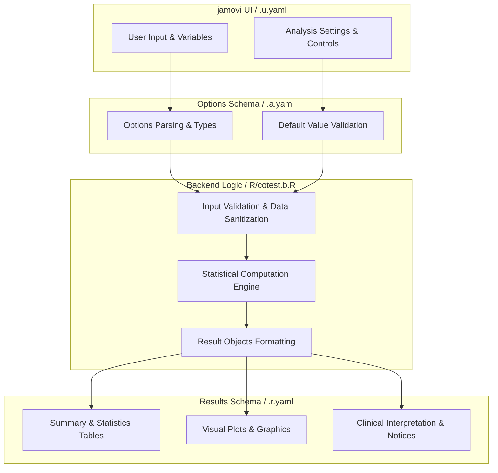
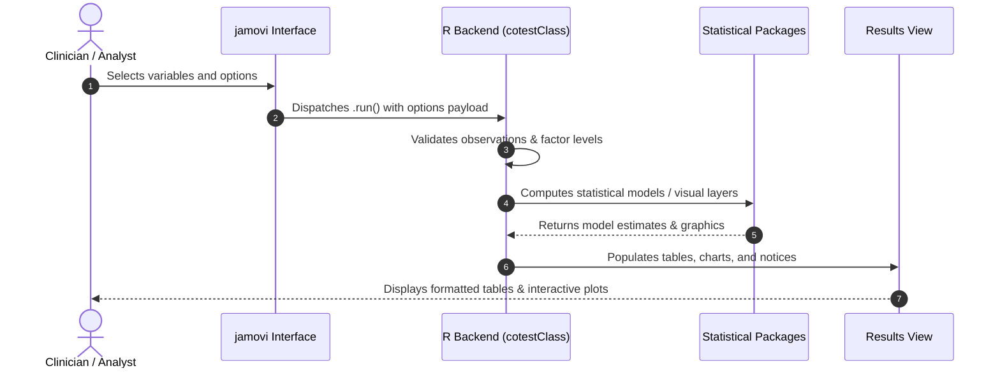

# Co-Testing Analysis - Developer Documentation

## 1. Overview

- **Function**: `cotest`
- **Title**: Co-Testing Analysis
- **Module**: `meddecide`
- **Files**:
  - `jamovi/cotest.u.yaml` - User Interface Definition
  - `jamovi/cotest.a.yaml` - Options & Schema Definition
  - `jamovi/cotest.r.yaml` - Results Layout & Tables
  - `R/cotest.b.R` - Backend Implementation
- **Summary**: Analyses two diagnostic tests applied in parallel: both are performed on the same subject at the same time, before either result is known, and the two results are then combined. Reports the post-test probability of disease for every result combination (either test positive, test 1 only, test 2 only, both positive, both negative), optionally allowing the two tests to be conditionally dependent. For tests performed one after another, where the second is ordered only after a particular first result, use Sequential Test Analysis instead. Note that Sequential Test Analysis also offers a parallel strategy, but its combined figures assume conditional independence; this analysis is the one that models conditional dependence numerically.

## 1a. Changelog

- **Date**: 2026-08-29
- **Summary**: Comprehensive documentation suite created & verified against active schemas and backend implementation.

## 2. Options Reference (`.a.yaml`)

| Option | Type | Default | Description |
| :--- | :--- | :--- | :--- |
| `test1_name` | `String` | `` | Name of test 1 |
| `test2_name` | `String` | `` | Name of test 2 |
| `test1_sens` | `Number` | `0.8` | Test 1 sensitivity |
| `test1_spec` | `Number` | `0.9` | Test 1 specificity |
| `test2_sens` | `Number` | `0.75` | Test 2 sensitivity |
| `test2_spec` | `Number` | `0.95` | Test 2 specificity |
| `indep` | `Bool` | `FALSE` | Assume conditional independence |
| `cond_dep_pos` | `Number` | `0.05` | Dependence among subjects with disease |
| `cond_dep_neg` | `Number` | `0.05` | Dependence among subjects without disease |
| `prevalence` | `Number` | `0.1` | Disease prevalence |
| `showGuidance` | `Bool` | `TRUE` | Guidance and explanations |
| `fnote` | `Bool` | `FALSE` | Footnotes |
| `fagan` | `Bool` | `FALSE` | Fagan nomogram |
| `preset` | `List` | `custom` | Worked example |

## 3. Results Definition (`.r.yaml`)

| Output ID | Type | Title | Description |
| :--- | :--- | :--- | :--- |
| `instructions` | `Html` | `Instructions` |  |
| `notices` | `Html` | `Validation Notices` |  |
| `testParamsTable` | `Table` | `Test Parameters` |  |
| `cotestResultsTable` | `Table` | `Co-Testing Results` |  |
| `dependenceInfo` | `Html` | `Test Dependence` |  |
| `dependenceExplanation` | `Html` | `Understanding Test Dependence` |  |
| `explanation` | `Html` | `Explanation` |  |
| `plot1` | `Image` | `Fagan nomogram - parallel rule (positive if either test is positive)` |  |

## 4. Architecture & Data Flow Diagram

## 5. Execution Sequence

## 6. Change Impact & Safety Guidelines

- **Data Filtering**: Ensure observations with missing values are handled gracefully according to analysis options.
- **Formula Conflicts**: Use isolated environment calls or base formula methods when interacting with `ggstatsplot` or formula parsers.
- **Safe Deparsing**: Use `deparse(val)` in syntax generation (`asSource()`) to escape column names with spaces or special symbols.

