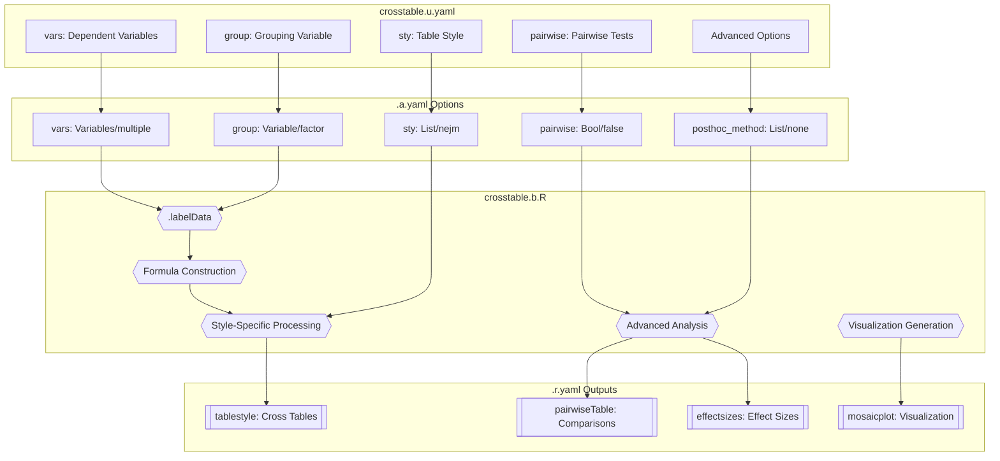
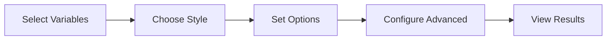
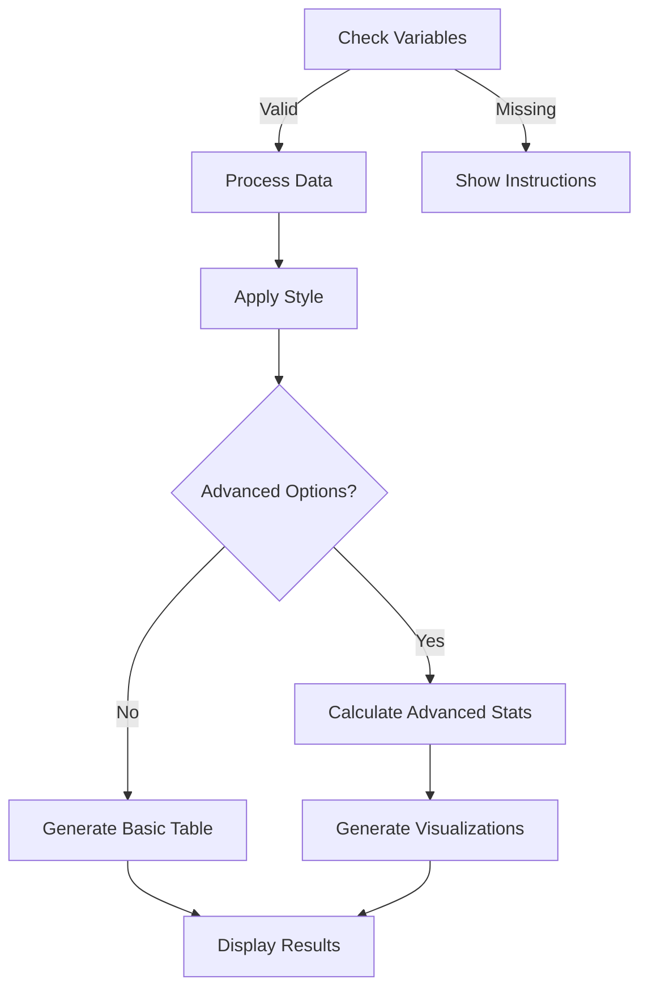

# crosstable Function Documentation

## 1. Overview

- **Function**: `crosstable`
- **Files**:
  - `jamovi/crosstable.u.yaml` — UI
  - `jamovi/crosstable.a.yaml` — Options
  - `R/crosstable.b.R` — Backend
  - `jamovi/crosstable.r.yaml` — Results
- **Summary**: This function creates comprehensive cross-tabulation tables for clinicopathological research, comparing dependent variables (rows) against grouping variables (columns). It supports multiple table styles (arsenal, finalfit, gtsummary, NEJM, Lancet, hmisc), advanced statistical testing, post-hoc analysis, effect size measures, and visualization tools including mosaic plots and correspondence analysis.

## 2. UI Controls → Options Map

| UI Control | Type | Label | Binds to Option | Default | Constraints | Visibility/Enable Rules |
|------------|------|-------|-----------------|---------|-------------|--------------------------|
| vars | VariablesListBox | Dependent Variable(s) | vars | - | multiple allowed | Always visible |
| group | VariablesListBox | Grouping Variable | group | - | maxItemCount: 1, factor | Always visible |
| sty | ComboBox | Table Style | sty | nejm | 6 options | Always visible |
| excl | CheckBox | Exclude Missing (NA) | excl | false | - | Always visible |
| cont | ComboBox | Mean vs Median | cont | mean | 2 options | Enable: (sty:finalfit) |
| pcat | ComboBox | ChiSq vs Fisher | pcat | chisq | 2 options | Enable: (sty:finalfit \|\| sty:gtsummary) |
| pairwise | CheckBox | Pairwise comparisons | pairwise | false | - | Always visible |
| p_adjust | ComboBox | P-value adjustment method | p_adjust | none | 5 options | Always visible |
| posthoc_method | ComboBox | Post-hoc Analysis Method | posthoc_method | none | 6 options | Always visible |
| effect_size_measures | CheckBox | Calculate Effect Size Measures | effect_size_measures | false | - | Always visible |
| residual_analysis | CheckBox | Perform Residual Analysis | residual_analysis | false | - | Always visible |
| mosaic_plot | CheckBox | Generate Mosaic Plot | mosaic_plot | false | - | Always visible |
| correspondence_analysis | CheckBox | Perform Correspondence Analysis | correspondence_analysis | false | - | Always visible |
| exact_tests | CheckBox | Use Exact Tests When Appropriate | exact_tests | true | - | Always visible |
| confidence_level | TextBox | Confidence Level for Intervals | confidence_level | 0.95 | number, 0.80-0.99 | Always visible |
| simulation_based | CheckBox | Use Simulation-Based Tests | simulation_based | false | - | Always visible |
| monte_carlo_replicates | TextBox | Monte Carlo Replicates | monte_carlo_replicates | 10000 | integer, 1000-100000 | Enable: (simulation_based) |

## 3. Options Reference (.a.yaml)

### Core Variables
- **vars** (Variables, multiple): Dependent variables that will appear as rows in the cross table
  - Downstream: Used in formula construction, supports both categorical and continuous variables
- **group** (Variable, factor): Grouping variable for columns in the cross table
  - Downstream: Used as dependent variable in finalfit, independent grouping in other styles

### Table Style Options
- **sty** (List, default: 'nejm'): Table formatting style
  - Options: arsenal, finalfit, gtsummary, nejm, lancet, hmisc
  - Downstream: Determines which table generation package and formatting to use
- **excl** (Bool, default: false): Exclude rows with missing values
  - Downstream: Controls jmvcore::naOmit() application before analysis

### Statistical Options
- **cont** (List, default: 'mean'): Central tendency for continuous variables
  - Options: mean, median
  - Downstream: Used in finalfit::summary_factorlist() cont parameter
- **pcat** (List, default: 'chisq'): Primary categorical test
  - Options: chisq (Chi-square), fisher (Fisher's exact)
  - Downstream: Controls p_cat parameter in finalfit and test selection in gtsummary

### Advanced Analysis Options
- **pairwise** (Bool, default: false): Perform all pairwise comparisons between groups
  - Downstream: Triggers comprehensive pairwise testing when >2 groups present
- **p_adjust** (List, default: 'none'): Multiple comparisons correction
  - Options: none, bonferroni, holm, BH (Benjamini-Hochberg), BY (Benjamini-Yekutieli)
  - Downstream: Applied to pairwise comparison p-values and creates adjusted columns

### Post-hoc Analysis Options
- **posthoc_method** (List, default: 'none'): Advanced post-hoc analysis method
  - Options: none, standardized_residuals, adjusted_residuals, cramers_v, phi_coefficient, freeman_halton
  - Downstream: Determines which advanced statistical measures to calculate
- **effect_size_measures** (Bool, default: false): Calculate comprehensive effect sizes
  - Downstream: Triggers calculation of Cramér's V, phi coefficient, contingency coefficient
- **residual_analysis** (Bool, default: false): Analyze cell contributions
  - Downstream: Calculates standardized and adjusted residuals for each cell
- **exact_tests** (Bool, default: true): Use exact tests for small samples
  - Downstream: Switches to Fisher's exact test when cell counts are low
- **simulation_based** (Bool, default: false): Use Monte Carlo simulation for p-values
  - Downstream: Enables simulation when exact computation is not feasible
- **monte_carlo_replicates** (Integer, default: 10000): Number of simulation replicates
  - Downstream: Controls precision of simulation-based p-values

### Visualization Options
- **mosaic_plot** (Bool, default: false): Generate mosaic plot visualization
  - Downstream: Creates mosaic plot showing association patterns
- **correspondence_analysis** (Bool, default: false): Perform correspondence analysis
  - Downstream: Enables dimensional reduction analysis and biplot generation
- **confidence_level** (Number, default: 0.95): Confidence level for intervals
  - Downstream: Used for effect size confidence intervals and parameter estimates

## 4. Backend Usage (.b.R)

### Key Methods and Option Usage

**Data Labeling (.labelData)**
- Processes `self$options$vars` and `self$options$group`
- Cleans variable names using janitor::clean_names()
- Preserves original labels for display
- Maps user selections to cleaned data structure

**Main Execution (.run)**
- Validates `self$options$vars` and `self$options$group` presence
- Constructs formula using jmvcore::constructFormula()
- Applies missing data exclusion based on `self$options$excl`
- Routes to appropriate table style based on `self$options$sty`

**Style-Specific Processing**
- **Arsenal style**: Uses arsenal::tableby() with total columns
- **Finalfit style**: Uses finalfit::summary_factorlist() with `cont` and `pcat` options
- **Gtsummary style**: Uses gtsummary::tbl_summary() with automatic test selection
- **NEJM/Lancet/Hmisc styles**: Uses tangram package with journal-specific formatting

**Advanced Analysis Methods**
- **Pairwise comparisons**: Generates all possible group pairs when `pairwise` enabled
- **Effect size calculations**: Computes multiple effect size measures when `effect_size_measures` enabled
- **Residual analysis**: Calculates standardized and adjusted residuals when `residual_analysis` enabled
- **Post-hoc testing**: Applies selected method from `posthoc_method` option

**Visualization Generation**
- **Mosaic plots**: Uses .mosaicplot() render function when `mosaic_plot` enabled
- **Correspondence analysis**: Uses .correspondenceplot() render function with CA results

## 5. Results Definition (.r.yaml)

| Output ID | Type | Title | Visibility | Content Source |
|-----------|------|-------|------------|----------------|
| subtitle | Preformatted | `Cross Table - ${group}` | Always | Group variable title |
| todo | Html | To Do | Always | Welcome message or instructions |
| todo2 | Html | To Do | Always | Style-specific information |
| tablestyle1 | Html | `Cross Table - ${group}` | (sty:arsenal) | Arsenal package table |
| tablestyle2 | Html | `Cross Table - ${group}` | (sty:finalfit) | Finalfit package table |
| tablestyle3 | Html | `Cross Table - ${group}` | (sty:gtsummary) | Gtsummary package table |
| tablestyle4 | Html | `Cross Table - ${group}` | (sty:nejm \|\| sty:lancet \|\| sty:hmisc) | Tangram package table |
| qvalueExplanation | Html | Q-value Explanation | (sty:gtsummary) | Multiple testing explanation |
| testInformation | Html | Q-value Information | (sty:gtsummary) | Statistical test information |
| pairwiseTable | Table | Pairwise Comparisons | (pairwise) | All pairwise group comparisons |
| pairwiseNote | Html | Note | (pairwise) | Pairwise testing interpretation |
| effectsizes | Table | Effect Size Measures | (effect_size_measures) | Comprehensive effect sizes |
| residuals | Table | Residual Analysis | (residual_analysis) | Cell contribution analysis |
| posthocstats | Table | Post-hoc Statistical Tests | (posthoc_method != none) | Advanced statistical tests |
| correspondenceanalysis | Table | Correspondence Analysis | (correspondence_analysis) | CA dimension results |
| mosaicplot | Image | Mosaic Plot | (mosaic_plot) | Mosaic plot visualization |
| correspondenceplot | Image | Correspondence Analysis Plot | (correspondence_analysis) | CA biplot visualization |

**ClearWith Dependencies**: Results clear when any relevant option changes, with style-specific dependencies for each table type.

## 6. Data Flow Diagram (UI → Options → Backend → Results)



## 7. Execution Sequence (User Action → Results)

### User Input Flow


### Decision Logic


**Step-by-step execution flow:**

1. **User selects variables** → UI updates `vars` and `group` options
2. **Backend validation** → Checks for required variables, shows welcome if missing
3. **Data labeling** → `.labelData()` processes variable names and preserves labels
4. **Formula construction** → Creates appropriate formula for statistical testing
5. **Style-specific processing** → Routes to arsenal, finalfit, gtsummary, or tangram
6. **Advanced analysis** → Applies pairwise testing, effect sizes, residuals if requested
7. **Visualization generation** → Creates mosaic plots and correspondence analysis if enabled
8. **Results population** → Updates all relevant result panels based on options
9. **Display application** → Shows visible results per visibility rules

## 8. Change Impact Guide

### Key Option Impacts

**vars/group change**:
- Triggers complete reanalysis
- Clears all results
- Recalculates all statistical tests
- Updates all visualizations

**sty change**:
- Changes table generation package
- Updates statistical test selection
- Modifies output formatting
- Affects available options (cont/pcat)

**pairwise toggle**:
- Enables/disables comprehensive pairwise testing
- Shows/hides pairwise comparison tables
- Affects multiple testing correction application

**Advanced options changes**:
- effect_size_measures: Shows/hides effect size calculations
- residual_analysis: Enables cell contribution analysis
- mosaic_plot/correspondence_analysis: Controls visualization generation

### Style-Specific Features

**Arsenal**:
- Simple, clean tables with totals
- Automatic test selection
- Medical journal formatting

**Finalfit**:
- Comprehensive statistical testing
- Customizable continuous/categorical tests
- Clinical research focus

**Gtsummary**:
- Modern table formatting
- Q-value multiple testing correction
- Automatic test explanations

**NEJM/Lancet/Hmisc**:
- Journal-specific formatting standards
- Professional appearance
- Publication-ready tables

### Common Pitfalls
- Missing data affects all analyses unless excl=true
- Small cell counts may trigger exact test warnings
- Multiple variables with pairwise testing creates large result tables
- Correspondence analysis requires adequate sample size
- Monte Carlo simulation increases computation time significantly

## 9. Example Usage

### Dataset Requirements
- **Dependent variables**: Multiple categorical or continuous variables
- **Grouping variable**: Factor with 2+ levels (e.g., treatment groups, disease stages)
- **Sample size**: Adequate for chosen statistical tests

### Example Option Payload
```yaml
vars: ["Age", "Grade", "Stage", "Treatment_Response"]
group: "Treatment_Group"
sty: "gtsummary"
pairwise: true
p_adjust: "BH"
effect_size_measures: true
residual_analysis: true
mosaic_plot: true
correspondence_analysis: true
exact_tests: true
confidence_level: 0.95
```

### Expected Outputs
- Gtsummary-formatted cross table with Q-values
- Pairwise comparisons between all treatment groups
- Effect size measures (Cramér's V, phi coefficient)
- Residual analysis showing cell contributions
- Mosaic plot visualizing association patterns
- Correspondence analysis biplot
- Multiple testing explanations and interpretations

## 10. Appendix (Schemas & Snippets)

### Result Panel Population
```r
# Style-specific table generation
if (sty == "gtsummary") {
  tablegtsummary <- mydata %>%
    gtsummary::tbl_summary(
      by = mygroup,
      include = myvars_term,
      statistic = list(all_continuous() ~ "{mean} ({sd})", 
                      all_categorical() ~ "{n} ({p}%)")
    ) %>%
    add_n() %>%
    add_overall() %>%
    add_p() %>%
    add_q() %>%
    bold_labels() %>%
    bold_p()
}

# Advanced effect size calculations
if (self$options$effect_size_measures) {
  # Calculate Cramér's V, phi coefficient, etc.
  effectsizes <- private$.calculateEffectSizes(mydata, myvars, mygroup)
  self$results$effectsizes$setRowData(effectsizes)
}
```

### Pairwise Testing Pattern
```r
# Generate all possible pairwise comparisons
if (self$options$pairwise && length(group_levels) > 2) {
  pairwise_results <- private$.performPairwiseTests(
    data = mydata,
    vars = myvars,
    group = mygroup,
    method = self$options$pcat,
    adjust = self$options$p_adjust
  )
  self$results$pairwiseTable$setRowData(pairwise_results)
}
```

### Advanced Analysis Integration
```r
# Post-hoc analysis selection
posthoc_method <- self$options$posthoc_method
if (posthoc_method != "none") {
  posthoc_results <- switch(posthoc_method,
    "cramers_v" = private$.calculateCramersV(mydata, myvars, mygroup),
    "phi_coefficient" = private$.calculatePhi(mydata, myvars, mygroup),
    "standardized_residuals" = private$.calculateStandardizedResiduals(mydata, myvars, mygroup),
    # ... additional methods
  )
  self$results$posthocstats$setRowData(posthoc_results)
}
```

### Visualization Generation
```r
# Mosaic plot generation
.mosaicplot = function(image, ...) {
  if (!self$options$mosaic_plot) return()
  
  plot <- private$.generateMosaicPlot(
    data = mydata,
    vars = myvars,
    group = mygroup
  )
  
  print(plot)
  TRUE
}
```