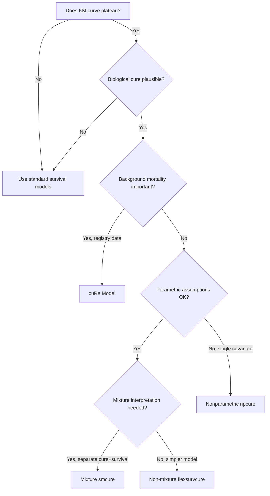
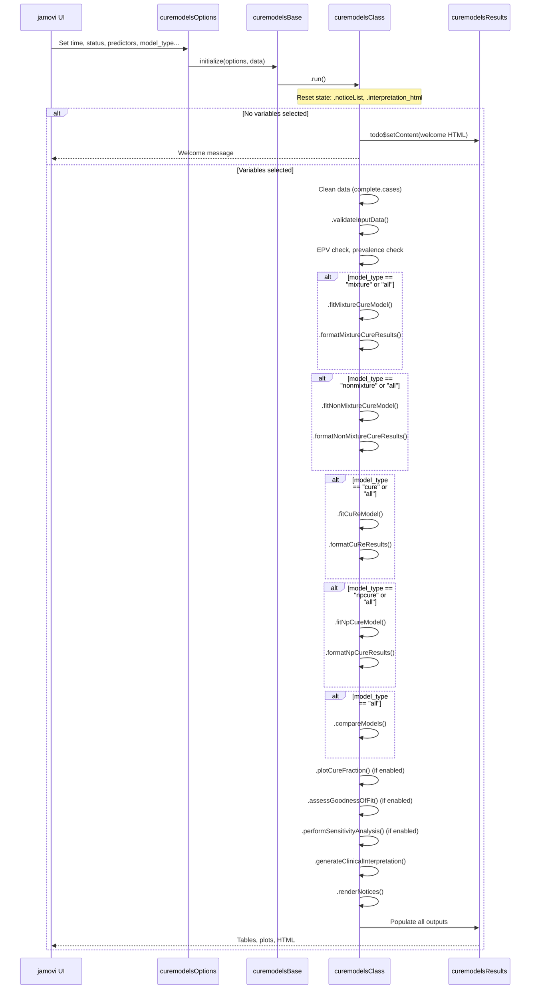
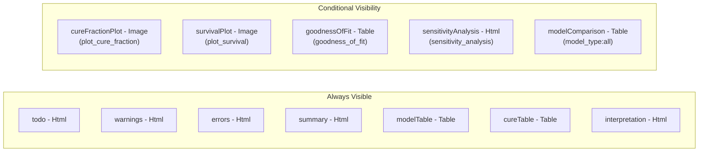
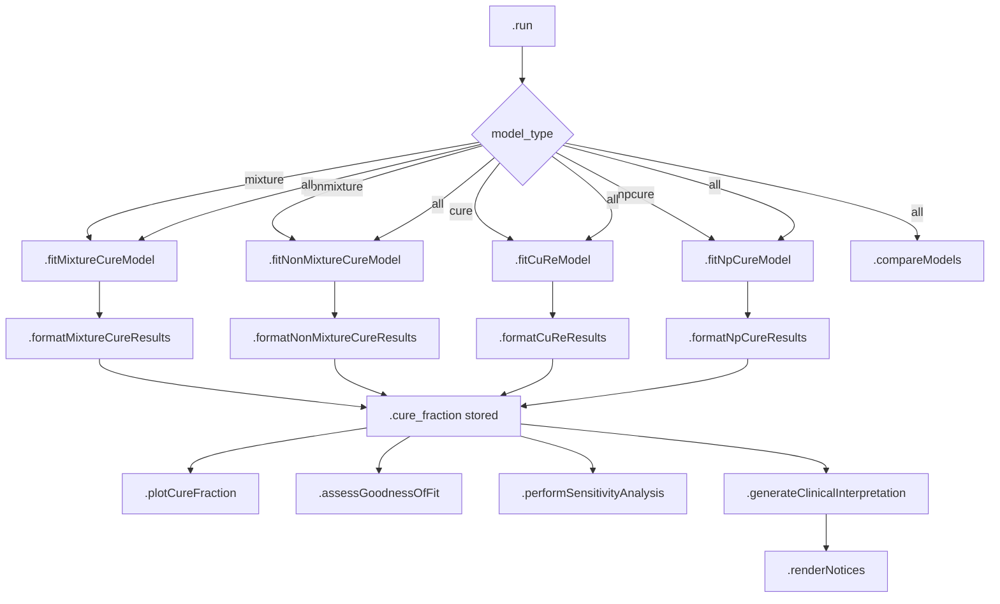
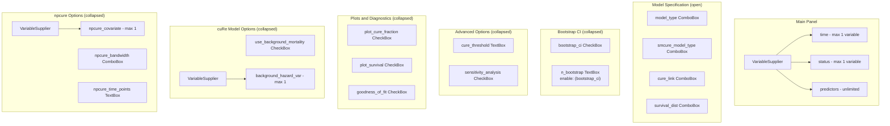

# Cure Models for Long-term Survivors: Developer Documentation

## Table of Contents

1. [Function Overview](#1-function-overview)
2. [Statistical Background](#2-statistical-background)
3. [Architecture and Data Flow](#3-architecture-and-data-flow)
4. [Options Reference](#4-options-reference)
5. [Results and Output Specification](#5-results-and-output-specification)
6. [Backend Implementation Details](#6-backend-implementation-details)
7. [UI Layout and Controls](#7-ui-layout-and-controls)
8. [Test Dataset](#8-test-dataset)
9. [Known Issues, Pitfalls, and Workarounds](#9-known-issues-pitfalls-and-workarounds)
10. [Extending the Function](#10-extending-the-function)

---

## 1. Function Overview

**Name:** `curemodels`
**Menu Location:** OncoPathD > Survival Analysis > "Mixture and Non-mixture Cure Models"
**Version:** 1.0.0
**Package:** ClinicoPath (namespace: `ClinicoPath`)

### Purpose

The `curemodels` function fits survival models that acknowledge a cured fraction -- a subpopulation of patients who will never experience the event of interest. Standard survival models (Cox, Kaplan-Meier) assume all patients will eventually fail given enough time. Cure models relax this assumption and are appropriate when the Kaplan-Meier curve plateaus at long follow-up, suggesting some patients are truly cured.

### Clinical Context

Cure models are most relevant in:

- **Early-stage cancer:** Where curative surgery or treatment can eliminate disease
- **Hematologic malignancies:** Post-transplant patients who achieve durable remission
- **Infectious diseases:** Where treatment eradication is achievable
- **Pediatric oncology:** Where long-term disease-free survival implies cure

The function provides four distinct modeling approaches, a head-to-head comparison mode, sensitivity analysis, goodness-of-fit diagnostics, and a copy-ready clinical report sentence.

### Dependencies

| Package | Required For | Notes |
|---------|-------------|-------|
| `smcure` | Mixture cure model | EM algorithm-based fitting |
| `flexsurvcure` | Non-mixture cure model | Profile likelihood CIs; provides AIC/BIC |
| `cuRe` | Background mortality model | Requires life table or hazard variable |
| `npcure` | Nonparametric cure model | Kernel smoothing; single continuous covariate only |
| `survival` | KM curves, Surv objects | Core survival infrastructure |
| `ggplot2` | All plots | Renders via jamovi image system |
| `scales` | Plot formatting | Percent axis labels |
| `jmvcore` | Module framework | Variable escaping, R6 classes, option system |
| `glue`, `stringr` | String formatting | Used in HTML output construction |

---

## 2. Statistical Background

### Mixture Cure Model (Berkson-Gage)

The mixture cure model decomposes the population survival function into two components:

```
S_pop(t) = pi + (1 - pi) * S_u(t)
```

Where:
- `pi` is the cure fraction (probability of being cured)
- `S_u(t)` is the survival function of the uncured (susceptible) subgroup
- As `t -> infinity`, `S_pop(t) -> pi` (the plateau)

**Two sub-models are estimated simultaneously:**

1. **Incidence (cure) model:** Logistic regression on cure probability `pi`, producing coefficients `$b`. The intercept `$b[1]` maps to the overall cure fraction via `plogis(b[1])`.
2. **Latency (survival) model:** PH or AFT model for the uncured group, producing coefficients `$beta`.

Implementation uses `smcure::smcure()` with EM algorithm. The `model` parameter selects PH vs AFT for the latency part; `link` selects the cure probability link function.

### Non-Mixture Cure Model (Promotion Time / Bounded Cumulative Hazard)

```
S_pop(t) = exp(-theta * F(t))
```

Where `theta` is directly interpretable as the cure probability (on the probability scale) and `F(t)` is a parametric distribution function. As `t -> infinity`, if `F(t) -> 1`, then `S_pop(t) -> exp(-theta)`.

Implementation uses `flexsurvcure::flexsurvcure()` with `mixture = FALSE`. The `theta` parameter in `model$res.t` is the cure fraction. Profile likelihood provides CIs, and AIC/BIC are available for model comparison.

### cuRe Model (Relative Survival with Cure)

Extends the cure model framework by incorporating background (expected) mortality from the general population:

```
h(t) = h*(t) + h_E(t)
```

Where `h*(t)` is the expected (background) hazard and `h_E(t)` is the excess hazard due to disease. This is critical for cancer registries where cause of death is unreliable.

Implementation uses `cuRe::fit.cure.model()`. The `bhazard` parameter accepts a vector of background hazard rates (one per patient, typically derived from life tables by age, sex, and calendar year).

### Nonparametric Cure Model

Estimates the cure probability `1 - p(x)` as a smooth function of a continuous covariate `x` using kernel smoothing, without assuming any parametric form for either the cure probability or the survival distribution.

Implementation uses `npcure::probcure()`. Parameters: `x` (covariate), `t` (time), `d` (event indicator), `x0` (evaluation points), `h` (bandwidth).

### When Each Model Is Appropriate



---

## 3. Architecture and Data Flow

### Four-File Structure

| File | Path | Role |
|------|------|------|
| `curemodels.a.yaml` | `jamovi/curemodels.a.yaml` | Option definitions (19 options + data) |
| `curemodels.u.yaml` | `jamovi/curemodels.u.yaml` | UI layout (7 panels) |
| `curemodels.r.yaml` | `jamovi/curemodels.r.yaml` | Results definitions (12 output items) |
| `curemodels.b.R` | `R/curemodels.b.R` | Backend R6 class (all logic) |
| `curemodels.h.R` | `R/curemodels.h.R` | **Auto-generated** from YAML (do not edit) |

### Execution Flow



### Private State

The class stores intermediate results in private fields to share across methods:

| Field | Type | Purpose |
|-------|------|---------|
| `cure_data` | data.frame | Cleaned data after `complete.cases()` |
| `cure_model` | smcure object | Mixture model result |
| `nm_cure_model` | flexsurvcure object | Non-mixture model result |
| `cure_cure_model` | cuRe object | cuRe model result |
| `npcure_model` | npcure object | Nonparametric model result |
| `.cure_fraction` | numeric | Extracted cure fraction (0-1 scale) |
| `.cure_ci_lower` | numeric | Lower bound of cure fraction CI |
| `.cure_ci_upper` | numeric | Upper bound of cure fraction CI |
| `.cure_ci_method` | character | CI method description string |
| `.interpretation_html` | character | Accumulator for interpretation output |
| `.noticeList` | list | Accumulator for error/warning/info notices |

### HTML Notice System

The function uses the project-wide HTML notice pattern (replacing the deprecated `insert(999, Notice)` approach that causes protobuf serialization errors). Three severity levels with distinct colors:

| Type | Color | Background | Use |
|------|-------|-----------|-----|
| `ERROR` | `#dc2626` (red) | `#fef2f2` | Fatal errors (missing packages, invalid data) |
| `STRONG_WARNING` | `#ea580c` (orange) | `#fff7ed` | Model failures, EPV issues |
| `WARNING` | `#ca8a04` (yellow) | `#fefce8` | Data quality warnings |
| `INFO` | `#2563eb` (blue) | `#eff6ff` | Model selection notes, bootstrap timing |

Errors and non-errors are routed to separate HTML outputs (`self$results$errors` and `self$results$warnings`) via `.renderNotices()`.

---

## 4. Options Reference

### Required Options

| Option | Type | YAML Key | Permitted | Notes |
|--------|------|----------|-----------|-------|
| `time` | Variable | `time` | numeric | Survival/follow-up time. Must be non-negative, non-infinite. |
| `status` | Variable | `status` | factor, numeric | Binary event indicator. Accepts `0/1` numeric or 2-level factor (first level = censored). |

### Core Model Options

| Option | Type | Default | Values | Notes |
|--------|------|---------|--------|-------|
| `predictors` | Variables | `[]` | numeric, factor | Zero or more. Intercept-only model when empty. |
| `model_type` | List | `mixture` | `mixture`, `nonmixture`, `cure`, `npcure`, `all` | Dispatches to fitting function(s). `all` fits all four. |
| `smcure_model_type` | List | `ph` | `ph`, `aft` | Latency model type for smcure only. PH = Cox-like; AFT = Weibull/log-normal. |
| `cure_link` | List | `logit` | `logit`, `probit`, `cloglog` | Link function for cure probability in mixture and cuRe models. |
| `survival_dist` | List | `weibull` | `weibull`, `exponential`, `lognormal`, `loglogistic` | Used by flexsurvcure and cuRe. Mapped to package-specific names internally. |

### Bootstrap Options

| Option | Type | Default | Range | Notes |
|--------|------|---------|-------|-------|
| `bootstrap_ci` | Bool | `false` | — | Enables bootstrap variance estimation in smcure (`Var = TRUE`). |
| `n_bootstrap` | Integer | `1000` | 100-10000 | Number of bootstrap resamples. Displayed info notice when >= 500. |

### Advanced Options

| Option | Type | Default | Range | Notes |
|--------|------|---------|-------|-------|
| `cure_threshold` | Number | `60` | >= 0 | Time point (months) for sensitivity analysis. Used to count patients/events beyond threshold. |
| `sensitivity_analysis` | Bool | `false` | — | Shows threshold assessment and CI precision analysis. |

### Plot and Diagnostic Options

| Option | Type | Default | Notes |
|--------|------|---------|-------|
| `plot_cure_fraction` | Bool | `false` | Bar chart of cured vs uncured fractions with optional CI error bars. |
| `plot_survival` | Bool | `false` | KM curve with red dashed cure plateau line and annotation. |
| `goodness_of_fit` | Bool | `false` | AIC/log-likelihood (flexsurvcure only), convergence check (smcure), sample size adequacy. |

### cuRe-Specific Options

| Option | Type | Default | Notes |
|--------|------|---------|-------|
| `use_background_mortality` | Bool | `false` | Passes `bhazard` to `cuRe::fit.cure.model()`. |
| `background_hazard_var` | Variable | `null` | Numeric variable with per-patient background hazard rates. |

### npcure-Specific Options

| Option | Type | Default | Range | Notes |
|--------|------|---------|-------|-------|
| `npcure_covariate` | Variable | `null` | — | Single continuous covariate required for npcure. |
| `npcure_bandwidth` | List | `auto` | `auto`, `small` (0.1), `medium` (0.3), `large` (0.5) | `auto` = cross-validation selected bandwidth. |
| `npcure_time_points` | Integer | `100` | 50-500 | Number of covariate grid points for estimation. |

---

## 5. Results and Output Specification

### Output Items



### Table Schemas

**modelTable** -- Cure Model Results (rows: 0, dynamically populated)

| Column | Type | Format | Content |
|--------|------|--------|---------|
| `parameter` | text | — | Prefixed with "Cure:" or "Survival:" for smcure; parameter name for others |
| `estimate` | number | — | Coefficient or cure probability |
| `std_error` | number | — | SE from bootstrap (smcure) or profile likelihood (flexsurvcure) |
| `z_value` | number | — | Wald z-statistic (estimate / SE) |
| `p_value` | number | `zto,pvalue` | Two-sided p-value |
| `ci_lower` | number | — | 95% CI lower bound |
| `ci_upper` | number | — | 95% CI upper bound |

**cureTable** -- Cure Fraction Summary

| Column | Type | Content |
|--------|------|---------|
| `group` | text | "Overall" (future: per-group estimates) |
| `cure_fraction` | number | Point estimate (0-1 scale) |
| `cure_ci_lower` | number | 95% CI lower |
| `cure_ci_upper` | number | 95% CI upper |
| `uncured_median` | number | Median event time among uncured patients |

**goodnessOfFit** -- Goodness of Fit Tests

| Column | Type | Content |
|--------|------|---------|
| `test_name` | text | "AIC", "Log-likelihood", "Convergence Check", "Sample Size Adequacy" |
| `statistic` | number | Metric value |
| `p_value` | number | p-value (usually NA for descriptive checks) |
| `interpretation` | text | Plain-language assessment |

**modelComparison** -- Model Comparison (visible only when `model_type == "all"`)

| Column | Type | Content |
|--------|------|---------|
| `model` | text | Model name + package |
| `aic` | number | AIC (NA for smcure and npcure) |
| `bic` | number | BIC (NA for smcure and npcure) |
| `loglik` | number | Log-likelihood (NA for smcure and npcure) |

### Plot Specifications

**cureFractionPlot** (700x450)
- Bar chart with two bars: "Cured" (blue `#2563eb`) and "Not Cured" (orange `#ea580c`)
- Y-axis: proportion (0-1), formatted as percentages
- Optional error bars for CI on the "Cured" bar
- State stored as `data.frame(cure_fraction, ci_lower, ci_upper)` to avoid protobuf issues

**survivalPlot** (700x450)
- Step function KM curve (black) with confidence ribbon (grey alpha=0.2)
- Red dashed horizontal line at cure fraction level
- Text annotation: "Cure fraction: XX.X%"
- Y-axis: 0-1 (survival probability)

### clearWith Dependencies

All results clear on changes to core variables (`time`, `status`, `predictors`). Model-specific options (`model_type`, `smcure_model_type`, `cure_link`, `survival_dist`, `bootstrap_ci`, `n_bootstrap`) additionally clear `summary`, `modelTable`, and most other outputs. The `sensitivityAnalysis` output uniquely clears on `cure_threshold`.

---

## 6. Backend Implementation Details

### Data Cleaning and Validation

```
.run()
  |-> complete.cases() on [time, status, predictors]
  |-> Minimum 30 rows check
  |-> .validateInputData():
  |     |-> Non-negative time
  |     |-> No infinite time values
  |     |-> Binary status (0/1 numeric or 2-level factor)
  |     |-> Minimum 10 events (warning if fewer)
  |     |-> Follow-up adequacy: max_time >= 2 * median_time
  |-> EPV check: n_events / n_predictors >= 10
  |-> Prevalence extremes: event_rate < 5% or > 95%
```

Factor status variables are converted to numeric via `as.numeric(status_col) - 1` where the first factor level becomes 0 (censored) and the second becomes 1 (event).

### Model Dispatch Pattern

The `.run()` method uses cascading `if` statements (not `switch`) so that `model_type == "all"` falls into all four branches sequentially. Each fitting function is wrapped in `tryCatch()` with error-type-specific notice generation.



### Package-Specific API Differences

This is a critical section. The four R packages have substantially different APIs:

**smcure::smcure()**

```r
smcure(formula, cureform, data, model, link, Var, nboot)
```

- Returns: `$b` (cure/incidence coefficients), `$beta` (latency/survival coefficients)
- Bootstrap SE: `$b_sd`, `$beta_sd` (only when `Var = TRUE`)
- Does NOT provide AIC, BIC, or log-likelihood
- Cure fraction extracted via: `plogis(model$b[1])`

**flexsurvcure::flexsurvcure()**

```r
flexsurvcure(formula, data, dist, mixture = FALSE)
```

- Returns: `$res.t` matrix with columns `est`, `L95%`, `U95%` (and optionally `se`)
- `theta` parameter row = cure probability on probability scale
- Provides: `$AIC`, `$loglik`, and supports `BIC()`
- Distribution names must be mapped: `"weibull" -> "weibullPH"`, `"exponential" -> "exp"`, `"lognormal" -> "lnorm"`, `"loglogistic" -> "llogis"`

**cuRe::fit.cure.model()**

```r
fit.cure.model(formula, data, bhazard, dist, link)
```

- Returns: `summary()$coef` matrix with `Estimate`, `Std. Error`, optionally `Pr(>|z|)`
- `$cure_fraction` field may or may not be present
- Supports `AIC()`, `BIC()`, `logLik()`
- `bhazard` is a numeric vector (one value per patient), not a variable name

**npcure::probcure()**

```r
probcure(x, t, d, x0, h, conflevel)
```

- Takes raw vectors, not formulas
- Returns: `$q` (cure probabilities), `$x0` (covariate values), `$h` (bandwidth), `$conf$lower`, `$conf$upper`
- No AIC/BIC/log-likelihood
- Limited to a single continuous covariate

### Variable Escaping

All variable names are escaped via `jmvcore::composeTerm()` before entering formulas. This handles names with spaces, special characters, and reserved words by backtick-quoting them. However, raw (unescaped) names are used for `data[[ ]]` indexing because backticks would cause lookup failures.

### Cure Fraction Extraction by Model Type

| Model | Extraction | CI Method |
|-------|-----------|-----------|
| Mixture (smcure) | `plogis(model$b[1])` | Delta method on logit scale using `$b_sd[1]` (requires bootstrap) |
| Non-mixture (flexsurvcure) | `model$res.t["theta", "est"]` | Profile likelihood (`L95%`, `U95%` columns) |
| cuRe | `model$cure_fraction` (if present) | Not directly available (NA) |
| Nonparametric | `mean(model$q)` (average across covariate grid) | Per-point CIs available, no overall CI |

### Clinical Interpretation Generation

The `.generateClinicalInterpretation()` method produces:

1. Model type description
2. Cure fraction with CI (when available)
3. Clinical significance classification: >50% = "high", 20-50% = "moderate", <20% = "small"
4. Clinical implications (population impact, treatment strategy, prognosis)
5. Statistical considerations (assumptions, follow-up requirements, validation)
6. A copy-ready report sentence formatted as:

> "Using a [model_type], the estimated cure fraction was XX.X% (95% CI: XX.X%-XX.X%; method: [method]), based on N patients with a median follow-up of XX.X time units."

This sentence is displayed in a styled `<div>` with a tip to copy it into manuscripts.

---

## 7. UI Layout and Controls

### Panel Structure



### Conditional Enable Logic

- `n_bootstrap` is enabled only when `bootstrap_ci` is checked
- `modelComparison` table is visible only when `model_type == "all"`
- `cureFractionPlot` is visible when `plot_cure_fraction` is checked
- `survivalPlot` is visible when `plot_survival` is checked
- `goodnessOfFit` is visible when `goodness_of_fit` is checked
- `sensitivityAnalysis` is visible when `sensitivity_analysis` is checked

### VariableSupplier Instances

The UI has **three** independent `VariableSupplier` widgets:
1. Main panel: feeds `time`, `status`, `predictors`
2. cuRe options: feeds `background_hazard_var`
3. npcure options: feeds `npcure_covariate`

Each has `persistentItems: false` so variables return to the pool when removed from a target.

---

## 8. Test Dataset

### `curemodels_test.rda`

**File locations:**
- `data/curemodels_test.rda` (binary, compressed xz)
- `data-raw/non-rda/curemodels_test.csv` (CSV)
- `data-raw/non-rda/curemodels_test.omv` (jamovi native)
- `data-raw/create_curemodels_test_data.R` (generation script)

**Clinical scenario:** 250 patients with early-stage colorectal cancer treated with curative intent. Approximately 30% are cured (never recur). Uncured patients have Weibull-distributed recurrence times. Administrative censoring at 120 months with ~8% loss to follow-up.

**Seed:** 2026

### Variable Dictionary

| Variable | Type | Range/Levels | Description |
|----------|------|-------------|-------------|
| `PatientID` | character | CM-0001 to CM-0250 | Unique identifier |
| `FollowUpMonths` | numeric | ~0.5-120 | Follow-up duration in months |
| `Recurrence` | integer | 0, 1 | Event indicator (0=censored, 1=recurrence) |
| `RecurrenceFactor` | factor | Censored, Recurrence | Same as Recurrence in factor form |
| `Age` | numeric | 35-85 | Patient age (N(62,11), ~3% missing) |
| `Sex` | factor | Male, Female | 55% male |
| `Treatment` | factor | Surgery Only, Surgery+Adjuvant | 40/60 split |
| `Stage` | factor | I, II, III | 30/40/30 split |
| `TumorSize` | numeric | 0.5+ | Centimeters (N(3.5,1.5), ~2% missing) |
| `PerformanceStatus` | integer | 0, 1, 2 | ECOG-like (50/35/15 split) |
| `BackgroundHazard` | numeric | >0 | Simulated monthly background mortality rate by age/sex |

### Data Generation Logic

The cure probability is modeled as a logistic function of covariates:

```
logit(cure) = 0.5 - 0.8*(Stage-1) + 0.4*(Adjuvant) - 0.02*(Age-62) - 0.15*TumorSize - 0.3*PS
```

Uncured patients have Weibull recurrence with shape=1.4, scale=36 months, modified by a covariate-dependent hazard multiplier. Cured patients receive administrative censoring times drawn from Uniform(60, 120).

### Usage in Tests

The test file (`tests/testthat/test-curemodels.R`) uses a `make_cure_data()` helper function (n=150, seed=42, 30% cure) rather than the bundled dataset, to keep tests self-contained and fast. The bundled `curemodels_test.rda` is intended for interactive testing and vignettes.

---

## 9. Known Issues, Pitfalls, and Workarounds

### P1: smcure Does Not Provide AIC/BIC

The `smcure` package does not compute or expose AIC, BIC, or log-likelihood values. The model comparison table shows `NA` for these metrics when the mixture model is included. Direct statistical comparison between smcure and flexsurvcure is not possible through information criteria alone.

**Workaround:** When `model_type == "all"`, the interpretation notes explicitly state this limitation and recommend using clinical plausibility and visual curve assessment alongside statistical criteria from flexsurvcure/cuRe.

### P2: smcure Return Object Field Names

The smcure package uses non-standard field names:
- `$b` = cure (incidence) coefficients (NOT `$beta` for cure)
- `$beta` = survival (latency) coefficients
- `$b_sd` = SEs for cure coefficients (NOT `$se`)
- `$beta_sd` = SEs for survival coefficients

These are documented as "FIX C2" in the source. Confusing `$b` with `$beta` would swap cure and survival coefficients in the output.

### P3: flexsurvcure Distribution Name Mapping

The user-facing distribution names differ from what `flexsurvcure` expects internally:

| User Selects | Internal Mapping |
|-------------|-----------------|
| `weibull` | `weibullPH` |
| `exponential` | `exp` |
| `lognormal` | `lnorm` |
| `loglogistic` | `llogis` |

This mapping is handled by the `dist_map` list in `.fitNonMixtureCureModel()`.

### P4: npcure API Parameter Names

The `npcure::probcure()` function uses non-standard parameter names (`x`, `t`, `d`, `x0`, `h`) rather than formula-based syntax. Documented as "FIX C3" in the source. It also only accepts a single continuous covariate -- not multiple predictors and not categorical variables.

### P5: Protobuf Serialization

Plot state must be stored as a plain `data.frame`, not as model objects or lists containing functions. The `image$setState(as.data.frame(...))` pattern is used throughout to avoid the jamovi protobuf serialization error that occurs when R objects with function references are stored.

### P6: Factor Status Handling

When `status` is a factor, the conversion `as.numeric(status_col) - 1` assumes the first level is "censored" (maps to 0) and the second level is "event" (maps to 1). This matches jamovi's convention but could silently produce wrong results if factor levels are reordered.

### P7: Bootstrap Performance

Bootstrap with n >= 500 iterations can take several minutes. An INFO notice is displayed to warn users. The minimum allowed is 100 iterations, which may produce unstable CI estimates.

### P8: Cure Fraction CI Availability

CIs for the cure fraction are only available under specific conditions:

- **Mixture model:** Requires `bootstrap_ci = TRUE`. Without bootstrap, CIs are `NA`.
- **Non-mixture model:** Always available via profile likelihood.
- **cuRe model:** Currently `NA` (not extracted from the model).
- **Nonparametric:** Per-point CIs available, but no overall CI.

### P9: Empty .init() Method

The `.init()` method is intentionally empty. Package availability checks used to be performed here but were removed because they created `jmvcore::Notice` objects that caused serialization errors. All package checks now occur at the start of each fitting function.

### P10: No Formal Goodness-of-Fit Tests

The `.assessGoodnessOfFit()` method provides descriptive diagnostics (AIC, convergence heuristics, sample size adequacy) rather than formal statistical goodness-of-fit tests. A disclaimer row is added to the table: "These diagnostics are descriptive only. Formal goodness-of-fit tests for cure models are limited."

---

## 10. Extending the Function

### Adding a New Model Type

To add a fifth cure model type (e.g., a Bayesian cure model):

1. **`.a.yaml`:** Add a new entry under `model_type.options`:
   ```yaml
   - title: Bayesian Cure Model (rstanarm)
     name: bayesian
   ```

2. **`.b.R`:** Add:
   - A new private field: `bayesian_model = NULL`
   - A new fitting method: `.fitBayesianCureModel(data, time_var, status_var, predictors)`
   - A new format method: `.formatBayesianCureResults(model)`
   - A dispatch branch in `.run()`: `if (model_type == "bayesian" || model_type == "all")`
   - A row in `.compareModels()` for the new model type

3. **`.r.yaml`:** Update `clearWith` lists if new options are added.

4. **`.u.yaml`:** Add a new `CollapseBox` for model-specific options if needed.

5. **Tests:** Add `test_that()` blocks with `skip_if_not_installed()`.

### Adding Group-Level Cure Fractions

Currently the `cureTable` only shows "Overall". To add per-group estimates:

1. In the formatting methods, iterate over levels of a grouping variable
2. Fit separate models per group or extract group-specific intercepts
3. Add rows to `cureTable` with the group name

### Adding New Distributions

For flexsurvcure, add the mapping to `dist_map` in `.fitNonMixtureCureModel()`:

```r
dist_map <- list(
    "weibull" = "weibullPH",
    "exponential" = "exp",
    "lognormal" = "lnorm",
    "loglogistic" = "llogis",
    "gompertz" = "gompertz"  # new
)
```

Then add the option to `.a.yaml` under `survival_dist.options`.

### Adding Formal Goodness-of-Fit

Cox-Snell residuals could be computed for flexsurvcure models. The pattern would be:

1. Extract cumulative hazard residuals from the fitted model
2. Plot against exponential(1) reference
3. Compute a Kolmogorov-Smirnov test statistic
4. Add to the `goodnessOfFit` table

### Connecting to Population Rate Tables

The `cuRe` model currently accepts a per-patient background hazard variable. To integrate with the project's bundled rate tables (`data/ratetable_*.rda`):

1. Add a dropdown for country selection (similar to `relativesurvival`)
2. Look up rates by patient age, sex, and calendar year
3. Compute per-patient expected hazard rates
4. Pass as `bhazard` to `cuRe::fit.cure.model()`

This would eliminate the need for users to manually prepare background hazard columns.

---

## Appendix: File Cross-Reference

| File | Absolute Path |
|------|--------------|
| Backend | `/Users/serdarbalci/Documents/GitHub/ClinicoPathJamoviModule/R/curemodels.b.R` |
| Header (auto-generated) | `/Users/serdarbalci/Documents/GitHub/ClinicoPathJamoviModule/R/curemodels.h.R` |
| Analysis YAML | `/Users/serdarbalci/Documents/GitHub/ClinicoPathJamoviModule/jamovi/curemodels.a.yaml` |
| Results YAML | `/Users/serdarbalci/Documents/GitHub/ClinicoPathJamoviModule/jamovi/curemodels.r.yaml` |
| UI YAML | `/Users/serdarbalci/Documents/GitHub/ClinicoPathJamoviModule/jamovi/curemodels.u.yaml` |
| Tests | `/Users/serdarbalci/Documents/GitHub/ClinicoPathJamoviModule/tests/testthat/test-curemodels.R` |
| Test data (rda) | `/Users/serdarbalci/Documents/GitHub/ClinicoPathJamoviModule/data/curemodels_test.rda` |
| Test data (CSV) | `/Users/serdarbalci/Documents/GitHub/ClinicoPathJamoviModule/data-raw/non-rda/curemodels_test.csv` |
| Data generation script | `/Users/serdarbalci/Documents/GitHub/ClinicoPathJamoviModule/data-raw/create_curemodels_test_data.R` |
