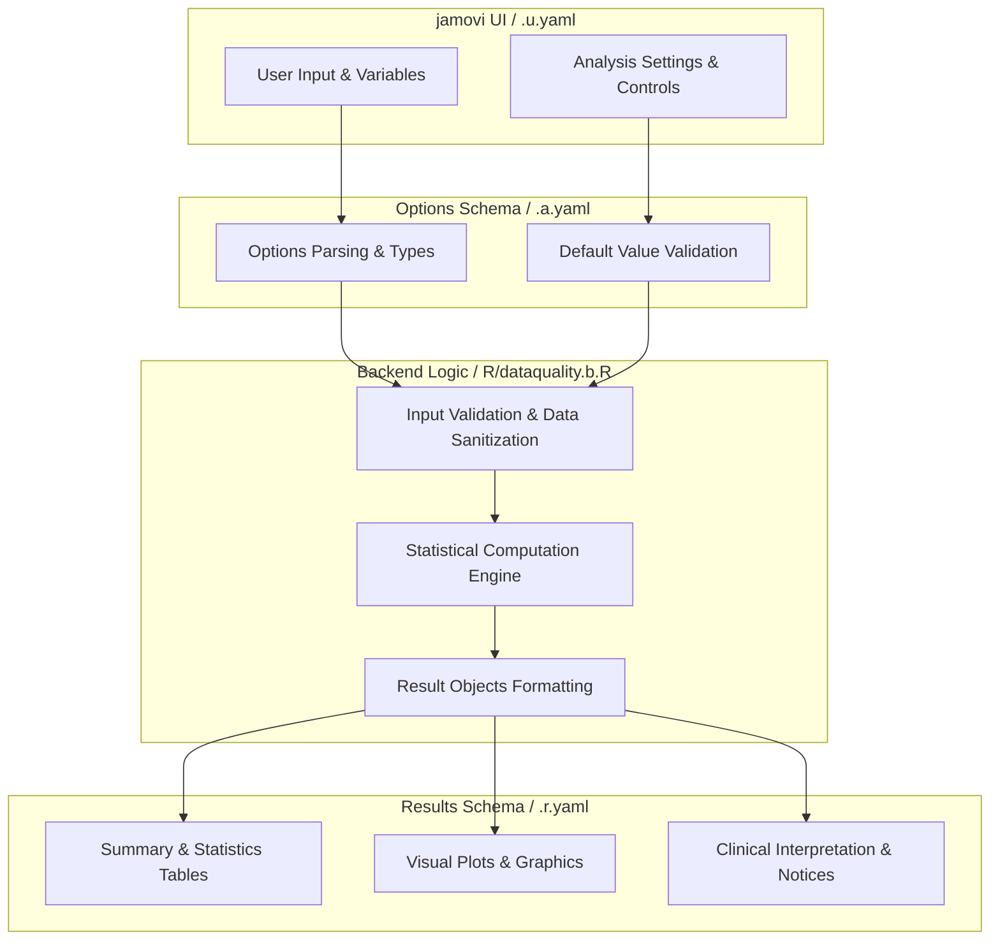
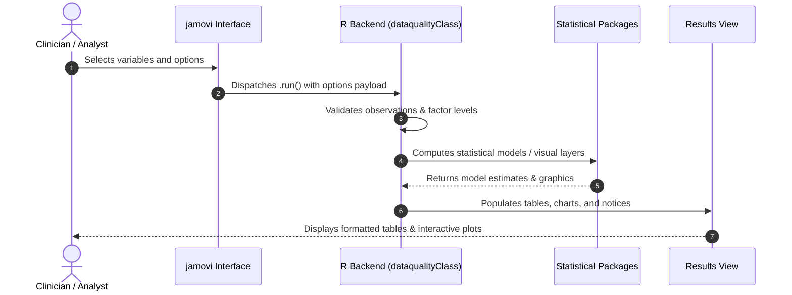

# Multi-Variable Visual Quality - Developer Documentation

## 1. Overview

- **Function**: `dataquality`
- **Title**: Multi-Variable Visual Quality
- **Module**: `ExplorationT`
- **Files**:
  - `jamovi/dataquality.u.yaml` - User Interface Definition
  - `jamovi/dataquality.a.yaml` - Options & Schema Definition
  - `jamovi/dataquality.r.yaml` - Results Layout & Tables
  - `R/dataquality.b.R` - Backend Implementation
- **Summary**: This module provides data quality assessment including duplicate detection, missing value analysis, and data completeness summary (similar to sumvar's dup() function).

## 1a. Changelog

- **Date**: 2026-08-29
- **Summary**: Comprehensive documentation suite created & verified against active schemas and backend implementation.

## 2. Options Reference (`.a.yaml`)

| Option | Type | Default | Description |
| :--- | :--- | :--- | :--- |
| `data` | `Data` | `NULL` |  |
| `vars` | `Variables` | `NULL` | Variables |
| `check_duplicates` | `Bool` | `FALSE` | Duplicate values |
| `check_missing` | `Bool` | `FALSE` | Missing value analysis |
| `row_level_duplicates` | `Bool` | `FALSE` | Duplicate rows |
| `plot_data_overview` | `Bool` | `FALSE` | Data overview plot (vis_dat) |
| `plot_missing_patterns` | `Bool` | `FALSE` | Missing patterns plot (vis_miss) |
| `plot_data_types` | `Bool` | `FALSE` | Data types plot (vis_guess) |
| `missing_threshold_visual` | `Number` | `10` | Missing-data flag threshold (percent) |
| `showSummary` | `Bool` | `TRUE` | Plain-language summary |
| `showRecommendations` | `Bool` | `TRUE` | Action recommendations |
| `showExplanations` | `Bool` | `FALSE` | Educational explanations |

## 3. Results Definition (`.r.yaml`)

| Output ID | Type | Title | Description |
| :--- | :--- | :--- | :--- |
| `notices` | `Preformatted` | `Important Information` |  |
| `todo` | `Html` | `` |  |
| `text` | `Html` | `Data Quality Summary` |  |
| `summary` | `Html` | `Plain-Language Summary` |  |
| `recommendations` | `Html` | `Recommended Actions` |  |
| `explanations` | `Html` | `Understanding Quality Metrics` |  |
| `plotDataOverview` | `Image` | `Data Overview` |  |
| `plotMissingPatterns` | `Image` | `Missing Patterns` |  |
| `plotDataTypes` | `Image` | `Data Types` |  |

## 4. Architecture & Data Flow Diagram

## 5. Execution Sequence

## 6. Change Impact & Safety Guidelines

- **Data Filtering**: Ensure observations with missing values are handled gracefully according to analysis options.
- **Formula Conflicts**: Use isolated environment calls or base formula methods when interacting with `ggstatsplot` or formula parsers.
- **Safe Deparsing**: Use `deparse(val)` in syntax generation (`asSource()`) to escape column names with spaces or special symbols.

