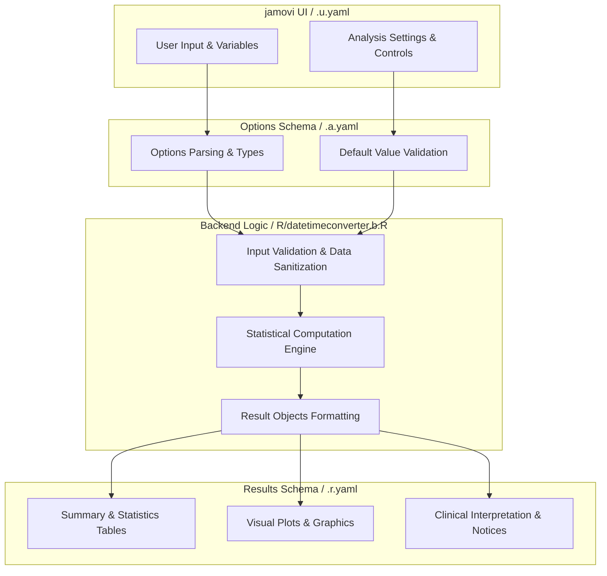
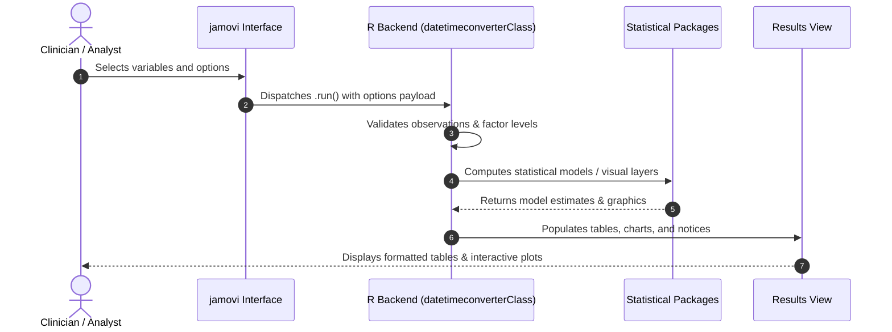

# DateTime Converter - Developer Documentation

## 1. Overview

- **Function**: `datetimeconverter`
- **Title**: DateTime Converter
- **Module**: `SurvivalT`
- **Files**:
  - `jamovi/datetimeconverter.u.yaml` - User Interface Definition
  - `jamovi/datetimeconverter.a.yaml` - Options & Schema Definition
  - `jamovi/datetimeconverter.r.yaml` - Results Layout & Tables
  - `R/datetimeconverter.b.R` - Backend Implementation
- **Summary**: Convert datetime variables to standardized format and extract datetime components (year, month, day, hour, minute, day name, week number, quarter, etc.). Features automatic format detection, quality assessment, and preview of converted data. Perfect for preparing datetime data for analysis and creating time-based variables.

## 1a. Changelog

- **Date**: 2026-08-29
- **Summary**: Comprehensive documentation suite created & verified against active schemas and backend implementation.

## 2. Options Reference (`.a.yaml`)

| Option | Type | Default | Description |
| :--- | :--- | :--- | :--- |
| `data` | `Data` | `NULL` |  |
| `datetime_var` | `Variable` | `NULL` | DateTime Variable |
| `datetime_format` | `List` | `auto` | DateTime Format |
| `timezone` | `String` | `system` | Timezone |
| `preview_rows` | `Number` | `20` | Number of Rows to Preview |
| `extract_year` | `Bool` | `FALSE` | Extract year |
| `extract_month` | `Bool` | `FALSE` | Extract month |
| `extract_monthname` | `Bool` | `FALSE` | Extract month name |
| `extract_day` | `Bool` | `FALSE` | Extract day |
| `extract_hour` | `Bool` | `FALSE` | Extract hour |
| `extract_minute` | `Bool` | `FALSE` | Extract minute |
| `extract_second` | `Bool` | `FALSE` | Extract second |
| `extract_dayname` | `Bool` | `FALSE` | Extract day name |
| `extract_weeknum` | `Bool` | `FALSE` | Extract week number |
| `extract_quarter` | `Bool` | `FALSE` | Extract quarter |
| `extract_dayofyear` | `Bool` | `FALSE` | Extract day of year |
| `show_quality_metrics` | `Bool` | `FALSE` | Data quality assessment |
| `show_summary` | `Bool` | `FALSE` | Natural-language summary |
| `show_explanations` | `Bool` | `FALSE` | Explanatory notes |
| `show_glossary` | `Bool` | `FALSE` | Glossary of terms |
| `corrected_datetime_char` | `Output` | `NULL` | Add Corrected DateTime (Text) |
| `corrected_datetime_numeric` | `Output` | `NULL` | Add Corrected DateTime (Numeric) |
| `year_out` | `Output` | `NULL` | Add Year to Data |
| `month_out` | `Output` | `NULL` | Extract Month Number |
| `monthname_out` | `Output` | `NULL` | Extract month name |
| `day_out` | `Output` | `NULL` | Extract Day of Month |
| `hour_out` | `Output` | `NULL` | Extract hour |
| `minute_out` | `Output` | `NULL` | Extract minute |
| `second_out` | `Output` | `NULL` | Extract second |
| `dayname_out` | `Output` | `NULL` | Extract day name |
| `weeknum_out` | `Output` | `NULL` | Extract week number |
| `quarter_out` | `Output` | `NULL` | Extract quarter |
| `dayofyear_out` | `Output` | `NULL` | Extract day of year |

## 3. Results Definition (`.r.yaml`)

| Output ID | Type | Title | Description |
| :--- | :--- | :--- | :--- |
| `notices` | `Html` | `Important Information` |  |
| `welcome` | `Html` | `Getting Started` |  |
| `formatInfo` | `Html` | `Format Detection` |  |
| `qualityMetrics` | `Html` | `Quality Assessment` |  |
| `previewTable` | `Html` | `Conversion Preview` |  |
| `componentPreview` | `Html` | `Extracted Components Preview` |  |
| `qualityAssessment` | `Html` | `Data Quality Assessment` |  |
| `nlSummary` | `Html` | `Summary (Copy-Ready)` |  |
| `aboutPanel` | `Html` | `About This Analysis` |  |
| `caveatsPanel` | `Html` | `Caveats & Assumptions` |  |
| `glossaryPanel` | `Html` | `Key Terms & Concepts` |  |
| `corrected_datetime_char` | `Output` | `Corrected DateTime (Text)` |  |
| `corrected_datetime_numeric` | `Output` | `Corrected DateTime (Numeric)` |  |
| `year_out` | `Output` | `Year` |  |
| `month_out` | `Output` | `Month` |  |
| `monthname_out` | `Output` | `Month Name` |  |
| `day_out` | `Output` | `Day` |  |
| `hour_out` | `Output` | `Hour` |  |
| `minute_out` | `Output` | `Minute` |  |
| `second_out` | `Output` | `Second` |  |
| `dayname_out` | `Output` | `Day Name` |  |
| `weeknum_out` | `Output` | `Week Number` |  |
| `quarter_out` | `Output` | `Quarter` |  |
| `dayofyear_out` | `Output` | `Day of Year` |  |

## 4. Architecture & Data Flow Diagram

## 5. Execution Sequence

## 6. Change Impact & Safety Guidelines

- **Data Filtering**: Ensure observations with missing values are handled gracefully according to analysis options.
- **Formula Conflicts**: Use isolated environment calls or base formula methods when interacting with `ggstatsplot` or formula parsers.
- **Safe Deparsing**: Use `deparse(val)` in syntax generation (`asSource()`) to escape column names with spaces or special symbols.

