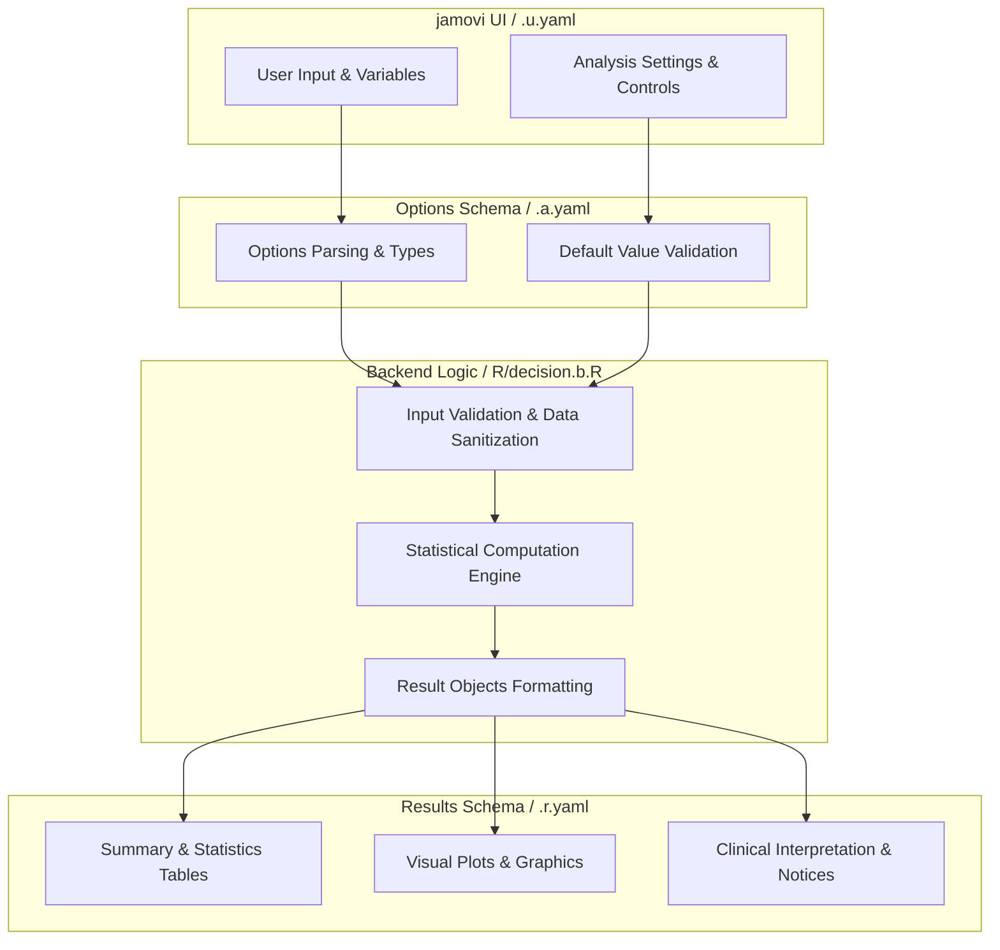
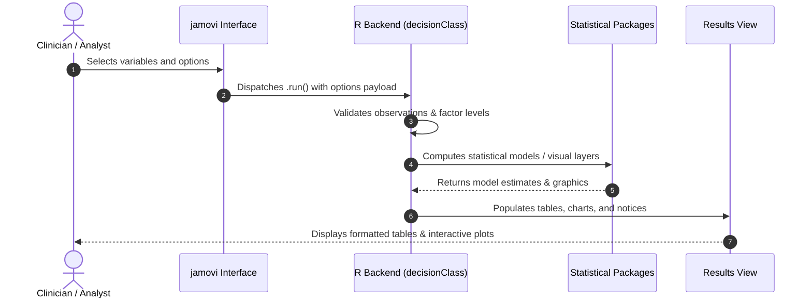

# Medical Decision - Developer Documentation

## 1. Overview

- **Function**: `decision`
- **Title**: Medical Decision
- **Module**: `meddecide`
- **Files**:
  - `jamovi/decision.u.yaml` - User Interface Definition
  - `jamovi/decision.a.yaml` - Options & Schema Definition
  - `jamovi/decision.r.yaml` - Results Layout & Tables
  - `R/decision.b.R` - Backend Implementation
- **Summary**: Function for Medical Decision Analysis. Sensitivity, Specificity, Positive Predictive Value, Negative Predictive Value.

## 1a. Changelog

- **Date**: 2026-08-29
- **Summary**: Comprehensive documentation suite created & verified against active schemas and backend implementation.

## 2. Options Reference (`.a.yaml`)

| Option | Type | Default | Description |
| :--- | :--- | :--- | :--- |
| `data` | `Data` | `NULL` |  |
| `gold` | `Variable` | `NULL` | Gold Standard (Reference) |
| `goldPositive` | `Level` | `NULL` | Disease present level |
| `newtest` | `Variable` | `NULL` | Test Under Evaluation |
| `testPositive` | `Level` | `NULL` | Test positive level |
| `goldNegative` | `Level` | `NULL` | Disease absent level |
| `testNegative` | `Level` | `NULL` | Test negative level |
| `pp` | `Bool` | `FALSE` | Known population prevalence |
| `pprob` | `Number` | `0.3` | Population disease prevalence |
| `od` | `Bool` | `FALSE` | Raw data tables |
| `fnote` | `Bool` | `FALSE` | Explanatory footnotes |
| `ci` | `Bool` | `FALSE` | 95 percent confidence intervals |
| `fagan` | `Bool` | `FALSE` | Fagan nomogram plot |
| `showNaturalLanguage` | `Bool` | `FALSE` | Clinical summary |
| `showClinicalInterpretation` | `Bool` | `FALSE` | Clinical interpretation guide |
| `showReportTemplate` | `Bool` | `FALSE` | Copy-ready report |
| `showAboutAnalysis` | `Bool` | `FALSE` | About this analysis |
| `showMisclassified` | `Bool` | `FALSE` | Misclassified cases analysis |
| `maxCasesShow` | `Integer` | `50` | Maximum cases to display |
| `saveClassifications` | `Output` | `NULL` | Save classifications to data |

## 3. Results Definition (`.r.yaml`)

| Output ID | Type | Title | Description |
| :--- | :--- | :--- | :--- |
| `welcome` | `Html` | `Getting Started` |  |
| `notices` | `Html` | `Important Information` |  |
| `rawContingency` | `Table` | `Raw Contingency Table` |  |
| `rawCounts` | `Table` | `Raw Combination Counts` |  |
| `cTable` | `Table` | `Recoded Data for Decision Test Statistics` |  |
| `nTable` | `Table` | `n` |  |
| `ratioTable` | `Table` | `` |  |
| `missingDataSummary` | `Html` | `Data Quality Summary` |  |
| `epirTable_ratio` | `Table` | `EpiR Table Ratios` |  |
| `epirTable_number` | `Table` | `` |  |
| `plot1` | `Image` | `Fagan nomogram` |  |
| `naturalLanguageSummary` | `Html` | `Clinical Summary` |  |
| `clinicalInterpretation` | `Html` | `Clinical Interpretation Guide` |  |
| `reportTemplate` | `Html` | `Copy-Ready Report` |  |
| `aboutAnalysis` | `Html` | `About This Analysis` |  |
| `misclassifiedHeading` | `Html` | `Misclassified Cases Analysis` |  |
| `confusionMatrixSummary` | `Table` | `Confusion Matrix Summary` |  |
| `falsePositiveTable` | `Table` | `False Positive Cases (Test+ but Disease-)` |  |
| `falseNegativeTable` | `Table` | `False Negative Cases (Test- but Disease+)` |  |
| `misclassificationInterpretation` | `Html` | `Interpretation of Misclassified Cases` |  |
| `saveClassifications` | `Output` | `Classification Groups` |  |

## 4. Architecture & Data Flow Diagram

## 5. Execution Sequence

## 6. Change Impact & Safety Guidelines

- **Data Filtering**: Ensure observations with missing values are handled gracefully according to analysis options.
- **Formula Conflicts**: Use isolated environment calls or base formula methods when interacting with `ggstatsplot` or formula parsers.
- **Safe Deparsing**: Use `deparse(val)` in syntax generation (`asSource()`) to escape column names with spaces or special symbols.

