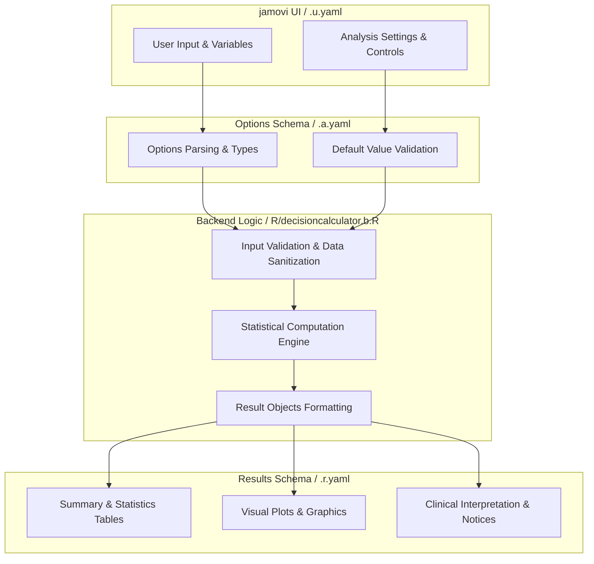
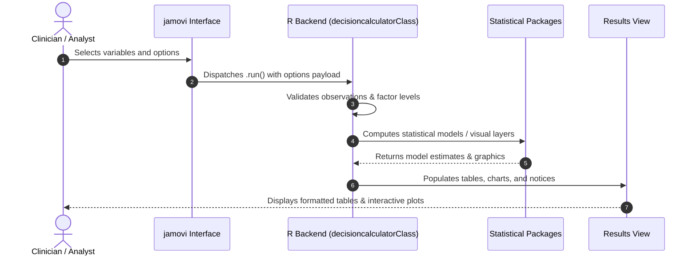

# Medical Decision Calculator - Developer Documentation

## 1. Overview

- **Function**: `decisioncalculator`
- **Title**: Medical Decision Calculator
- **Module**: `meddecide`
- **Files**:
  - `jamovi/decisioncalculator.u.yaml` - User Interface Definition
  - `jamovi/decisioncalculator.a.yaml` - Options & Schema Definition
  - `jamovi/decisioncalculator.r.yaml` - Results Layout & Tables
  - `R/decisioncalculator.b.R` - Backend Implementation
- **Summary**: Medical Decision Calculator for diagnostic test evaluation when you have  the four key counts: True Positives (TP), False Positives (FP), True  Negatives (TN), and False Negatives (FN). Calculates comprehensive  diagnostic performance metrics including sensitivity, specificity,  positive and negative predictive values, likelihood ratios, and  post-test probabilities. Supports confidence interval estimation and  Fagan nomogram visualization for educational interpretation. Presets and examples are illustrative only and are not clinical guides.

## 1a. Changelog

- **Date**: 2026-08-29
- **Summary**: Comprehensive documentation suite created & verified against active schemas and backend implementation.

## 2. Options Reference (`.a.yaml`)

| Option | Type | Default | Description |
| :--- | :--- | :--- | :--- |
| `TP` | `Number` | `90` | True Positive (TP) |
| `TN` | `Number` | `80` | True Negative (TN) |
| `FP` | `Number` | `30` | False Positive (FP) |
| `FN` | `Number` | `20` | False Negative (FN) |
| `pp` | `Bool` | `FALSE` | Known population prevalence |
| `pprob` | `Number` | `0.3` | Prior Probability (prevalence) |
| `fnote` | `Bool` | `FALSE` | Explanatory footnotes |
| `ci` | `Bool` | `FALSE` | 95 percent confidence intervals |
| `fagan` | `Bool` | `FALSE` | Fagan nomogram plot |
| `showWelcome` | `Bool` | `FALSE` | Welcome message |
| `showSummary` | `Bool` | `FALSE` | Plain-language summary |
| `showAbout` | `Bool` | `FALSE` | About this analysis |
| `showGlossary` | `Bool` | `FALSE` | Clinical terms glossary |
| `multiplecuts` | `Bool` | `FALSE` | Multiple cut-off evaluation |
| `cutoff1` | `String` | `Higher sensitivity example` | Cut-off scenario 1 name |
| `tp1` | `Number` | `100` | TP (Cut-off 1) |
| `fp1` | `Number` | `40` | FP (Cut-off 1) |
| `tn1` | `Number` | `70` | TN (Cut-off 1) |
| `fn1` | `Number` | `10` | FN (Cut-off 1) |
| `cutoff2` | `String` | `Higher specificity example` | Cut-off scenario 2 name |
| `tp2` | `Number` | `80` | TP (Cut-off 2) |
| `fp2` | `Number` | `15` | FP (Cut-off 2) |
| `tn2` | `Number` | `95` | TN (Cut-off 2) |
| `fn2` | `Number` | `30` | FN (Cut-off 2) |

## 3. Results Definition (`.r.yaml`)

| Output ID | Type | Title | Description |
| :--- | :--- | :--- | :--- |
| `notices` | `Preformatted` | `Important Information` |  |
| `welcome` | `Html` | `` |  |
| `summary` | `Html` | `Summary` |  |
| `about` | `Html` | `About This Analysis` |  |
| `assumptions` | `Html` | `Assumptions & Caveats` |  |
| `glossary` | `Html` | `Clinical Terms Glossary` |  |
| `cTable` | `Table` | `` |  |
| `nTable` | `Table` | `` |  |
| `ratioTable` | `Table` | `` |  |
| `advancedMetricsTable` | `Table` | `Advanced Diagnostic Metrics` |  |
| `epirTable_ratio` | `Table` | `` |  |
| `epirTable_number` | `Table` | `` |  |
| `faganSummary` | `Html` | `Reading the Nomogram` | Plain-language reading of the Fagan nomogram: the pre-test probability, the likelihood ratios, and where a positive or a negative result moves the probability of disease. |
| `plot1` | `Image` | `Fagan nomogram` |  |
| `multipleCutoffTable` | `Table` | `Cut-off Comparison` |  |

## 4. Architecture & Data Flow Diagram

## 5. Execution Sequence

## 6. Change Impact & Safety Guidelines

- **Data Filtering**: Ensure observations with missing values are handled gracefully according to analysis options.
- **Formula Conflicts**: Use isolated environment calls or base formula methods when interacting with `ggstatsplot` or formula parsers.
- **Safe Deparsing**: Use `deparse(val)` in syntax generation (`asSource()`) to escape column names with spaces or special symbols.

