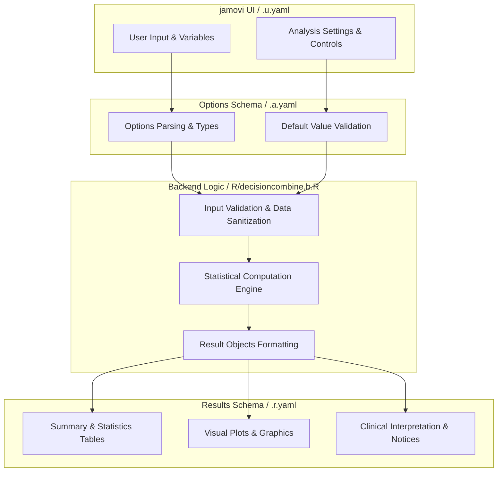
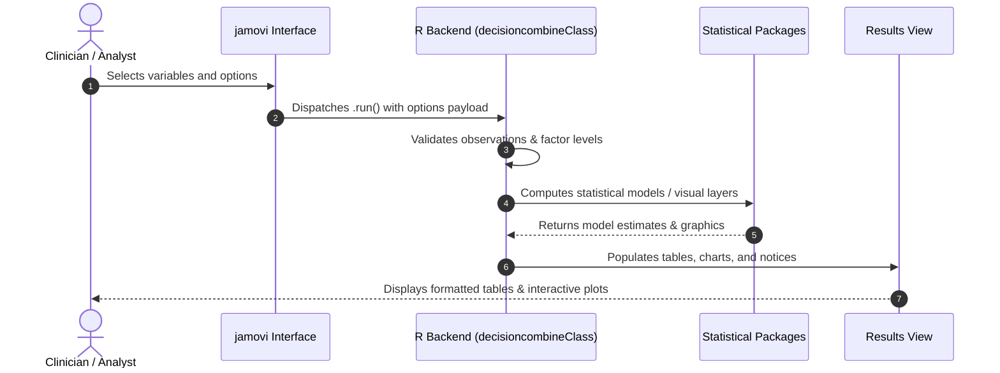

# Combine Medical Decision Tests - Developer Documentation

## 1. Overview

- **Function**: `decisioncombine`
- **Title**: Combine Medical Decision Tests
- **Module**: `meddecide`
- **Files**:
  - `jamovi/decisioncombine.u.yaml` - User Interface Definition
  - `jamovi/decisioncombine.a.yaml` - Options & Schema Definition
  - `jamovi/decisioncombine.r.yaml` - Results Layout & Tables
  - `R/decisioncombine.b.R` - Backend Implementation
- **Summary**: Systematic evaluation of diagnostic test combinations. Analyzes all possible test result patterns (2-test: 4 patterns, 3-test: 8 patterns) against a gold standard and summarizes named parallel, serial, and majority strategies. Calculates sensitivity, specificity, predictive values, likelihood ratios, accuracy, and uncertainty intervals. Descriptive rankings are sample-dependent analytical summaries, not clinical guides or validated recommendations.

## 1a. Changelog

- **Date**: 2026-08-29
- **Summary**: Comprehensive documentation suite created & verified against active schemas and backend implementation.

## 2. Options Reference (`.a.yaml`)

| Option | Type | Default | Description |
| :--- | :--- | :--- | :--- |
| `data` | `Data` | `NULL` |  |
| `gold` | `Variable` | `NULL` | Gold Standard (Reference Test) |
| `goldPositive` | `Level` | `NULL` | Disease present level |
| `test1` | `Variable` | `NULL` | Test 1 (Required) |
| `test1Positive` | `Level` | `NULL` | Test 1 Positive Level |
| `test2` | `Variable` | `NULL` | Test 2 (Required for Combinations) |
| `test2Positive` | `Level` | `NULL` | Test 2 Positive Level |
| `test3` | `Variable` | `NULL` | Test 3 (Optional) |
| `test3Positive` | `Level` | `NULL` | Test 3 Positive Level |
| `showIndividual` | `Bool` | `FALSE` | Individual test statistics |
| `showFrequency` | `Bool` | `FALSE` | Frequency tables |
| `showBarPlot` | `Bool` | `FALSE` | Bar chart |
| `showHeatmap` | `Bool` | `FALSE` | Heatmap |
| `showForest` | `Bool` | `FALSE` | Forest plot |
| `showDecisionTree` | `Bool` | `FALSE` | Decision space (sensitivity vs specificity) |
| `showRecommendation` | `Bool` | `FALSE` | Descriptive candidate-rule ranking |
| `addedPattern` | `Output` | `NULL` | Test pattern column |
| `showAbout` | `Bool` | `FALSE` | About this analysis |
| `filterStatistic` | `List` | `all` | Filter by statistic |
| `filterPattern` | `List` | `all` | Filter by pattern type |

## 3. Results Definition (`.r.yaml`)

| Output ID | Type | Title | Description |
| :--- | :--- | :--- | :--- |
| `combinationTable` | `Table` | `Test Combination Performance` | Counts and diagnostic performance metrics for each test combination pattern and clinical strategy, including prevalence, balanced accuracy, Youden's J, likelihood ratios, and diagnostic odds ratios |
| `combinationTableCI` | `Table` | `Proportions with 95% Confidence Intervals` | Wilson score 95 percent confidence intervals for sensitivity, specificity, PPV, NPV and accuracy, shown as percentages to match the combination table above. Likelihood ratios and the diagnostic odds ratio are unbounded ratios rather than proportions, so they appear in their own table below. |
| `combinationTableCIRatios` | `Table` | `Likelihood Ratios with 95% Confidence Intervals` | Log-scale 95 percent confidence intervals for LR+, LR- and the diagnostic odds ratio. These are ratios on an unbounded scale, so they are reported separately from the proportions above rather than sharing a column with them. |
| `goldFreqTable` | `Table` | `Gold Standard Frequency Distribution` | Frequency distribution of the gold standard (reference) test showing counts and percentages for each level |
| `crossTabTable` | `Table` | `Test Results Cross-Tabulation` | Cross-tabulation showing how test combination patterns align with gold standard results |
| `individualTest1` | `Group` | `Test 1 Performance` |  |
| `individualTest2` | `Group` | `Test 2 Performance` |  |
| `individualTest3` | `Group` | `Test 3 Performance` |  |
| `barPlot` | `Image` | `Bar Chart - Performance Comparison` | Grouped bar chart comparing sensitivity, specificity, PPV, NPV, and accuracy across test combinations |
| `heatmapPlot` | `Image` | `Heatmap - All Metrics by Pattern` | Color-coded heatmap showing all diagnostic metrics for each test pattern |
| `forestPlot` | `Image` | `Forest Plot - Confidence Intervals` | Forest plot displaying 95 percent confidence intervals for key diagnostic metrics |
| `decisionTreePlot` | `Image` | `Decision Space: Sensitivity vs Specificity` | Decision-space scatter plot positioning each test pattern by its sensitivity and specificity, with point size scaled by Youden's J |
| `recommendationTable` | `Table` | `Descriptive Candidate-Rule Ranking` | Sample-dependent descriptive ranking of eligible exact-pattern rules and named testing strategies by observed Youden index; this is not a clinical guide or validated recommendation |
| `addedPattern` | `Output` | `Test Pattern Column` |  |
| `about` | `Html` | `About This Analysis` |  |
| `assumptions` | `Html` | `Assumptions and Caveats` |  |
| `notices` | `Html` | `Notices` |  |

## 4. Architecture & Data Flow Diagram

## 5. Execution Sequence

## 6. Change Impact & Safety Guidelines

- **Data Filtering**: Ensure observations with missing values are handled gracefully according to analysis options.
- **Formula Conflicts**: Use isolated environment calls or base formula methods when interacting with `ggstatsplot` or formula parsers.
- **Safe Deparsing**: Use `deparse(val)` in syntax generation (`asSource()`) to escape column names with spaces or special symbols.

