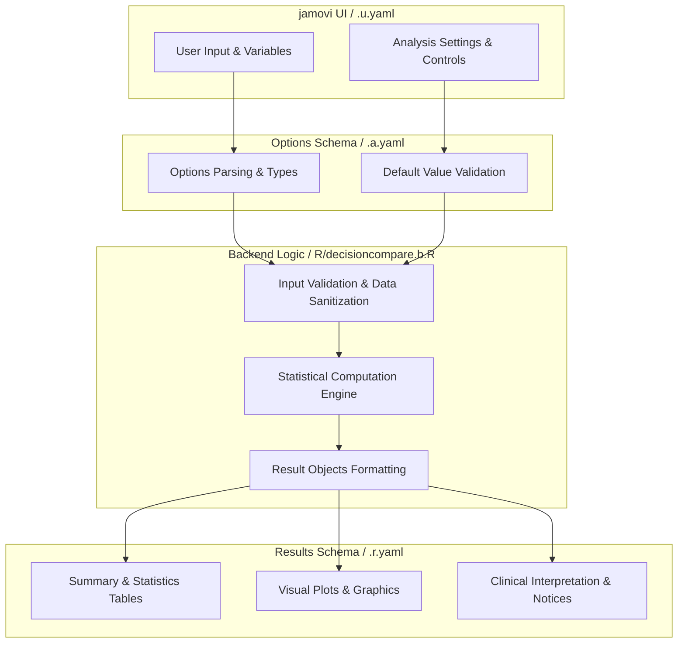
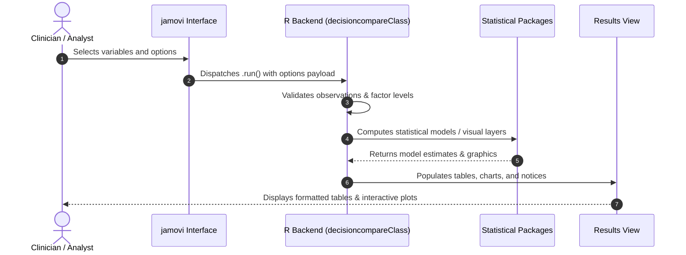

# Compare Medical Decision Tests - Developer Documentation

## 1. Overview

- **Function**: `decisioncompare`
- **Title**: Compare Medical Decision Tests
- **Module**: `meddecide`
- **Files**:
  - `jamovi/decisioncompare.u.yaml` - User Interface Definition
  - `jamovi/decisioncompare.a.yaml` - Options & Schema Definition
  - `jamovi/decisioncompare.r.yaml` - Results Layout & Tables
  - `R/decisioncompare.b.R` - Backend Implementation
- **Summary**: Function for comparing multiple Medical Decision Tests. Compares sensitivity, specificity, positive predictive value, negative predictive value, and other metrics between different tests against the same gold standard. Includes statistical comparison using McNemar's test and confidence intervals for differences.

## 1a. Changelog

- **Date**: 2026-08-29
- **Summary**: Comprehensive documentation suite created & verified against active schemas and backend implementation.

## 2. Options Reference (`.a.yaml`)

| Option | Type | Default | Description |
| :--- | :--- | :--- | :--- |
| `data` | `Data` | `NULL` |  |
| `gold` | `Variable` | `NULL` | Gold Standard (Reference Test) |
| `goldPositive` | `Level` | `NULL` | Disease present level |
| `goldNegative` | `Level` | `NULL` | Disease absent level |
| `test1` | `Variable` | `NULL` | Test 1 (Required) |
| `test1Positive` | `Level` | `NULL` | Test 1 Positive Level |
| `test1Negative` | `Level` | `NULL` | Test 1 Negative Level |
| `test2` | `Variable` | `NULL` | Test 2 (Required for Comparison) |
| `test2Positive` | `Level` | `NULL` | Test 2 Positive Level |
| `test2Negative` | `Level` | `NULL` | Test 2 Negative Level |
| `test3` | `Variable` | `NULL` | Test 3 (Optional) |
| `test3Positive` | `Level` | `NULL` | Test 3 Positive Level |
| `test3Negative` | `Level` | `NULL` | Test 3 Negative Level |
| `pp` | `Bool` | `FALSE` | Prior probability (prevalence) |
| `pprob` | `Number` | `0.3` | Prior probability (prevalence) |
| `od` | `Bool` | `FALSE` | Original data |
| `fnote` | `Bool` | `FALSE` | Footnotes |
| `ci` | `Bool` | `FALSE` | 95 percent CI |
| `plot` | `Bool` | `FALSE` | Comparison plot |
| `excludeIndeterminate` | `Bool` | `FALSE` | Exclude indeterminate/Equivocal levels |
| `radarplot` | `Bool` | `FALSE` | Radar plot |
| `heatmap` | `Bool` | `FALSE` | Concordance heatmap |
| `opa` | `Bool` | `FALSE` | Overall percent agreement with CI |
| `niMargin` | `Number` | `75` | Minimum acceptable OPA (percent) |
| `useOpaCriterion` | `Bool` | `FALSE` | Apply minimum OPA criterion |
| `ciMethod` | `List` | `wilson` | CI Method for Agreement |
| `stratify` | `Variable` | `NULL` | Stratification Variable |
| `statComp` | `Bool` | `FALSE` | Statistical comparison |
| `showSummary` | `Bool` | `FALSE` | Summary |
| `showExplanations` | `Bool` | `FALSE` | Explanations |
| `showReportSentence` | `Bool` | `FALSE` | Report sentence |
| `showDescriptiveReport` | `Bool` | `FALSE` | Descriptive report templates |

## 3. Results Definition (`.r.yaml`)

| Output ID | Type | Title | Description |
| :--- | :--- | :--- | :--- |
| `text1` | `Preformatted` | `Original Data` |  |
| `text2` | `Html` | `Original Data` |  |
| `cTable1` | `Table` | `Test 1 - Recoded Data` |  |
| `epirTable1` | `Table` | `Test 1 - Confidence Intervals` |  |
| `cTable2` | `Table` | `Test 2 - Recoded Data` |  |
| `epirTable2` | `Table` | `Test 2 - Confidence Intervals` |  |
| `cTable3` | `Table` | `Test 3 - Recoded Data` |  |
| `epirTable3` | `Table` | `Test 3 - Confidence Intervals` |  |
| `comparisonTable` | `Table` | `Decision Test Comparison` |  |
| `opaTable` | `Table` | `Overall Percent Agreement (Descriptive)` |  |
| `stratifiedTable` | `Table` | `Stratified Diagnostic Accuracy` |  |
| `mcnemarTable` | `Table` | `Statistical Comparison of Test Accuracy` |  |
| `diffTable` | `Table` | `Differences with 95% Confidence Intervals` |  |
| `plot1` | `Image` | `Test Comparison` |  |
| `plotRadar` | `Image` | `Radar Plot Comparison` |  |
| `plotHeatmap` | `Image` | `Concordance Heatmap` |  |
| `summaryReport` | `Html` | `Summary` |  |
| `reportSentence` | `Html` | `Manuscript-Ready Report` |  |
| `explanationsContent` | `Html` | `Statistical Explanations & Glossary` |  |
| `clinicalReport` | `Html` | `Descriptive Summary & Report Templates` |  |
| `aboutAnalysis` | `Html` | `About This Analysis` |  |
| `notices` | `Html` | `Important Information` |  |

## 4. Architecture & Data Flow Diagram

## 5. Execution Sequence

## 6. Change Impact & Safety Guidelines

- **Data Filtering**: Ensure observations with missing values are handled gracefully according to analysis options.
- **Formula Conflicts**: Use isolated environment calls or base formula methods when interacting with `ggstatsplot` or formula parsers.
- **Safe Deparsing**: Use `deparse(val)` in syntax generation (`asSource()`) to escape column names with spaces or special symbols.

