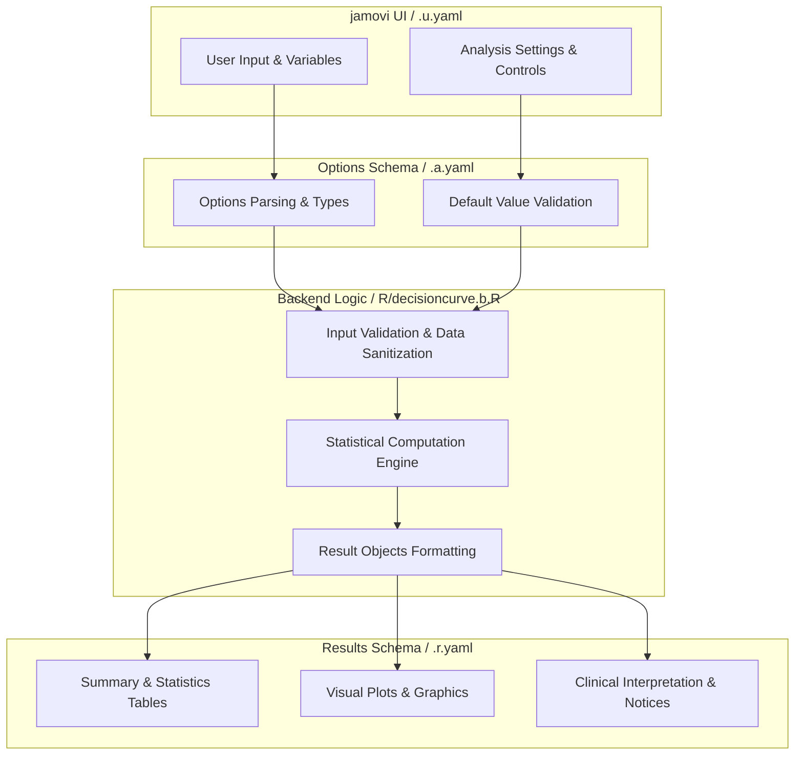
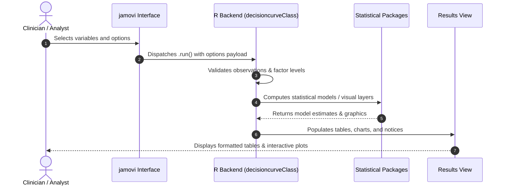

# Decision Curve Analysis - Developer Documentation

## 1. Overview

- **Function**: `decisioncurve`
- **Title**: Decision Curve Analysis
- **Module**: `meddecide`
- **Files**:
  - `jamovi/decisioncurve.u.yaml` - User Interface Definition
  - `jamovi/decisioncurve.a.yaml` - Options & Schema Definition
  - `jamovi/decisioncurve.r.yaml` - Results Layout & Tables
  - `R/decisioncurve.b.R` - Backend Implementation
- **Summary**: Decision Curve Analysis for evaluating the clinical utility of prediction models and diagnostic tests. Calculates net benefit across threshold probabilities to determine if using a model provides more benefit than default strategies. Inputs must be probabilities for a clearly defined binary outcome and prediction horizon; calibration must be assessed separately, and this analysis does not handle censoring.

## 1a. Changelog

- **Date**: 2026-08-29
- **Summary**: Comprehensive documentation suite created & verified against active schemas and backend implementation.

## 2. Options Reference (`.a.yaml`)

| Option | Type | Default | Description |
| :--- | :--- | :--- | :--- |
| `data` | `Data` | `NULL` |  |
| `outcome` | `Variable` | `NULL` | Outcome Variable |
| `outcomePositive` | `Level` | `NULL` | Positive Outcome Level |
| `models` | `Variables` | `NULL` | Prediction Variables/Models |
| `modelNames` | `String` | `` | Model Names |
| `thresholdRange` | `List` | `clinical` | Threshold Range |
| `thresholdMin` | `Number` | `0.05` | Minimum Threshold |
| `thresholdMax` | `Number` | `0.5` | Maximum Threshold |
| `thresholdStep` | `Number` | `0.01` | Threshold Step Size |
| `showTable` | `Bool` | `TRUE` | Show Results Table |
| `selectedThresholds` | `String` | `0.05, 0.10, 0.15, 0.20, 0.25, 0.30` | Selected Thresholds for Table |
| `showPlot` | `Bool` | `TRUE` | Show Decision Curve Plot |
| `plotStyle` | `List` | `standard` | Plot Style |
| `showReferenceLinesLabels` | `Bool` | `FALSE` | Show Reference Line Labels |
| `highlightRange` | `Bool` | `FALSE` | Highlight Clinical Range |
| `highlightMin` | `Number` | `0.1` | Highlight Range Minimum |
| `highlightMax` | `Number` | `0.3` | Highlight Range Maximum |
| `calculateClinicalImpact` | `Bool` | `FALSE` | Calculate Clinical Impact |
| `populationSize` | `Number` | `1000` | Population Size for Projections |
| `showInterventionAvoided` | `Bool` | `FALSE` | Net Interventions Avoided |
| `confidenceIntervals` | `Bool` | `FALSE` | Bootstrap Confidence Intervals |
| `bootReps` | `Integer` | `1000` | Bootstrap Replications |
| `seed` | `Integer` | `42` | Random Seed |
| `ciLevel` | `Number` | `0.95` | Confidence Level |
| `showBenefitRange` | `Bool` | `FALSE` | Range of Benefit |
| `compareModels` | `Bool` | `FALSE` | Model Comparison Statistics |
| `weightedAUC` | `Bool` | `FALSE` | Average Net Benefit Over the Threshold Range |
| `clinicalDecisionRule` | `Bool` | `FALSE` | Clinical Decision Rule Integration |
| `decisionRuleVar` | `Variable` | `NULL` | Clinical Decision Rule (binary) |
| `decisionRulePositive` | `Level` | `NULL` | Decision Rule Positive Level |
| `decisionRuleLabel` | `String` | `Clinical Rule` | Decision Rule Label |
| `showClinicalImpactPlot` | `Bool` | `FALSE` | Clinical Impact Plot |
| `showNetBenefitCI` | `Bool` | `FALSE` | Show Net Benefit Confidence Intervals |
| `costBenefitAnalysis` | `Bool` | `FALSE` | Exploratory Monetary Payoff |
| `testCost` | `Number` | `100` | Monetary Cost per Test/Screening |
| `treatmentCost` | `Number` | `1000` | Monetary Cost per Treatment |
| `benefitCorrectTreatment` | `Number` | `10000` | Monetary Value Assigned to a True Positive |
| `harmFalseTreatment` | `Number` | `500` | Monetary Harm Assigned to a False Positive |
| `showStandardizedNetBenefit` | `Bool` | `FALSE` | Standardized Net Benefit |
| `multiModelComparison` | `Bool` | `FALSE` | Enhanced Multi-Model Comparison |
| `comparisonMethod` | `List` | `bootstrap` | Comparison Statistical Test (bootstrap only) |
| `showDecisionConsequences` | `Bool` | `FALSE` | Decision Consequences Table |
| `resourceUtilization` | `Bool` | `FALSE` | Resource Utilization Analysis |
| `showRelativeUtility` | `Bool` | `FALSE` | Relative Utility Curve |

## 3. Results Definition (`.r.yaml`)

| Output ID | Type | Title | Description |
| :--- | :--- | :--- | :--- |
| `instructions` | `Html` | `Instructions` |  |
| `procedureNotes` | `Html` | `Analysis Summary` |  |
| `notices` | `Html` | `Important Information` |  |
| `resultsTable` | `Table` | `Net Benefit at Selected Thresholds` |  |
| `benefitRangeTable` | `Table` | `Range of Benefit` |  |
| `clinicalImpactTable` | `Table` | `Clinical Impact Analysis` |  |
| `comparisonTable` | `Table` | `Exploratory Model Comparison` |  |
| `weightedAUCTable` | `Table` | `Descriptive Average Net Benefit Over Threshold Range` |  |
| `dcaPlot` | `Image` | `Decision Curve Analysis` | Net-benefit curves with optional pointwise bootstrap intervals; ribbons are not simultaneous confidence bands |
| `clinicalImpactPlot` | `Image` | `Clinical Impact Plot` | Projected true and false positives for the selected population size |
| `interventionsAvoidedPlot` | `Image` | `Net Interventions Avoided vs Treat All` |  |
| `summaryText` | `Html` | `Clinical Interpretation` |  |
| `costBenefitTable` | `Table` | `Exploratory Monetary Payoff (Not Cost-Effectiveness)` | Simple monetary payoff projection under explicit assumptions; not an ICER, QALY or formal health-economic analysis |
| `decisionConsequencesTable` | `Table` | `Decision Consequences` | Detailed consequences at selected thresholds |
| `modelComparisonEnhanced` | `Table` | `Exploratory Pairwise Model Comparison` | Exploratory case-resampling comparison of average net benefit over the selected range |
| `resourceUtilizationTable` | `Table` | `Resource Utilization` | Resource utilization projected to the selected population size |
| `relativeUtilityPlot` | `Image` | `Relative Utility Curve` | Relative utility compared to default strategies |
| `standardizedNetBenefitPlot` | `Image` | `Standardized Net Benefit` | Dimensionless net benefit divided by outcome prevalence; not net benefit per 100 patients |

## 4. Architecture & Data Flow Diagram

## 5. Execution Sequence

## 6. Change Impact & Safety Guidelines

- **Data Filtering**: Ensure observations with missing values are handled gracefully according to analysis options.
- **Formula Conflicts**: Use isolated environment calls or base formula methods when interacting with `ggstatsplot` or formula parsers.
- **Safe Deparsing**: Use `deparse(val)` in syntax generation (`asSource()`) to escape column names with spaces or special symbols.

