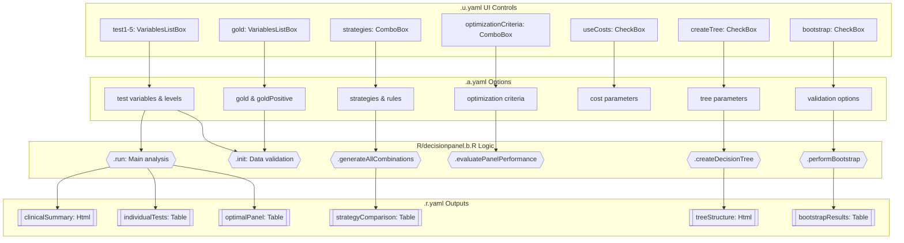
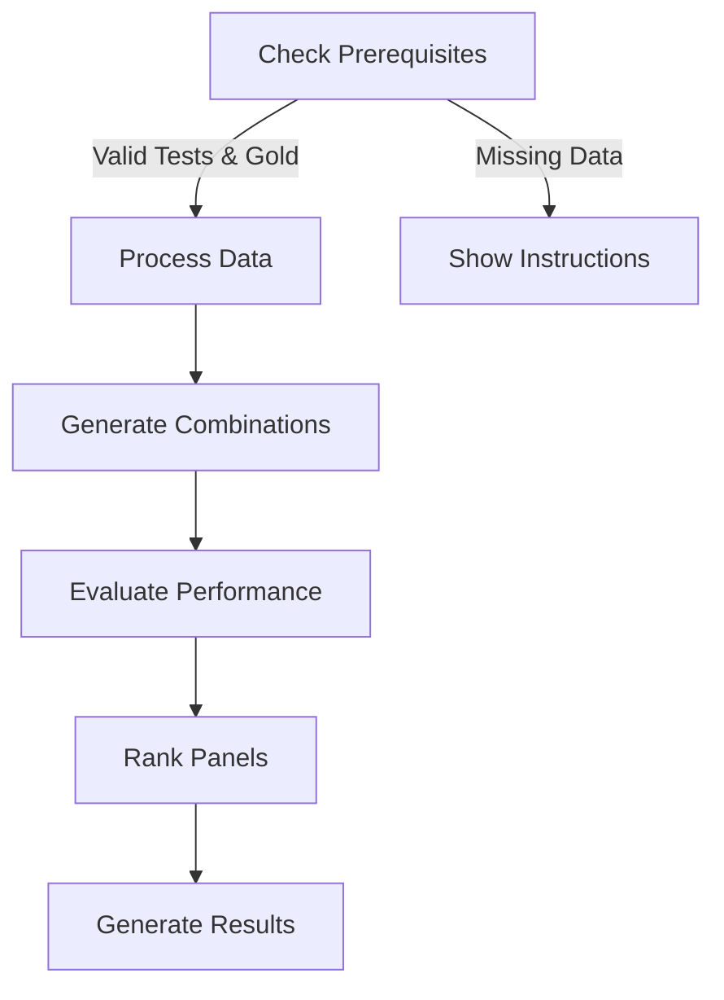
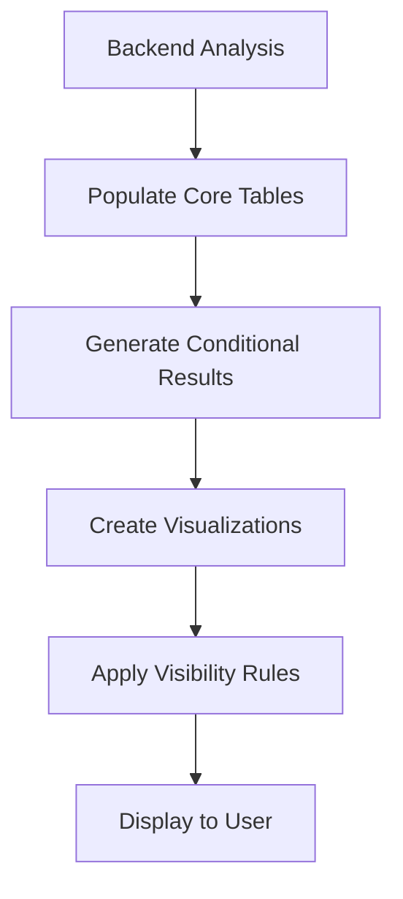
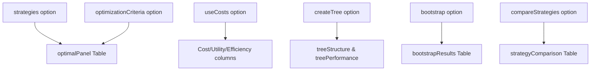

# Decision Panel Optimization Documentation

## 1. Overview

**Function**: `decisionpanel`

**Files**:
- `jamovi/decisionpanel.u.yaml` — UI
- `jamovi/decisionpanel.a.yaml` — Options  
- `R/decisionpanel.b.R` — Backend
- `jamovi/decisionpanel.r.yaml` — Results

**Summary**: The Decision Panel Optimization function optimizes diagnostic test panels by evaluating various combination strategies including parallel testing (cotest), sequential testing, and repeated tests. It creates decision trees to minimize cost while maximizing accuracy for clinical decision-making scenarios. The function supports up to 5 diagnostic tests and performs comprehensive analysis including individual test performance, optimal panel selection, strategy comparison, and cost-effectiveness evaluation.

## 2. UI Controls → Options Map

| UI Control | Type | Label | Binds to Option | Defaults & Constraints | Visibility/Enable Rules |
|------------|------|-------|----------------|------------------------|-------------------------|
| test1 | VariablesListBox | Primary Diagnostic Test | test1 | maxItemCount: 1 | - |
| test1Positive | LevelSelector | Positive Result Level | test1Positive | - | enable: (test1) |
| test2 | VariablesListBox | Secondary Diagnostic Test | test2 | maxItemCount: 1 | - |
| test2Positive | LevelSelector | Positive Result Level | test2Positive | - | enable: (test2) |
| test3 | VariablesListBox | Additional Test 3 (Optional) | test3 | maxItemCount: 1 | - |
| test3Positive | LevelSelector | Positive Result Level | test3Positive | - | enable: (test3) |
| test4 | VariablesListBox | Additional Test 4 (Optional) | test4 | maxItemCount: 1 | - |
| test4Positive | LevelSelector | Positive Result Level | test4Positive | - | enable: (test4) |
| test5 | VariablesListBox | Additional Test 5 (Optional) | test5 | maxItemCount: 1 | - |
| test5Positive | LevelSelector | Positive Result Level | test5Positive | - | enable: (test5) |
| gold | VariablesListBox | Gold Standard Reference | gold | maxItemCount: 1 | - |
| goldPositive | LevelSelector | Disease/Condition Present Level | goldPositive | - | enable: (gold) |
| strategies | ComboBox | Testing Strategies to Evaluate | strategies | default: all | - |
| maxTests | TextBox | Maximum Tests per Panel | maxTests | default: 3, format: number | - |
| parallelRules | ComboBox | Decision Rule for Parallel Tests | parallelRules | default: any | enable: (strategies:parallel) |
| customThreshold | TextBox | Custom Threshold | customThreshold | default: 2, format: number | enable: (parallelRules:custom) |
| sequentialStop | ComboBox | When to Stop Sequential Testing | sequentialStop | default: positive | enable: (strategies:sequential) |
| optimizationCriteria | ComboBox | Primary Optimization Goal | optimizationCriteria | default: accuracy | - |
| panelOptimization | ComboBox | Panel Building Strategy | panelOptimization | default: forward | - |
| minSensitivity | TextBox | Minimum Sensitivity Required | minSensitivity | default: 0.80, format: number | - |
| minSpecificity | TextBox | Minimum Specificity Required | minSpecificity | default: 0.80, format: number | - |
| minImprovement | TextBox | Minimum Performance Improvement | minImprovement | default: 0.01, format: number | - |
| topN | TextBox | Number of Top Panels to Display | topN | default: 10, format: number | - |
| redundancyThreshold | TextBox | Test Correlation Threshold | redundancyThreshold | default: 0.7, format: number | - |
| useCosts | CheckBox | Include Cost-Effectiveness Analysis | useCosts | default: false | - |
| testCosts | TextBox | Individual Test Costs | testCosts | default: "", format: string | enable: (useCosts) |
| fpCost | TextBox | Cost of False Positive Result | fpCost | default: 100, format: number | enable: (useCosts) |
| fnCost | TextBox | Cost of False Negative Result | fnCost | default: 1000, format: number | enable: (useCosts) |
| prevalence | TextBox | Disease Prevalence | prevalence | default: 0, format: number | - |
| createTree | CheckBox | Create Decision Tree for Sequential Testing | createTree | default: false | - |
| treeMethod | ComboBox | Tree Construction Method | treeMethod | default: costSensitive | enable: (createTree) |
| maxDepth | TextBox | Maximum Tree Depth | maxDepth | default: 5, format: number | enable: (createTree) |
| minSplit | TextBox | Minimum Node Size for Split | minSplit | default: 20, format: number | enable: (createTree) |
| bootstrap | CheckBox | Bootstrap Confidence Intervals | bootstrap | default: false | - |
| bootReps | TextBox | Bootstrap Replications | bootReps | default: 1000, format: number | enable: (bootstrap) |
| crossValidate | CheckBox | K-Fold Cross-Validation | crossValidate | default: false | - |
| nFolds | TextBox | Number of Folds | nFolds | default: 5, format: number | enable: (crossValidate) |
| showAllCombinations | CheckBox | Show All Test Combinations | showAllCombinations | default: false | - |
| compareStrategies | CheckBox | Compare Testing Strategies | compareStrategies | default: true | - |
| plotTree | CheckBox | Decision Tree Plot | plotTree | default: true | enable: (createTree) |
| plotComparison | CheckBox | Strategy Comparison Plots | plotComparison | default: true | - |
| plotCostEffect | CheckBox | Cost-Effectiveness Frontier Plot | plotCostEffect | default: true | enable: (useCosts) |
| plotROC | CheckBox | ROC Curves for Top Panels | plotROC | default: false | - |
| seed | TextBox | Random Seed | seed | default: 12345, format: number | - |
| showProgress | CheckBox | Show Progress Indicators | showProgress | default: true | - |

## 3. Options Reference (.a.yaml)

### Test Variables
- **test1** / Variable / NULL: Primary diagnostic test variable (factor, nominal)
- **test1Positive** / Level / NULL: Positive level for Test 1, depends on test1 variable
- **test2** / Variable / NULL: Secondary diagnostic test variable (factor, nominal)  
- **test2Positive** / Level / NULL: Positive level for Test 2, depends on test2 variable
- **test3** / Variable / NULL: Third diagnostic test variable (optional)
- **test3Positive** / Level / NULL: Positive level for Test 3, depends on test3 variable
- **test4** / Variable / NULL: Fourth diagnostic test variable (optional)
- **test4Positive** / Level / NULL: Positive level for Test 4, depends on test4 variable
- **test5** / Variable / NULL: Fifth diagnostic test variable (optional) 
- **test5Positive** / Level / NULL: Positive level for Test 5, depends on test5 variable
- **gold** / Variable / NULL: Gold standard reference variable (factor, nominal)
- **goldPositive** / Level / NULL: Disease/condition present level, depends on gold variable

### Cost Parameters  
- **useCosts** / Bool / false: Enables cost-effectiveness analysis throughout the module
- **testCosts** / String / "": Comma-separated test costs, parsed in backend for economic calculations
- **fpCost** / Number / 100: False positive cost (min: 0), used in utility calculations
- **fnCost** / Number / 1000: False negative cost (min: 0), used in utility calculations

### Testing Strategies
- **strategies** / List / all: Controls which strategies are evaluated (all, single, parallel, sequential, custom)
- **parallelRules** / List / any: Parallel testing combination rules (any, all, majority, custom)
- **customThreshold** / Number / 2: Custom threshold for parallel testing (min: 1)
- **maxTests** / Number / 3: Maximum tests per panel (min: 2, max: 10)
- **sequentialStop** / List / positive: Sequential testing stop criteria

### Optimization Criteria
- **optimizationCriteria** / List / accuracy: Primary optimization metric (accuracy, sensitivity, specificity, ppv, npv, youden, utility, efficiency)
- **panelOptimization** / List / forward: Panel building method (forward, backward, both, exhaustive)
- **minImprovement** / Number / 0.01: Minimum performance improvement threshold (0.001-0.1)
- **redundancyThreshold** / Number / 0.7: Test correlation threshold (0.5-0.95)
- **minSensitivity** / Number / 0.80: Minimum acceptable sensitivity (0-1)
- **minSpecificity** / Number / 0.80: Minimum acceptable specificity (0-1)

### Decision Tree Options
- **createTree** / Bool / false: Enables decision tree generation and related outputs
- **treeMethod** / List / costSensitive: Tree construction method (cart, conditional, costSensitive, ensemble)
- **maxDepth** / Number / 5: Maximum tree depth (1-10)
- **minSplit** / Number / 20: Minimum node size for splits (min: 5)

### Output Options  
- **showAllCombinations** / Bool / false: Controls visibility of comprehensive combinations table
- **topN** / Number / 10: Number of top panels to display (1-50)
- **compareStrategies** / Bool / true: Enables strategy comparison analysis
- **bootstrap** / Bool / false: Enables bootstrap confidence intervals
- **bootReps** / Number / 1000: Bootstrap replications (100-10000)

### Visualization Options
- **plotTree** / Bool / true: Controls decision tree plot generation
- **plotComparison** / Bool / true: Controls strategy comparison plots  
- **plotCostEffect** / Bool / true: Controls cost-effectiveness frontier plots
- **plotROC** / Bool / false: Controls ROC curve generation

### Additional Options
- **prevalence** / Number / 0: Known disease prevalence (0-1), 0 uses sample prevalence
- **crossValidate** / Bool / false: Enables k-fold cross-validation
- **nFolds** / Number / 5: Number of CV folds (2-10)
- **seed** / Number / 12345: Random seed for reproducibility
- **showProgress** / Bool / true: Controls progress indicator display

## 4. Backend Usage (.b.R)

### Key Option Usage Patterns:

**Data Processing**:
- `self$options$gold` and `self$options$goldPositive`: Used in `.init()` and `.run()` for gold standard validation
- `self$options$test1` through `self$options$test5`: Test variable selection and binary conversion
- `self$options$seed`: Set early in `.run()` for reproducibility

**Strategy Configuration**:
- `self$options$strategies`: Controls which analysis strategies are performed in `.generateAllCombinations()`
- `self$options$parallelRules` and `self$options$customThreshold`: Used in `.evaluatePanelPerformance()` for parallel testing
- `self$options$sequentialStop`: Controls sequential testing logic
- `self$options$maxTests`: Limits combination generation

**Optimization Logic**:
- `self$options$optimizationCriteria`: Used in panel ranking throughout analysis
- `self$options$minSensitivity` and `self$options$minSpecificity`: Applied as constraints in panel selection
- `self$options$topN`: Limits results display in multiple tables

**Cost-Effectiveness**:
- `self$options$useCosts`: Gates all cost-related calculations
- `self$options$testCosts`: Parsed to numeric array for cost calculations
- `self$options$fpCost` and `self$options$fnCost`: Used in utility calculations in `.evaluatePanelPerformance()`

**Decision Trees**:
- `self$options$createTree`: Enables tree-related analysis in `.createDecisionTree()`
- `self$options$treeMethod`: Selects tree algorithm (CART, conditional, etc.)
- `self$options$maxDepth` and `self$options$minSplit`: Tree construction parameters

**Validation**:
- `self$options$bootstrap` and `self$options$bootReps`: Controls bootstrap analysis
- `self$options$crossValidate` and `self$options$nFolds`: Controls cross-validation

**Progress Control**:
- `self$options$showProgress`: Used throughout for progress indicator display

### Result Population Entry Points:
- `.populateIndividualTests()`: Populates `self$results$individualTests` 
- `.populateOptimalPanel()`: Populates `self$results$optimalPanel`
- `.populateStrategyComparison()`: Populates `self$results$strategyComparison` 
- `.populateAllCombinations()`: Populates `self$results$allCombinations`
- `.populateTreeResults()`: Populates `self$results$treeStructure` and `self$results$treePerformance`
- `.populateCrossValidation()`: Populates `self$results$crossValidation`
- `.populateBootstrapResults()`: Populates `self$results$bootstrapResults`

## 5. Results Definition (.r.yaml)

### Summary Results (Always Visible)
- **summary** (Html): Main analysis summary and progress updates
- **clinicalSummary** (Html): Clinical interpretation of results  
- **clinicalInterpretation** (Html): Detailed clinical guidance
- **clinicalReport** (Html): Copy-ready clinical report
- **clinicalWarnings** (Html): Clinical considerations and warnings

### Core Analysis Tables (Always Visible)
- **optimalPanel** (Table): Top-ranked test panels with performance metrics
  - Columns: rank, tests, strategy, sensitivity, specificity, accuracy, ppv, npv, youden, cost*, utility*, efficiency*
  - Cost columns visible when `useCosts` is true
- **individualTests** (Table): Individual test performance ranked by diagnostic value
  - Columns: rank, test, sensitivity, specificity, accuracy, ppv, npv, plr, nlr, auc, youden, cost*
- **panelBuilding** (Table): Forward selection panel building analysis
  - Columns: step, testAdded, panelComposition, baselineAccuracy, newAccuracy, improvementPercent, pValue, keep
- **optimalPanelsBySize** (Table): Best panels organized by size
  - Columns: panelSize, testCombination, strategy, sensitivity, specificity, accuracy, youden, costEffectiveness*, recommendation

### Analysis Tables (Always Visible)  
- **testRedundancy** (Table): Test correlation and redundancy analysis
  - Columns: testPair, correlation, overlap, redundancyLevel, recommendation
- **incrementalValue** (Table): Incremental diagnostic value analysis
  - Columns: test, aloneAccuracy, withOthersAccuracy, incrementalAccuracy, nri, pValueImprovement, essential
- **resultImportance** (Table): Test result importance analysis
  - Columns: test, resultType, frequency, positiveLR, negativeLR, informationGain, diagnosticImpact

### Conditional Tables
- **strategyComparison** (Table): Testing strategy comparison - visible when `compareStrategies` is true
  - Columns: strategy, nTests, avgSens, avgSpec, avgAccuracy, avgCost*, bestPanel, bestPerformance
- **allCombinations** (Table): All test combinations - visible when `showAllCombinations` is true
  - Columns: tests, strategy, nTests, sensitivity, specificity, accuracy, ppv, npv, cost*, utility*
- **treeStructure** (Html): Decision tree structure - visible when `createTree` is true
- **treePerformance** (Table): Decision tree performance - visible when `createTree` is true
  - Columns: node, condition, nCases, probPositive, decision, accuracy
- **crossValidation** (Table): Cross-validation results - visible when `crossValidate` is true
  - Columns: panel, strategy, cvSensitivity, cvSensitivitySD, cvSpecificity, cvSpecificitySD, cvAccuracy, cvAccuracySD
- **bootstrapResults** (Table): Bootstrap confidence intervals - visible when `bootstrap` is true
  - Columns: panel, metric, estimate, lower, upper, se

### Visualization Outputs
- **treeVisualization** (Image): Decision tree plot - visible when `plotTree && createTree`
- **strategyComparisonPlot** (Image): Strategy comparison plot - visible when `plotComparison && compareStrategies`
- **costEffectivenessPlot** (Image): Cost-effectiveness frontier - visible when `plotCostEffect && useCosts`
- **rocCurvesPlot** (Image): ROC curves for top panels - visible when `plotROC`

### Final Output
- **recommendations** (Html): Clinical recommendations and guidance (always visible)

*Cost-related columns visible only when `useCosts` is true

## 6. Data Flow Diagram (UI → Options → Backend → Results)



## 7. Execution Sequence (User Action → Results)

### User Input Flow


### Decision Logic


### Result Processing


**Step-by-step execution flow:**

1. **User Interface Interaction** → User selects test variables (test1-test5) and gold standard, configures strategy options
2. **Data Validation** → `.init()` and `.run()` validate selected variables, check for missing data, set random seed
3. **Data Preprocessing** → Convert categorical variables to binary, create working dataset with escaped variable names
4. **Strategy Generation** → `.generateAllCombinations()` creates test combinations based on selected strategies
5. **Panel Evaluation** → `.evaluatePanelPerformance()` calculates diagnostic metrics for each combination
6. **Optimization** → Rank panels by optimization criteria, apply constraints (minSensitivity, minSpecificity)
7. **Core Results Population** → Populate main tables (optimalPanel, individualTests, panelBuilding)
8. **Conditional Analysis** → Generate decision trees, bootstrap results, cross-validation based on options
9. **Visualization Generation** → Create plots based on plot options and data availability
10. **Clinical Interpretation** → Generate clinical summaries, warnings, and recommendations
11. **Result Display** → Apply visibility rules and present results to user



## 8. Change Impact Guide

### Key Option Changes:

**strategies**: 
- **If changed**: Recalculates all combinations, affects optimalPanel, strategyComparison, allCombinations
- **Performance impact**: "exhaustive" can be computationally intensive with many tests
- **Common pitfalls**: Limited combinations with "single" strategy

**optimizationCriteria**:
- **If changed**: Re-ranks all panels, changes optimal panel selection, affects all result rankings
- **Performance impact**: Minimal computational overhead
- **Recommended defaults**: "accuracy" for balanced datasets, "sensitivity" for screening, "specificity" for confirmation

**useCosts**:
- **If changed**: Enables/disables cost-related columns and calculations, affects optimization when "utility" or "efficiency" selected
- **Performance impact**: Minimal if costs properly specified
- **Common pitfalls**: Missing or incorrectly formatted testCosts string

**createTree**:
- **If changed**: Enables/disables decision tree analysis and plots
- **Performance impact**: Moderate, especially with large datasets and deep trees
- **Recommended defaults**: Enable for sequential testing scenarios

**maxTests**:
- **If changed**: Dramatically affects number of combinations (exponential growth)
- **Performance impact**: High impact - combinations grow as C(n,k) for k up to maxTests
- **Common pitfalls**: Setting too high (>5) can cause performance issues

**bootstrap/crossValidate**:
- **If changed**: Enables intensive validation procedures
- **Performance impact**: High - bootstrap especially with high bootReps
- **Recommended defaults**: Enable for publication-quality results, disable for exploratory analysis

## 9. Example Usage

### Basic Diagnostic Test Comparison
**Dataset requirements**: Categorical test variables and gold standard with at least 2 levels each

**Example option payload**:
```yaml
test1: "rapid_test"
test1Positive: "Positive" 
test2: "lab_test"
test2Positive: "Positive"
gold: "final_diagnosis"
goldPositive: "Disease"
strategies: "all"
optimizationCriteria: "accuracy"
compareStrategies: true
```

**Expected outputs**: Individual test performance, optimal 2-test panels, strategy comparison showing single vs parallel testing

### Cost-Effectiveness Analysis
**Additional requirements**: Cost information for tests and clinical consequences

**Example option payload**:
```yaml
useCosts: true
testCosts: "10,50"  
fpCost: 500
fnCost: 2000
optimizationCriteria: "utility"
plotCostEffect: true
```

**Expected outputs**: Cost-effectiveness frontier plot, utility-optimized panels, economic recommendations

### Decision Tree Analysis  
**Use case**: Sequential testing workflow optimization

**Example option payload**:
```yaml
createTree: true
treeMethod: "cart"
maxDepth: 3
strategies: "sequential"
sequentialStop: "positive"
plotTree: true
```

**Expected outputs**: Decision tree structure, tree performance metrics, sequential testing recommendations

## 10. Appendix (Schemas & Snippets)

### Core Table Schemas

**optimalPanel Table**:
```yaml
columns:
  - rank (integer): Panel ranking
  - tests (text): Comma-separated test names  
  - strategy (text): Testing strategy used
  - sensitivity (number, pc): True positive rate
  - specificity (number, pc): True negative rate
  - accuracy (number, pc): Overall accuracy
  - ppv (number, pc): Positive predictive value
  - npv (number, pc): Negative predictive value  
  - youden (number, zto): Youden's J index
  - cost (number, zto): Panel cost [visible: useCosts]
  - utility (number, zto): Clinical utility [visible: useCosts]
  - efficiency (number, zto): Accuracy/cost ratio [visible: useCosts]
```

**individualTests Table**:
```yaml
columns:
  - rank (integer): Performance ranking
  - test (text): Test name
  - sensitivity (number, pc): Sensitivity
  - specificity (number, pc): Specificity  
  - accuracy (number, pc): Accuracy
  - ppv (number, pc): Positive predictive value
  - npv (number, pc): Negative predictive value
  - plr (number, zto): Positive likelihood ratio
  - nlr (number, zto): Negative likelihood ratio
  - auc (number, zto): Area under ROC curve
  - youden (number, zto): Youden's J index
  - cost (number, zto): Test cost [visible: useCosts]
```

### Key Code Snippets

**Option Access Pattern**:
```r
# Strategy configuration
strategies <- self$options$strategies
max_tests <- self$options$maxTests
optimization_criteria <- self$options$optimizationCriteria

# Cost analysis enablement  
if (self$options$useCosts && nchar(self$options$testCosts) > 0) {
    test_costs <- as.numeric(unlist(strsplit(self$options$testCosts, ",")))
}
```

**Result Population Pattern**:
```r
# Table population
table <- self$results$optimalPanel
for (i in seq_len(nrow(results))) {
    table$setRow(rowNo = i, values = list(
        rank = i,
        tests = results$tests[i],
        sensitivity = results$sensitivity[i]
    ))
}

# HTML content population  
self$results$clinicalSummary$setContent(html_content)
```

**Visibility Control Pattern**:
```r
# Conditional analysis based on options
if (self$options$createTree) {
    tree_results <- private$.createDecisionTree(data, tests, gold)
    self$results$treeVisualization$setState(tree_results)
}

if (self$options$bootstrap) {
    bootstrap_results <- private$.performBootstrap(data, panels)
    private$.populateBootstrapResults(bootstrap_results)
}
```