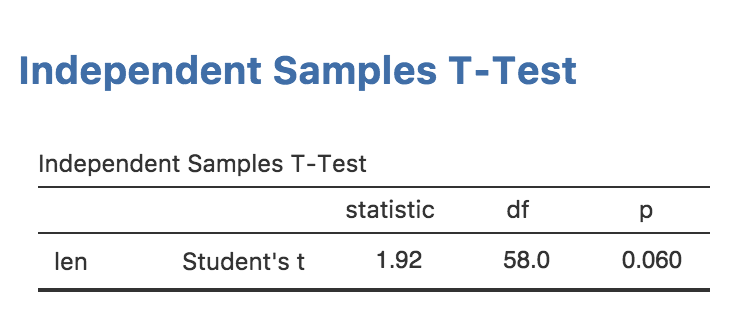
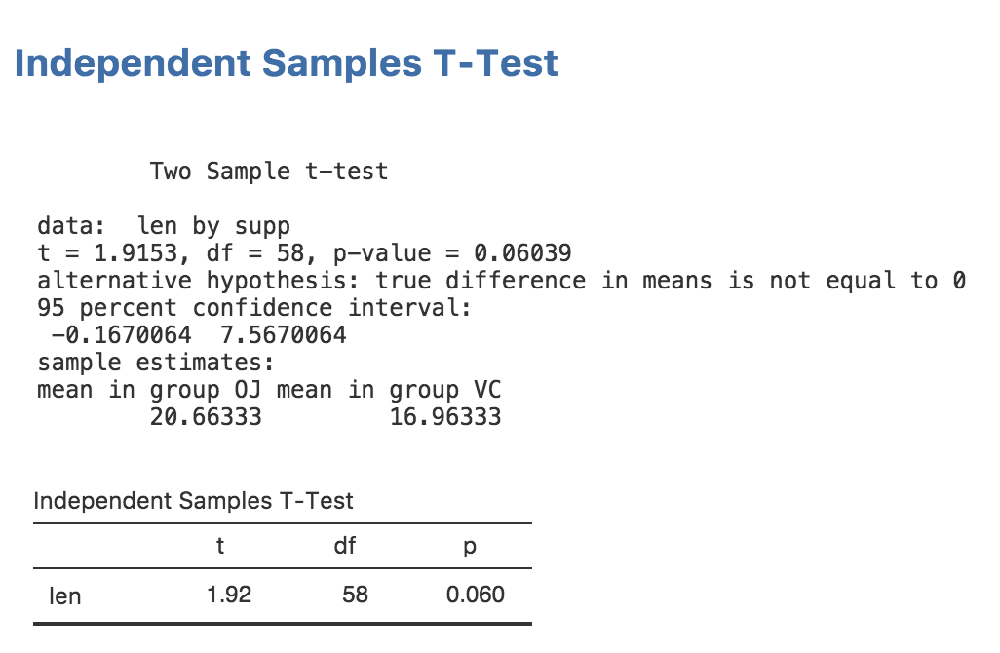

In this section, we will add rich results to our analysis; a nice APA formatted table like this:

{ width=337px }

Rich results are visually appealing, and make it easier for users of your module to 'parse' and understand the results your module produces. A lot of people find statistics challenging, so we might as well make them as accessible and easy to read as possible.

## The Results Definition

In order to provide rich results, we need to add some entries into the results definition. This is the `ttest.r.yaml` file which was created earlier in this tutorial series:

```{yaml }
---
name:  ttest
title: Independent Samples T-Test
jrs:   '1.1'

items:
    - name:  text
      title: Independent Samples T-Test
      type:  Preformatted
```

This is pretty similar to the `ttest.a.yaml` file; there's a name, a title, and a jamovi results spec (`jrs`) (note, this is different to the `jas` in the `.a.yaml` file). `items` comes next, and it describes all the items that make up the results. For example, the results could be made up of two tables and a plot. Each item in the results is listed here.

At present, the results contains a single `Preformatted` results item called `text` with the title `Independent Samples T-Test`. If you think back to the [previous section](tuts0104-implementing-an-analysis.html), we accessed a results object with the following:

```{r eval=FALSE}
self$results$text
```

Now you can see where this seemingly arbitrary name `text` came from. This is how different results items are accessed.

## Adding a Table

Let's add a table for our t-test results. For the time being, we'll leave the existing 'Preformatted' results item and add the table underneath. This will let us check that the results we populate the table with are correct.

Modify `ttest.r.yaml` so it reads:

```{yaml }
---
name:  ttest
title: Independent Samples T-Test
jrs:   '1.1'

items:
    - name:  text
      title: Independent Samples T-Test
      type:  Preformatted

    - name:  ttest
      title: Independent Samples T-Test
      type: Table
      rows:  1
      columns:
        - name: var
          title: ''
          type: text
        - name: t
          type: number
        - name: df
          type: integer
        - name: p
          type: number
          format: zto,pvalue
```

With these modifications, we've added a new table called `ttest` with the title `Independent Samples T-Test`. We've also specified that it is to have 1 row, and that it has four columns; `var`, `t`, `df` and `p`. Notice that we've specified an empty string for the title of column `var`. If a title isn't specified the column name is used instead.

The `type` for each column is specified as either `text`, `number` or `integer`. The type affects the way the column is formatted. `text` columns have their content left aligned, `number` and `integer` columns have their content right aligned. `integer` columns are formatted as whole numbers (no decimal places).

The `format` field is a string of comma separated values. It provides additional information on how a column should be formatted. In the case of the p column, it has two formats applied, `zto` and `pvalue`. `zto` indicates that a value ranges between zero and one; this causes it to be rendered to a fixed number of decimal places. In contrast, values without this format are formatted to a fixed number of significant figures. This makes the biggest difference with values close to zero; without `zto` the value 0.006 would be rendered `0.00600` (3 significant figures), where as with `zto` it would be rendered `0.006` (3 decimal places). With values like correlation co-efficients and other values which range between zero and one, the latter is generally preferred.

The other format is `pvalue`, which indicates that values in this column are [p-values](https://en.wikipedia.org/wiki/P-value). If any of these values drop below a threshold (.001 by default), they will be replaced with `< .001`.

Now that we've set up our table, we can see what it looks like by reinstalling the module:

```{r eval=FALSE}
jmvtools::install()
```

If you return to jamovi now, you'll see that the installed module has been updated and our earlier analysis has been rerun. The table we added is now visible in the results. This is pretty handy: whenever you reinstall a module, it is updated immediately. Your results should now look as follows:

{ width=509px }

## Populating a Table

Now we've created a table, let's fill it in with the values from the t-test. For this, we need to extract the actual values from the t-test object returned by R's `t.test` function. Rather awkwardly, analyses in R don't return consistent results objects; there's generally no predictable way to know how to access the underlying values. Some R functions return lists, others return S3 objects, others S4. Some require reading the values with indices (`[[x]]`), others require the use of slots (`@`). It generally requires a bit of trial and error to figure out how to access the underlying values of a results object. One useful function for this is the `mode()` function. For example, we can call mode on a `t.test` results object like so:

```{r}
results <- t.test(1:5)
mode(results)
```

This tells us that the results object from the t.test function is a list (although somewhat in disguise). We can then use the functions we normally use on lists, for example:

```{r}
results <- t.test(1:5)
names(results)
```

With a little more tinkering we can figure out that `results$statistic` contains the *t* statistic, `results$parameter` contains the degrees of freedom, and `results$p.value` contains the p value (that last one probably didn't require that much tinkering).

We can assign each of these values to the row in our table with the `setRow()` function:

```{r eval=FALSE}
table <- self$results$ttest
table$setRow(rowNo=1, values=list(
    var=self$options$dep,
    t=results$statistic,
    df=results$parameter,
    p=results$p.value
))
```

Now if we reinstall our module:

```{r eval=FALSE}
jmvtools::install()
```

Our results in jamovi should look something like this:

{ width=509px }

Now we have everything working, let's remove the text results:

```{r eval=FALSE}
ttestISClass <- R6Class("ttestISClass",
    inherit=ttestISBase,
    private=list(
        .run=function() {

            formula <- constructFormula(self$options$dep, self$options$group)
            formula <- as.formula(formula)
        
            results <- t.test(formula, self$data)
        
            table <- self$results$ttest
            
            table$setRow(rowNo=1, values=list(
                var=self$options$dep,
                t=results$statistic,
                df=results$parameter,
                p=results$p.value
            ))
        })
)
```

then perform a reinstall with `jmvtools::install()`. Now we have a nice, attractive, minimalist t-test.

{ width=287px }

Let's also take a look at running this analysis in an R session. We can install the package into R with:

```{r, eval=FALSE}
devtools::install()  # note here we're using devtools, not jmvtools
```

and run the analysis with:

```{r, eval=FALSE}
library(SuperAwesome)
data("ToothGrowth")
ttest(ToothGrowth, dep='len', group='supp')
```

```
 Independent Samples T-Test

 Independent Samples T-Test     
 ────────────────────────────── 
          t       df    p       
 ────────────────────────────── 
   len    1.92    55    0.061   
 ────────────────────────────── 
```

As can be seen, a nicely formatted table has been generated in R as well. Everything is maintained, right down to the number of decimal places. In this way jamovi can make R packages --- even if you have no intention of publishing as jamovi modules --- more attractive, easier to read, and more consistent too.

Next: [Adding Plots](tuts0106-adding-plots.html)
