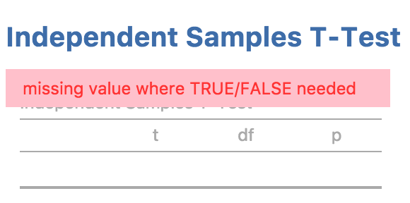
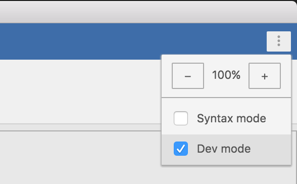
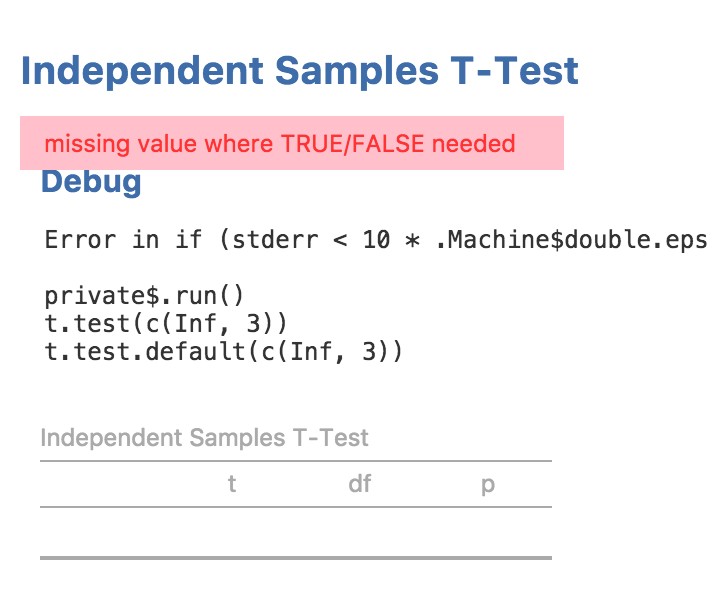

Hopefully you got throw the last section without encountering any errors in your analysis. In this section, we'll explore how to debug an analysis which is going wrong. For example, if we change our `.run()` function to produce an error:

```
ttestISClass <- R6Class("ttestISClass",
    inherit=ttestISBase,
    private=list(
        .run=function() {

            t.test(c(Inf, 3))  # <-- produces an error!
        })
)
```

We receive the following error message.

{ width=290px }

In this example, our code is only one line of code, so we can be reasonably confident where the problem lies. However, in practice software can be two or three or even more lines of code. In more complex situations, it can be handy to have a 'stack trace' which tells us where the problem occurred. jamovi can be placed in 'dev mode', which displays stack traces when errors occur. dev mode can be toggled from the app menu to the top right of the jamovi window:

{ width=294px }

With dev mode turned on, we can see the stack trace and see that the call to `t.test(c(Inf, 3))` is responsible for the error.

{ width=356px }

When developing jamovi modules, it's best to just leave dev mode on.

Next: [Creating Rich Results](tuts0105-creating-rich-results.html)

