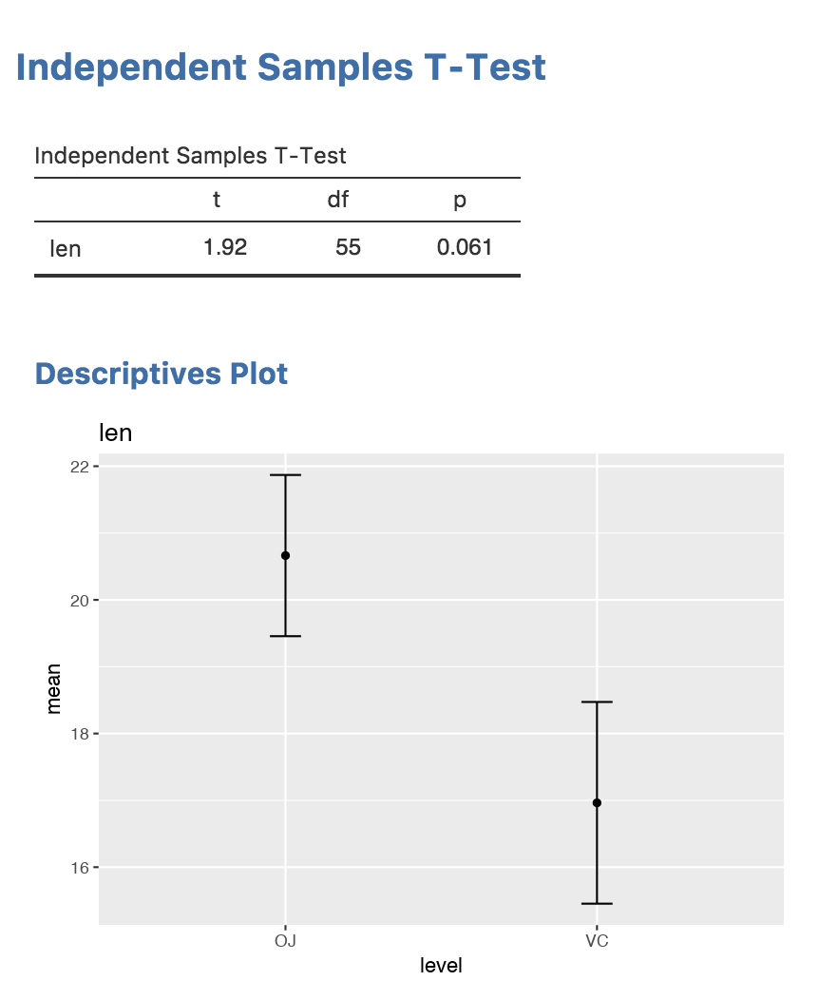

In this section, we'll add a plot to the t-test analysis we've been developing in this series. A plot is another item to appear in the results, so we'll add another entry into our `ttest.r.yaml` file:

```{yaml }
---
name:  ttest
title: Independent Samples T-Test
jrs:   '1.1'

items:
    - name:  ttest
      title: Independent Samples T-Test
      type: Table
      rows:  1
      columns:
        - name: var
          title: ''
          type: text
        - name: t
          type: number
        - name: df
          type: integer
        - name: p
          type: number
          format: zto,pvalue
    
    - name: plot
      title: Descriptives Plot
      type: Image
      width:  400
      height: 300
      renderFun: .plot
```

Same as before, we define an item with a `name`, `title` and a `type`; in this case the type is `Image`. Additionally, we define `renderFun` which is the name of the function responsible for rendering the image. Whatever we specify as the render function, we must add as a *private member function* to `ttestClass` in `ttest.b.R`:

```{r eval=FALSE }
#' @export
ttestClass <- R6::R6Class(
    "ttestClass",
    inherit = ttestBase,
    private = list(
        .run = function() {
            formula <- paste(self$options$dep, '~', self$options$group)
            formula <- as.formula(formula)
            
            results <- t.test(formula, self$data)
            
            table <- self$results$ttest
            table$setRow(rowNo=1, values=list(
                var=self$options$dep,
                t=results$statistic,
                df=results$parameter,
                p=results$p.value
            ))
        },
        .plot=function(image, ...) {  # <-- the plot function
        
        })
)
```

## Adding ggplot2

We're going to use `ggplot2` for plotting, so make sure you have that installed. To use ggplot2 in this package/module, we need to add some entries into the DESCRIPTION and NAMESPACE files. We add ggplot2 to the imports line in the DESCRIPTION, so it reads:

```
Imports: jmvcore, R6, ggplot2
```

and we'll add the following line into NAMESPACE:

```
import(ggplot2)
```

These entries are standard for using R code from other packages in a package. More information is available in [Writing R Extensions](https://cran.r-project.org/doc/manuals/r-release/R-exts.html).

Now we have ggplot2 ready, we can proceed with using it in our analysis.

## Implementing Plots

In jamovi modules, plotting occurs in two stages; first the data for the plot is prepared, then the plot is rendered. The two stages mean that if the image is resized, or the user requests a different file format, only the rendering needs to be performed again --- the data preparation needs only to occur once.

For the t-test, we're going to plot a mean for each of the groups, and the standard errors. In `ggplot2`, we're required to assemble these 'plot points' into a data frame, which we will do as follows:

```{r eval=FALSE}
    means  <- aggregate(formula, self$data, mean)[,2]
    ses    <- aggregate(formula, self$data, function(x) sd(x)/sqrt(length(x)))[,2]
    sel    <- means - ses  # standard error lower bound
    seu    <- means + ses  # standard error upper bound
    levels <- base::levels(self$data[[self$options$group]])
    plotData <- data.frame(level=levels, mean=means, sel=sel, seu=seu)
```
```
##   level     mean      sel      seu
## 1    OJ 20.66333 19.45733 21.86934
## 2    VC 16.96333 15.45417 18.47250
```

This plot data we assign to the image using the `setState()` function:

```{r eval=FALSE}
    image <- self$results$plot
    image$setState(plotData)
```

Next, we'll add the plotting code into the `.plot()` function we created:

```{r eval=FALSE}
    .plot=function(image, ...) {
        plotData <- image$state
        plot <- ggplot(plotData, aes(x=level, y=mean)) +
            geom_errorbar(aes(ymin=sel, ymax=seu, width=.1)) +
            geom_point(aes(x=level, y=mean)) +
            labs(title=self$options$dep)
        print(plot)
        TRUE
    }
```

The plot function accepts an argument `image`, which corresponds to the image object we called `setState()` on. We can retrieve the state object from this image with `image$state`, which we can see is being assigned to `plotData`.

Following this are a number of calls to `ggplot2` functions. A full discussion of how to use ggplot2 is **well and truly** beyond the scope of this document, but there are many excellent resources available online.

Next we explicitly print the ggplot object. When using ggplot interactively in an R session, calling `ggplot()` leads to the creation of the plot, however, when calling ggplot from inside a function, it is necessary to explicitly call `print()`.

The final statement is `TRUE` which is the return value. Don't forget this! Returning true notifies the rendering system that you have plotted something. If you don't return true, your plot will not appear. There are situations where the user may not have specified enough information for plotting, in which case the function should return `FALSE`.

So this is our final `ttest.b.R` file:

```{r eval=FALSE }
#' @export
ttestClass <- R6::R6Class(
    "ttestClass",
    inherit = ttestBase,
    private = list(
        .run = function() {
            formula <- paste(self$options$dep, '~', self$options$group)
            formula <- as.formula(formula)
            
            results <- t.test(formula, self$data)
            
            table <- self$results$ttest
            table$setRow(rowNo=1, values=list(
                var=self$options$dep,
                t=results$statistic,
                df=results$parameter,
                p=results$p.value
            ))
            
            means  <- aggregate(formula, self$data, mean)[,2]
            ses    <- aggregate(formula, self$data, function(x) sd(x)/sqrt(length(x)))[,2]
            sel    <- means - ses  # standard error lower bound
            seu    <- means + ses  # standard error upper bound
            levels <- base::levels(self$data[[self$options$group]])
            plotData <- data.frame(level=levels, mean=means, sel=sel, seu=seu)
            
            image <- self$results$plot
            image$setState(plotData)
        },
        .plot=function(image, ...) {
            plotData <- image$state
            plot <- ggplot(plotData, aes(x=level, y=mean)) +
                geom_errorbar(aes(ymin=sel, ymax=seu, width=.1)) +
                geom_point(aes(x=level, y=mean)) +
                labs(title=self$options$dep)
            print(plot)
            TRUE
        })
)
```

And these are our final results, including the plot:

{width=441px}

Next: [Distributing Modules](tuts0107-distributing-modules.html)
