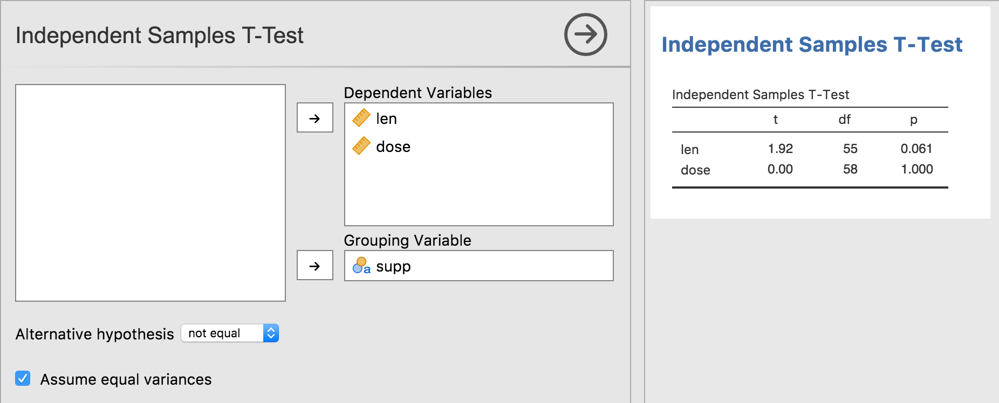
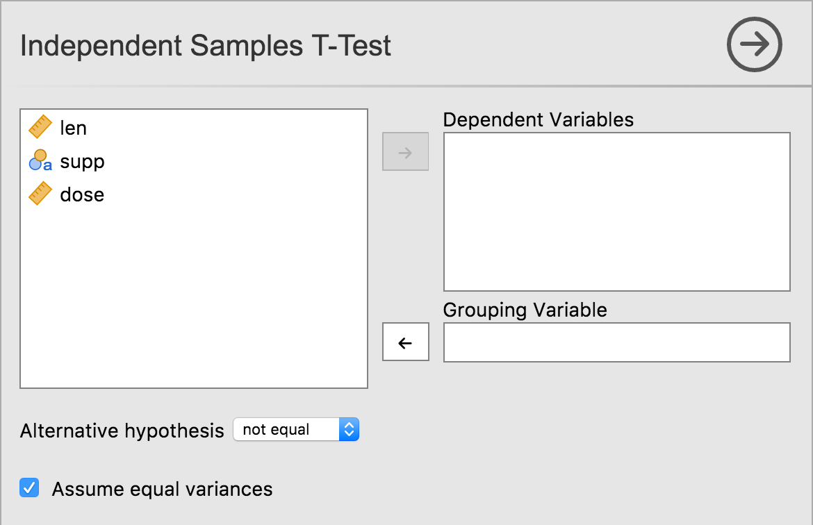
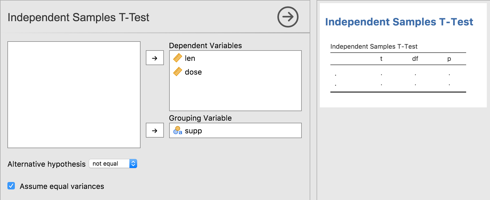
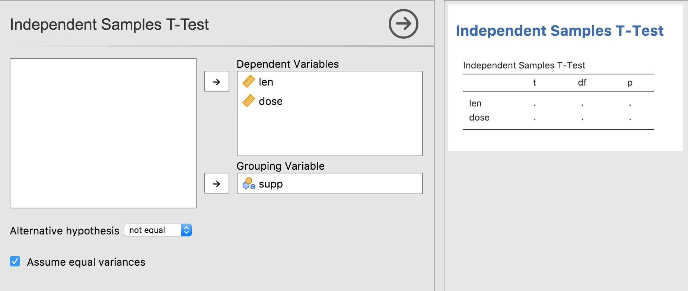

In the previous tutorial series, we looked at [constructing and populating tables](tuts0105-creating-rich-results.html). The .r.yaml file contained:

```
...
    - name:  ttest
      title: Independent Samples T-Test
      type: Table
      rows:  1
      columns:
        - name: var
          title: ''
          type: text
        - name: t
          type: number
        - name: df
          type: integer
        - name: p
          type: number
          format: zto,pvalue
```

That is, the results contained a table called `ttest` with the title 'Independent Samples T-Test', with 4 columns and 1 row.

In practice however, the number of rows in the table often isn't fixed. They may vary based on the options the user has selected, or based on the results of the analysis itself. In this tutorial, we will concentrate on the former.

In the previous tutorial series, we created a t-test analysis. It allowed the user to specify a single dependent variable, and a single grouping variable. However, we could make this analysis more convenient by allowing people to specify *multiple* dependent variables. For example, a data set might contain the columns 'gender', 'height' and 'weight'. By allowing multiple dependent variables, the user could specify 'height' and 'weight' as the dependent variables, and 'gender' as the grouping variable. Our analysis could then perform multiple t-tests (one for each dependent variable). The resulting analysis might look something like this:



The first thing we need to do is change the dependent variable in the .a.yaml file, from `Variable` to `Variables`.

```
---
name:  ttest
title: Independent Samples T-Test
menuGroup: SuperAwesome
version: '1.0.0'
jas: '1.1'

options:
    - name: data
      type: Data

    - name: deps                  # <-- let's add an s
      title: Dependent Variables  # <-- and another s
      type: Variables             # <-- Variables with an s!
      
...
```

**NOTE** there is currently a bug in jmvtools, where the UI is not updated appropriately. In this scenario, jmvtools *should* update the .u.yaml file to accept multiple variables, however this does not happen. It is possible to update the .u.yaml file by hand, but it's generally easiest to simply delete the .u.yaml file, and let jmvtools create one from scratch. This is something which will be fixed in the coming weeks.

**NOTE** that you will have to shut jamovi down, and restart it in order to see changes to the analysis UI.

As we have changed the name and type of the `dep` variable, our t-test will no longer work. For now, you should comment out or delete the content of the `.run()` function of the t-test analysis, otherwise it will produce a number of errors. We will return to it later in this tutorial.

Having performed these modifications, your t-test UI should look something like:



As can be seen, multiple dependent variables can now be specified.

Now let's return to our .y.raml file, to the `rows` value in particular:

```
...
- name:  ttest
      title: Independent Samples T-Test
      type: Table
      rows: 1
...
```

What we now want, is not 1 row, but rather 1 row *per* dependent variable. If one variable is assigned to the option `deps`, then we want the table to have 1 row. If two variables are assigned to the option `deps`, then the table should have two rows, etc.

The way we do this, is with what's called 'data-binding'. Data-binding is where we 'bind' a particular property of a results object, to an option. In this case, we want to 'bind' the number of rows to the `deps` option. We do this be specifying the option inside of parentheses (or brackets).

```
...
- name:  ttest
      title: Independent Samples T-Test
      type: Table
      rows: (deps)
...
```

When bound in this way, the number of rows in the table always matches the number of variables specified by the user. Let's reinstall our module and see this in action:



As can be seen, our table grows and shrinks accordingly. But we can do one better. The first column should contain the variable name, and although we can add this using the Table's `setRow()` function, there is a better way to do this. We can specify the `content` of the column in the .r.yaml file.

The `content` in the .r.yaml file can be a string literal, but it can also be a data-binding as well. When the rows of a table are bound to an option, each row has a key associated with it. When bound to an option of type `Variables`, each row's key corresponds to the Variable for that row. This allows us to bind the content of a column, to each row's key, as follows:

```
items:
    - name:  ttest
      title: Independent Samples T-Test
      type:  Table
      rows:  (deps)
      columns:
        - name: var
          title: ''
          type: text
          content: ($key)  # <- here!
```

`$key` is a special value which maps to the row's key. Make this change, and reinstall the module with `jmvtools::install()`. As can be seen the first column is now filled in appropriately.



Data-binding is nice, because it often leads to much simpler code. The .yaml files are able to take care of a lot of aspects of the results objects, and allows the R code (in the .b.R files) to be much simpler, and focused on performing the calculations. In computer science, this is called *[separation of concerns](https://en.wikipedia.org/wiki/Separation_of_concerns)*.

Now all we need do is add our analysis implementation to the .b.R file. We can fill the table in using either the `rowKey` or the `rowNo`.

```
    .run=function() {
    
        table <- self$results$ttest
    
        for (dep in self$options$deps) {
    
            formula <- jmvcore::constructFormula(dep, self$options$group)
            formula <- as.formula(formula)
        
            results <- t.test(formula, self$data)
        
            table$setRow(rowKey=dep, values=list(  # set by rowKey!
                t=results$statistic,
                df=results$parameter,
                p=results$p.value
            ))
        }
    }
```

We can now reinstall the module using `jmvtools::install()` (Note that this analysis will not work if you specify a nominal or ordinal variable as a dependent. So be sure to either use a continuous variable, or change the type of the variable to continuous before assigning it as a dependent. We will look at the correct way to handle nominal and ordinal variables in the next tutorial). You should have something like the following:


