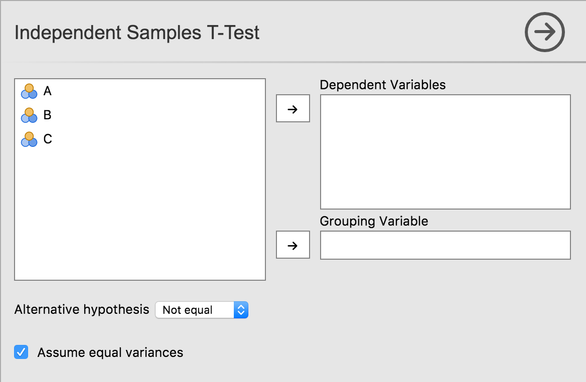

UIs for jamovi analyses are defined in the .u.yaml file (A refresher on the files and the relationship between them is described [here](tuts0103-creating-an-analysis.html)). This describes what sort of control each option is represented by (i.e. a dropdown list, or some radio buttons), and the order and the layout in which they will appear.

### `aggressive` vs `tame` compiler mode

By default, .u.yaml files are in `aggressive` compiler mode. This means when installing jamovi modules with `jmvtools::install()` the .u.yaml files are regenerated and replaced each time. This is good early on in the development process, but as development progresses, getting a UI *just right* or adding custom behaviour requires hand editing of the .u.yaml files. To prevent jmvtools from simply replacing all your changes, the .u.yaml file can be placed in `tame` mode. In `tame` mode the compiler respects your changes, and will not interfere with your adjustments. The trade-off is that the compiler often can't insert new controls into the UI as optimally.

To begin with we'd encourage you to leave your .u.yaml files in `aggressive` mode.

### Controls

As we've seen earlier in this tutorial series with our t-test example, each option is represented by one or more controls. Our list option was represented by a list box, boolean options were represented by checkboxes, and Variable options were represented as a box that variables could be dragged to.

Let's take a look at UI, and the .u.yaml file which is responsible for it:



```
title: Independent Samples T-Test
name: ttestIS
jus: '3.0'
stage: 0
compilerMode: aggressive

children:

  - type: VariableSupplier
    persistentItems: false
    stretchFactor: 1
    children:

      - type: TargetLayoutBox
        label: Dependent Variables
        children:
          - type: VariablesListBox
            name: deps
            isTarget: true

      - type: TargetLayoutBox
        label: Grouping Variable
        children:
          - type: VariablesListBox
            name: group
            maxItemCount: 1
            isTarget: true

  - type: LayoutBox
    margin: large
    children:
      - type: ComboBox
        name: alt

  - type: LayoutBox
    margin: large
    children:
      - type: CheckBox
        name: varEq
```

As can be seen, controls are arranged in a hierarchy. At the very top is a control of type `VariableSupplier`. It has two children: `deps` of type `VariablesListBox` and `group` of type `VariableListBox`. Together, these three controls create the variables list, and the 'Dependent Variables' and 'Grouping Variable' drop targets.

Next is a `LayoutBox` which contains the hypothesis `ComboBox`, followed by another `LayoutBox` containing the equality of variances `CheckBox`. By default, items are laid out in a grid from top to bottom.

TODO: how to layout controls in other configurations, group headings, etc.

Next: [Advanced UI Design](ui-advanced-design.html)
