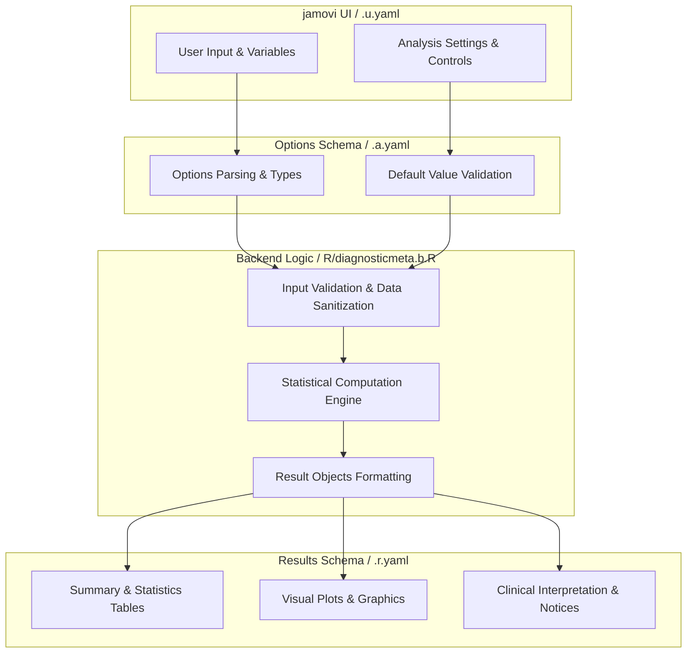
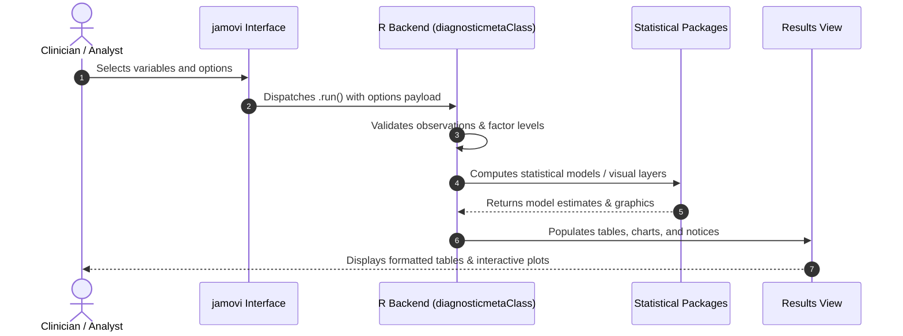

# Diagnostic Test Meta-Analysis for Pathology - Developer Documentation

## 1. Overview

- **Function**: `diagnosticmeta`
- **Title**: Diagnostic Test Meta-Analysis for Pathology
- **Module**: `OncoPath`
- **Files**:
  - `jamovi/diagnosticmeta.u.yaml` - User Interface Definition
  - `jamovi/diagnosticmeta.a.yaml` - Options & Schema Definition
  - `jamovi/diagnosticmeta.r.yaml` - Results Layout & Tables
  - `R/diagnosticmeta.b.R` - Backend Implementation
- **Summary**: Comprehensive meta-analysis of diagnostic test accuracy studies designed for pathology research. Performs bivariate random-effects modeling, proportional-hazards SROC analysis, meta-regression, and publication bias assessment for AI algorithm validation and biomarker diagnostic accuracy synthesis.

## 1a. Changelog

- **Date**: 2026-08-29
- **Summary**: Comprehensive documentation suite created & verified against active schemas and backend implementation.

## 2. Options Reference (`.a.yaml`)

| Option | Type | Default | Description |
| :--- | :--- | :--- | :--- |
| `data` | `Data` | `NULL` |  |
| `study` | `Variable` | `NULL` | Study Identifier |
| `true_positives` | `Variable` | `NULL` | True Positives (TP) |
| `false_positives` | `Variable` | `NULL` | False Positives (FP) |
| `false_negatives` | `Variable` | `NULL` | False Negatives (FN) |
| `true_negatives` | `Variable` | `NULL` | True Negatives (TN) |
| `covariate` | `Variable` | `NULL` | Meta-Regression Covariate |
| `bivariate_analysis` | `Bool` | `TRUE` | Bivariate random-effects model |
| `hsroc_analysis` | `Bool` | `FALSE` | Proportional-hazards SROC analysis |
| `meta_regression` | `Bool` | `FALSE` | Meta-regression |
| `heterogeneity_analysis` | `Bool` | `FALSE` | Heterogeneity analysis |
| `publication_bias` | `Bool` | `FALSE` | Publication bias assessment |
| `confidence_level` | `Integer` | `95` | Confidence Level |
| `method` | `List` | `reml` | Meta-Analysis Method |
| `zero_cell_correction` | `List` | `none` | Zero-Cell Correction Method |
| `forest_plot` | `Bool` | `FALSE` | Forest plot |
| `sroc_plot` | `Bool` | `FALSE` | Summary ROC plot |
| `funnel_plot` | `Bool` | `FALSE` | Funnel plot |
| `show_individual_studies` | `Bool` | `FALSE` | Individual study results |
| `show_interpretation` | `Bool` | `FALSE` | Clinical interpretation |
| `show_methodology` | `Bool` | `FALSE` | Methodology information |
| `show_analysis_summary` | `Bool` | `FALSE` | Analysis summary |
| `color_palette` | `List` | `standard` | Plot Color Palette |
| `show_plot_explanations` | `Bool` | `FALSE` | Plot explanations |

## 3. Results Definition (`.r.yaml`)

| Output ID | Type | Title | Description |
| :--- | :--- | :--- | :--- |
| `instructions` | `Html` | `Getting Started` |  |
| `notices` | `Html` | `Notices` |  |
| `summary` | `Html` | `Analysis Summary` |  |
| `about` | `Html` | `About This Analysis` |  |
| `bivariateresults` | `Table` | `Bivariate Meta-Analysis Results` |  |
| `hsrocresults` | `Table` | `Proportional-Hazards SROC Model Results` |  |
| `heterogeneity` | `Table` | `Heterogeneity Assessment` |  |
| `metaregression` | `Table` | `Meta-Regression Results` |  |
| `publicationbias` | `Table` | `Publication Bias Assessment` |  |
| `individualstudies` | `Table` | `Individual Study Results` |  |
| `forestplot` | `Image` | `Forest Plot` |  |
| `srocplot` | `Image` | `Summary ROC Plot` |  |
| `funnelplot` | `Image` | `Funnel Plot for Publication Bias` |  |
| `interpretation` | `Html` | `Clinical Interpretation and Guidelines` |  |
| `forestplot_explanation` | `Html` | `Forest Plot Explanation` |  |
| `srocplot_explanation` | `Html` | `SROC Plot Explanation` |  |
| `funnelplot_explanation` | `Html` | `Funnel Plot Explanation` |  |

## 4. Architecture & Data Flow Diagram

## 5. Execution Sequence

## 6. Change Impact & Safety Guidelines

- **Data Filtering**: Ensure observations with missing values are handled gracefully according to analysis options.
- **Formula Conflicts**: Use isolated environment calls or base formula methods when interacting with `ggstatsplot` or formula parsers.
- **Safe Deparsing**: Use `deparse(val)` in syntax generation (`asSource()`) to escape column names with spaces or special symbols.

