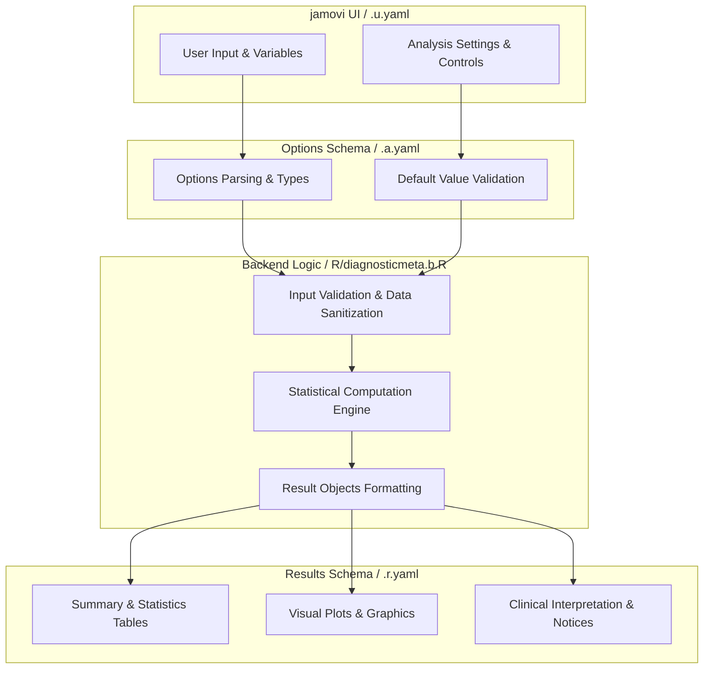
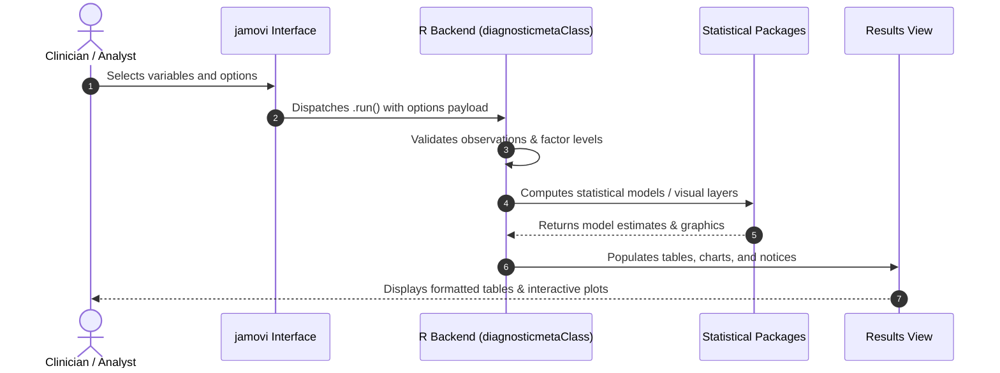

# Diagnostic Test Meta-Analysis for Pathology - Developer Documentation

## 1. Overview

- **Function**: `diagnosticmeta`
- **Title**: Diagnostic Test Meta-Analysis for Pathology
- **Module**: `OncoPath`. Note that `.a.yaml` currently declares `menuGroup: OncoPathT`; the `T` suffix routes the analysis to the **JamoviTest** module while it is under review, so it is not in the production OncoPath menu until the suffix is removed.
- **Files**:
  - `jamovi/diagnosticmeta.u.yaml` - User Interface Definition
  - `jamovi/diagnosticmeta.a.yaml` - Options & Schema Definition
  - `jamovi/diagnosticmeta.r.yaml` - Results Layout & Tables
  - `R/diagnosticmeta.b.R` - Backend Implementation
- **Summary**: Comprehensive meta-analysis of diagnostic test accuracy studies designed for pathology research. Performs bivariate random-effects modeling, proportional-hazards SROC analysis, meta-regression, and publication bias assessment for AI algorithm validation and biomarker diagnostic accuracy synthesis.

## 1a. Changelog

- **Date**: 2026-08-29
- **Summary**: Comprehensive documentation suite created & verified against active schemas and backend implementation.
- **Date**: 2026-09-20
- **Summary**: Options and results tables re-synchronised with `jamovi/diagnosticmeta.a.yaml` and `jamovi/diagnosticmeta.r.yaml` after the release pass. Six option titles had drifted to Title Case (`Study identifier`, `Confidence level`, `Meta-analysis method`, `Zero-cell correction method`, `Plot color palette`, `Meta-regression covariate`); `data` was documented with a `NULL` default it does not have; option descriptions were absent; the results table now records each item's `visible:` condition instead of an empty column. The `OncoPathT` test-routing suffix and the backend's actual guidance notes are recorded above and in section 6.

## 2. Options Reference (`.a.yaml`)

Titles and descriptions below are quoted from `jamovi/diagnosticmeta.a.yaml` as of 2026-09-20 (descriptions are the `description: R:` text, which is also what `man/diagnosticmeta.Rd` renders).

| Option | Type | Default | Title | Description (R) |
| :--- | :--- | :--- | :--- | :--- |
| `data` | `Data` | none - required argument | (none) | the data as a data frame |
| `study` | `Variable` | `NULL` | Study identifier | Variable containing unique study identifiers |
| `true_positives` | `Variable` | `NULL` | True Positives (TP) | Number of true positive results in each study |
| `false_positives` | `Variable` | `NULL` | False Positives (FP) | Number of false positive results in each study |
| `false_negatives` | `Variable` | `NULL` | False Negatives (FN) | Number of false negative results in each study |
| `true_negatives` | `Variable` | `NULL` | True Negatives (TN) | Number of true negative results in each study |
| `covariate` | `Variable` | `NULL` | Meta-regression covariate | Optional covariate for meta-regression analysis |
| `bivariate_analysis` | `Bool` | `TRUE` | Bivariate random-effects model | Perform bivariate random-effects meta-analysis |
| `hsroc_analysis` | `Bool` | `FALSE` | Proportional-hazards SROC analysis | Perform Holling proportional-hazards summary ROC analysis |
| `meta_regression` | `Bool` | `FALSE` | Meta-regression | Perform meta-regression with specified covariate |
| `heterogeneity_analysis` | `Bool` | `FALSE` | Heterogeneity analysis | Perform heterogeneity analysis including I-squared and Q statistics |
| `publication_bias` | `Bool` | `FALSE` | Publication bias assessment | Assess publication bias using Deeks' funnel plot test |
| `confidence_level` | `Integer` | `95` | Confidence level | Confidence level for all intervals: the pooled estimates and likelihood ratios, the prediction interval for a future study, the per-study Wilson intervals, and the confidence and prediction regions on the SROC plot. |
| `method` | `List` | `reml` | Meta-analysis method | Estimator for the between-study variance. REML is recommended. The bivariate model uses this method directly; the univariate heterogeneity and meta-regression models map it to the metafor equivalent, so 'Method of Moments' gives DerSimonian-Laird and 'Variance components' gives the Hedges estimator in those two tables. DerSimonian-Laird is not an appropriate estimator for the bivariate model itself, which is why it is not offered there. |
| `zero_cell_correction` | `List` | `none` | Zero-cell correction method | Method for handling zero cells in 2x2 tables. `none` (recommended) applies no correction to the data itself; the bivariate model still adds 0.5 to studies with a zero cell at fitting time (mada's `single` correction), while the univariate heterogeneity and meta-regression models exclude those studies instead, so they rest on fewer studies. Both are disclosed in the output. Under `none` the publication-bias path behaves differently from the rest: because a zero cell survives to that point, Deeks' test and the funnel plot add 0.5 to EVERY study, not only the affected ones (correcting only the affected studies would build a size-related trend into the test's own outcome variable), and no asymmetry verdict is reported at all when more than a quarter of the studies have a zero cell. The other three settings leave no zero cell, so neither of those steps applies and a verdict is always given. `constant` adds 0.5 to all four cells of affected studies before any analysis. `zero_cells` adds 0.5 only to the zero cells themselves. `reciprocal_n` adds 1/N to all cells of affected studies, where N is the study's total sample size. (The former option keys `treatment_arm` and `empirical` were renamed: they did not implement the procedures those names denote in Sweeting et al. 2004.) |
| `forest_plot` | `Bool` | `FALSE` | Forest plot | Generate forest plot for sensitivity and specificity |
| `sroc_plot` | `Bool` | `FALSE` | Summary ROC plot | Generate summary receiver operating characteristic plot |
| `funnel_plot` | `Bool` | `FALSE` | Funnel plot | Generate funnel plot for publication bias assessment |
| `show_individual_studies` | `Bool` | `FALSE` | Individual study results | Display results for individual studies in summary tables |
| `show_interpretation` | `Bool` | `FALSE` | Clinical interpretation | Display clinical interpretation guidelines and recommendations |
| `show_methodology` | `Bool` | `FALSE` | Methodology information | Display detailed methodology and statistical approach information |
| `show_analysis_summary` | `Bool` | `FALSE` | Analysis summary | Display natural language summary of analysis results |
| `color_palette` | `List` | `standard` | Plot color palette | Color palette for all plots - choose color-blind safe options for accessibility |
| `show_plot_explanations` | `Bool` | `FALSE` | Plot explanations | Display detailed explanations for all plots including interpretation guidance |

Domains of the constrained options:

- `confidence_level`: integer, `min: 50`, `max: 99`.
- `method`: `reml` (REML (Recommended)), `ml` (Maximum likelihood), `fixed` (Fixed effects), `mm` (Method of Moments), `vc` (Variance components).
- `zero_cell_correction`: `none` (Default (+0.5 to zero-cell studies at model fit)), `constant` (+0.5 to all cells of zero-cell studies), `zero_cells` (+0.5 to the zero cells only), `reciprocal_n` (+1/N to all cells (N = study size)).
- `color_palette`: `standard`, `colorblind_safe`, `high_contrast`, `viridis`, `plasma`.
- `study` permits `factor`/`id`; the four count variables permit `numeric`; `covariate` permits `numeric`/`factor`. `permitted: numeric` still lets a jamovi *Nominal* integer column through as a factor, which is why the backend routes every count through `jmvcore::toNumeric()` - see section 6.

## 3. Results Definition (`.r.yaml`)

No result item in `.r.yaml` carries a `description:`, so the final column records the `visible:` condition instead.

| Output ID | Type | Title | Visible When |
| :--- | :--- | :--- | :--- |
| `instructions` | `Html` | `Getting Started` | `true` (the backend then calls `setVisible(FALSE)` once all five required variables are assigned) |
| `notices` | `Html` | `Notices` | always |
| `summary` | `Html` | `Analysis Summary` | `(show_analysis_summary)` |
| `about` | `Html` | `About This Analysis` | `(show_methodology)` |
| `bivariateresults` | `Table` | `Bivariate Meta-Analysis Results` | `(bivariate_analysis)` |
| `hsrocresults` | `Table` | `Proportional-Hazards SROC Model Results` | `(hsroc_analysis)` |
| `heterogeneity` | `Table` | `Heterogeneity Assessment` | `(heterogeneity_analysis)` |
| `metaregression` | `Table` | `Meta-Regression Results` | `(meta_regression && !is.null(covariate))` |
| `publicationbias` | `Table` | `Publication Bias Assessment` | `(publication_bias)` |
| `individualstudies` | `Table` | `Individual Study Results` | `(show_individual_studies)` |
| `forestplot` | `Image` | `Forest Plot` | `(forest_plot)`; 800x600, `renderFun: .forestplot` |
| `srocplot` | `Image` | `Summary ROC Plot` | `(sroc_plot)`; 600x600, `renderFun: .srocplot` |
| `funnelplot` | `Image` | `Funnel Plot for Publication Bias` | `(funnel_plot && publication_bias)`; 600x500, `renderFun: .funnelplot` |
| `interpretation` | `Html` | `Clinical Interpretation and Guidelines` | `(show_interpretation)` |
| `forestplot_explanation` | `Html` | `Forest Plot Explanation` | `(show_plot_explanations && forest_plot)` |
| `srocplot_explanation` | `Html` | `SROC Plot Explanation` | `(show_plot_explanations && sroc_plot)` |
| `funnelplot_explanation` | `Html` | `Funnel Plot Explanation` | `(show_plot_explanations && funnel_plot)` |

None of the three Images declares `requiresData`, which is correct: each renderer works from the frame stashed by `image$setState()` and never reaches `self$data`. The `refs:` block cites `ClinicoPathJamoviModule`, `mada`, `metafor`, `CochraneDTAHandbook2023`, `DeeksMacaskillIrwig2005`, `ZwindermanBossuyt2008`, `RileyHigginsDeeks2011`, `SweetingSuttonLambert2004` and `HollingBoehningBoehning2012`.

## 4. Architecture & Data Flow Diagram

## 5. Execution Sequence

## 6. Change Impact & Safety Guidelines

- **Data Filtering**: A jamovi analysis is re-run on every edit, so a data problem must never throw. Studies with missing, negative, non-integer or otherwise unusable counts are excluded and the exclusion is **disclosed** in the `notices` panel - never dropped silently. `tests/testthat/test-diagnosticmeta-edge-cases.R` and `test-diagnosticmeta-release-fixes.R` assert exactly that contract.
- **Counts arrive as factors**: a count column typed Nominal or Ordinal in jamovi is a factor carrying a `values` attribute, and `permitted: numeric` lets it through. A bare `as.numeric()` on one returns level indices, not counts (a 12-study set once read 55.6% pooled sensitivity instead of 81.7%, with no warning). Every count goes through `jmvcore::toNumeric()` plus a factor fallback.
- **Column names are lookup keys, not formula terms**: use the raw `self$options$<var>` string as the `self$data[[...]]` key. The former `.escapeVar()` helper mangled `"Study Name (2020)"` into `"Study_Name_2020_"`, which returned `NULL` and broke the analysis. No variable name in this backend reaches a formula, so no escaping is needed there.
- **Table notes are plain text**: `setNote()` honours only a small HTML allow-list, so error messages passed to it must **not** be HTML-escaped - escaping turned `object 'x' not found` into a literal `object &apos;x&apos; not found`.
- **Safe Deparsing**: Use `deparse(val)` in syntax generation (`asSource()`) to escape column names with spaces or special symbols. `asSource()` emits Variable options through `deparse()` and leaves every other option to jmvcore's canonical sourcification.
- **Plot state, not data**: the three renderers (`.forestplot`, `.srocplot`, `.funnelplot`) read only `image$state` plus `private$.getColorPalette()`, `private$.wilsonCI()` and the cached `private$.pooled_sensitivity` / `.pooled_specificity`. Keep it that way. A renderer that reached `self$data` - directly or through a helper - would need `requiresData: true` on its Image, and without the flag it errors on resize, on reopening the `.omv` and on export, none of which a testthat run can see.

