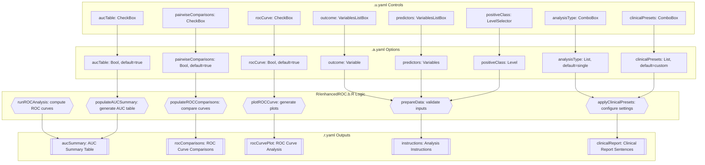
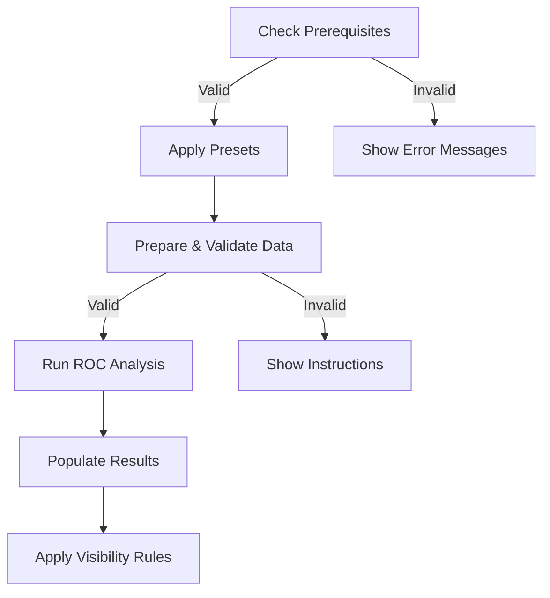
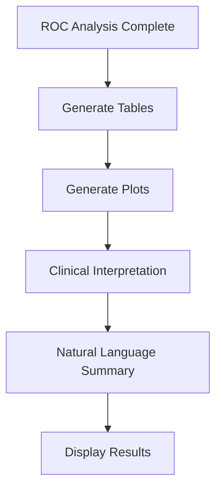

# Enhanced ROC Analysis - Jamovi Function Documentation

## 1. Overview

- **Function**: `enhancedROC`
- **Files**:
  - `jamovi/enhancedROC.u.yaml` — UI
  - `jamovi/enhancedROC.a.yaml` — Options
  - `R/enhancedROC.b.R` — Backend
  - `jamovi/enhancedROC.r.yaml` — Results
- **Summary**: Clinical ROC analysis toolkit for comprehensive diagnostic performance evaluation. Provides ROC curve analysis, Youden Index optimization, sensitivity/specificity analysis, optimal cutoff determination, and comparative ROC analysis for biomarker validation and clinical decision support.

## 2. UI Controls → Options Map

| UI Control | Type | Label | Binds to Option | Defaults & Constraints | Visibility/Enable Rules |
|------------|------|-------|----------------|------------------------|-------------------------|
| `outcome` | VariablesListBox | Outcome Variable | `outcome` | maxItemCount: 1 | Always visible |
| `positiveClass` | LevelSelector | Positive Class | `positiveClass` | - | enable: (outcome) |
| `predictors` | VariablesListBox | Predictor Variables | `predictors` | - | Always visible |
| `analysisType` | ComboBox | Analysis Settings | `analysisType` | default: single | Always visible |
| `direction` | ComboBox | Analysis Settings | `direction` | default: auto | Always visible |
| `youdenOptimization` | CheckBox | Analysis Settings | `youdenOptimization` | default: true | Always visible |
| `clinicalPresets` | ComboBox | Clinical Presets & Thresholds | `clinicalPresets` | default: custom | Always visible |
| `sensitivityThreshold` | TextBox | Clinical Presets & Thresholds | `sensitivityThreshold` | default: 0.8, min: 0.1, max: 1.0 | Always visible |
| `specificityThreshold` | TextBox | Clinical Presets & Thresholds | `specificityThreshold` | default: 0.8, min: 0.1, max: 1.0 | Always visible |
| `customCutoffs` | TextBox | Clinical Presets & Thresholds | `customCutoffs` | - | Always visible |
| `aucTable` | CheckBox | Tables | `aucTable` | default: true | Always visible |
| `cutoffTable` | CheckBox | Tables | `cutoffTable` | default: true | Always visible |
| `optimalCutoffs` | CheckBox | Tables | `optimalCutoffs` | default: true | Always visible |
| `diagnosticMetrics` | CheckBox | Tables | `diagnosticMetrics` | default: true | Always visible |
| `clinicalMetrics` | CheckBox | Tables | `clinicalMetrics` | default: true | Always visible |
| `rocCurve` | CheckBox | Plots | `rocCurve` | default: true | Always visible |
| `showCutoffPoints` | CheckBox | Plots | `showCutoffPoints` | default: true | enable: (rocCurve) |
| `showConfidenceBands` | CheckBox | Plots | `showConfidenceBands` | default: false | enable: (rocCurve) |
| `plotTheme` | ComboBox | Plots | `plotTheme` | default: clinical | enable: (rocCurve) |
| `showMetricsDiff` | CheckBox | Plots | `showMetricsDiff` | default: true | Always visible |
| `statisticalComparison` | CheckBox | Plots | `statisticalComparison` | default: true | Always visible |
| `confidenceLevel` | TextBox | Confidence Intervals | `confidenceLevel` | default: 95, min: 50, max: 99.9 | Always visible |
| `useBootstrap` | CheckBox | Confidence Intervals | `useBootstrap` | default: true | Always visible |
| `bootstrapSamples` | TextBox | Confidence Intervals | `bootstrapSamples` | default: 1000, min: 100, max: 10000 | enable: (useBootstrap) |
| `pairwiseComparisons` | CheckBox | Comparisons | `pairwiseComparisons` | default: true | Always visible |
| `comparisonMethod` | ComboBox | Comparisons | `comparisonMethod` | default: delong | enable: (pairwiseComparisons) |
| `clinicalContext` | ComboBox | Clinical Application | `clinicalContext` | default: general | Always visible |
| `prevalence` | TextBox | Clinical Application | `prevalence` | default: 0.1, min: 0.001, max: 0.999 | Always visible |
| `smoothMethod` | ComboBox | Advanced Options | `smoothMethod` | default: none | Always visible |
| `partialAuc` | CheckBox | Advanced Options | `partialAuc` | default: false | Always visible |
| `partialRange` | TextBox | Advanced Options | `partialRange` | default: '0.8,1.0' | enable: (partialAuc) |
| `comprehensive_output` | CheckBox | Advanced Output | `comprehensive_output` | default: false | Always visible |
| `clinical_interpretation` | CheckBox | Advanced Output | `clinical_interpretation` | default: true | Always visible |
| `plotWidth` | TextBox | Plot Settings | `plotWidth` | default: 600, min: 300, max: 1200 | Always visible |
| `plotHeight` | TextBox | Plot Settings | `plotHeight` | default: 600, min: 300, max: 1200 | Always visible |

## 3. Options Reference (.a.yaml)

### Core Analysis Options
- **outcome** / Variable / - : Binary outcome variable (disease status)
- **positiveClass** / Level / - : Level representing the positive class (disease/condition present)
- **predictors** / Variables / - : Numeric predictor variables for ROC analysis
- **analysisType** / List / single : Type of ROC analysis (single, comparative, comprehensive)
- **direction** / List / auto : Direction of predictor-outcome relationship (auto, higher, lower)

### Optimization & Thresholds
- **youdenOptimization** / Bool / true : Find optimal cutoff using Youden Index
- **customCutoffs** / String / - : Comma-separated list of custom cutoffs
- **sensitivityThreshold** / Number / 0.8 : Minimum required sensitivity (0.1-1.0)
- **specificityThreshold** / Number / 0.8 : Minimum required specificity (0.1-1.0)
- **clinicalPresets** / List / custom : Pre-configured settings for clinical scenarios

### Statistical Options
- **confidenceLevel** / Number / 95 : Confidence level for AUC intervals (50-99.9)
- **bootstrapSamples** / Integer / 1000 : Number of bootstrap samples (100-10000)
- **useBootstrap** / Bool / true : Use bootstrap methods for confidence intervals
- **pairwiseComparisons** / Bool / true : Perform pairwise ROC curve comparisons
- **comparisonMethod** / List / delong : Method for ROC curve comparison

### Output Control
- **aucTable** / Bool / true : Display AUC summary table
- **cutoffTable** / Bool / true : Display detailed cutoff analysis
- **optimalCutoffs** / Bool / true : Display optimal cutoff summary
- **diagnosticMetrics** / Bool / true : Display comprehensive diagnostic metrics
- **clinicalMetrics** / Bool / true : Display clinical application metrics
- **rocCurve** / Bool / true : Display ROC curve plot

### Advanced Options
- **smoothMethod** / List / none : ROC curve smoothing method (none, binormal, kernel)
- **partialAuc** / Bool / false : Calculate partial AUC for specific ranges
- **partialRange** / String / '0.8,1.0' : Range for partial AUC analysis
- **comprehensive_output** / Bool / false : Include comprehensive statistical details
- **clinical_interpretation** / Bool / true : Provide clinical context for results

### Clinical Context
- **prevalence** / Number / 0.1 : Disease prevalence for predictive value calculations (0.001-0.999)
- **clinicalContext** / List / general : Clinical application context (screening, diagnosis, prognosis, monitoring, general)

### Plot Settings
- **plotTheme** / List / clinical : Visual theme for ROC plots (classic, modern, clinical)
- **plotWidth** / Integer / 600 : Width of ROC plots (300-1200)
- **plotHeight** / Integer / 600 : Height of ROC plots (300-1200)
- **showCutoffPoints** / Bool / true : Highlight optimal cutoff points on ROC curve
- **showConfidenceBands** / Bool / false : Display confidence bands around ROC curve
- **showMetricsDiff** / Bool / true : Display detailed differences between model metrics
- **statisticalComparison** / Bool / true : Perform comprehensive statistical model comparison

## 4. Backend Usage (.b.R)

### Core Execution Flow (.run method)
- **self$options$outcome, self$options$predictors**: Validation in data preparation (lines 43-48)
- **self$options$clinicalPresets**: Applied via `.applyClinicalPresets()` (line 51)
- **self$options$aucTable**: Controls AUC summary population (line 67)
- **self$options$optimalCutoffs, self$options$youdenOptimization**: Controls optimal cutoff analysis (line 71)
- **self$options$cutoffTable**: Controls detailed cutoff analysis (line 76)
- **self$options$diagnosticMetrics**: Controls diagnostic performance population (line 81)
- **self$options$clinicalMetrics**: Controls clinical metrics population (line 86)
- **self$options$pairwiseComparisons, self$options$analysisType**: Controls ROC comparisons (line 91)
- **self$options$showMetricsDiff, self$options$analysisType**: Controls detailed comparison (line 96)
- **self$options$statisticalComparison, self$options$analysisType**: Controls statistical summary (line 101)
- **self$options$partialAuc**: Controls partial AUC analysis (line 106)
- **self$options$comprehensive_output**: Controls comprehensive analysis (line 111)
- **self$options$clinical_interpretation**: Controls clinical interpretation (line 116)

### Data Preparation (.prepareData method)
- **self$options$partialRange**: Validated for format and range (lines 156-178)
- **self$options$positiveClass**: Used for multi-level outcome conversion (line 226+)
- **self$options$outcome, self$options$predictors**: Core data validation

### Clinical Preset Application (.applyClinicalPresets method)
- **self$options$clinicalPresets**: Triggers preset configuration changes
- Updates multiple options based on selected preset (biomarker_screening, diagnostic_validation, etc.)

### Result Population Methods
- **.populateAUCSummary()**: Uses `self$options$confidenceLevel`, `self$options$useBootstrap`
- **.populateROCComparisons()**: Uses `self$options$comparisonMethod`
- **.populateClinicalMetrics()**: Uses `self$options$prevalence`
- **.populatePartialAUC()**: Uses `self$options$partialRange`
- **Plotting functions**: Use `self$options$plotTheme`, `self$options$plotWidth`, `self$options$plotHeight`

## 5. Results Definition (.r.yaml)

### HTML Outputs
- **instructions** (Html): Analysis instructions, always visible
- **analysisSummary** (Html): Plain language summary of findings, always visible
- **clinicalReport** (Html): Copy-ready clinical report sentences, always visible
- **clinicalInterpretationGuide** (Html): Clinical application guidance, visible: (clinical_interpretation)
- **methodsExplanation** (Html): Statistical methods and references, visible: (comprehensive_output)

### Data Tables
- **aucSummary** (Table): AUC values with confidence intervals, visible: (aucTable)
  - Columns: predictor, auc, auc_lower, auc_upper, std_error, auc_interpretation, clinical_utility
- **rocComparisons** (Table): Pairwise ROC curve comparisons, visible: (pairwiseComparisons && analysisType:comparative)
  - Columns: predictor1, predictor2, auc_difference, test_statistic, p_value, result, clinical_significance
- **detailedComparison** (Table): Comprehensive model comparison metrics, visible: (showMetricsDiff && analysisType:comparative)
  - Columns: metric, model1_value, model2_value, difference, percent_change, p_value, effect_size, interpretation
- **statisticalSummary** (Table): Statistical test summary, visible: (statisticalComparison && analysisType:comparative)
  - Columns: test_name, test_statistic, p_value, conclusion, effect_magnitude
- **optimalCutoffSummary** (Table): Youden Index optimization results, visible: (optimalCutoffs)
  - Columns: predictor, optimal_cutoff, youden_index, sensitivity, specificity, accuracy, clinical_recommendation
- **cutoffAnalysis** (Table): Comprehensive cutoff analysis, visible: (cutoffTable)
  - Columns: predictor, cutoff, cutoff_type, sensitivity, specificity, one_minus_specificity, youden_index, true_positive, true_negative, false_positive, false_negative
- **diagnosticPerformance** (Table): Diagnostic performance at optimal cutoff, visible: (diagnosticMetrics)
  - Columns: predictor, cutoff, sensitivity, sensitivity_ci, specificity, specificity_ci, accuracy, balanced_accuracy
- **clinicalApplicationMetrics** (Table): Clinical metrics with predictive values, visible: (clinicalMetrics)
  - Columns: predictor, prevalence, ppv, npv, lr_positive, lr_negative, diagnostic_odds_ratio, clinical_interpretation
- **partialAucAnalysis** (Table): Partial AUC for specific ranges, visible: (partialAuc)
  - Columns: predictor, range_type, range_min, range_max, partial_auc, normalized_pauc, clinical_relevance
- **comprehensiveAnalysisSummary** (Table): Enhanced statistical summary, visible: (comprehensive_output)
  - Columns: measure, value, interpretation, clinical_significance

### Image Outputs
- **rocCurvePlot** (Image): ROC curves with optimal cutoff points, visible: (rocCurve)
- **comparativeROCPlot** (Image): Multiple ROC curves for comparison, visible: (rocCurve && analysisType:comparative)
- **cutoffAnalysisPlot** (Image): Sensitivity/specificity across cutoffs, visible: (cutoffTable)
- **youdenIndexPlot** (Image): Youden Index optimization visualization, visible: (youdenOptimization)
- **clinicalDecisionPlot** (Image): Clinical decision curves, visible: (clinicalMetrics)

## 6. Data Flow Diagram (UI → Options → Backend → Results)



## 7. Execution Sequence (User Action → Results)

### User Input Flow


### Decision Logic


### Result Processing


**Step-by-step execution flow:**

1. **User Variable Selection** → UI updates outcome and predictor options
2. **Clinical Preset Application** → Automatically configures thresholds and settings based on clinical scenario
3. **Data Validation** → Validates binary outcome, handles multi-level conversion via positive class selection
4. **ROC Curve Computation** → Calculates AUC, optimal cutoffs using pROC package
5. **Statistical Analysis** → Performs comparative analysis, bootstrap confidence intervals
6. **Results Population** → Updates tables and plots via `self$results$...setContent()`
7. **Clinical Interpretation** → Generates natural language summaries and clinical recommendations
8. **Display Application** → Shows results based on visibility rules and user selections

## 8. Change Impact Guide

### Key Option Changes:
- **analysisType**: Changing from 'single' to 'comparative' enables additional comparison tables and statistical tests
- **clinicalPresets**: Automatically updates multiple threshold and output options based on clinical scenario
- **useBootstrap**: Switches between bootstrap and parametric confidence interval methods
- **partialAuc**: Enables partial AUC analysis with custom range specification
- **comprehensive_output**: Enables detailed statistical output tables and methods documentation

### Common Pitfalls:
- **Multi-level outcomes**: Requires positive class selection for binary conversion
- **Missing data**: Automatically removed via na.omit(), may reduce sample size
- **Non-numeric predictors**: Analysis will fail, requires numeric/continuous variables
- **Insufficient sample size**: Minimum 20 observations required for reliable analysis

### Recommended Defaults:
- **Clinical presets**: Use 'biomarker_screening' for high sensitivity applications
- **Bootstrap**: Keep enabled for robust confidence intervals
- **Youden optimization**: Default enabled provides balanced sensitivity/specificity
- **Clinical interpretation**: Default enabled for practical guidance

## 9. Example Usage

### Example Dataset Requirements:
- **Outcome variable**: Binary or multi-level factor (e.g., Disease Status: Healthy, Diseased)
- **Predictor variables**: Continuous numeric (e.g., Biomarker levels, Test scores, Age)
- **Minimum sample size**: 20+ observations for reliable results

### Example Option Configuration:
```yaml
outcome: "Disease_Status"
positiveClass: "Diseased"
predictors: ["Biomarker_A", "Biomarker_B", "Age"]
analysisType: "comparative"
clinicalPresets: "diagnostic_validation"
aucTable: true
rocCurve: true
pairwiseComparisons: true
confidenceLevel: 95
useBootstrap: true
```

### Expected Outputs:
- AUC values with 95% confidence intervals for each predictor
- ROC curve plots with optimal cutoff points highlighted
- Sensitivity/specificity analysis at Youden-optimal thresholds
- Pairwise statistical comparisons between predictors
- Clinical interpretation with recommendations for diagnostic use

## 10. Appendix (Schemas & Snippets)

### Key Table Schemas:

**AUC Summary Table**:
```
predictor (text) | auc (number) | auc_lower (number) | auc_upper (number) | 
std_error (number) | auc_interpretation (text) | clinical_utility (text)
```

**ROC Comparisons Table**:
```
predictor1 (text) | predictor2 (text) | auc_difference (number) | 
test_statistic (number) | p_value (number) | result (text) | clinical_significance (text)
```

**Diagnostic Performance Table**:
```
predictor (text) | cutoff (number) | sensitivity (number) | sensitivity_ci (text) |
specificity (number) | specificity_ci (text) | accuracy (number) | balanced_accuracy (number)
```

### Key Code Snippets:

**Option Access Pattern**:
```r
# Core validation
if (is.null(private$.outcome) || length(private$.predictors) == 0) return()

# Conditional execution based on options
if (self$options$aucTable) private$.populateAUCSummary()
if (self$options$pairwiseComparisons && self$options$analysisType == "comparative") 
    private$.populateROCComparisons()
```

**Result Population Pattern**:
```r
# Table population
self$results$results$aucSummary$setRow(rowKey=predictor, values=list(
    predictor = predictor,
    auc = auc_value,
    auc_lower = ci_lower,
    auc_upper = ci_upper
))

# HTML content setting  
self$results$results$instructions$setContent(html_content)
```