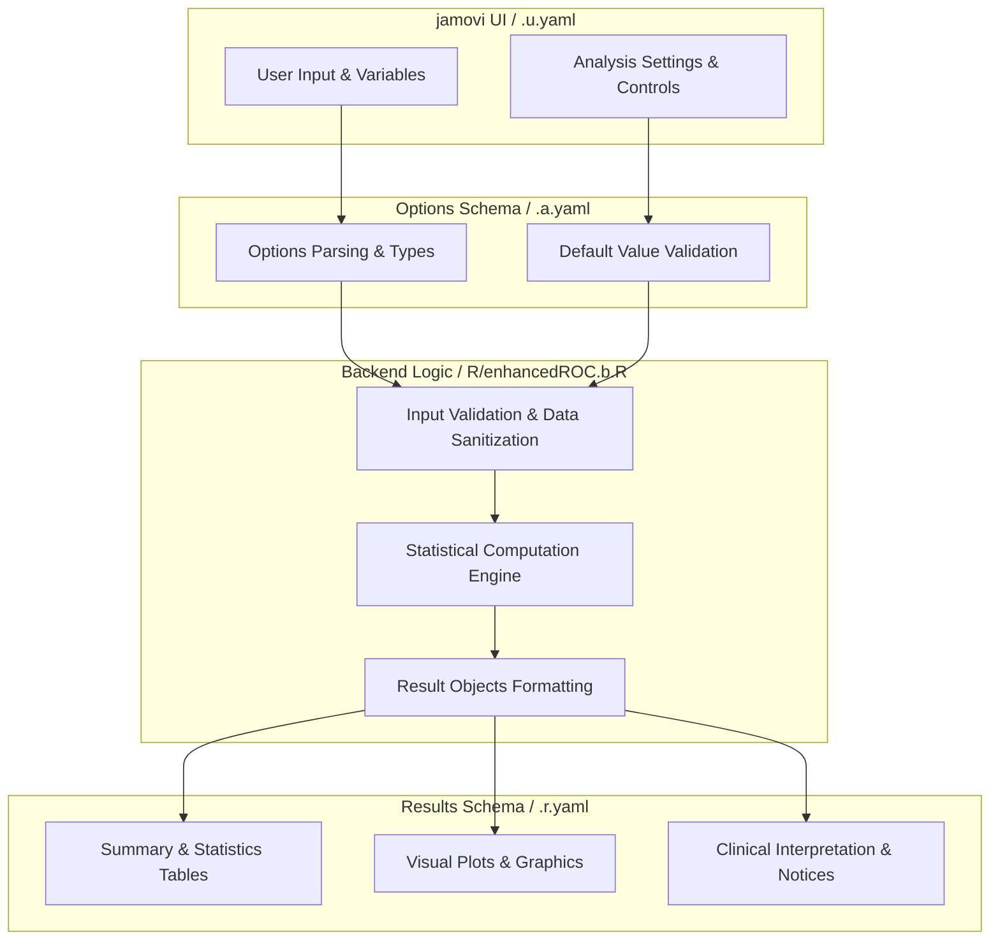
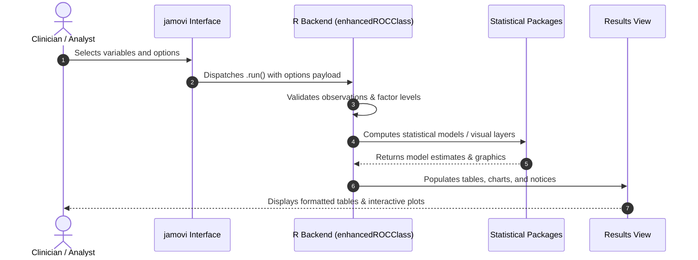

# Clinical ROC Analysis - Developer Documentation

## 1. Overview

- **Function**: `enhancedROC`
- **Title**: Clinical ROC Analysis
- **Module**: `meddecide`
- **Files**:
  - `jamovi/enhancedROC.u.yaml` - User Interface Definition
  - `jamovi/enhancedROC.a.yaml` - Options & Schema Definition
  - `jamovi/enhancedROC.r.yaml` - Results Layout & Tables
  - `R/enhancedROC.b.R` - Backend Implementation
- **Summary**: Clinical ROC analysis toolkit for comprehensive diagnostic performance  evaluation. Includes ROC curve analysis, Youden Index optimization,  sensitivity/specificity analysis, optimal cutoff determination, and  comparative ROC analysis. Essential for biomarker validation, diagnostic test evaluation, and clinical decision support in medical research.

## 1a. Changelog

- **Date**: 2026-08-29
- **Summary**: Comprehensive documentation suite created & verified against active schemas and backend implementation.

## 2. Options Reference (`.a.yaml`)

| Option | Type | Default | Description |
| :--- | :--- | :--- | :--- |
| `data` | `Data` | `NULL` |  |
| `outcome` | `Variable` | `NULL` | Outcome Variable |
| `positiveClass` | `Level` | `NULL` | Positive Class |
| `predictors` | `Variables` | `NULL` | Predictor Variables |
| `analysisType` | `List` | `single` | Analysis Type |
| `direction` | `List` | `auto` | Direction |
| `youdenOptimization` | `Bool` | `TRUE` | Youden index optimization |
| `customCutoffs` | `String` | `` | Custom Cutoffs |
| `sensitivityThreshold` | `Number` | `0` | Minimum sensitivity |
| `specificityThreshold` | `Number` | `0` | Minimum specificity |
| `confidenceLevel` | `Number` | `95` | Confidence Level |
| `bootstrapSamples` | `Integer` | `1000` | Bootstrap Samples |
| `useBootstrap` | `Bool` | `FALSE` | Use bootstrap |
| `bootstrapMethod` | `List` | `bca` | Bootstrap Method |
| `bootstrapCutoffCI` | `Bool` | `FALSE` | Bootstrap CI for optimal cutoff |
| `bootstrapPartialAUC` | `Bool` | `FALSE` | Bootstrap CI for partial AUC |
| `stratifiedBootstrap` | `Bool` | `FALSE` | Stratified bootstrap |
| `seed` | `Integer` | `0` | Random Seed |
| `pairwiseComparisons` | `Bool` | `FALSE` | Pairwise comparisons |
| `comparisonMethod` | `List` | `delong` | Comparison Method |
| `rocCurve` | `Bool` | `TRUE` | ROC curve plot |
| `aucTable` | `Bool` | `TRUE` | AUC summary table |
| `cutoffTable` | `Bool` | `FALSE` | Cutoff analysis table |
| `optimalCutoffs` | `Bool` | `TRUE` | Optimal cutoffs summary |
| `diagnosticMetrics` | `Bool` | `TRUE` | Diagnostic metrics |
| `clinicalMetrics` | `Bool` | `FALSE` | Clinical metrics |
| `smoothMethod` | `List` | `none` | ROC Curve Smoothing |
| `partialAuc` | `Bool` | `FALSE` | Partial AUC analysis |
| `partialAucType` | `List` | `specificity` | Partial AUC Type |
| `partialRange` | `String` | `0.8,1.0` | Partial AUC Range |
| `crocAnalysis` | `Bool` | `FALSE` | CROC analysis |
| `crocAlpha` | `Number` | `7` | CROC Alpha Parameter |
| `convexHull` | `Bool` | `FALSE` | ROC convex hull |
| `tiedScoreHandling` | `List` | `average` | Tied Score Handling |
| `detectImbalance` | `Bool` | `FALSE` | Detect class imbalance |
| `imbalanceThreshold` | `Number` | `3` | Imbalance Threshold |
| `showImbalanceWarning` | `Bool` | `FALSE` | Imbalance warning |
| `recommendPRC` | `Bool` | `FALSE` | Recommend PRC for imbalanced data |
| `prevalence` | `Number` | `0.1` | Disease prevalence |
| `useObservedPrevalence` | `Bool` | `TRUE` | Use observed prevalence |
| `clinicalContext` | `List` | `general` | Clinical Context |
| `clinicalPresets` | `List` | `custom` | Clinical Presets |
| `comprehensive_output` | `Bool` | `FALSE` | Comprehensive statistical output |
| `clinical_interpretation` | `Bool` | `FALSE` | Clinical interpretation |
| `plotTheme` | `List` | `clinical` | Plot Theme |
| `plotWidth` | `Integer` | `600` | Plot Width |
| `plotHeight` | `Integer` | `600` | Plot Height |
| `showCutoffPoints` | `Bool` | `FALSE` | Cutoff points |
| `showConfidenceBands` | `Bool` | `FALSE` | Confidence bands |
| `showMetricsDiff` | `Bool` | `FALSE` | Metrics differences |
| `statisticalComparison` | `Bool` | `FALSE` | Statistical model comparison |
| `calibrationAnalysis` | `Bool` | `FALSE` | Calibration analysis |
| `calibrationPlot` | `Bool` | `FALSE` | Calibration plot |
| `hosmerLemeshow` | `Bool` | `FALSE` | Hosmer-Lemeshow test |
| `hlGroups` | `Integer` | `10` | Risk groups |
| `brierScore` | `Bool` | `FALSE` | Brier score |
| `calibrationMetrics` | `Bool` | `FALSE` | Calibration metrics |
| `splineCalibration` | `Bool` | `FALSE` | Spline calibration curves |
| `splineKnots` | `Integer` | `4` | Number of Knots |
| `eoRatio` | `Bool` | `FALSE` | E/O ratio |
| `namDagostino` | `Bool` | `FALSE` | Nam-D'Agostino test |
| `greenwoodNam` | `Bool` | `FALSE` | Greenwood-Nam-D'Agostino test |
| `calibrationBelt` | `Bool` | `FALSE` | Calibration belt |
| `calibrationDensity` | `Bool` | `FALSE` | Calibration density plot |
| `multiClassROC` | `Bool` | `FALSE` | Multi-class ROC analysis |
| `multiClassStrategy` | `List` | `ovr` | Multi-Class Strategy |
| `multiClassAveraging` | `List` | `macro` | Multi-Class AUC Averaging |
| `clinicalImpact` | `Bool` | `FALSE` | Clinical impact analysis |
| `nntCalculation` | `Bool` | `FALSE` | Number needed to test/Treat |
| `clinicalUtilityCurve` | `Bool` | `FALSE` | Clinical utility curve |
| `decisionImpactTable` | `Bool` | `FALSE` | Decision impact table |
| `harrellCIndex` | `Bool` | `FALSE` | Harrell's C-index |
| `unoCStatistic` | `Bool` | `FALSE` | Uno's C-statistic |
| `incidentDynamic` | `Bool` | `FALSE` | Incident/Dynamic AUC |
| `cumulativeDynamic` | `Bool` | `FALSE` | Cumulative/Dynamic AUC |
| `competingRisksConcordance` | `Bool` | `FALSE` | Competing risks concordance |
| `internalValidation` | `Bool` | `FALSE` | Internal validation |
| `validationMethod` | `List` | `bootstrap` | Validation Method |
| `optimismCorrection` | `Bool` | `FALSE` | Optimism correction |
| `externalValidation` | `Bool` | `FALSE` | External validation framework |
| `decisionImpactCurves` | `Bool` | `FALSE` | Decision impact curves |
| `netBenefitRegression` | `Bool` | `FALSE` | Net benefit regression |
| `modelUpdating` | `Bool` | `FALSE` | Model updating analysis |
| `transportability` | `Bool` | `FALSE` | Transportability analysis |

## 3. Results Definition (`.r.yaml`)

| Output ID | Type | Title | Description |
| :--- | :--- | :--- | :--- |
| `results` | `Group` | `Analysis Results` |  |

## 4. Architecture & Data Flow Diagram

```mermaid
flowchart TD
  subgraph UI[jamovi UI / .u.yaml]
    U1[User Input & Variables]
    U2[Analysis Settings & Controls]
  end

  subgraph Opts[Options Schema / .a.yaml]
    O1[Options Parsing & Types]
    O2[Default Value Validation]
  end

  subgraph Backend[Backend Logic / R/enhancedROC.b.R]
    B1[Input Validation & Data Sanitization]
    B2[Statistical Computation Engine]
    B3[Result Objects Formatting]
  end

  subgraph Res[Results Schema / .r.yaml]
    R1[Summary & Statistics Tables]
    R2[Visual Plots & Graphics]
    R3[Clinical Interpretation & Notices]
  end

  U1 --> O1
  U2 --> O2
  O1 --> B1
  O2 --> B1
  B1 --> B2
  B2 --> B3
  B3 --> R1
  B3 --> R2
  B3 --> R3
```

## 5. Execution Sequence

```mermaid
sequenceDiagram
  autonumber
  actor User as Clinician / Analyst
  participant UI as jamovi Interface
  participant Backend as R Backend (enhancedROCClass)
  participant Engine as Statistical Packages
  participant Results as Results View

  User->>UI: Selects variables and options
  UI->>Backend: Dispatches .run() with options payload
  Backend->>Backend: Validates observations & factor levels
  Backend->>Engine: Computes statistical models / visual layers
  Engine-->>Backend: Returns model estimates & graphics
  Backend->>Results: Populates tables, charts, and notices
  Results-->>User: Displays formatted tables & interactive plots
```

## 6. Change Impact & Safety Guidelines

- **Data Filtering**: Ensure observations with missing values are handled gracefully according to analysis options.
- **Formula Conflicts**: Use isolated environment calls or base formula methods when interacting with `ggstatsplot` or formula parsers.
- **Safe Deparsing**: Use `deparse(val)` in syntax generation (`asSource()`) to escape column names with spaces or special symbols.

