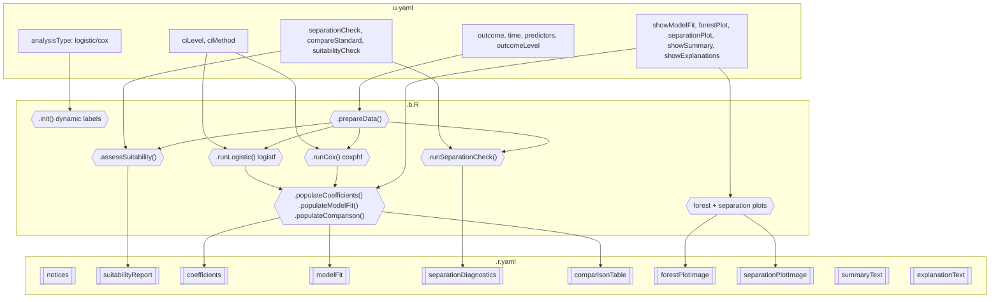

# Firth's Penalized Likelihood Regression -- Developer Documentation

## 1. Overview

- **Function**: `firthregression`
- **Menu**: SurvivalT > Penalized Cox Regression > Firth Regression
- **Version**: 0.0.37
- **Files**:
  - `jamovi/firthregression.u.yaml` -- UI
  - `jamovi/firthregression.a.yaml` -- Options (14 options excl. data)
  - `R/firthregression.b.R` -- Backend (~1165 lines)
  - `jamovi/firthregression.r.yaml` -- Results (11 outputs)

**Summary**: Firth's penalized likelihood regression for both logistic (binary outcome) and Cox proportional hazards (survival) models. Addresses small-sample bias, complete/quasi-complete separation, and rare events by adding a Jeffreys-prior penalty to the likelihood. Uses `logistf` for logistic and `coxphf` for Cox mode. Provides profile likelihood CIs, penalized LR test p-values, separation diagnostics, bias reduction quantification vs standard models, forest plots, and natural-language summaries.

---

## 2. UI Controls -> Options Map

| UI Control | Type | Label | Binds to Option | Default | Notes |
|------------|------|-------|-----------------|---------|-------|
| `analysisType` | ComboBox | Analysis Type | `analysisType` | `logistic` | logistic / cox |
| `time` | VariablesListBox | Time Variable (Cox only) | `time` | -- | maxItemCount: 1 |
| `outcome` | VariablesListBox | Outcome Variable | `outcome` | -- | maxItemCount: 1 |
| `predictors` | VariablesListBox | Predictor Variables | `predictors` | -- | |
| `outcomeLevel` | LevelSelector | Event Level | `outcomeLevel` | -- | |
| `ciLevel` | TextBox (number) | Confidence Level | `ciLevel` | `0.95` | 0.80--0.99 |
| `ciMethod` | ComboBox | CI Method | `ciMethod` | `profile` | profile / wald |
| `separationCheck` | CheckBox | Separation Detection | `separationCheck` | `true` | |
| `compareStandard` | CheckBox | Compare with Standard Model | `compareStandard` | `true` | |
| `suitabilityCheck` | CheckBox | Data Suitability Assessment | `suitabilityCheck` | `true` | |
| `showModelFit` | CheckBox | Model Fit Statistics | `showModelFit` | `true` | |
| `forestPlot` | CheckBox | Forest Plot | `forestPlot` | `true` | |
| `separationPlot` | CheckBox | Separation Diagnostic Plot | `separationPlot` | `false` | |
| `showSummary` | CheckBox | Results Summary | `showSummary` | `false` | |
| `showExplanations` | CheckBox | Method Explanations | `showExplanations` | `false` | |

---

## 5. Results Definition

| Output | Type | Visibility | Population Method |
|--------|------|------------|-------------------|
| `instructions` | Html | `false` (programmatic) | `.showMessage()` welcome |
| `notices` | Html | always | `.renderNotices()` custom system |
| `suitabilityReport` | Html | `(suitabilityCheck)` | `.assessSuitability()` |
| `coefficients` | Table | always | `.populateCoefficients()` |
| `modelFit` | Table | `(showModelFit)` | `.populateModelFit()` |
| `separationDiagnostics` | Table | `(separationCheck)` | `.runSeparationCheck()` |
| `comparisonTable` | Table | `(compareStandard)` | `.populateComparison()` |
| `forestPlotImage` | Image | `(forestPlot)` | `.prepareForestPlot()` + `.renderForestPlot()` |
| `separationPlotImage` | Image | `(separationPlot)` | `.prepareSeparationPlot()` + `.renderSeparationPlot()` |
| `summaryText` | Html | `(showSummary)` | `.showSummaryText()` |
| `explanationText` | Html | `(showExplanations)` | `.showExplanations()` |

---

## 6. Data Flow Diagram



---

## 7. Execution Sequence

1. **`.init()`** -- Set dynamic column labels (OR vs HR based on analysisType)
2. **`.run()`** -- Guard: missing outcome or predictors -> welcome HTML
3. **`.prepareData()`** -- Complete cases, outcome encoding, predictor validation, time validation (Cox)
4. **`.assessSuitability()`** -- EPV, sample size, missing data, multicollinearity (if enabled)
5. **`.runSeparationCheck()`** -- Per-variable complete/quasi-complete separation diagnostics (if enabled)
6. **`.runLogistic()`** or **`.runCox()`** -- Dispatch based on analysisType
7. **Model fitting** -- `logistf::logistf()` (logistic) or `coxphf::coxphf()` (Cox)
8. **Standard model** -- `glm(binomial)` or `survival::coxph()` for comparison (if enabled)
9. **`.populateCoefficients()`** -- Coefficients, SE, OR/HR, CIs, p-values, bias reduction %
10. **`.populateModelFit()`** -- Log-likelihood, AIC, n, events (if enabled)
11. **`.populateComparison()`** -- Side-by-side Firth vs Standard (if enabled)
12. **Plots** -- Forest plot (ggplot2), separation diagnostic plot (if enabled)
13. **Summary + Explanations** -- Natural-language text (if enabled)
14. **Clinical notices** -- EPV check, completion summary
15. **`.renderNotices()`** -- Compile all notices into styled HTML

---

## 8. Change Impact Guide

| Option Changed | Recalculates | Performance |
|---------------|-------------|-------------|
| `analysisType` | Everything (different engine) | Moderate |
| `outcome`/`predictors` | Everything | Full refit |
| `ciLevel` | CIs only (not coefficients) | Fast |
| `ciMethod` | CI calculation method | Slow (profile) / Fast (wald) |
| `separationCheck` | Separation diagnostics | Fast |
| `compareStandard` | Standard model fit + comparison table + bias_reduction column | Moderate |
| `showModelFit` | Computation gated | Fast |
| Display toggles | Visibility only | Negligible |

---

## 9. Example Usage

**Dataset**: `firth_standard` (n=120, 58 mortality events, 31 survival events)

```yaml
analysisType: "logistic"
outcome: "mortality"
outcomeLevel: "Dead"
predictors: ["age", "grade", "tumor_size", "lvi", "marker"]
ciLevel: 0.95
ciMethod: "profile"
separationCheck: true
compareStandard: true
```

---

## 10. Appendix

### Package Dependencies

| Package | Usage |
|---------|-------|
| `logistf` | Firth logistic regression |
| `coxphf` | Firth Cox regression |
| `survival` | `Surv()`, `coxph()` for standard comparison |
| `ggplot2` | Forest plot |
