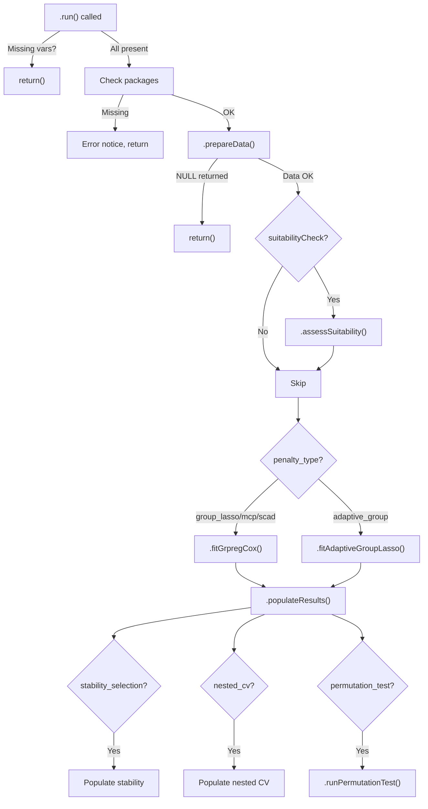

# Group LASSO for Survival Analysis — Developer Documentation

## 1. Overview

- **Function**: `grouplasso`
- **Menu**: SurvivalT > Penalized Cox Regression > Group LASSO Cox
- **Version**: 0.0.37
- **Files**:
  - `jamovi/grouplasso.u.yaml` — UI
  - `jamovi/grouplasso.a.yaml` — Options
  - `R/grouplasso.b.R` — Backend
  - `jamovi/grouplasso.r.yaml` — Results

**Summary**: Group LASSO fits penalized Cox proportional hazards models that select or remove pre-defined variable groups simultaneously using the `grpreg` package. Unlike standard LASSO (individual variable selection), Group LASSO uses an L1/L2 mixed norm penalty at the group level, making it ideal for categorical variables with multiple dummy codes, grouped biomarkers, or gene pathways. Supports four penalty types (grLasso, grMCP, grSCAD, Adaptive), stability selection, nested CV, and permutation testing.

---

## 2. UI Controls → Options Map

### Variable Selectors

| UI Control | Type | Label | Binds to Option | Default | Constraints | Visibility/Enable |
|------------|------|-------|-----------------|---------|-------------|-------------------|
| `time` | VariablesListBox | Time Variable | `time` | — | maxItemCount: 1, numeric | Always |
| `event` | VariablesListBox | Event Indicator | `event` | — | maxItemCount: 1, factor/numeric | Always |
| `outcomeLevel` | LevelSelector | Event Level | `outcomeLevel` | — | Levels of `event` | `enable: (event)` |
| `censorLevel` | LevelSelector | Censored Level | `censorLevel` | — | Levels of `event` | `enable: (event)` |
| `predictors` | VariablesListBox | Predictor Variables | `predictors` | — | numeric/factor | Always |

### Data Suitability (CollapseBox, collapsed: false)

| UI Control | Type | Label | Binds to Option | Default |
|------------|------|-------|-----------------|---------|
| `suitabilityCheck` | CheckBox | Data Suitability Assessment | `suitabilityCheck` | `true` |

### Group Definition (CollapseBox, collapsed: false)

| UI Control | Type | Label | Binds to Option | Default | Enable Condition |
|------------|------|-------|-----------------|---------|------------------|
| `group_definition` | ComboBox | Group Definition Method | `group_definition` | `automatic` | Always |
| `group_structure` | TextBox (string) | Group Structure | `group_structure` | `""` | `(group_definition:custom)` |
| `factor_grouping` | CheckBox | Factor Variable Grouping | `factor_grouping` | `true` | Always |

### Penalty Options (CollapseBox, collapsed: false)

| UI Control | Type | Label | Binds to Option | Default | Enable Condition |
|------------|------|-------|-----------------|---------|------------------|
| `penalty_type` | ComboBox | Penalty Type | `penalty_type` | `group_lasso` | Always |
| `group_weights` | ComboBox | Group Weight Method | `group_weights` | `sqrt_size` | Always |
| `custom_weights` | TextBox (string) | Custom Group Weights | `custom_weights` | `""` | `(group_weights:custom)` |
| `adaptive_weights_method` | ComboBox | Adaptive Weights Method | `adaptive_weights_method` | `ridge` | `(penalty_type:adaptive_group)` |

### Cross-Validation (CollapseBox, collapsed: false)

| UI Control | Type | Label | Binds to Option | Default | Constraints |
|------------|------|-------|-----------------|---------|-------------|
| `cv_folds` | TextBox (number) | Cross-Validation Folds | `cv_folds` | `10` | min: 3, max: 20 |
| `n_lambda` | TextBox (number) | Number of Lambda Values | `n_lambda` | `100` | min: 10, max: 500 |
| `lambda_min_ratio` | TextBox (number) | Lambda Min Ratio | `lambda_min_ratio` | `0.001` | min: 1e-6, max: 0.1 |

### Advanced Validation (CollapseBox, collapsed: true)

| UI Control | Type | Label | Binds to Option | Default | Enable Condition |
|------------|------|-------|-----------------|---------|------------------|
| `stability_selection` | CheckBox | Stability Selection | `stability_selection` | `false` | Always |
| `bootstrap_samples` | TextBox (number) | Bootstrap Samples | `bootstrap_samples` | `100` | `(stability_selection)` |
| `stability_threshold` | TextBox (number) | Stability Threshold | `stability_threshold` | `0.6` | `(stability_selection)` |
| `nested_cv` | CheckBox | Nested Cross-Validation | `nested_cv` | `false` | Always |
| `inner_cv_folds` | TextBox (number) | Inner CV Folds | `inner_cv_folds` | `5` | `(nested_cv)` |
| `permutation_test` | CheckBox | Permutation Test | `permutation_test` | `false` | Always |
| `n_permutations` | TextBox (number) | Number of Permutations | `n_permutations` | `100` | `(permutation_test)` |

### Output Options (CollapseBox, collapsed: true)

| UI Control | Type | Label | Binds to Option | Default |
|------------|------|-------|-----------------|---------|
| `showSummary` | CheckBox | Show Summary | `showSummary` | `false` |
| `showExplanations` | CheckBox | Show Explanations | `showExplanations` | `false` |
| `show_group_summary` | CheckBox | Show Group Summary | `show_group_summary` | `true` |
| `show_coefficients` | CheckBox | Show Coefficients | `show_coefficients` | `true` |
| `show_path_summary` | CheckBox | Show Regularization Path | `show_path_summary` | `true` |
| `show_cv_results` | CheckBox | Show CV Results | `show_cv_results` | `true` |
| `plot_regularization_path` | CheckBox | Group Regularization Path | `plot_regularization_path` | `true` |
| `plot_cv_curve` | CheckBox | Cross-Validation Curve | `plot_cv_curve` | `true` |
| `plot_group_importance` | CheckBox | Group Importance Plot | `plot_group_importance` | `true` |
| `plot_stability` | CheckBox | Stability Selection Plot | `plot_stability` | `false` |
| `plot_group_structure` | CheckBox | Group Structure Plot | `plot_group_structure` | `false` |

### Advanced Settings (CollapseBox, collapsed: true)

| UI Control | Type | Label | Binds to Option | Default | Constraints |
|------------|------|-------|-----------------|---------|-------------|
| `max_iterations` | TextBox (number) | Maximum Iterations | `max_iterations` | `10000` | min: 100, max: 100000 |
| `tolerance` | TextBox (number) | Convergence Tolerance | `tolerance` | `0.001` | min: 1e-8, max: 0.1 |
| `selection_threshold` | TextBox (number) | Group Selection Threshold | `selection_threshold` | `1e-8` | min: 1e-12, max: 1e-3 |
| `standardize` | CheckBox | Standardize Variables | `standardize` | `true` | |
| `random_seed` | TextBox (number) | Random Seed | `random_seed` | `123` | min: 1, max: 999999 |

---

## 3. Options Reference (.a.yaml)

### Input Variables

| Option | Type | Default | Description | Downstream Effects |
|--------|------|---------|-------------|-------------------|
| `data` | Data | — | Input data frame | Used throughout `.prepareData()` |
| `time` | Variable | — | Time to event (numeric) | `.prepareData()` → `survival::Surv()` |
| `event` | Variable | — | Event indicator (factor/numeric) | `.prepareData()` → event encoding |
| `outcomeLevel` | Level | — | Level of event = 1 | `.prepareData()` two-level encoding |
| `censorLevel` | Level | — | Level of censoring = 0 | `.prepareData()` two-level encoding |
| `predictors` | Variables | — | Predictor variables | `.prepareData()` → design matrix → model fitting |

### Group Definition

| Option | Type | Default | Description | Downstream Effects |
|--------|------|---------|-------------|-------------------|
| `group_definition` | List | `automatic` | Group method: automatic/custom/factor_based | `.defineGroups()` dispatch |
| `group_structure` | String | `""` | Custom assignments: "var1:1, var2:1, var3:2" | `.customGrouping()` parsing |
| `factor_grouping` | Bool | `true` | Group factor dummies together | `.automaticGrouping()` assign_vec usage |

### Penalty & Weights

| Option | Type | Default | Description | Downstream Effects |
|--------|------|---------|-------------|-------------------|
| `penalty_type` | List | `group_lasso` | grLasso/grMCP/grSCAD/adaptive | `.fitGroupLasso()` penalty dispatch |
| `group_weights` | List | `sqrt_size` | equal/sqrt_size/group_size/custom | `.buildGroupMultiplier()` |
| `custom_weights` | String | `""` | Comma-separated custom weights | `.buildGroupMultiplier()` parsing |
| `adaptive_weights_method` | List | `ridge` | ridge/univariate | `.fitAdaptiveGroupLasso()` → `.getInitialEstimates()` |

### Cross-Validation

| Option | Type | Default | Description | Downstream Effects |
|--------|------|---------|-------------|-------------------|
| `cv_folds` | Integer | `10` | CV folds (3–20) | `grpreg::cv.grpsurv(nfolds=)` |
| `n_lambda` | Integer | `100` | Lambda grid size (10–500) | `grpreg::cv.grpsurv(nlambda=)` |
| `lambda_min_ratio` | Number | `0.001` | Min/max lambda ratio | `grpreg::cv.grpsurv(lambda.min=)` |

### Algorithm Settings

| Option | Type | Default | Description | Downstream Effects |
|--------|------|---------|-------------|-------------------|
| `max_iterations` | Integer | `10000` | Max iterations (100–100000) | `grpreg::cv.grpsurv(max.iter=)` |
| `tolerance` | Number | `0.001` | Convergence tolerance | `grpreg::cv.grpsurv(eps=)` |
| `selection_threshold` | Number | `1e-8` | Group selection cutoff | All result population methods |
| `standardize` | Bool | `true` | Pre-standardize variables | `.createDesignMatrix()` column scaling |
| `random_seed` | Integer | `123` | Random seed | `set.seed()` in fitting & bootstrap |

### Validation Options

| Option | Type | Default | Description | Downstream Effects |
|--------|------|---------|-------------|-------------------|
| `stability_selection` | Bool | `false` | Run stability selection | `.stabilitySelection()` in `.fitGroupLasso()` |
| `bootstrap_samples` | Integer | `100` | Subsample count (50–1000) | `.stabilitySelection()` loop count |
| `stability_threshold` | Number | `0.6` | Stable selection cutoff (0.5–0.95) | `.populateStabilityResults()` |
| `nested_cv` | Bool | `false` | Run nested CV | `.nestedCrossValidation()` |
| `inner_cv_folds` | Integer | `5` | Inner CV folds (3–10) | `.nestedCrossValidation()` |
| `permutation_test` | Bool | `false` | Run permutation test | `.runPermutationTest()` in `.populateResults()` |
| `n_permutations` | Integer | `100` | Permutation count (50–1000) | `.runPermutationTest()` loop |

### Display Options

| Option | Type | Default | Description | Downstream Effects |
|--------|------|---------|-------------|-------------------|
| `show_group_summary` | Bool | `true` | Show group summary table | `groupSummary` visibility & population |
| `show_coefficients` | Bool | `true` | Show coefficients table | `coefficients` visibility & population |
| `show_path_summary` | Bool | `true` | Show regularization path table | `pathSummary` visibility & population |
| `show_cv_results` | Bool | `true` | Show CV results table | `cvResults` visibility & population |
| `plot_regularization_path` | Bool | `true` | Show regularization path plot | `pathPlot` setState |
| `plot_cv_curve` | Bool | `true` | Show CV curve plot | `cvPlot` setState |
| `plot_group_importance` | Bool | `true` | Show group importance plot | `importancePlot` setState |
| `plot_stability` | Bool | `false` | Show stability plot | `stabilityPlot` setState |
| `plot_group_structure` | Bool | `false` | Show group structure plot | `groupStructurePlot` setState |
| `showSummary` | Bool | `false` | Show results summary HTML | `summary` content |
| `showExplanations` | Bool | `false` | Show explanations HTML | `explanations` content |

---

## 4. Backend Usage (.b.R)

### Execution Entry Points

| Method | Purpose | Key Options Used |
|--------|---------|-----------------|
| `.init()` | Show instructions if no data/time/event | `time`, `event` |
| `.run()` | Main execution orchestrator | All |
| `.prepareData()` | Data validation, survival object, design matrix | `time`, `event`, `outcomeLevel`, `censorLevel`, `predictors` |
| `.createDesignMatrix()` | Factor→dummy expansion, standardization, group assignment | `standardize`, `group_definition`, `factor_grouping` |
| `.defineGroups()` | Dispatch to grouping method | `group_definition` |
| `.automaticGrouping()` | Groups by original variable (optionally merging factor dummies) | `factor_grouping` |
| `.factorBasedGrouping()` | Always merges factor dummies | — |
| `.customGrouping()` | Parses `"var:group"` string | `group_structure` |
| `.buildGroupMultiplier()` | Computes per-group penalty weights | `group_weights`, `custom_weights` |
| `.fitGroupLasso()` | Orchestrates model fit + optional stability/nested CV | `penalty_type`, `stability_selection`, `nested_cv` |
| `.fitGrpregCox()` | Core `grpreg::cv.grpsurv()` call | `cv_folds`, `n_lambda`, `lambda_min_ratio`, `tolerance`, `max_iterations`, `random_seed` |
| `.fitAdaptiveGroupLasso()` | Two-step: initial estimates → weighted grLasso | `adaptive_weights_method` |
| `.getInitialEstimates()` | Ridge (via `glmnet`) or univariate Cox | `adaptive_weights_method` |
| `.computeLambda1se()` | Manual 1-SE rule for grpreg (not natively provided) | — |
| `.stabilitySelection()` | Subsample loop with CV on each | `bootstrap_samples`, `stability_threshold`, `random_seed` |
| `.nestedCrossValidation()` | Outer/inner CV loop for unbiased performance | `cv_folds`, `inner_cv_folds`, `random_seed` |
| `.runPermutationTest()` | Permuted response testing | `n_permutations`, `random_seed` |
| `.populateResults()` | Orchestrates all result population | All display options |
| `.assessSuitability()` | Traffic-light HTML for 5 checks (EPV, reduction need, sample size, multicollinearity, data quality) | `suitabilityCheck` |

### Key Logic Branches

**Penalty type dispatch** (`.fitGroupLasso()` line 561–574):
- `group_lasso` → `grpreg::cv.grpsurv(penalty="grLasso")`
- `group_mcp` → `grpreg::cv.grpsurv(penalty="grMCP")`
- `group_scad` → `grpreg::cv.grpsurv(penalty="grSCAD")`
- `adaptive_group` → `.fitAdaptiveGroupLasso()` (two-step: initial estimates + weighted grLasso)

**Adaptive weights** (`.getInitialEstimates()` line 669–727):
- `ridge` → `glmnet::glmnet(alpha=0, family="cox")` for initial coefficients
- `univariate` → `survival::coxph()` per group
- Fallback → least-penalized `grpreg::grpsurv()` path

**Group definition** (`.defineGroups()` line 369–384):
- `automatic` → uses `model.matrix()` assign attribute + optional factor grouping
- `factor_based` → always groups factor dummies together
- `custom` → parses `"var1:1, var2:1, var3:2"` string

### Notice System

Uses `.insertNotice()` (line 170–191) with fallback to `todo` HTML:
- `missingGrpreg` / `missingSurvival` — missing package errors
- `insufficientData` / `insufficientDataAfterEncoding` — too few observations
- `excludedRows` — outcome encoding exclusions
- `invalidTime` / `noEvents` — data validation
- `veryLowEvents` / `lowEvents` — clinical warnings
- `noSelection` — all coefficients zero
- `poorDiscrimination` — C-index < 0.5
- `weightMismatch` — custom weights length mismatch
- `analysisComplete` — summary notice
- `analysisError` — fitting error

---

## 5. Results Definition (.r.yaml)

### Output Summary

| Output ID | Type | Title | Visibility | Population Method |
|-----------|------|-------|------------|-------------------|
| `instructions` | Html | Instructions | `false` (set in `.init()`) | `.init()` → `setContent()` |
| `todo` | Html | (untitled) | `true` | Fallback notice container |
| `suitabilityReport` | Html | Data Suitability Assessment | `(suitabilityCheck)` | `.assessSuitability()` → `.generateSuitabilityHtml()` |
| `groupSummary` | Table | Group Structure Summary | `(show_group_summary)` | `.populateGroupSummary()` |
| `coefficients` | Table | Group LASSO Coefficients | `(show_coefficients)` | `.populateCoefficients()` |
| `pathSummary` | Table | Regularization Path Summary | `(show_path_summary)` | `.populatePathSummary()` |
| `cvResults` | Table | Cross-Validation Results | `(show_cv_results)` | `.populateCVResults()` |
| `stabilityResults` | Table | Stability Selection Results | `(stability_selection)` | `.populateStabilityResults()` |
| `modelPerformanceNote` | Html | (untitled) | `true` | `.populatePerformance()` |
| `modelPerformance` | Table | Model Performance | Always | `.populatePerformance()` |
| `nestedCVResults` | Table | Nested Cross-Validation | `(nested_cv)` | `.populateNestedCVResults()` |
| `permutationResults` | Table | Permutation Test Results | `(permutation_test)` | `.populatePermutationResults()` |
| `pathPlot` | Image | Group Regularization Path | `(plot_regularization_path)` | `.setPathPlotState()` → `.renderPathPlot()` |
| `cvPlot` | Image | Cross-Validation Curve | `(plot_cv_curve)` | `.setCVPlotState()` → `.renderCVPlot()` |
| `importancePlot` | Image | Group Importance | `(plot_group_importance)` | `.setImportancePlotState()` → `.renderImportancePlot()` |
| `stabilityPlot` | Image | Stability Selection | `(plot_stability)` | `.setStabilityPlotState()` → `.renderStabilityPlot()` |
| `groupStructurePlot` | Image | Group Structure Visualization | `(plot_group_structure)` | `.setGroupStructurePlotState()` → `.renderGroupStructurePlot()` |
| `summary` | Html | Results Summary | `(showSummary)` | `.populateSummary()` |
| `explanations` | Html | About This Analysis | `(showExplanations)` | `.populateExplanations()` |

### Table Column Schemas

#### `groupSummary` — Group Structure Summary

| Column | Title | Type | Format |
|--------|-------|------|--------|
| `group_id` | Group ID | integer | — |
| `group_name` | Group Name | text | — |
| `variables` | Variables | text | — |
| `group_size` | Size | integer | — |
| `group_weight` | Weight | number | zto |
| `selected` | Selected | text | — |
| `selection_order` | Entry Order | integer | — |

clearWith: `predictors`, `group_definition`, `group_structure`, `factor_grouping`

#### `coefficients` — Group LASSO Coefficients

| Column | Title | Type | Format |
|--------|-------|------|--------|
| `group_id` | Group | integer | — |
| `variable` | Variable | text | — |
| `coefficient` | Coefficient | number | zto |
| `exp_coefficient` | Hazard Ratio | number | zto |
| `group_norm` | Group Norm | number | zto |
| `relative_importance` | Relative Importance | number | zto |
| `selected` | Selected | text | — |

clearWith: `time`, `event`, `outcomeLevel`, `censorLevel`, `predictors`, `penalty_type`, `cv_folds`

#### `pathSummary` — Regularization Path Summary

| Column | Title | Type | Format |
|--------|-------|------|--------|
| `step` | Step | integer | — |
| `lambda` | Lambda | number | zto |
| `n_groups_selected` | Groups Selected | integer | — |
| `n_variables_selected` | Variables Selected | integer | — |
| `deviance` | Deviance | number | zto |
| `df` | Degrees of Freedom | number | zto |

clearWith: `n_lambda`, `penalty_type`

#### `cvResults` — Cross-Validation Results

| Column | Title | Type | Format |
|--------|-------|------|--------|
| `criterion` | Criterion | text | — |
| `lambda_min` | Lambda Min | number | zto |
| `lambda_1se` | Lambda 1SE | number | zto |
| `cv_error_min` | Min CV Error | number | zto |
| `cv_error_1se` | 1SE CV Error | number | zto |
| `groups_min` | Groups (Min) | integer | — |
| `groups_1se` | Groups (1SE) | integer | — |

clearWith: `cv_folds`, `n_lambda`

#### `stabilityResults` — Stability Selection Results

| Column | Title | Type | Format |
|--------|-------|------|--------|
| `group_id` | Group ID | integer | — |
| `group_name` | Group Name | text | — |
| `selection_frequency` | Selection Frequency | number | pc (percentage) |
| `stability_score` | Stability Score | number | zto |
| `stable_selection` | Stable Selection | text | — |
| `first_selected` | First Selected (Lambda) | number | zto |

clearWith: `stability_threshold`, `bootstrap_samples`

#### `modelPerformance` — Model Performance

| Column | Title | Type | Format |
|--------|-------|------|--------|
| `metric` | Metric | text | — |
| `value` | Value | number | zto |
| `confidence_interval` | 95% CI | text | — |
| `description` | Description | text | — |

clearWith: `time`, `event`, `outcomeLevel`, `censorLevel`, `predictors`, `penalty_type`

#### `nestedCVResults` — Nested Cross-Validation

| Column | Title | Type | Format |
|--------|-------|------|--------|
| `outer_fold` | Outer Fold | integer | — |
| `optimal_lambda` | Optimal Lambda | number | zto |
| `n_groups_selected` | Groups Selected | integer | — |
| `performance` | Performance | number | zto |
| `training_error` | Training Error | number | zto |

clearWith: `cv_folds`, `inner_cv_folds`, `nested_cv`

#### `permutationResults` — Permutation Test Results

| Column | Title | Type | Format |
|--------|-------|------|--------|
| `test_statistic` | Test Statistic | text | — |
| `observed_value` | Observed Value | number | zto |
| `permutation_mean` | Permutation Mean | number | zto |
| `permutation_sd` | Permutation SD | number | zto |
| `p_value` | p-value | number | zto |

clearWith: `n_permutations`, `permutation_test`

### Plot Specifications

| Plot | Dimensions | Render Function | clearWith |
|------|-----------|-----------------|-----------|
| `pathPlot` | 600×500 | `.renderPathPlot()` | `predictors`, `penalty_type`, `n_lambda`, `lambda_min_ratio` |
| `cvPlot` | 500×400 | `.renderCVPlot()` | `cv_folds` |
| `importancePlot` | 500×400 | `.renderImportancePlot()` | `show_coefficients`, `penalty_type` |
| `stabilityPlot` | 500×400 | `.renderStabilityPlot()` | `stability_selection`, `stability_threshold` |
| `groupStructurePlot` | 600×400 | `.renderGroupStructurePlot()` | `group_definition`, `group_structure`, `factor_grouping` |

---

## 6. Data Flow Diagram

```mermaid
flowchart TD
  subgraph UI["UI (.u.yaml)"]
    U_vars["time, event, outcomeLevel,<br/>censorLevel, predictors"]
    U_group["group_definition, group_structure,<br/>factor_grouping"]
    U_penalty["penalty_type, group_weights,<br/>custom_weights, adaptive_weights_method"]
    U_cv["cv_folds, n_lambda, lambda_min_ratio"]
    U_valid["stability_selection, nested_cv,<br/>permutation_test"]
    U_display["show_group_summary, show_coefficients,<br/>show_path_summary, show_cv_results,<br/>plot_* options, showSummary, showExplanations"]
    U_adv["max_iterations, tolerance,<br/>selection_threshold, standardize, random_seed"]
  end

  subgraph Backend["Backend (.b.R)"]
    B_init{{".init()"}}
    B_run{{".run()"}}
    B_prep{{".prepareData()"}}
    B_design{{".createDesignMatrix()"}}
    B_groups{{".defineGroups()"}}
    B_weights{{".buildGroupMultiplier()"}}
    B_fit{{".fitGroupLasso()"}}
    B_grpreg{{".fitGrpregCox()"}}
    B_adaptive{{".fitAdaptiveGroupLasso()"}}
    B_stability{{".stabilitySelection()"}}
    B_nested{{".nestedCrossValidation()"}}
    B_perm{{".runPermutationTest()"}}
    B_suit{{".assessSuitability()"}}
    B_pop{{".populateResults()"}}
  end

  subgraph Results["Results (.r.yaml)"]
    R_instr[["instructions (Html)"]]
    R_suit[["suitabilityReport (Html)"]]
    R_grp[["groupSummary (Table)"]]
    R_coef[["coefficients (Table)"]]
    R_path[["pathSummary (Table)"]]
    R_cv[["cvResults (Table)"]]
    R_stab[["stabilityResults (Table)"]]
    R_perf[["modelPerformance (Table)"]]
    R_nest[["nestedCVResults (Table)"]]
    R_perm_r[["permutationResults (Table)"]]
    R_plots[["5 Image plots"]]
    R_summ[["summary (Html)"]]
    R_expl[["explanations (Html)"]]
  end

  U_vars --> B_prep
  U_group --> B_design
  U_penalty --> B_fit
  U_cv --> B_grpreg
  U_valid --> B_stability & B_nested & B_perm
  U_adv --> B_grpreg & B_design
  U_display --> B_pop

  B_init --> R_instr
  B_run --> B_prep --> B_design --> B_groups
  B_design --> B_fit
  B_fit --> B_grpreg & B_adaptive
  B_fit --> B_stability & B_nested
  B_run --> B_suit --> R_suit
  B_run --> B_pop
  B_weights --> B_grpreg
  B_pop --> R_grp & R_coef & R_path & R_cv & R_stab & R_perf & R_nest & R_perm_r & R_plots & R_summ & R_expl
```



---

## 7. Execution Sequence

### Step-by-step flow

1. **User assigns variables** → time, event (with levels), predictors populate `.a.yaml` options
2. **`.init()` runs** → If any required variable is null, show instruction HTML and return
3. **`.run()` starts** → Guards: null data/variables/predictors → early return
4. **Package check** → `requireNamespace("grpreg")` and `requireNamespace("survival")`
5. **`.prepareData()`** → na.omit, two-level event encoding, time validation, `model.matrix()` for design
6. **`.createDesignMatrix()`** → standardize if requested, build assign_vec, dispatch to `.defineGroups()`
7. **`.assessSuitability()`** → 5 traffic-light checks (EPV, reduction need, sample size, collinearity, quality) → HTML
8. **Clinical notices** → events < 10 (strong warning), < 20 (warning)
9. **`.fitGroupLasso()`** → dispatch by `penalty_type`:
   - Standard: `.fitGrpregCox()` → `grpreg::cv.grpsurv()`
   - Adaptive: `.fitAdaptiveGroupLasso()` → initial estimates → weighted `.fitGrpregCox()`
10. **`.computeLambda1se()`** → manual 1-SE rule (grpreg doesn't provide natively)
11. **Optional: `.stabilitySelection()`** → `bootstrap_samples` subsample loops with CV
12. **Optional: `.nestedCrossValidation()`** → outer/inner fold loops with concordance evaluation
13. **`.populateResults()`** → dispatches to all table/plot/HTML population methods based on display options
14. **Optional: `.runPermutationTest()`** → permuted response fitting for significance
15. **Post-analysis notices** → zero selection warning, completion summary

### Decision Logic



---

## 8. Change Impact Guide

| Option Changed | What Recalculates | Performance Impact | Common Pitfalls |
|---------------|-------------------|-------------------|-----------------|
| `time` / `event` / `predictors` | Everything | Full refit | Must have matching outcomeLevel/censorLevel |
| `outcomeLevel` / `censorLevel` | Everything | Full refit | Rows matching neither level are excluded |
| `penalty_type` | Model fit + all downstream | Moderate | Adaptive requires `glmnet` for ridge initialization |
| `group_definition` | Design matrix + fit | Moderate | Custom requires valid "var:group" syntax |
| `cv_folds` | CV + all CV-dependent outputs | Linear with folds | Small datasets: reduce folds to avoid empty fold errors |
| `n_lambda` | Lambda grid + path | Linear with n_lambda | Very large values slow without much benefit |
| `stability_selection` | Adds bootstrap loop | Heavy (n_boot × CV fits) | 100 bootstrap samples × 5-fold CV = 500 model fits |
| `nested_cv` | Adds outer/inner CV loop | Very heavy | 10 outer × 5 inner = 50 model fits |
| `permutation_test` | Adds permutation loop | Very heavy | 100 permutations × CV = 100+ model fits |
| `selection_threshold` | Only result interpretation | Negligible | Too high → nothing selected; too low → noise selected |
| `standardize` | Design matrix + fit | Negligible | Recommended TRUE for mixed-scale predictors |
| Display toggles | Only UI visibility | Negligible | — |

---

## 9. Example Usage

### Example Dataset

`grouplasso_biomarker`: n=200 breast cancer patients, 15 predictors in 5 clinical groups (demographics, tumor features, biomarkers, lab values, treatment).
- `.rda`: `data/grouplasso_biomarker.rda`
- `.csv`/`.omv`: `data-raw/non-rda/grouplasso_biomarker.csv` (`.omv`)

### Example Option Payload

```yaml
time: "time"
event: "status"
outcomeLevel: "Dead"
censorLevel: "Alive"
predictors: ["age", "bmi", "tumor_size", "grade", "lvi", "er", "pr", "her2", "ki67", "albumin", "ldh", "crp", "chemo", "radiation", "hormonal"]
group_definition: "automatic"
factor_grouping: true
penalty_type: "group_lasso"
group_weights: "sqrt_size"
cv_folds: 10
suitabilityCheck: true
show_group_summary: true
show_coefficients: true
plot_regularization_path: true
plot_cv_curve: true
plot_group_importance: true
```

### Expected Outputs

- **Suitability report**: green/yellow traffic lights for EPV, sample size, etc.
- **Group Summary table**: 5+ groups (demographics, tumor, biomarkers, lab, treatment) with selection status
- **Coefficients table**: Selected variables with hazard ratios
- **CV Results**: lambda.min, lambda.1se, CV error
- **Path Summary**: 20 steps showing group entry/exit
- **Performance**: C-index, # groups selected, CV deviance
- **3 plots**: Regularization path, CV curve, group importance

---

## 10. Appendix

### Package Dependencies

| Package | Usage | Required |
|---------|-------|----------|
| `grpreg` | Core group penalized regression via `cv.grpsurv()` / `grpsurv()` | Yes |
| `survival` | `Surv()` objects, `coxph()`, `concordance()` | Yes |
| `glmnet` | Ridge Cox for adaptive weights initialization | Only for `adaptive_group` penalty |
| `ggplot2` | All plot rendering | Yes (via jamovi) |
| `scales` | `percent_format()` in stability plot | Yes |

### Key Code Patterns

**grpreg Cox call** (line 599–611):
```r
cv_result <- grpreg::cv.grpsurv(
    X = group_data$x,
    y = group_data$y,
    group = group_data$groups,
    penalty = penalty,
    group.multiplier = group_multiplier,
    nfolds = self$options$cv_folds,
    nlambda = self$options$n_lambda,
    lambda.min = self$options$lambda_min_ratio,
    eps = self$options$tolerance,
    max.iter = self$options$max_iterations,
    seed = self$options$random_seed
)
```

**Lambda 1-SE computation** (line 729–746):
```r
idx_min <- which.min(cve)
threshold <- cve[idx_min] + cvse[idx_min]
candidates <- which(cve <= threshold)
lambda_1se <- lambda[min(candidates)]
```

**C-index with reverse=TRUE** (line 1297):
```r
conc <- survival::concordance(group_data$y ~ lp, reverse = TRUE)
```
Note: `reverse = TRUE` is critical because Cox LP has higher = worse prognosis, but `concordance()` treats higher as better by default.
