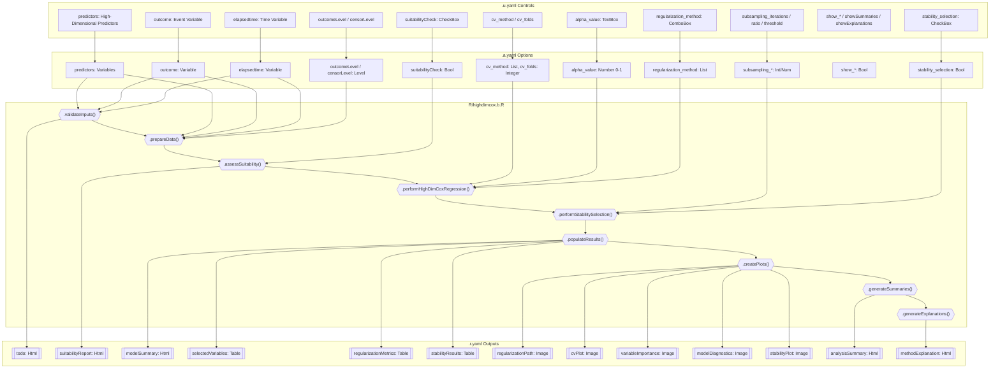

# highdimcox — High-Dimensional Cox Regression: Developer Documentation

## 1. Overview

- **Function**: `highdimcox`
- **Menu**: SurvivalT > Penalized Cox Regression > Elastic Net Cox
- **Files**:
  - `jamovi/highdimcox.u.yaml` — UI
  - `jamovi/highdimcox.a.yaml` — Options
  - `R/highdimcox.b.R` — Backend
  - `jamovi/highdimcox.r.yaml` — Results

**Summary**: Performs regularized Cox proportional hazards regression for survival data with many predictors (p close to or exceeding n). Supports four regularization strategies (LASSO, Ridge, Elastic Net, Adaptive LASSO), cross-validated lambda selection, optional stability selection via bootstrap subsampling, and comprehensive diagnostic visualizations. Designed for genomic, proteomic, and other high-throughput biomedical datasets.

---

## 1a. Changelog

- **Date**: 2026-03-12
- **Summary**: Full resync with current `.a.yaml`/`.b.R`/`.r.yaml` after major backend rewrite.
- **Changes**:
  - **Options removed** from docs: `variable_selection`, `bootstrap_iterations` (never existed in `.a.yaml`; renamed to `subsampling_iterations` and `subsampling_ratio`).
  - **Backend**: `.run()` rewritten to use `withCallingHandlers`/`warning()` pattern instead of `insert(999, Notice)`. Added `.clearAnalysisOutputs()`, `.assessSuitability()`, `.generateSuitabilityHtml()`. Removed `.performVariableScreening()` (not in current code).
  - **Results schema**: `dimensionalityReduction` table removed (not in `.r.yaml`). `suitabilityReport` (Html) added. `modelSummary` is Html (not Table). Column names in `selectedVariables` updated (`beta`→`coefficient`, `HR`→`hazard_ratio`).
  - **Diagrams**: Rebuilt to match actual code flow.

---

## 2. UI Controls → Options Map

| UI Control | Type | Label | Binds to Option | Default | Constraints | Visibility/Enable |
|---|---|---|---|---|---|---|
| `elapsedtime` | VariablesListBox | Time Variable | `elapsedtime` | — | maxItemCount: 1, numeric | always |
| `outcome` | VariablesListBox | Event Variable | `outcome` | — | maxItemCount: 1, factor/numeric | always |
| `predictors` | VariablesListBox | High-Dimensional Predictors | `predictors` | — | multiple, numeric/factor | always |
| `outcomeLevel` | ComboBox | Event Level | `outcomeLevel` | — | Level of `outcome` | always |
| `censorLevel` | ComboBox | Censored Level | `censorLevel` | — | Level of `outcome` | always |
| `suitabilityCheck` | CheckBox | Data Suitability Assessment | `suitabilityCheck` | `true` | — | CollapseBox: "Data Suitability" |
| `regularization_method` | ComboBox | Regularization Method | `regularization_method` | `elastic_net` | lasso, ridge, elastic_net, adaptive_lasso | CollapseBox: "Regularization Settings" |
| `alpha_value` | TextBox (number) | Elastic Net Alpha (0=Ridge, 1=LASSO) | `alpha_value` | `0.5` | min: 0, max: 1 | `enable: (regularization_method:elastic_net)` |
| `cv_method` | ComboBox | Cross-Validation Method | `cv_method` | `cv_1se` | cv_1se, cv_min | CollapseBox: "Regularization Settings" |
| `cv_folds` | TextBox (number) | Number of CV Folds | `cv_folds` | `10` | min: 3, max: 20 | CollapseBox: "Regularization Settings" |
| `stability_selection` | CheckBox | Perform Stability Selection | `stability_selection` | `false` | — | CollapseBox: "Stability Selection" |
| `subsampling_iterations` | TextBox (number) | Subsampling Iterations | `subsampling_iterations` | `500` | min: 100, max: 1000 | `enable: (stability_selection)` |
| `subsampling_ratio` | TextBox (number) | Subsampling Ratio (0.1–0.9) | `subsampling_ratio` | `0.5` | min: 0.1, max: 0.9 | `enable: (stability_selection)` |
| `stability_threshold` | TextBox (number) | Stability Threshold | `stability_threshold` | `0.8` | min: 0.5, max: 1.0 | `enable: (stability_selection)` |
| `show_regularization_path` | CheckBox | Show Regularization Path | `show_regularization_path` | `false` | — | CollapseBox: "Display Options" |
| `show_cv_plot` | CheckBox | Show Cross-Validation Plot | `show_cv_plot` | `false` | — | CollapseBox: "Display Options" |
| `show_variable_importance` | CheckBox | Show Variable Importance | `show_variable_importance` | `true` | — | CollapseBox: "Display Options" |
| `show_coefficients_table` | CheckBox | Show Coefficients Table | `show_coefficients_table` | `true` | — | CollapseBox: "Display Options" |
| `show_model_diagnostics` | CheckBox | Show Model Diagnostics | `show_model_diagnostics` | `false` | — | CollapseBox: "Display Options" |
| `showSummaries` | CheckBox | Analysis Summaries | `showSummaries` | `false` | — | CollapseBox: "Display Options" |
| `showExplanations` | CheckBox | Method Explanations | `showExplanations` | `false` | — | CollapseBox: "Display Options" |

---

## 3. Options Reference (.a.yaml)

| Name | Type | Default | Description | Downstream Effects |
|---|---|---|---|---|
| `data` | Data | — | The data frame | Used throughout |
| `elapsedtime` | Variable | — | Survival time (numeric) | `.prepareData()`: extracts time vector |
| `outcome` | Variable | — | Event indicator (factor/numeric) | `.prepareData()`: encodes as 0/1 via level matching |
| `predictors` | Variables | — | High-dimensional predictors (numeric/factor) | `.prepareData()`: builds predictor matrix, dummy-encodes factors |
| `outcomeLevel` | Level | — | Level indicating event occurred | `.prepareData()`: maps to 1 in binary event vector |
| `censorLevel` | Level | — | Level indicating censored | `.prepareData()`: maps to 0 in binary event vector |
| `regularization_method` | List | `elastic_net` | Regularization strategy | `.performHighDimCoxRegression()`: sets alpha (lasso→1, ridge→0, adaptive_lasso→1+weights) |
| `alpha_value` | Number | `0.5` | Elastic net mixing (0=ridge, 1=lasso) | Used only when `regularization_method == "elastic_net"` |
| `cv_method` | List | `cv_1se` | Lambda selection rule | `cv_min` → `lambda.min`; `cv_1se` → `lambda.1se` |
| `cv_folds` | Integer | `10` | K-fold CV count | `glmnet::cv.glmnet(nfolds=...)` |
| `stability_selection` | Bool | `false` | Enable bootstrap stability selection | Gates `.performStabilitySelection()`, stability table/plot |
| `subsampling_iterations` | Integer | `500` | Bootstrap iterations | Loop count in `.performStabilitySelection()` |
| `subsampling_ratio` | Number | `0.5` | Subsample proportion | `floor(n_obs * ratio)` per iteration |
| `stability_threshold` | Number | `0.8` | Stability probability cutoff | Variables with prob ≥ threshold flagged as "stable" |
| `show_regularization_path` | Bool | `false` | Show coefficient path plot | Gates `.createRegularizationPath()` and `regularizationPath` Image |
| `show_cv_plot` | Bool | `false` | Show CV error plot | Gates `.createCVPlot()` and `cvPlot` Image |
| `show_variable_importance` | Bool | `true` | Show importance plot | Gates `.createVariableImportancePlot()` and `variableImportance` Image |
| `show_coefficients_table` | Bool | `true` | Show selected variables table | Gates `.populateVariablesTable()` and `selectedVariables` Table |
| `show_model_diagnostics` | Bool | `false` | Show diagnostic plots | Gates `.createModelDiagnostics()` and `modelDiagnostics` Image |
| `showSummaries` | Bool | `false` | Show natural language summary | Gates `.generateSummaries()` and `analysisSummary` Html |
| `showExplanations` | Bool | `false` | Show methodology text | Gates `.generateExplanations()` and `methodExplanation` Html |
| `suitabilityCheck` | Bool | `true` | Run data suitability assessment | Gates `.assessSuitability()` and `suitabilityReport` Html |

---

## 4. Backend Usage (.b.R)

### Private Fields (Model Storage)

| Field | Purpose |
|---|---|
| `.glmnet_model` | Stored glmnet model object (unused in current code — results passed via lists) |
| `.cv_results` | Stored CV results (unused — passed via lists) |
| `.selected_lambda` | Selected lambda (unused — passed via lists) |
| `.selected_variables` | Selected variable indices (unused — passed via lists) |
| `.stability_results` | Stability results (unused — passed via lists) |
| `.variable_importance` | Variable importance (unused — passed via lists) |
| `.screening_results` | Screening results (unused — passed via lists) |
| `.var_display_names` | Active: maps model.matrix column names → user-friendly display names |

### Constants

| Constant | Value | Purpose |
|---|---|---|
| `DEFAULT_CV_FOLDS` | 10 | Fallback CV fold count |
| `DEFAULT_ALPHA` | 0.5 | Fallback elastic net alpha |
| `DEFAULT_SUBSAMPLING_ITERATIONS` | 500 | Fallback stability iterations |
| `DEFAULT_STABILITY_THRESHOLD` | 0.8 | Fallback stability threshold |
| `MIN_OBSERVATIONS` | 30 | Minimum n for analysis |

### Method-by-Method Reference

#### `.init()`
- Sets `todo` HTML with introductory instructions
- Early returns if no data or validation fails
- Calls `.initializeResultTables()` (currently a no-op)

#### `.run()`
- **Validation**: `.validateInputs()` → error HTML in `todo` on failure
- **Package check**: verifies `glmnet` and `survival` are installed
- **Warning collection**: `withCallingHandlers` + `tryCatch` pattern collects all `warning()` calls into `collected_warnings` vector
- **Pipeline**: `.prepareData()` → `.assessSuitability()` (if enabled) → `.performHighDimCoxRegression()` → `.performStabilitySelection()` (if enabled) → `.populateResults()` → `.createPlots()` → `.generateSummaries()` (if enabled) → `.generateExplanations()` (if enabled)
- **Error handling**: on error, calls `.clearAnalysisOutputs()` and displays error in `todo` HTML
- **Success**: displays success message with counts and warnings in `todo` HTML

#### `.validateInputs()`
- Checks: `elapsedtime` not null/empty, `outcome` not null/empty, `predictors` has ≥1 element
- Checks: `nrow(data) >= MIN_OBSERVATIONS` (30)
- Checks: `outcomeLevel` and `censorLevel` are set, distinct, and have matching rows in data
- Returns `list(valid, message)`

#### `.prepareData()`
- Extracts time (must be numeric), encodes event as 0/1 via level matching
- Rows not matching either level → `NA` → excluded
- **Complete-case filter BEFORE `model.matrix()`** (critical: avoids row-drop mismatch)
- Factor predictors → dummy encoding via `model.matrix(~ . - 1, data = pred_data)`
- Removes constant (zero-variance) columns from predictor matrix
- Builds display name mapping (`make.names(pv)` prefix matching for dummy variables)
- Returns list with: `survival`, `predictors`, `time`, `event`, `n_obs`, `n_vars`, `var_names`, `n_excluded_outcome`, `n_na_outcome`, `n_constant_removed`

#### `.performHighDimCoxRegression(data_prep)`
- Sets `alpha` based on `regularization_method`:
  - `lasso` → 1.0
  - `ridge` → 0.0
  - `adaptive_lasso` → 1.0 + adaptive penalty weights from initial Ridge fit
  - `elastic_net` → user's `alpha_value`
- Runs `glmnet::cv.glmnet(family="cox", alpha, penalty.factor, nfolds, standardize=TRUE)`
- Lambda selection: `cv_min` → `lambda.min`, otherwise → `lambda.1se`
- Fits full `glmnet::glmnet()` path, extracts coefficients at selected lambda
- Calculates concordance via `survival::concordance(y ~ risk_scores, reverse=TRUE)`
- Returns list: `cv_fit`, `final_fit`, `selected_lambda`, `coefficients`, `selected_variables`, `variable_importance`, `alpha`, `n_selected`, `concordance`

#### `.performStabilitySelection(data_prep)`
- Uses fixed lambda from full-data CV (Meinshausen & Buhlmann 2010)
- Ridge method bumped to `alpha=0.5` (ridge has no selection)
- Subsamples `floor(n * subsampling_ratio)` observations without replacement
- Fits `glmnet::glmnet()` (not cv.glmnet — faster) per iteration at fixed lambda
- Computes selection probabilities from successful iterations
- Returns list: `selection_probabilities`, `stable_variables`, `stability_threshold`, `n_bootstrap`, `n_successful`, `n_stable`, `alpha_used`

#### `.clearAnalysisOutputs()`
- Deletes rows from `selectedVariables`, `regularizationMetrics`, `stabilityResults` tables

#### `.populateResults(model_results, data_prep, stability_results)`
- Delegates to: `.populateModelSummary()`, `.populateVariablesTable()`, `.populateRegularizationMetrics()`, `.populateStabilityResults()`

#### `.populateModelSummary(model_results, data_prep)`
- Writes HTML to `modelSummary` with regularization method, alpha, lambda, variable counts, C-index

#### `.populateVariablesTable(model_results, data_prep)`
- Writes rows to `selectedVariables` table: variable name, coefficient, hazard ratio, importance score
- Adds notes for empty selection or ridge (all retained)

#### `.populateRegularizationMetrics(model_results)`
- Writes 7 metric rows to `regularizationMetrics` table: selected lambda, lambda.min, lambda.1se, CV deviance, training C-index, n_selected, method description

#### `.populateStabilityResults(stability_results, data_prep)`
- Writes rows to `stabilityResults` table: stable variables first, then top 5 unstable for comparison
- Columns: variable, selection_probability, stable (Yes/No), importance_rank

#### `.assessSuitability(data_prep)`
- 6 checks with traffic-light colors (green/yellow/red):
  1. Events-Per-Variable (EPV)
  2. Regularization Need (p/n ratio)
  3. Sample Size
  4. Event Rate
  5. Multicollinearity (pairwise correlation, skipped if p > 2000)
  6. Data Quality (missing data, constant predictors)
- Calls `.generateSuitabilityHtml()` to render styled HTML table in `suitabilityReport`

#### Plot Creation Methods

All follow the same pattern: extract plain numeric/character vectors, store in `image$setState()`, wrapped in `tryCatch`.

| Method | Image Output | State Contents |
|---|---|---|
| `.createRegularizationPath()` | `regularizationPath` | Long-format data.frame (log_lambda, coefficient, variable) + attrs: lambda_min, lambda_1se, selected_lambda |
| `.createCVPlot()` | `cvPlot` | data.frame (lambda, cvm, cvsd, cvup, cvlo) + attrs: lambda_min, lambda_1se, selected_lambda |
| `.createVariableImportancePlot()` | `variableImportance` | data.frame (var_names, importance) + attr: selected_vars |
| `.createModelDiagnostics()` | `modelDiagnostics` | data.frame (n_selected, concordance) + attrs: selected_vars, coefficients, hazard_ratios |
| `.createStabilityPlot()` | `stabilityPlot` | data.frame (var_names, selection_frequencies) + attr: threshold |

#### Render Functions (called by jamovi Image framework)

| Render Function | Image | Description |
|---|---|---|
| `.plot_regularization_path()` | `regularizationPath` | ggplot2 line chart of coefficient paths vs log(lambda) with vertical lines at lambda.min and lambda.1se |
| `.plot_cv()` | `cvPlot` | ggplot2 ribbon + line chart of CV deviance vs log(lambda) |
| `.plot_variable_importance()` | `variableImportance` | ggplot2 horizontal bar chart of top 25 variables by absolute coefficient, colored by selected/not |
| `.plot_model_diagnostics()` | `modelDiagnostics` | ggplot2 forest-style plot of selected variables (coefficient ± proxy CI, hazard ratios) |
| `.plot_stability()` | `stabilityPlot` | ggplot2 horizontal bar chart of selection frequencies with threshold line |

#### `.generateSummaries(model_results, stability_results)`
- Writes natural language HTML to `analysisSummary`: method, lambda, variable counts, C-index, stability results (if available)

#### `.generateExplanations()`
- Writes static methodology HTML to `methodExplanation`: overview, 4 regularization methods, CV, stability selection, clinical interpretation

---

## 5. Results Definition (.r.yaml)

### HTML Items

| Name | Title | Visibility | Population Method |
|---|---|---|---|
| `todo` | Analysis | always (cleared on success) | `.init()`, `.run()` |
| `suitabilityReport` | Data Suitability Assessment | `(suitabilityCheck)` | `.assessSuitability()` → `.generateSuitabilityHtml()` |
| `modelSummary` | Model Summary | always | `.populateModelSummary()` |
| `analysisSummary` | Analysis Summary | `(showSummaries)` | `.generateSummaries()` |
| `methodExplanation` | Methodology | `(showExplanations)` | `.generateExplanations()` |

### Tables

| Name | Title | Visibility | Columns | Population Method |
|---|---|---|---|---|
| `selectedVariables` | Selected Variables | `(show_coefficients_table)` | `variable` (text), `coefficient` (number), `hazard_ratio` (number), `importance_score` (number) | `.populateVariablesTable()` |
| `regularizationMetrics` | Regularization Metrics | always | `metric` (text), `value` (text), `interpretation` (text) | `.populateRegularizationMetrics()` |
| `stabilityResults` | Stability Selection Results | `(stability_selection)` | `variable` (text), `selection_probability` (number), `stable` (text), `importance_rank` (integer) | `.populateStabilityResults()` |

### Images (Plots)

| Name | Title | Size | Visibility | renderFun |
|---|---|---|---|---|
| `regularizationPath` | Regularization Path | 600×500 | `(show_regularization_path)` | `.plot_regularization_path` |
| `cvPlot` | Cross-Validation Plot | 500×400 | `(show_cv_plot)` | `.plot_cv` |
| `variableImportance` | Variable Importance Plot | 500×400 | `(show_variable_importance)` | `.plot_variable_importance` |
| `modelDiagnostics` | Model Diagnostics | 600×500 | `(show_model_diagnostics)` | `.plot_model_diagnostics` |
| `stabilityPlot` | Stability Selection Plot | 500×400 | `(stability_selection)` | `.plot_stability` |

---

## 6. Data Flow Diagram



---

## 7. Execution Sequence

### Step-by-step flow

1. **User assigns variables** in UI → `.a.yaml` options updated
2. **`.init()`** runs: sets introductory `todo` HTML, validates inputs, calls `.initializeResultTables()`
3. **`.run()`** begins:
   a. `.validateInputs()` — if invalid, shows error in `todo` and returns
   b. Package availability check — if missing, shows error in `todo` and returns
   c. Clears `todo`, sets up warning collection via `withCallingHandlers`
4. **`.prepareData()`**: extracts time/event/predictors, encodes event, complete-case filter, dummy encoding, removes constant columns, builds display name mapping
5. **`.assessSuitability()`** (if `suitabilityCheck`): 6 checks → traffic-light HTML in `suitabilityReport`
6. **`.performHighDimCoxRegression()`**: sets alpha/weights, `cv.glmnet()`, selects lambda, `glmnet()` full path, extracts coefficients, calculates C-index
7. **`.performStabilitySelection()`** (if `stability_selection`): fixed-lambda bootstrap, selection probabilities
8. **`.populateResults()`**: fills `modelSummary`, `selectedVariables`, `regularizationMetrics`, `stabilityResults`
9. **`.createPlots()`**: fills `regularizationPath`, `cvPlot`, `variableImportance`, `modelDiagnostics`, `stabilityPlot`
10. **`.generateSummaries()`** (if `showSummaries`): natural language HTML in `analysisSummary`
11. **`.generateExplanations()`** (if `showExplanations`): static methodology HTML in `methodExplanation`
12. **Success/warning display**: collected warnings shown in `todo` HTML alongside success message

### Error handling flow

```
Any error in steps 4-11
  → tryCatch catches it
  → .clearAnalysisOutputs() deletes table rows
  → Error message displayed in todo HTML
  → Analysis stops gracefully
```

### Option → Output dependency

```mermaid
graph TD
  suitabilityCheck --> suitabilityReport
  regularization_method --> modelSummary
  regularization_method --> selectedVariables
  regularization_method --> regularizationMetrics
  alpha_value --> modelSummary
  alpha_value --> selectedVariables
  cv_method --> regularizationMetrics
  cv_folds --> regularizationMetrics
  stability_selection --> stabilityResults
  stability_selection --> stabilityPlot
  subsampling_iterations --> stabilityResults
  subsampling_ratio --> stabilityResults
  stability_threshold --> stabilityResults
  show_regularization_path --> regularizationPath
  show_cv_plot --> cvPlot
  show_variable_importance --> variableImportance
  show_coefficients_table --> selectedVariables
  show_model_diagnostics --> modelDiagnostics
  showSummaries --> analysisSummary
  showExplanations --> methodExplanation
```



---

## 8. Change Impact Guide

| Option Changed | What Recalculates | Performance Impact | Common Pitfalls |
|---|---|---|---|
| `elapsedtime` / `outcome` / `predictors` | Everything | Full recompute | Factor predictors get dummy-encoded; constant columns removed |
| `outcomeLevel` / `censorLevel` | Event encoding → everything | Full recompute | Must be distinct; rows matching neither level are excluded |
| `regularization_method` | Alpha, penalty weights, model fit, all outputs | Full recompute | Ridge retains all variables (no selection); adaptive_lasso runs an extra Ridge CV for weights |
| `alpha_value` | Model fit (elastic_net only) | Full recompute | Only active when `regularization_method == "elastic_net"` |
| `cv_method` | Lambda selection only | Minimal | `cv_min` typically selects more variables than `cv_1se` |
| `cv_folds` | CV fit | Moderate | Reduce to 5 for small samples; max 20 |
| `stability_selection` | Stability analysis | Heavy (500 iterations) | Very slow for large n×p; reduce `subsampling_iterations` for exploration |
| `subsampling_iterations` | Stability loop count | Linear | More iterations = more stable probabilities but slower |
| `subsampling_ratio` | Subsample size | Moderate | Lower ratio = smaller subsamples = noisier but faster |
| `stability_threshold` | "Stable" flag only | Negligible | Does not re-run bootstrap; just re-classifies |
| `show_*` options | Plot/table visibility | Negligible | Plots are created regardless; visibility just toggles display |
| `showSummaries` / `showExplanations` | HTML generation | Negligible | Light text generation |
| `suitabilityCheck` | Suitability report | Light (correlation matrix for p≤2000) | Skips collinearity check when p > 2000 |

---

## 9. Example Usage

### Dataset requirements

- Time variable: positive numeric (survival/follow-up time)
- Event variable: factor or numeric with at least 2 levels (one for event, one for censored)
- Predictors: numeric or factor columns; at minimum 1, typically 10-1000+
- Minimum 30 observations with complete data

### Example payload

```r
highdimcox(
  data = highdimcox_genomic,
  elapsedtime = "survival_months",
  outcome = "vital_status",
  outcomeLevel = "Dead",
  censorLevel = "Alive",
  predictors = paste0("GENE_", sprintf("%03d", 1:100)),
  regularization_method = "elastic_net",
  alpha_value = 0.5,
  cv_method = "cv_1se",
  cv_folds = 10,
  stability_selection = TRUE,
  subsampling_iterations = 200,
  subsampling_ratio = 0.5,
  stability_threshold = 0.8,
  suitabilityCheck = TRUE,
  show_regularization_path = TRUE,
  show_cv_plot = TRUE,
  show_variable_importance = TRUE,
  show_coefficients_table = TRUE,
  show_model_diagnostics = TRUE,
  showSummaries = TRUE,
  showExplanations = TRUE
)
```

### Expected outputs

- `todo`: success banner with counts (e.g., "150 observations, 75 events, 100 predictors, 12 selected via elastic_net (C-index=0.734)")
- `suitabilityReport`: traffic-light table with 6 checks
- `modelSummary`: HTML with method, alpha, lambda, variable counts
- `selectedVariables`: table with 12 rows (variable, coefficient, HR, importance)
- `regularizationMetrics`: 7-row table with lambda values, C-index, etc.
- `stabilityResults`: table with stable + top unstable variables
- 5 plots: regularization path, CV curve, variable importance bars, model diagnostics, stability bars
- `analysisSummary`: narrative text
- `methodExplanation`: methodology reference

---

## 10. Appendix

### R6 Class Hierarchy

```
jmvcore::Analysis
  └── highdimcoxBase  (auto-generated from YAML in highdimcox.h.R)
        └── highdimcoxClass  (R/highdimcox.b.R)
              Private methods:
              - .init()
              - .run()
              - .validateInputs()
              - .prepareData()
              - .performHighDimCoxRegression()
              - .performStabilitySelection()
              - .clearAnalysisOutputs()
              - .initializeResultTables()
              - .populateResults()
              - .populateModelSummary()
              - .populateVariablesTable()
              - .populateRegularizationMetrics()
              - .populateStabilityResults()
              - .createPlots()
              - .createRegularizationPath()
              - .createCVPlot()
              - .createVariableImportancePlot()
              - .createModelDiagnostics()
              - .createStabilityPlot()
              - .generateSummaries()
              - .generateExplanations()
              - .assessSuitability()
              - .generateSuitabilityHtml()
              - .plot_regularization_path()  (renderFun)
              - .plot_cv()                   (renderFun)
              - .plot_variable_importance()  (renderFun)
              - .plot_model_diagnostics()    (renderFun)
              - .plot_stability()            (renderFun)
```

### Dependencies

| Package | Purpose |
|---|---|
| `survival` | `Surv()`, `concordance()` |
| `glmnet` | `cv.glmnet()`, `glmnet()` for regularized Cox |
| `jmvcore` | jamovi framework (R6 base, options, results) |
| `R6` | R6 class system |
| `ggplot2` | All plot rendering (loaded at render time) |

### File Locations

| File | Purpose |
|---|---|
| `jamovi/highdimcox.a.yaml` | Analysis definition |
| `jamovi/highdimcox.u.yaml` | UI definition |
| `jamovi/highdimcox.r.yaml` | Results definition |
| `R/highdimcox.h.R` | Auto-generated header |
| `R/highdimcox.b.R` | Backend implementation |
| `data/highdimcox_genomic.rda` | Genomic test dataset |
| `data/highdimcox_proteomic.rda` | Proteomic test dataset |
| `data-raw/create_highdimcox_test_data.R` | Test data generation |
| `tests/testthat/test-highdimcox-*.R` | Test files (4 files, 68 tests) |
| `inst/examples/highdimcox_example.R` | Example usage |
