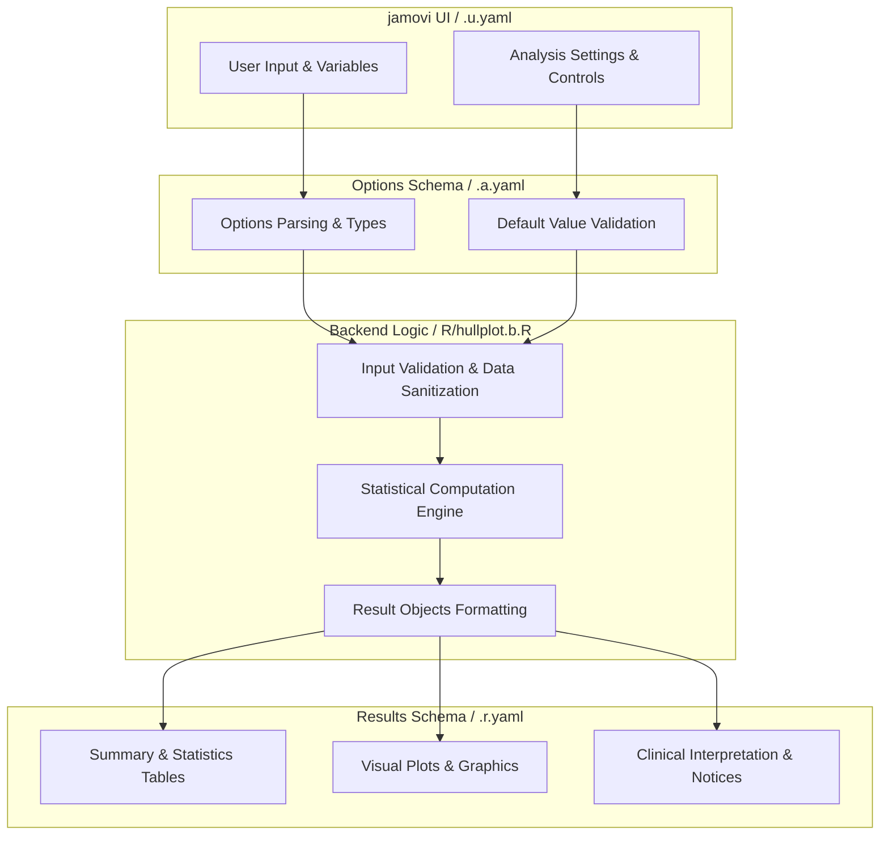
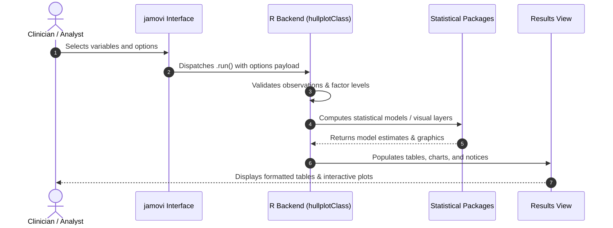

# Hull Plot - Developer Documentation

## 1. Overview

- **Function**: `hullplot`
- **Title**: Hull Plot
- **Module**: `JJStatsPlotT`
- **Files**:
  - `jamovi/hullplot.u.yaml` - User Interface Definition
  - `jamovi/hullplot.a.yaml` - Options & Schema Definition
  - `jamovi/hullplot.r.yaml` - Results Layout & Tables
  - `R/hullplot.b.R` - Backend Implementation
- **Summary**: Creates Hull plots to visualize clusters and groups in scatter plots using ggforce. Hull plots draw polygonal boundaries around data points grouped by categorical variables, making it easy to identify customer segments, group membership, and data clusters. Based on the geom_mark_hull() function from ggforce package.

## 1a. Changelog

- **Date**: 2026-08-29
- **Summary**: Comprehensive documentation suite created & verified against active schemas and backend implementation.

## 2. Options Reference (`.a.yaml`)

| Option | Type | Default | Description |
| :--- | :--- | :--- | :--- |
| `data` | `Data` | `NULL` |  |
| `x_var` | `Variable` | `NULL` | X-Axis Variable |
| `y_var` | `Variable` | `NULL` | Y-Axis Variable |
| `group_var` | `Variable` | `NULL` | Grouping Variable |
| `color_var` | `Variable` | `NULL` | Color Variable (Optional) |
| `size_var` | `Variable` | `NULL` | Size Variable (Optional) |
| `hull_concavity` | `Number` | `2` | Hull Concavity |
| `hull_alpha` | `Number` | `0.3` | Hull Transparency |
| `show_labels` | `Bool` | `TRUE` | Group labels |
| `point_size` | `Number` | `2` | Point Size |
| `point_alpha` | `Number` | `0.7` | Point Transparency |
| `color_palette` | `List` | `default` | Color Palette |
| `plot_theme` | `List` | `minimal` | Plot Theme |
| `plot_title` | `String` | `Hull Plot - Group Visualization` | Plot Title |
| `x_label` | `String` | `` | X-Axis Label |
| `y_label` | `String` | `` | Y-Axis Label |
| `hull_expand` | `Number` | `0.05` | Hull Boundary Expansion |
| `show_statistics` | `Bool` | `FALSE` | Group statistics |
| `outlier_detection` | `Bool` | `FALSE` | Outlier detection |
| `confidence_ellipses` | `Bool` | `FALSE` | Add confidence ellipses |
| `show_summary` | `Bool` | `FALSE` | Natural language summary |
| `show_assumptions` | `Bool` | `FALSE` | Assumptions & guidelines |

## 3. Results Definition (`.r.yaml`)

| Output ID | Type | Title | Description |
| :--- | :--- | :--- | :--- |
| `todo` | `Html` | `Instructions` |  |
| `plot` | `Image` | `Hull Plot` |  |
| `statistics` | `Html` | `Group Statistics` |  |
| `outliers` | `Html` | `Outlier Analysis` |  |
| `interpretation` | `Html` | `Interpretation Guide` |  |
| `summary` | `Html` | `Natural Language Summary` |  |
| `assumptions` | `Html` | `Assumptions & Guidelines` |  |

## 4. Architecture & Data Flow Diagram

## 5. Execution Sequence

## 6. Change Impact & Safety Guidelines

- **Data Filtering**: Ensure observations with missing values are handled gracefully according to analysis options.
- **Formula Conflicts**: Use isolated environment calls or base formula methods when interacting with `ggstatsplot` or formula parsers.
- **Safe Deparsing**: Use `deparse(val)` in syntax generation (`asSource()`) to escape column names with spaces or special symbols.

