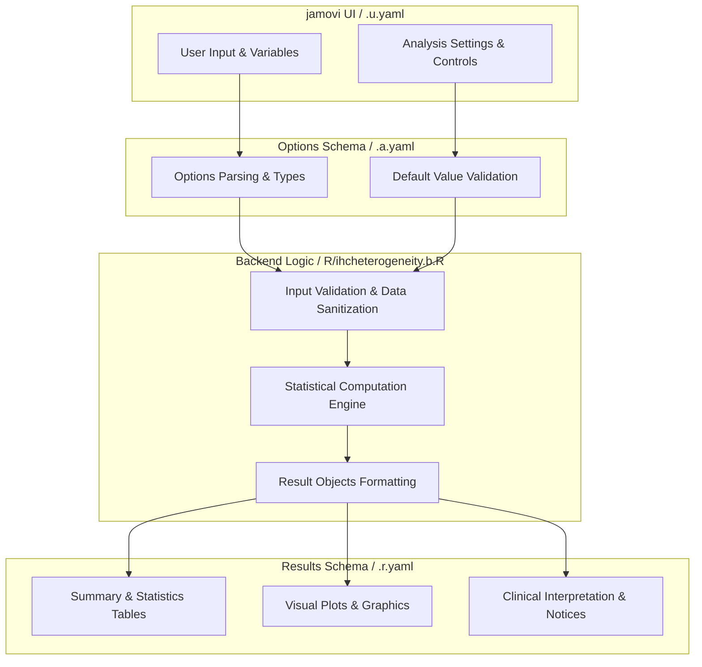
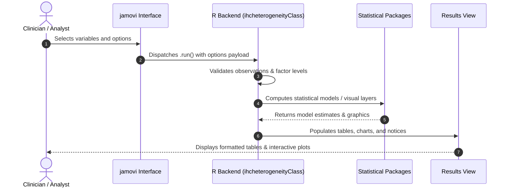

# IHC Heterogeneity Analysis - Developer Documentation

## 1. Overview

- **Function**: `ihcheterogeneity`
- **Title**: IHC Heterogeneity Analysis
- **Module**: `OncoPath`
- **Files**:
  - `jamovi/ihcheterogeneity.u.yaml` - User Interface Definition
  - `jamovi/ihcheterogeneity.a.yaml` - Options & Schema Definition
  - `jamovi/ihcheterogeneity.r.yaml` - Results Layout & Tables
  - `R/ihcheterogeneity.b.R` - Backend Implementation
- **Summary**: Analysis for IHC Heterogeneity Analysis

## 1a. Changelog

- **Date**: 2026-08-29
- **Summary**: Comprehensive documentation suite created & verified against active schemas and backend implementation.

## 2. Options Reference (`.a.yaml`)

| Option | Type | Default | Description |
| :--- | :--- | :--- | :--- |
| `data` | `Data` | `NULL` |  |
| `wholesection` | `Variable` | `NULL` | Overall / Whole Slide / HotSpot (Optional) |
| `biopsy1` | `Variable` | `NULL` | Regional Measurement 1 (Required) |
| `biopsy2` | `Variable` | `NULL` | Regional Measurement 2 (Optional) |
| `biopsy3` | `Variable` | `NULL` | Regional Measurement 3 (Optional) |
| `biopsy4` | `Variable` | `NULL` | Regional Measurement 4 (Optional) |
| `biopsies` | `Variables` | `NULL` | Additional Regional Measurements |
| `spatial_id` | `Variable` | `NULL` | Spatial Region ID (Optional) |
| `compareCompartments` | `Bool` | `FALSE` | Spatial compartment comparison |
| `compartmentTests` | `Bool` | `FALSE` | Compartment comparison tests |
| `analysis_type` | `List` | `comprehensive` | Analysis Focus |
| `sampling_strategy` | `List` | `unknown` | Sampling Strategy |
| `cv_threshold` | `Number` | `20` | CV Threshold for Acceptable Variability |
| `correlation_threshold` | `Number` | `0.8` | Minimum Acceptable Correlation |
| `show_variability_plots` | `Bool` | `FALSE` | Variability plots |
| `variance_components` | `Bool` | `FALSE` | Variance component analysis |
| `power_analysis` | `Bool` | `FALSE` | Power analysis |
| `generate_recommendations` | `Bool` | `FALSE` | Clinical recommendations |
| `showSummary` | `Bool` | `FALSE` | Plain-language summary |
| `showGlossary` | `Bool` | `FALSE` | Statistical glossary |
| `showReportSentences` | `Bool` | `FALSE` | Copy-ready report sentences |
| `showAssumptions` | `Bool` | `FALSE` | Methodology & assumptions |

## 3. Results Definition (`.r.yaml`)

| Output ID | Type | Title | Description |
| :--- | :--- | :--- | :--- |
| `welcome` | `Html` | `` | Welcome screen shown when no variables selected |
| `interpretation` | `Html` | `Clinical Interpretation and Analysis Summary` |  |
| `report_sentences` | `Html` | `Copy-Ready Report Sentences` | Pre-formatted sentences ready for clinical reports and publications |
| `assumptions` | `Html` | `Methodology & Assumptions` | Analysis assumptions, data requirements, and methodological considerations |
| `summary` | `Html` | `Summary (Plain-Language)` | Natural-language summary of heterogeneity analysis results |
| `glossary` | `Html` | `Statistical Glossary` | Definitions of key statistical terms used in the analysis |
| `reproducibilitytable` | `Table` | `Reproducibility Assessment` | Correlation and reliability metrics |
| `samplingbiastable` | `Table` | `Sampling Bias Analysis` | Systematic bias assessment between methods |
| `variancetable` | `Table` | `Variance Component Analysis` | Sources of measurement variability |
| `poweranalysistable` | `Table` | `Power Analysis Results` | Sample size recommendations and power calculations |
| `spatialanalysistable` | `Table` | `Spatial Heterogeneity Analysis` | Variability across spatial regions |
| `compartmentComparison` | `Table` | `Compartment Heterogeneity Comparison` | Statistical comparison of heterogeneity metrics between compartments |
| `compartmentTests` | `Table` | `Statistical Tests for Compartment Differences` | Formal statistical tests comparing heterogeneity across compartments |
| `biopsyplot` | `Image` | `Regional Measurements Comparison` | Distribution comparison across regional measurements and reference (if provided) |
| `variabilityplot` | `Image` | `Sampling Variability Analysis` | Coefficient of variation by case |
| `spatialplot` | `Image` | `Spatial Heterogeneity Visualization` | Spatial distribution of biomarker values |

## 4. Architecture & Data Flow Diagram

## 5. Execution Sequence

## 6. Change Impact & Safety Guidelines

- **Data Filtering**: Ensure observations with missing values are handled gracefully according to analysis options.
- **Formula Conflicts**: Use isolated environment calls or base formula methods when interacting with `ggstatsplot` or formula parsers.
- **Safe Deparsing**: Use `deparse(val)` in syntax generation (`asSource()`) to escape column names with spaces or special symbols.

