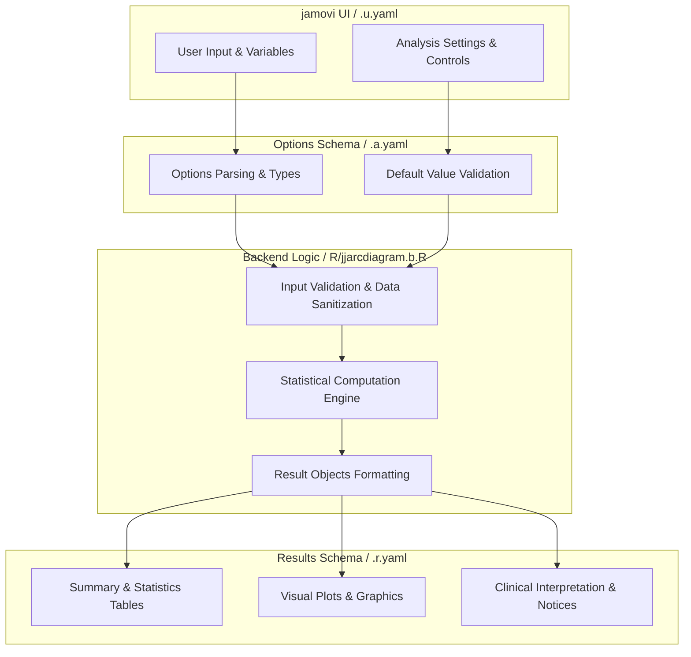
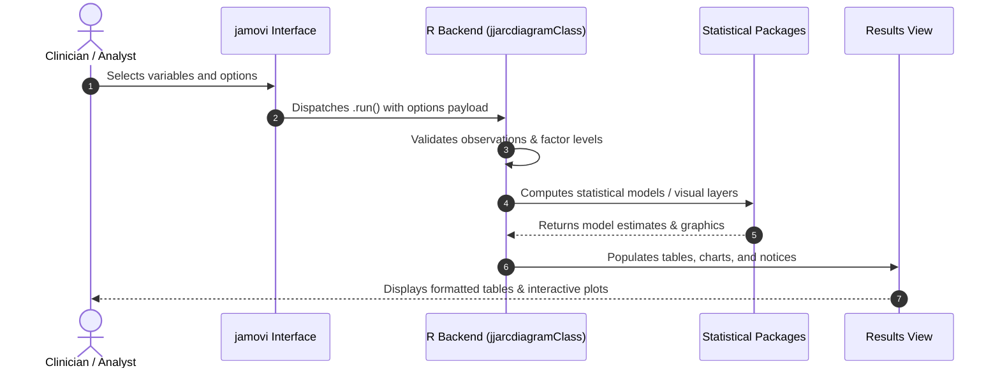

# Arc Diagram - Developer Documentation

## 1. Overview

- **Function**: `jjarcdiagram`
- **Title**: Arc Diagram
- **Module**: `JJStatsPlotT`
- **Files**:
  - `jamovi/jjarcdiagram.u.yaml` - User Interface Definition
  - `jamovi/jjarcdiagram.a.yaml` - Options & Schema Definition
  - `jamovi/jjarcdiagram.r.yaml` - Results Layout & Tables
  - `R/jjarcdiagram.b.R` - Backend Implementation
- **Summary**: 'Creates arc diagrams for network visualization using the arcdiagram package.'

## 1a. Changelog

- **Date**: 2026-08-29
- **Summary**: Comprehensive documentation suite created & verified against active schemas and backend implementation.

## 2. Options Reference (`.a.yaml`)

| Option | Type | Default | Description |
| :--- | :--- | :--- | :--- |
| `data` | `Data` | `NULL` |  |
| `source` | `Variable` | `NULL` | Source Node (From) |
| `target` | `Variable` | `NULL` | Target Node (To) |
| `weight` | `Variable` | `NULL` | Edge Weight (Strength) |
| `group` | `Variable` | `NULL` | Node Categories (Color Coding) |
| `analysisPreset` | `List` | `custom` | Analysis Type |
| `showNodes` | `Bool` | `FALSE` | Nodes |
| `nodeSize` | `List` | `fixed` | Node Size |
| `nodeSizeValue` | `Number` | `2` | Fixed Node Size |
| `sortNodes` | `List` | `none` | Sort Nodes |
| `sortDecreasing` | `Bool` | `FALSE` | Sort decreasing |
| `horizontal` | `Bool` | `FALSE` | Horizontal layout |
| `arcWidth` | `List` | `fixed` | Arc Width |
| `arcWidthValue` | `Number` | `1` | Fixed Arc Width |
| `arcTransparency` | `Number` | `0.5` | Arc Transparency |
| `directed` | `Bool` | `FALSE` | Directed network |
| `aggregateEdges` | `Bool` | `TRUE` | Aggregate duplicate edges |
| `weightMode` | `List` | `strength` | Edge Weight Interpretation |
| `arcColorMode` | `List` | `source` | Arc Coloring (for Groups) |
| `colorByGroup` | `Bool` | `FALSE` | Color nodes by group |
| `showStats` | `Bool` | `FALSE` | Network statistics |
| `showLegend` | `Bool` | `FALSE` | Legend |
| `labelSize` | `Number` | `0.8` | Label Size |
| `plotTitle` | `String` | `` | Plot Title |
| `showSummary` | `Bool` | `TRUE` | Copy-ready summary |
| `showAssumptions` | `Bool` | `TRUE` | Assumptions & guidelines |
| `showGlossary` | `Bool` | `FALSE` | Glossary |

## 3. Results Definition (`.r.yaml`)

| Output ID | Type | Title | Description |
| :--- | :--- | :--- | :--- |
| `notices` | `Preformatted` | `Important Information` |  |
| `instructions` | `Html` | `Instructions` |  |
| `todo` | `Html` | `Status` |  |
| `plot` | `Image` | `Arc Diagram` |  |
| `networkStats` | `Html` | `Network Statistics` |  |
| `assumptions` | `Html` | `Analysis Assumptions & Guidelines` |  |
| `reportSentence` | `Html` | `Copy-Ready Summary` |  |
| `glossary` | `Html` | `Network Analysis Glossary` |  |

## 4. Architecture & Data Flow Diagram

## 5. Execution Sequence

## 6. Change Impact & Safety Guidelines

- **Data Filtering**: Ensure observations with missing values are handled gracefully according to analysis options.
- **Formula Conflicts**: Use isolated environment calls or base formula methods when interacting with `ggstatsplot` or formula parsers.
- **Safe Deparsing**: Use `deparse(val)` in syntax generation (`asSource()`) to escape column names with spaces or special symbols.

