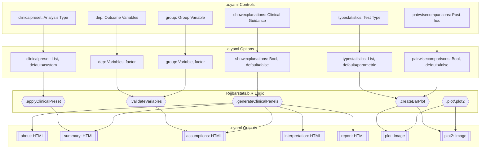
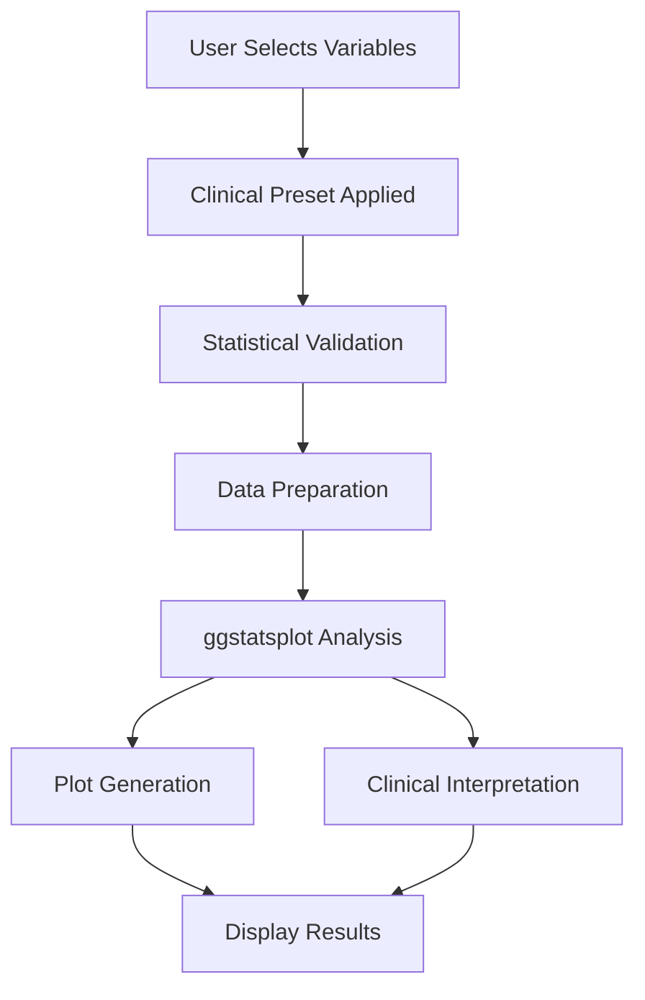

# jjbarstats Function Documentation

## 1. Overview

- **Function**: `jjbarstats`
- **Files**:
  - `jamovi/jjbarstats.u.yaml` — UI
  - `jamovi/jjbarstats.a.yaml` — Options
  - `R/jjbarstats.b.R` — Backend
  - `jamovi/jjbarstats.r.yaml` — Results

**Summary**: A comprehensive wrapper for `ggstatsplot::ggbarstats` and `ggstatsplot::grouped_ggbarstats` that generates statistical bar charts with clinical interpretation features. The function compares categorical variables across groups using various statistical tests (chi-square, McNemar's, Bayesian) with optional pairwise comparisons, while providing clinical context through preset configurations and interpretative panels.

## 2. UI Controls → Options Map

| UI Control | Type | Label | Binds to Option | Default | Constraints | Visibility/Enable |
|------------|------|-------|----------------|---------|-------------|-------------------|
| `clinicalpreset` | ComboBox | Analysis Type | `clinicalpreset` | custom | 5 preset options | Always visible |
| `showexplanations` | CheckBox | Show Clinical Guidance | `showexplanations` | false | Boolean | Always visible |
| `dep` | VariablesListBox | Outcome Variable | `dep` | NULL | Factor variables | Always visible |
| `group` | VariablesListBox | Group Variable | `group` | NULL | Single factor variable | Always visible |
| `grvar` | VariablesListBox | Subgroup Analysis | `grvar` | NULL | Single factor variable | Always visible |
| `counts` | VariablesListBox | Frequency Counts | `counts` | NULL | Single numeric variable | Always visible |
| `excl` | CheckBox | Exclude Missing Data | `excl` | false | Boolean | Always visible |
| `paired` | CheckBox | Paired/Matched Data | `paired` | false | Boolean | Always visible |
| `typestatistics` | ComboBox | Test Type | `typestatistics` | parametric | 4 statistical types | Always visible |
| `proportiontest` | CheckBox | Include Proportion Tests | `proportiontest` | false | Boolean | Always visible |
| `bfmessage` | CheckBox | Show Bayes Factor | `bfmessage` | false | Boolean | Always visible |
| `pairwisecomparisons` | CheckBox | Group-by-Group Comparisons | `pairwisecomparisons` | false | Boolean | Always visible |
| `pairwisedisplay` | ComboBox | Show Results | `pairwisedisplay` | significant | 3 display options | Enabled when `pairwisecomparisons=true` |
| `padjustmethod` | ComboBox | Multiple Comparison Correction | `padjustmethod` | holm | 8 adjustment methods | Enabled when `pairwisecomparisons=true` |
| `conflevel` | TextBox | Confidence Level | `conflevel` | 0.95 | 0.00-1.00 | Always visible |
| `ratio` | TextBox | Expected Proportions | `ratio` | '' | String format | Always visible |
| `originaltheme` | CheckBox | Use ggstatsplot Theme | `originaltheme` | false | Boolean | Always visible |
| `resultssubtitle` | CheckBox | Show Statistics in Plot | `resultssubtitle` | false | Boolean | Always visible |
| `messages` | CheckBox | Show Console Messages | `messages` | false | Boolean | Always visible |
| `label` | ComboBox | Bar Label Type | `label` | percentage | 3 label types | Always visible |
| `digits` | TextBox | Decimal Places (Statistics) | `digits` | 2 | 0-5 integer | Always visible |
| `digitsperc` | TextBox | Decimal Places (Percentages) | `digitsperc` | 0 | 0-2 integer | Always visible |

## 3. Options Reference (.a.yaml)

### Core Variables
- **dep** / Variables / NULL — Dependent variables for analysis (categorical/ordinal)
- **group** / Variable / NULL — Grouping variable for comparison (categorical/ordinal) 
- **grvar** / Variable / NULL — Optional splitting variable for grouped analysis
- **counts** / Variable / NULL — Optional frequency counts variable (numeric)

### Clinical Configuration
- **clinicalpreset** / List / custom — Predefined clinical analysis configurations:
  - `custom`: Manual configuration
  - `diagnostic`: 2×2 diagnostic test tables
  - `treatment`: Treatment response comparisons
  - `biomarker`: Biomarker expression analysis
  - `riskfactor`: Risk factor analysis
- **showexplanations** / Bool / false — Display clinical interpretation panels

### Data Handling
- **excl** / Bool / false — Exclude missing data before analysis
- **paired** / Bool / false — Use paired analysis (McNemar's test vs chi-square)

### Statistical Methods
- **typestatistics** / List / parametric — Statistical test type:
  - `parametric`: Chi-square test
  - `nonparametric`: Non-parametric tests
  - `robust`: Robust statistical methods
  - `bayes`: Bayesian analysis
- **proportiontest** / Bool / false — Include proportion tests
- **bfmessage** / Bool / false — Display Bayes Factor (Bayesian only)

### Post-hoc Analysis
- **pairwisecomparisons** / Bool / false — Perform pairwise group comparisons
- **pairwisedisplay** / List / significant — Which pairwise results to show
- **padjustmethod** / List / holm — Multiple comparison adjustment method

### Advanced Parameters
- **conflevel** / Number / 0.95 — Confidence/credible interval level (0.00-1.00)
- **ratio** / String / '' — Expected proportions for tests (comma-separated)

### Presentation
- **originaltheme** / Bool / false — Use ggstatsplot theme
- **resultssubtitle** / Bool / false — Show statistics in plot subtitle
- **messages** / Bool / false — Display console messages
- **label** / List / percentage — Bar label display type (percentage/counts/both)
- **digits** / Integer / 2 — Decimal places for statistics (0-5)
- **digitsperc** / Integer / 0 — Decimal places for percentages (0-2)

## 4. Backend Usage (.b.R)

### Initialization (`.init`)
- **self$options$dep**: Sets plot height based on number of dependent variables
- **self$options$grvar**: Configures plot2 size for grouped analysis

### Clinical Configuration (`.applyClinicalPreset`)
- **self$options$clinicalpreset**: Applies preset-specific parameter configurations
  - `diagnostic`: Enables statistical results display
  - `treatment`: Activates pairwise comparisons with Holm correction
  - `biomarker`: Sets robust statistics and pairwise comparisons
  - `riskfactor`: Configures parametric methods with proportion tests

### Validation (`.validateVariables`)
- **self$options$dep, group, grvar**: Variable existence and type checking
- **self$options$counts**: Numeric validation and negative value checks
- Statistical requirements validation through `.validateStatisticalRequirements`

### Data Preparation (`.prepareData`)
- **self$options$excl**: Controls missing data handling via `complete.cases`
- **self$options$dep, group, grvar, counts**: Creates relevant variables list for filtering

### Plot Creation (`.createBarPlot`)
- **self$options$pairwisecomparisons**: Auto-disabled for >10 groups (performance)
- **self$options$ratio**: Parsed and validated for proportion tests
- **Multiple options**: Mapped to ggstatsplot function arguments:
  - `typestatistics` → `type`
  - `paired` → `paired` 
  - `pairwisedisplay` → `pairwise.display`
  - `padjustmethod` → `p.adjust.method`
  - `resultssubtitle` → `results.subtitle`
  - `label, digits, digitsperc` → label formatting parameters
  - `proportiontest, bfmessage, conflevel` → statistical parameters

### Results Population (`.run`)
- **self$options$showexplanations**: Triggers clinical interpretation panels:
  - `self$results$about$setContent()` — Analysis explanation
  - `self$results$summary$setContent()` — Analysis summary
  - `self$results$assumptions$setContent()` — Statistical assumptions
  - `self$results$interpretation$setContent()` — Results interpretation  
  - `self$results$report$setContent()` — Copy-ready report template
- **self$results$todo$setContent()**: Welcome message and setup guidance
- **self$results$plot$**: Main bar chart output via `.plot`
- **self$results$plot2$**: Grouped bar chart output via `.plot2` (when grvar specified)

## 5. Results Definition (.r.yaml)

### HTML Outputs
- **about**: "About This Analysis" — Always visible clinical explanation panel
- **summary**: "Analysis Summary" — Conditional summary of current analysis
- **assumptions**: "Statistical Assumptions & Warnings" — Real-time assumption validation
- **interpretation**: "Results Interpretation" — Context-specific interpretation guidance
- **report**: "Copy-Ready Report" — Template for manuscript/report writing
- **todo**: "Analysis Setup" — Welcome message and configuration guidance

### Image Outputs  
- **plot**: "Bar Chart" — Main statistical bar chart (`.plot` renderFun, requiresData: true)
- **plot2**: "Bar Chart Grouped by {grvar}" — Grouped analysis chart (`.plot2` renderFun, visible when grvar specified)

### Visibility Conditions
- Clinical panels (summary, assumptions, interpretation, report): Conditional on `(dep && group)`
- plot2: Conditional on `(grvar)`
- about, todo: Always visible

### Population Entry Points
- HTML panels: Populated conditionally in `.run()` when `showexplanations=true`
- Images: Rendered on-demand through `.plot()` and `.plot2()` methods
- Clear triggers: All results clear when any option in clearWith list changes

## 6. Data Flow Diagram



## 7. Execution Sequence

### User Input Flow
1. **UI Interaction** → User selects variables and configures options
2. **Option Updates** → UI controls bind to .a.yaml options  
3. **Backend Triggered** → Options changes trigger .run() method
4. **Validation** → Variables and statistical requirements checked
5. **Processing** → Analysis executed based on configuration
6. **Results Display** → Multiple output panels populated and shown

### Decision Logic Flow
1. **Prerequisites Check** → Validate dep/group variables exist
2. **Clinical Preset Application** → Auto-configure based on preset selection
3. **Statistical Method Selection** → Choose appropriate tests based on options
4. **Data Processing** → Handle missing data and prepare for analysis
5. **Analysis Execution** → Call ggstatsplot functions with parameters
6. **Clinical Interpretation** → Generate explanatory content if enabled

### Result Processing Flow  
1. **Core Analysis** → Generate statistical bar charts
2. **Clinical Panels** → Create interpretative HTML content
3. **Visibility Rules** → Apply conditional display logic
4. **User Display** → Show relevant results based on configuration

**Step-by-step execution:**

1. **User configures analysis** → Selects variables, statistical methods, and clinical options
2. **Backend validation** → Checks variable types, missing data, statistical assumptions  
3. **Preset application** → Auto-configures parameters based on clinical scenario
4. **Data preparation** → Handles missing data, validates counts variable
5. **Statistical analysis** → Calls ggstatsplot with configured parameters
6. **Results generation** → Creates plots and clinical interpretation panels
7. **Display update** → Shows relevant outputs based on visibility rules



## 8. Change Impact Guide

### Key Option Dependencies

**dep (Dependent Variables)**
- **If changed**: Recalculates all statistics, resizes plots, updates validation
- **Performance impact**: Linear with number of variables (multiple plots)
- **Common pitfalls**: Must be categorical, sufficient variation required

**group (Grouping Variable)**  
- **If changed**: New statistical comparisons, different group sizes affect tests
- **Performance impact**: Exponential with pairwise comparisons enabled
- **Common pitfalls**: Minimum 2 categories, adequate sample sizes per group

**typestatistics (Statistical Method)**
- **If changed**: Different statistical tests, different assumptions, different interpretations
- **Performance impact**: Bayesian methods significantly slower
- **Recommendations**: Parametric for normal data, nonparametric for skewed, robust for outliers

**pairwisecomparisons (Post-hoc Analysis)**
- **If changed**: Adds/removes pairwise comparisons tables
- **Performance impact**: O(n²) with number of groups, auto-disabled >10 groups
- **Common pitfalls**: Requires multiple comparison correction, increases Type I error risk

**clinicalpreset (Clinical Configuration)**
- **If changed**: Automatically reconfigures multiple related options
- **Performance impact**: Minimal (configuration only)
- **Recommended usage**: Start with preset, then customize as needed

**showexplanations (Clinical Guidance)**
- **If changed**: Shows/hides all interpretative panels
- **Performance impact**: Slight increase when enabled
- **Recommendation**: Enable for learning/documentation, disable for routine analysis

## 9. Example Usage

### Example Dataset Requirements
- **Categorical outcome variable**: tumor grade (G1/G2/G3), treatment response (CR/PR/SD/PD)
- **Grouping variable**: treatment arm, patient group, biomarker status
- **Optional counts variable**: frequency data for pre-tabulated results
- **Optional splitting variable**: study site, patient subset

### Example Configuration (Diagnostic Test Preset)
```yaml
clinicalpreset: diagnostic
dep: test_result
group: patient_group  
typestatistics: parametric
showexplanations: true
resultssubtitle: true
conflevel: 0.95
```

### Expected Outputs
- **Main bar chart**: Statistical comparison with chi-square test results
- **About panel**: Explanation of diagnostic test analysis
- **Summary panel**: Sample sizes, test method, confidence level
- **Assumptions panel**: Chi-square validity warnings, recommendations
- **Interpretation panel**: Sensitivity/specificity guidance
- **Report template**: Copy-ready methods and results sections

### Example Configuration (Treatment Response Preset)
```yaml  
clinicalpreset: treatment
dep: response
group: treatment_arm
pairwisecomparisons: true
padjustmethod: holm
typestatistics: parametric
showexplanations: true
```

## 10. Appendix

### Clinical Preset Configurations

| Preset | Auto-Configured Options | Clinical Context |
|--------|-------------------------|------------------|
| diagnostic | resultssubtitle=true | 2×2 diagnostic tables, sensitivity/specificity |
| treatment | pairwisecomparisons=true, padjustmethod=holm | Treatment comparisons with post-hoc analysis |
| biomarker | typestatistics=robust, pairwisecomparisons=true | Expression analysis with outlier resistance |
| riskfactor | typestatistics=parametric, proportiontest=true | Risk factor associations with proportion tests |

### Key Code Snippets

**Option Access Pattern**:
```r
# Safe boolean evaluation
if (isTRUE(self$options$showexplanations)) {
    private$.generateClinicalPanels()
}

# Option mapping to ggstatsplot
base_args$type <- self$options$typestatistics
base_args$pairwise.comparisons <- self$options$pairwisecomparisons
```

**Result Population Pattern**:
```r
# HTML content setting
self$results$about$setContent(clinical_content)
self$results$summary$setContent(analysis_summary)

# Plot generation
self$results$plot$setSize(650, deplen * 450)
print(plot)  # In .plot() method
```

**Clinical Interpretation Generation**:
```r
# Context-specific guidance
switch(self$options$clinicalpreset %||% "custom",
    "diagnostic" = generate_diagnostic_guidance(),
    "treatment" = generate_treatment_guidance(),
    generate_general_guidance()
)
```

This documentation provides a comprehensive reference for understanding and maintaining the `jjbarstats` function's clinical-enhanced statistical analysis capabilities.