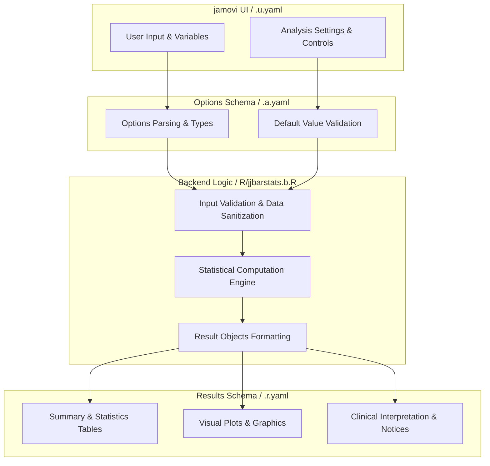
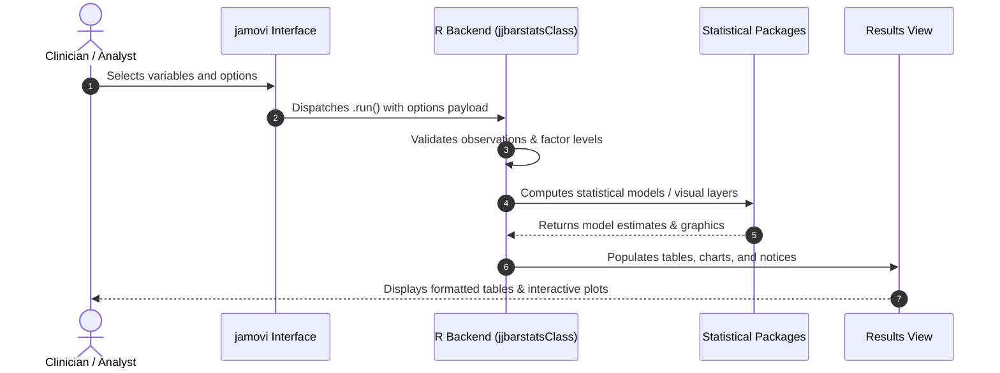

# Bar Charts - Developer Documentation

## 1. Overview

- **Function**: `jjbarstats`
- **Title**: Bar Charts
- **Module**: `JJStatsPlot`
- **Files**:
  - `jamovi/jjbarstats.u.yaml` - User Interface Definition
  - `jamovi/jjbarstats.a.yaml` - Options & Schema Definition
  - `jamovi/jjbarstats.r.yaml` - Results Layout & Tables
  - `R/jjbarstats.b.R` - Backend Implementation
- **Summary**: 'Wrapper Function for ggstatsplot::ggbarstats and ggstatsplot::grouped_ggbarstats to generate Bar Charts.'

## 1a. Changelog

- **Date**: 2026-08-29
- **Summary**: Comprehensive documentation suite created & verified against active schemas and backend implementation.

## 2. Options Reference (`.a.yaml`)

| Option | Type | Default | Description |
| :--- | :--- | :--- | :--- |
| `data` | `Data` | `NULL` |  |
| `dep` | `Variables` | `NULL` | Dependent Variable |
| `group` | `Variable` | `NULL` | Grouping Variable |
| `grvar` | `Variable` | `NULL` | Split By (Optional) |
| `counts` | `Variable` | `NULL` | Counts (Optional) |
| `excl` | `Bool` | `FALSE` | Exclude missing (NA) |
| `typestatistics` | `List` | `parametric` | Type of Statistic |
| `pairwisecomparisons` | `Bool` | `FALSE` | Pairwise comparisons |
| `pairwisedisplay` | `List` | `significant` | Pairwise Display |
| `padjustmethod` | `List` | `holm` | Adjustment Method |
| `originaltheme` | `Bool` | `FALSE` | Add GGStatsPlot layer |
| `resultssubtitle` | `Bool` | `FALSE` | Statistical results in subtitle |
| `paired` | `Bool` | `FALSE` | Paired/Repeated measures |
| `label` | `List` | `percentage` | Label Display |
| `digits` | `Integer` | `2` | Decimal Digits |
| `digitsperc` | `Integer` | `0` | Percentage Decimal Digits |
| `proportiontest` | `Bool` | `FALSE` | Proportion test |
| `bfmessage` | `Bool` | `FALSE` | Bayes factor message |
| `conflevel` | `Number` | `0.95` | Confidence Level |
| `ratio` | `String` | `` | Expected Proportions (Optional) |
| `clinicalpreset` | `List` | `custom` | Clinical Analysis Preset |
| `showexplanations` | `Bool` | `FALSE` | Clinical explanations |
| `showSummary` | `Bool` | `TRUE` | Analysis summary |
| `showAssumptions` | `Bool` | `TRUE` | Assumptions & warnings |
| `showInterpretation` | `Bool` | `FALSE` | Interpretation guide |
| `addGGPubrBalloon` | `Bool` | `FALSE` | Add balloon plot (ggpubr) |
| `ggpubrBalloonPalette` | `List` | `jco` | Balloon Plot Palette |

## 3. Results Definition (`.r.yaml`)

| Output ID | Type | Title | Description |
| :--- | :--- | :--- | :--- |
| `notices` | `Preformatted` | `Important Information` |  |
| `about` | `Html` | `About This Analysis` |  |
| `summary` | `Html` | `Analysis Summary` |  |
| `assumptions` | `Html` | `Statistical Assumptions & Warnings` |  |
| `interpretation` | `Html` | `Results Interpretation` |  |
| `report` | `Html` | `Copy-Ready Report` |  |
| `todo` | `Html` | `Analysis Setup` |  |
| `plot2` | `Image` | ``Bar Chart Grouped by {grvar}`` |  |
| `plot` | `Image` | `Bar Chart` |  |
| `balloonPlot` | `Image` | `Balloon Plot (ggpubr)` |  |

## 4. Architecture & Data Flow Diagram

```mermaid
flowchart TD
  subgraph UI[jamovi UI / .u.yaml]
    U1[User Input & Variables]
    U2[Analysis Settings & Controls]
  end

  subgraph Opts[Options Schema / .a.yaml]
    O1[Options Parsing & Types]
    O2[Default Value Validation]
  end

  subgraph Backend[Backend Logic / R/jjbarstats.b.R]
    B1[Input Validation & Data Sanitization]
    B2[Statistical Computation Engine]
    B3[Result Objects Formatting]
  end

  subgraph Res[Results Schema / .r.yaml]
    R1[Summary & Statistics Tables]
    R2[Visual Plots & Graphics]
    R3[Clinical Interpretation & Notices]
  end

  U1 --> O1
  U2 --> O2
  O1 --> B1
  O2 --> B1
  B1 --> B2
  B2 --> B3
  B3 --> R1
  B3 --> R2
  B3 --> R3
```

## 5. Execution Sequence

```mermaid
sequenceDiagram
  autonumber
  actor User as Clinician / Analyst
  participant UI as jamovi Interface
  participant Backend as R Backend (jjbarstatsClass)
  participant Engine as Statistical Packages
  participant Results as Results View

  User->>UI: Selects variables and options
  UI->>Backend: Dispatches .run() with options payload
  Backend->>Backend: Validates observations & factor levels
  Backend->>Engine: Computes statistical models / visual layers
  Engine-->>Backend: Returns model estimates & graphics
  Backend->>Results: Populates tables, charts, and notices
  Results-->>User: Displays formatted tables & interactive plots
```

## 6. Change Impact & Safety Guidelines

- **Data Filtering**: Ensure observations with missing values are handled gracefully according to analysis options.
- **Formula Conflicts**: Use isolated environment calls or base formula methods when interacting with `ggstatsplot` or formula parsers.
- **Safe Deparsing**: Use `deparse(val)` in syntax generation (`asSource()`) to escape column names with spaces or special symbols.

