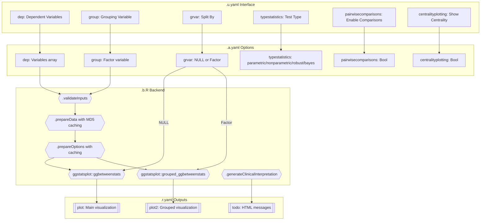
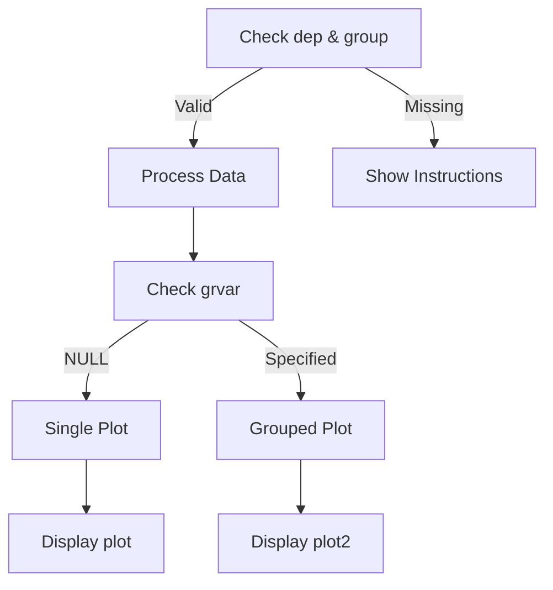
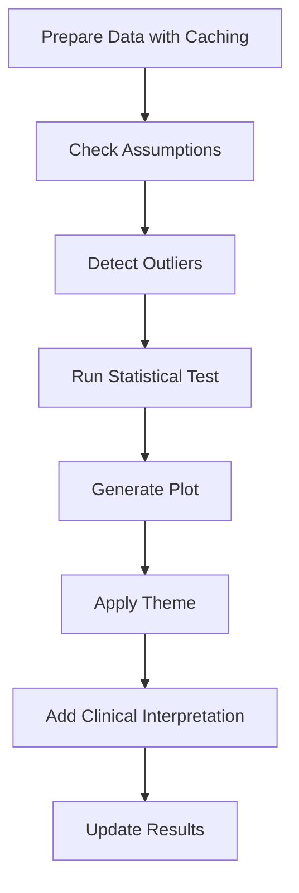

# jjbetweenstats Function Documentation

## 1. Overview

- **Function**: `jjbetweenstats`
- **Files**:
  - `jamovi/jjbetweenstats.u.yaml` — UI
  - `jamovi/jjbetweenstats.a.yaml` — Options
  - `R/jjbetweenstats.b.R` — Backend
  - `jamovi/jjbetweenstats.r.yaml` — Results
- **Summary**: Creates optimized box-violin plots for comparing continuous variables between groups with comprehensive statistical annotations. The function wraps ggstatsplot::ggbetweenstats and grouped_ggbetweenstats to provide publication-ready visualizations with parametric, non-parametric, robust, and Bayesian analyses.

## 2. UI Controls → Options Map

| UI Control | Type | Label | Binds to Option | Defaults & Constraints | Visibility/Enable Rules |
|------------|------|-------|-----------------|------------------------|-------------------------|
| dep | VariablesListBox | Dependent Variables | dep | No default, multiple allowed | Always visible |
| group | VariablesListBox | Grouping Variable | group | No default, max 1 variable | Always visible |
| grvar | VariablesListBox | Split By (Optional) | grvar | NULL, max 1 variable | Always visible |
| typestatistics | ComboBox | Type of Statistic | typestatistics | "parametric", options: parametric/nonparametric/robust/bayes | Always visible |
| effsizetype | ComboBox | Effect Size Type | effsizetype | "biased", options: biased/unbiased/eta/omega | Always visible |
| conflevel | TextBox | Confidence Level | conflevel | 0.95, min: 0, max: 1 | Always visible |
| bfmessage | CheckBox | Bayes Factor Message | bfmessage | false | Always visible |
| k | TextBox | Decimal Places | k | 2, min: 0, max: 5 | Always visible |
| varequal | CheckBox | Equal Variances | varequal | false | Always visible |
| pairwisecomparisons | CheckBox | Pairwise Comparisons | pairwisecomparisons | false | Always visible |
| pairwisedisplay | ComboBox | Pairwise Display | pairwisedisplay | "significant", options: significant/non-significant/everything | Enabled when pairwisecomparisons=true |
| padjustmethod | ComboBox | Adjustment Method | padjustmethod | "holm", options: holm/hochberg/hommel/bonferroni/BH/BY/fdr/none | Enabled when pairwisecomparisons=true |
| centralityplotting | CheckBox | Show Centrality | centralityplotting | false | Always visible |
| centralitytype | ComboBox | Centrality Type | centralitytype | "parametric", options: parametric/nonparametric/robust/bayes | Enabled when centralityplotting=true |
| resultssubtitle | CheckBox | Statistical Results | resultssubtitle | false | Always visible |
| originaltheme | CheckBox | Add GGStatsPlot Layer | originaltheme | false | Always visible |
| colorblindSafe | CheckBox | Use Colorblind-Safe Palette | colorblindSafe | false | Always visible |
| mytitle | TextBox | Title | mytitle | "Within Group Comparison" | Always visible |
| xtitle | TextBox | X-Title | xtitle | "" | Always visible |
| ytitle | TextBox | Y-Title | ytitle | "" | Always visible |
| plotwidth | TextBox | Plot Width | plotwidth | 650, min: 300, max: 1200 | Always visible |
| plotheight | TextBox | Plot Height | plotheight | 450, min: 300, max: 800 | Always visible |

## 3. Options Reference (.a.yaml)

| Name | Type | Default | Description | Downstream Effects |
|------|------|---------|-------------|-------------------|
| data | Data | - | The data frame | Core data source for all analysis |
| dep | Variables | - | Dependent continuous variables | Determines Y-axis variables; supports multiple selections |
| group | Variable | - | Grouping categorical variable | X-axis grouping; must be factor |
| grvar | Variable | NULL | Optional faceting variable | Creates grouped panels when specified |
| typestatistics | List | "parametric" | Statistical test type | Controls analysis method: t-test (parametric), Mann-Whitney (nonparametric), robust, or Bayesian |
| pairwisecomparisons | Bool | false | Enable pairwise comparisons | Triggers post-hoc comparisons between groups |
| pairwisedisplay | List | "significant" | Which comparisons to show | Filters pairwise comparison display |
| padjustmethod | List | "holm" | P-value adjustment method | Multiple comparison correction method |
| effsizetype | List | "biased" | Effect size calculation | Type of effect size for parametric tests |
| centralityplotting | Bool | false | Show central tendency | Displays mean/median/trimmed mean points |
| centralitytype | List | "parametric" | Central tendency type | Determines which measure to plot |
| bfmessage | Bool | false | Show Bayes Factor | Displays BF in subtitle for Bayesian tests |
| k | Integer | 2 | Decimal places | Precision for statistical output |
| conflevel | Number | 0.95 | Confidence interval level | CI width for estimates |
| varequal | Bool | false | Assume equal variances | Affects parametric test calculations |
| mytitle | String | "Within Group Comparison" | Plot title | Main title displayed above plot |
| xtitle | String | "" | X-axis label | Custom X-axis label |
| ytitle | String | "" | Y-axis label | Custom Y-axis label |
| originaltheme | Bool | false | Use ggstatsplot theme | Applies original package theme |
| resultssubtitle | Bool | false | Show statistical subtitle | Displays test results in subtitle |
| plotwidth | Integer | 650 | Plot width in pixels | Image output width |
| plotheight | Integer | 450 | Plot height in pixels | Image output height |
| colorblindSafe | Bool | false | Colorblind-safe palette | Uses viridis color scheme |

## 4. Backend Usage (.b.R)

### Key Methods and Option Usage:

**`.init` Method** (lines 21-39):
- Uses `self$options$plotwidth` and `self$options$plotheight` to set plot dimensions
- Multiplies height by number of dependent variables for proper scaling
- Checks `self$options$grvar` to adjust plot2 size based on factor levels

**`.validateInputs` Method** (lines 42-60):
- Validates `self$options$dep` and `self$options$group` existence
- Provides helpful error messages with available variable names

**`.prepareData` Method** (lines 211-283):
- Creates MD5 hash using `self$options$dep`, `self$options$group`, `self$options$grvar`
- Implements sophisticated caching to avoid redundant processing
- Calls `.checkAssumptions` using `self$options$typestatistics`

**`.prepareOptions` Method** (lines 291-365):
- Caches all option values with MD5 hashing
- Maps `self$options$centralityplotting` → `centrality.plotting` for ggstatsplot
- Maps `self$options$centralitytype` → `centrality.type` for ggstatsplot
- Processes `self$options$colorblindSafe` for palette selection

**`.plot` Method** (lines 406-535):
- Main plotting for single/multiple dependent variables
- Builds argument list from all `self$options$*` values
- Uses `self$options$typestatistics` for test selection
- Applies theme based on `self$options$originaltheme`
- Updates `self$results$todo` with clinical interpretations
- Updates `self$results$plot` image output

**`.plot2` Method** (lines 538-655):
- Grouped plotting when `self$options$grvar` is specified
- Uses `ggstatsplot::grouped_ggbetweenstats` with grouping.var
- Same option mapping as `.plot` but with faceting
- Updates `self$results$plot2` image output

## 5. Results Definition (.r.yaml)

| Output ID | Type | Title | Visibility | Population Entry Points |
|-----------|------|-------|------------|------------------------|
| todo | Html | "To Do" | Always visible | `.run()` lines 371-395: Welcome message and analysis summary<br>`.prepareData()` lines 232-276: Data processing status and warnings<br>`.generateClinicalInterpretation()` lines 462-529: Statistical results summary |
| plot | Image | "Violin Plot" | When dep and group specified | `.plot()` lines 533: Main visualization output via `print(plot)` |
| plot2 | Image | "Violin Plot by ${grvar}" | When grvar specified | `.plot2()` lines 653: Grouped visualization output via `print(plot2)` |

### Schema Details:
- **todo**: HTML content with clinical summaries, warnings, and instructions
- **plot**: ggplot2 image object rendered at specified width/height
- **plot2**: Combined ggplot2 panels for grouped analysis

### clearWith Triggers:
All outputs clear and recalculate when any of these options change:
dep, group, grvar, typestatistics, pairwisecomparisons, pairwisedisplay, padjustmethod, effsizetype, centralityplotting, centralitytype, bfmessage, k, conflevel, varequal, mytitle, xtitle, ytitle, originaltheme, resultssubtitle, plotwidth, plotheight, colorblindSafe

## 6. Data Flow Diagram (UI → Options → Backend → Results)



## 7. Execution Sequence (User Action → Results)

### User Input Flow


### Decision Logic


### Result Processing


**Step-by-step execution flow:**

1. **User interacts with UI controls** → jamovi updates `.a.yaml` option values
2. **Backend validation** → `.validateInputs()` checks dep and group existence
3. **Data processing** → `.prepareData()` with MD5 caching:
   - Converts variables to numeric
   - Removes NA values
   - Validates data quality
   - Checks statistical assumptions
   - Detects outliers (sampling for large datasets >5000 rows)
4. **Options processing** → `.prepareOptions()` with caching:
   - Maps UI options to ggstatsplot parameters
   - Sets default arguments for violin/box/point elements
   - Configures centrality display settings
5. **Analysis execution** → Calls ggstatsplot functions:
   - Single variable: `ggbetweenstats()`
   - Multiple variables: Multiple calls combined with `combine_plots()`
   - Grouped: `grouped_ggbetweenstats()`
6. **Results population** → Updates result objects:
   - `self$results$todo$setContent()` for messages
   - `print(plot)` for image rendering
7. **Display application** → Shows results based on visibility rules:
   - plot: Always visible when data specified
   - plot2: Only visible when grvar specified

## 8. Change Impact Guide

### Key Option Impacts:

**typestatistics**:
- Changes statistical test (t-test, Mann-Whitney, robust, Bayesian)
- Affects subtitle statistics display
- Influences computation time (Bayesian slowest)
- Triggers different assumption checks

**pairwisecomparisons**:
- Enables post-hoc testing between all group pairs
- Significantly increases computation time
- Adds comparison brackets to plot
- Activates pairwisedisplay and padjustmethod options

**grvar (Split By)**:
- Creates faceted plot panels
- Activates plot2 output
- Multiplies computation by number of factor levels
- Changes plot dimensions automatically

**dep (Multiple Variables)**:
- Creates stacked plots (one per variable)
- Multiplies plot height by variable count
- Increases memory usage and computation time

**colorblindSafe**:
- Switches to viridis color palette
- Overrides default ggplot2 colors
- Ensures accessibility compliance

### Common Pitfalls:
- Missing group levels cause errors → Validate factor has 2+ levels
- Very small sample sizes (<3 per group) → Triggers warnings
- Non-normal data with parametric test → Suggests non-parametric
- Large datasets (>5000 rows) → Uses sampling for outlier detection
- Multiple comparisons without adjustment → Risk of Type I errors

### Recommended Defaults:
- typestatistics="parametric" → Most familiar to clinicians
- pairwisedisplay="significant" → Reduces visual clutter
- padjustmethod="holm" → Good balance of power and control
- k=2 → Sufficient precision for most contexts
- centralityplotting=false → Cleaner initial display

## 9. Example Usage

### Example Dataset Requirements:
- At least one continuous numeric variable (dep)
- At least one categorical factor variable (group) with 2+ levels
- Optional: Second categorical variable for faceting (grvar)
- Recommended: 10+ observations per group

### Example Option Payload:
```yaml
dep: ["Sepal.Length", "Sepal.Width"]
group: "Species"
grvar: null
typestatistics: "nonparametric"
pairwisecomparisons: true
pairwisedisplay: "significant"
padjustmethod: "bonferroni"
centralityplotting: true
centralitytype: "nonparametric"
resultssubtitle: true
colorblindSafe: true
```

### Expected Outputs:
- **todo**: HTML with analysis summary and any warnings
- **plot**: Stacked violin plots (2 panels) comparing Species
- Statistical annotations showing Kruskal-Wallis results
- Pairwise comparison brackets for significant differences
- Median points displayed with labels
- Colorblind-safe viridis palette applied

## 10. Appendix (Schemas & Snippets)

### Cache Implementation (lines 213-226):
```r
current_hash <- digest::digest(list(
    dep = self$options$dep,
    group = self$options$group,
    data_dim = dim(self$data),
    col_names = names(self$data),
    grvar = self$options$grvar
), algo = "md5")

if (!is.null(private$.processedData) && 
    private$.data_hash == current_hash && 
    !force_refresh) {
    return(private$.processedData)
}
```

### Theme Application (lines 130-145):
```r
.applyTheme = function(plot, opts, ggtheme) {
    if (!opts$originaltheme) {
        plot <- plot + ggtheme
    } else {
        plot <- plot + ggstatsplot::theme_ggstatsplot()
    }
    
    if (opts$colorblindSafe) {
        plot <- plot + 
            ggplot2::scale_fill_viridis_d(option = "D") +
            ggplot2::scale_color_viridis_d(option = "D")
    }
    return(plot)
}
```

### Assumption Checking (lines 186-204):
```r
if (test_type == "parametric" && min_group_size >= 3) {
    for (level in names(group_counts)) {
        group_subset <- var_data[group_data == level & !is.na(var_data)]
        if (length(group_subset) >= 3 && length(group_subset) <= 5000) {
            p_val <- tryCatch(shapiro.test(group_subset)$p.value, 
                             error = function(e) 1)
            if (p_val < 0.05) {
                warnings <- c(warnings, sprintf(
                    .("⚠️ %s: Data may not be normally distributed in group '%s'"),
                    var, level))
            }
        }
    }
}
```

### Performance Optimization Features:
- MD5 hash-based caching for data and options
- Sampling for outlier detection in large datasets (>5000 rows)
- Checkpoint system for user feedback during long operations
- Lazy evaluation of expensive computations
- Efficient memory management with processed data reuse