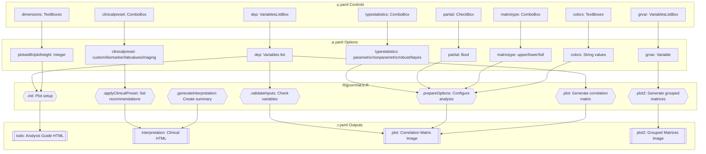
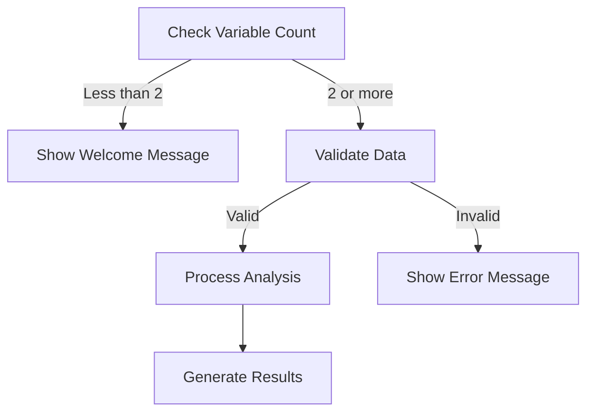
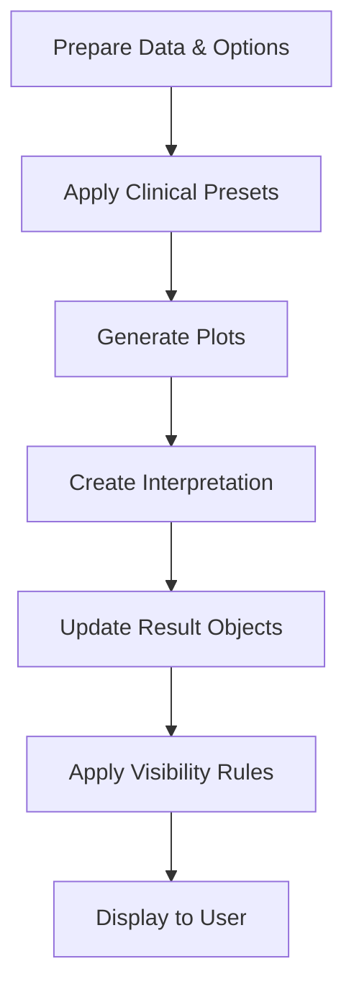
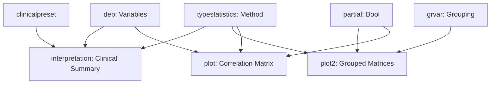

# jjcorrmat Function Documentation

## 1. Overview

- **Function**: `jjcorrmat`
- **Files**:
  - `jamovi/jjcorrmat.u.yaml` — UI
  - `jamovi/jjcorrmat.a.yaml` — Options  
  - `R/jjcorrmat.b.R` — Backend
  - `jamovi/jjcorrmat.r.yaml` — Results
- **Summary**: A comprehensive correlation matrix analysis wrapper for `ggstatsplot::ggcorrmat` and `ggstatsplot::grouped_ggcorrmat` that generates correlation matrix visualizations with significance testing. Supports both regular and partial correlations, grouped analysis, clinical presets, and extensive customization options for clinical research applications.

## 2. UI Controls → Options Map

| UI Control | Type | Label | Binds to Option | Defaults & Constraints | Visibility/Enable Rules |
|------------|------|-------|-----------------|------------------------|------------------------|
| `dep` | VariablesListBox | Dependent Variables | `dep` | Multiple continuous variables required | Always visible |
| `grvar` | VariablesListBox | Split By (Optional) | `grvar` | Single categorical variable, maxItemCount: 1 | Always visible |
| `typestatistics` | ComboBox | Correlation Method | `typestatistics` | Default: "parametric" | Collapsed in Statistical Analysis |
| `siglevel` | TextBox | Significance Level | `siglevel` | Default: 0.05, Min: 0, Max: 1 | Collapsed in Statistical Analysis |
| `conflevel` | TextBox | Confidence Level | `conflevel` | Default: 0.95, Min: 0, Max: 1 | Collapsed in Statistical Analysis |
| `padjustmethod` | ComboBox | P-value Adjustment Method | `padjustmethod` | Default: "holm" | Collapsed in Statistical Analysis |
| `k` | TextBox | Decimal Places | `k` | Default: 2, Min: 0, Max: 5 | Collapsed in Statistical Analysis |
| `partial` | CheckBox | Partial Correlations | `partial` | Default: false | Collapsed in Statistical Analysis |
| `clinicalpreset` | ComboBox | Clinical Preset | `clinicalpreset` | Default: "custom" | Collapsed in Statistical Analysis |
| `matrixtype` | ComboBox | Matrix Type | `matrixtype` | Default: "upper" | Collapsed in Matrix Display |
| `matrixmethod` | ComboBox | Matrix Method | `matrixmethod` | Default: "square" | Collapsed in Matrix Display |
| `lowcolor` | TextBox | Low Correlation Color | `lowcolor` | Default: "#E69F00" | Collapsed in Plot Appearance |
| `midcolor` | TextBox | Mid Correlation Color | `midcolor` | Default: "white" | Collapsed in Plot Appearance |
| `highcolor` | TextBox | High Correlation Color | `highcolor` | Default: "#009E73" | Collapsed in Plot Appearance |
| `title` | TextBox | Plot Title | `title` | Default: "" | Collapsed in Plot Appearance |
| `subtitle` | TextBox | Plot Subtitle | `subtitle` | Default: "" | Collapsed in Plot Appearance |
| `caption` | TextBox | Plot Caption | `caption` | Default: "" | Collapsed in Plot Appearance |
| `plotwidth` | TextBox | Plot Width | `plotwidth` | Default: 600, Min: 300, Max: 1200 | Collapsed in Plot Configuration |
| `plotheight` | TextBox | Plot Height | `plotheight` | Default: 450, Min: 300, Max: 800 | Collapsed in Plot Configuration |

## 3. Options Reference (.a.yaml)

| Name | Type | Default | Description | Downstream Effects |
|------|------|---------|-------------|-------------------|
| `dep` | Variables | - | List of continuous variables for correlation matrix | Used in `.validateInputs()`, `.prepareOptions()`, passed to `ggcorrmat()` |
| `grvar` | Variable | - | Optional grouping variable for separate correlation matrices | Controls `.plot2()` visibility and `grouped_ggcorrmat()` usage |
| `typestatistics` | List | "parametric" | Type of correlation analysis (parametric, nonparametric, robust, bayes) | Determines correlation method in `ggcorrmat()` |
| `matrixtype` | List | "upper" | Matrix display type (upper, lower, full) | Passed to `ggcorrmat()` matrix.type parameter |
| `matrixmethod` | List | "square" | Visualization method (square, circle) | Used in `ggcorrplot.args` configuration |
| `siglevel` | Number | 0.05 | Significance level for marking correlations | Passed to `ggcorrmat()` sig.level parameter |
| `conflevel` | Number | 0.95 | Confidence level for confidence intervals | Passed to `ggcorrmat()` conf.level parameter |
| `padjustmethod` | List | "holm" | P-value adjustment method for multiple comparisons | Passed to `ggcorrmat()` p.adjust.method parameter |
| `k` | Integer | 2 | Number of decimal places for correlation coefficients | Passed to `ggcorrmat()` k parameter |
| `partial` | Bool | false | Compute partial correlations instead of zero-order | Passed to `ggcorrmat()` partial parameter, affects interpretation |
| `clinicalpreset` | List | "custom" | Pre-configured settings for clinical scenarios | Triggers `.applyClinicalPreset()` for recommendations |
| `lowcolor` | String | "#E69F00" | Color for low (negative) correlation values | Used in colors vector for `ggcorrmat()` |
| `midcolor` | String | "white" | Color for mid (zero) correlation values | Used in colors vector for `ggcorrmat()` |
| `highcolor` | String | "#009E73" | Color for high (positive) correlation values | Used in colors vector for `ggcorrmat()` |
| `title` | String | "" | Plot title | Passed to `ggcorrmat()` title parameter |
| `subtitle` | String | "" | Plot subtitle | Passed to `ggcorrmat()` subtitle parameter |
| `caption` | String | "" | Plot caption | Passed to `ggcorrmat()` caption parameter |
| `plotwidth` | Integer | 600 | Plot width in pixels | Used in `.init()` to set plot dimensions |
| `plotheight` | Integer | 450 | Plot height in pixels | Used in `.init()` to set plot dimensions |

## 4. Backend Usage (.b.R)

### Option Access Patterns

**Variable Selection (`dep`, `grvar`)**

- **Locations**: `.init()`, `.validateInputs()`, `.run()`, `.plot()`, `.plot2()`
- **Logic**: Checks for minimum 2 variables in `dep`, validates existence in data
- **Results**: Controls welcome message display, plot visibility, enables grouped analysis

**Statistical Options (`typestatistics`, `siglevel`, `conflevel`, `padjustmethod`, `k`, `partial`)**

- **Locations**: `.prepareOptions()`, `.plot()`, `.plot2()`, `.generateInterpretation()`
- **Logic**: Configured in `options_data` object and passed to `ggstatsplot` functions
- **Results**: Affects correlation computation method and statistical testing

**Clinical Features (`clinicalpreset`)**

- **Locations**: `.applyClinicalPreset()`, `.generateInterpretation()`
- **Logic**: Sets `private$.preset_recommendations` based on preset selection
- **Results**: Adds clinical guidance to interpretation output

**Visualization (`matrixtype`, `matrixmethod`, colors, labels, dimensions)**

- **Locations**: `.init()`, `.prepareOptions()`, `.plot()`, `.plot2()`
- **Logic**: Configures plot appearance, dimensions, and styling
- **Results**: Controls plot layout and visual properties

### Key Code Excerpts

```r
# Variable validation
if (is.null(self$options$dep) || length(self$options$dep) < 2) {
    # Show welcome message
}

# Options caching with hash
current_options_hash <- paste(
    paste(self$options$dep, collapse = ","),
    self$options$typestatistics, self$options$matrixtype, 
    # ... all options
)

# ggcorrmat call with options
plot <- ggstatsplot::ggcorrmat(
    data = mydata,
    cor.vars = myvars,
    matrix.type = options_data$matrixtype,
    type = options_data$typestatistics,
    partial = options_data$partial,
    # ... other options
)
```

## 5. Results Definition (.r.yaml)

| Output ID | Type | Title | Visibility | Population Entry Points |
|-----------|------|-------|------------|------------------------|
| `todo` | Html | Analysis Guide | Always visible | `.init()`, `.run()`, `.prepareData()` - Shows welcome message, processing status |
| `interpretation` | Html | Clinical Interpretation | Always visible | `.generateInterpretation()` - Detailed correlation analysis summary |
| `plot` | Image | Chart | `requiresData: true` | `.plot()` - Main correlation matrix visualization |
| `plot2` | Image | Chart | `visible: (grvar), requiresData: true` | `.plot2()` - Grouped correlation matrices |

### Result Population Details

- **`todo`**: Dynamic HTML content showing welcome message (no variables), processing status, or completion message
- **`interpretation`**: Comprehensive clinical interpretation including correlation summary, significance analysis, and clinical recommendations
- **`plot`**: Single correlation matrix using `ggstatsplot::ggcorrmat()`
- **`plot2`**: Multiple correlation matrices grouped by categorical variable using `ggstatsplot::grouped_ggcorrmat()`

## 6. Data Flow Diagram (UI → Options → Backend → Results)



## 7. Execution Sequence (User Action → Results)

### User Input Flow


### Decision Logic



### Result Processing



**Step-by-step execution flow:**

1. **User Variable Selection** → UI updates `dep` and optional `grvar` options
2. **Initial Validation** → `.init()` checks variable count, shows welcome message if insufficient
3. **Data Preparation** → `.prepareData()` cleans data, handles missing values with caching
4. **Options Processing** → `.prepareOptions()` creates configuration object with caching for performance
5. **Clinical Preset Application** → `.applyClinicalPreset()` sets recommendations based on selected preset
6. **Validation & Warnings** → `.validateInputs()` and `.validateClinicalInputs()` check prerequisites
7. **Main Analysis** → `.plot()` generates single correlation matrix using `ggstatsplot::ggcorrmat()`
8. **Grouped Analysis** → `.plot2()` generates grouped matrices if `grvar` is specified
9. **Interpretation Generation** → `.generateInterpretation()` creates detailed clinical summary
10. **Result Display** → Results shown according to `.r.yaml` visibility rules



## 8. Change Impact Guide

### Key Option Changes

**If `dep` (variables) changed**:

- Triggers complete re-analysis
- Affects plot dimensions for grouped analysis
- Updates interpretation with new correlation count
- Performance impact: High (recalculates everything)

**If `typestatistics` changed**:

- Changes correlation method (Pearson/Spearman/Robust/Bayes)
- Updates statistical interpretation
- Affects significance testing
- Performance impact: Medium

**If `partial` changed**:

- Switches between zero-order and partial correlations
- Requires minimum 3 variables for meaningful partial correlations
- Adds detailed explanation in interpretation
- Performance impact: Medium

**If `grvar` changed**:

- Toggles between single and grouped analysis
- Shows/hides `plot2` output
- Adjusts plot dimensions based on group levels
- Performance impact: High (different analysis type)

**If `clinicalpreset` changed**:

- Updates clinical recommendations
- No impact on statistical computation
- Performance impact: Low

### Common Pitfalls

- **Insufficient variables**: Less than 2 variables shows welcome message instead of analysis
- **Partial correlations with few variables**: Requires 3+ variables, shows warning otherwise  
- **Missing grouping variable**: `plot2` won't render if `grvar` is not specified
- **Large datasets**: Consider performance with many variables (>10 shows warning)

### Recommended Defaults

- **typestatistics**: "parametric" for normally distributed data, "nonparametric" otherwise
- **matrixtype**: "upper" reduces visual clutter while showing all unique correlations
- **padjustmethod**: "holm" provides good balance between Type I error control and power
- **k**: 2-3 decimal places sufficient for most clinical applications

## 9. Example Usage

### Example Dataset Requirements
- **Minimum**: 2 continuous numeric variables, 10+ observations
- **Optimal**: 3-8 continuous variables, 50+ observations
- **For grouping**: Categorical variable with 2-5 levels

### Example Option Configurations

**Basic Correlation Analysis:**

```yaml
dep: ["age", "weight", "height", "bmi"]
typestatistics: "parametric"
matrixtype: "upper"
```

**Clinical Biomarker Analysis:**

```yaml
dep: ["biomarker_a", "biomarker_b", "biomarker_c", "outcome_score"]
typestatistics: "robust"
clinicalpreset: "biomarker" 
partial: true
```

**Grouped Analysis by Treatment:**

```yaml
dep: ["pre_score", "post_score", "change_score"]
grvar: "treatment_group"
typestatistics: "nonparametric"
matrixtype: "full"
```

### Expected Outputs

- **Analysis Guide**: Welcome message or processing status
- **Clinical Interpretation**: Detailed summary with correlation counts, significance, and clinical recommendations
- **Chart**: Correlation matrix visualization with color-coded correlation strengths
- **Grouped Chart**: Multiple matrices if grouping variable specified

## 10. Appendix (Schemas & Snippets)

### Result Object Schemas

**HTML Results (`todo`, `interpretation`)**:

- Type: Html content
- Content: Dynamic HTML strings with clinical formatting
- Population: Via `setContent()` method

**Image Results (`plot`, `plot2`)**:

- Type: Image with configurable dimensions
- Default size: 600x450 pixels
- Population: Via ggplot object rendering
- Visibility: Based on data requirements and grouping variable presence

### Key Code Snippets

**Option Access Pattern:**

```r
# Cached option processing
current_options_hash <- paste(
    paste(self$options$dep, collapse = ","),
    self$options$typestatistics, self$options$matrixtype,
    # ... all relevant options
    collapse = "_"
)
```

**Result Population:**
```r
# Welcome message
self$results$todo$setContent(todo)

# Clinical interpretation  
self$results$interpretation$setContent(interpretation)

# Plot generation
plot <- ggstatsplot::ggcorrmat(
    data = mydata,
    cor.vars = myvars,
    matrix.type = options_data$matrixtype,
    type = options_data$typestatistics,
    # ... other options
)
```

**Clinical Preset Implementation:**
```r
if (preset == "biomarker") {
    private$.preset_recommendations <- .("For biomarker correlations, consider robust correlation methods to handle outliers.")
}
```

This comprehensive documentation covers all aspects of the `jjcorrmat` function's architecture, from UI interactions through backend processing to result generation, providing developers with a complete understanding of the module's functionality and implementation details.