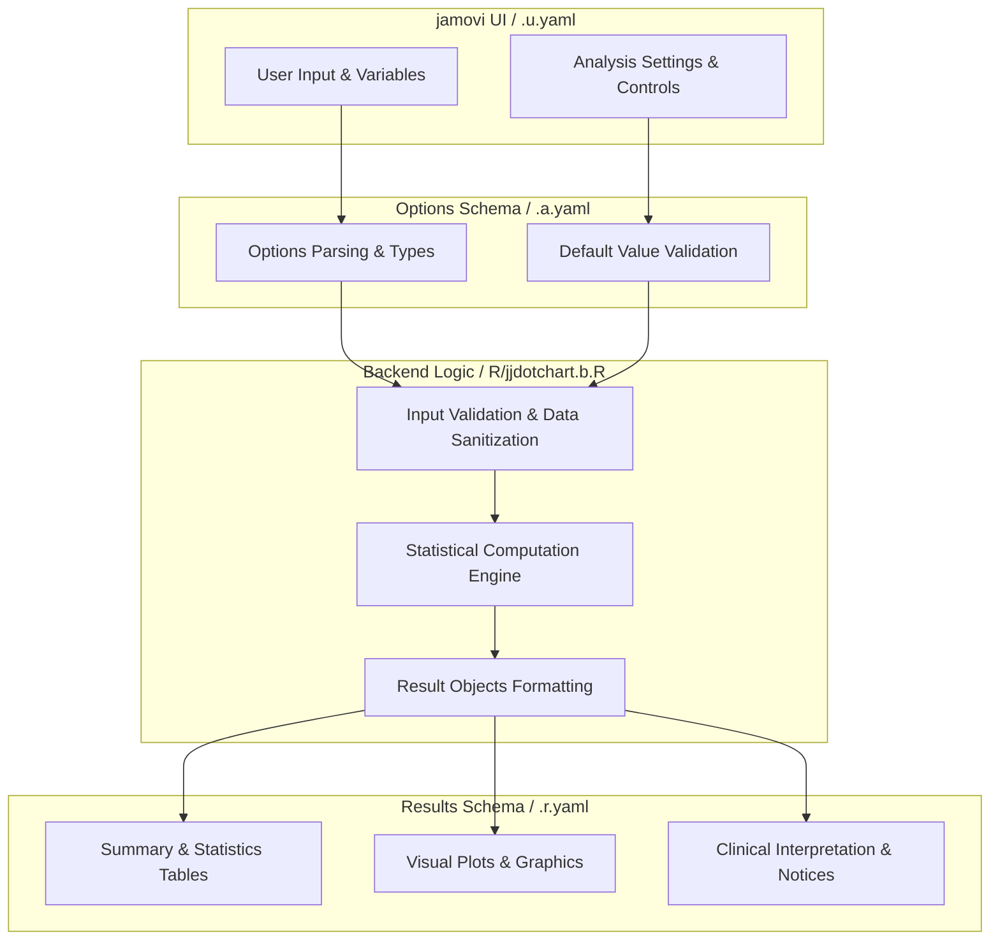
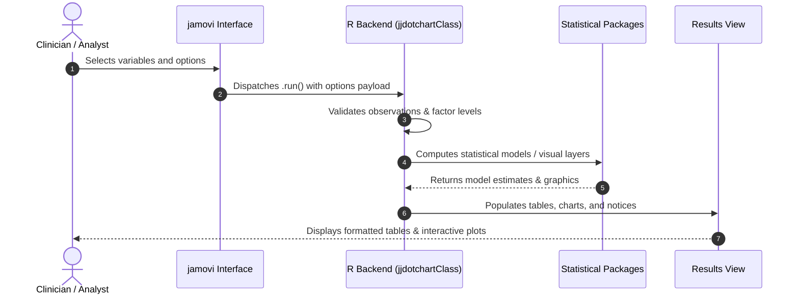

# Dot Chart (Summary vs Reference Value) - Developer Documentation

## 1. Overview

- **Function**: `jjdotchart`
- **Title**: Dot Chart (Summary vs Reference Value)
- **Module**: `JJStatsPlotT`
- **Files**:
  - `jamovi/jjdotchart.u.yaml` - User Interface Definition
  - `jamovi/jjdotchart.a.yaml` - Options & Schema Definition
  - `jamovi/jjdotchart.r.yaml` - Results Layout & Tables
  - `R/jjdotchart.b.R` - Backend Implementation
- **Summary**: Cleveland dot chart: one summary point per group, ordered by value, with a confidence interval and a reference line. Wraps ggstatsplot::ggdotplotstats and ggstatsplot::grouped_ggdotplotstats.  IMPORTANT - what is tested. Every observation in a group is collapsed to a SINGLE summary value, and the test is a ONE-SAMPLE test of those k summary values against your Reference Value. The sample size of the test is therefore the NUMBER OF GROUPS, not the number of patients: 120 patients in 3 groups gives a one-sample t-test with n = 3 and 2 degrees of freedom. It answers "are the group summaries, taken together, different from this value?" - NOT "do these groups differ from each other".  Which summary is plotted follows the Statistical Test you choose, and the test then runs on those same values: parametric plots the group MEANS, nonparametric the MEDIANS, robust the 20 percent TRIMMED MEANS, Bayesian the MAP estimates. Verified on skewed data where they differ sharply (mean 33.77 vs median 9.75 for the same group), so switching test type genuinely changes the picture, not just the caption.  To compare groups WITH EACH OTHER using every observation, use "Box-Violin Plots to Compare Between Groups" or "Horizontal Box-Violin Comparison" instead.  Best suited to many labels each contributing one meaningful summary - mean turnaround time across 20 laboratories, median biomarker by centre - which is what a Cleveland dot plot is designed for. With only two or three groups the test has 1-2 degrees of freedom and is of little value, even though the chart itself is still a fair picture of the group averages.

## 1a. Changelog

- **Date**: 2026-08-29
- **Summary**: Comprehensive documentation suite created & verified against active schemas and backend implementation.

## 2. Options Reference (`.a.yaml`)

| Option | Type | Default | Description |
| :--- | :--- | :--- | :--- |
| `data` | `Data` | `NULL` |  |
| `dep` | `Variable` | `NULL` | Measurement |
| `group` | `Variable` | `NULL` | Groups (one point each) |
| `grvar` | `Variable` | `NULL` | Split By (Optional) |
| `testvalue` | `Number` | `0` | Reference Value |
| `typestatistics` | `List` | `parametric` | Statistical Test |
| `conflevel` | `Number` | `0.95` | Confidence Level |
| `k` | `Integer` | `2` | Decimal Places |
| `resultssubtitle` | `Bool` | `TRUE` | Statistical results in plot |
| `showSummaryTable` | `Bool` | `TRUE` | Group summary table |
| `centralityplotting` | `Bool` | `FALSE` | Also mark the centre of the plotted points |
| `centralitytype` | `List` | `parametric` | Central Tendency Measure |
| `bfmessage` | `Bool` | `FALSE` | Bayes factor interpretation |
| `originaltheme` | `Bool` | `FALSE` | Original ggstatsplot theme |
| `mytitle` | `String` | `` | Plot Title |
| `xtitle` | `String` | `` | X-axis Label (Measurement) |
| `ytitle` | `String` | `` | Y-axis Label (Groups) |
| `plotwidth` | `Integer` | `650` | Plot Width (pixels) |
| `plotheight` | `Integer` | `450` | Plot Height (pixels) |

## 3. Results Definition (`.r.yaml`)

| Output ID | Type | Title | Description |
| :--- | :--- | :--- | :--- |
| `todo` | `Html` | `To Do` |  |
| `notices` | `Html` | `Notices` |  |
| `summary` | `Table` | `Group Summaries (one row per plotted point)` |  |
| `plot2` | `Image` | ``${dep} by {group}, split by {grvar}`` |  |
| `plot` | `Image` | ``${dep} by {group}`` |  |

## 4. Architecture & Data Flow Diagram

## 5. Execution Sequence

## 6. Change Impact & Safety Guidelines

- **Data Filtering**: Ensure observations with missing values are handled gracefully according to analysis options.
- **Formula Conflicts**: Use isolated environment calls or base formula methods when interacting with `ggstatsplot` or formula parsers.
- **Safe Deparsing**: Use `deparse(val)` in syntax generation (`asSource()`) to escape column names with spaces or special symbols.

