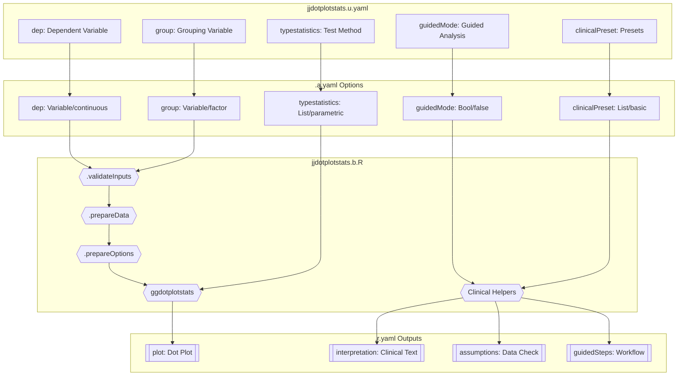
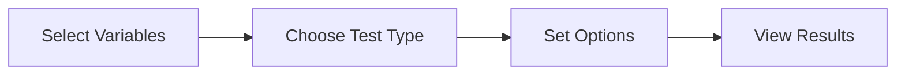
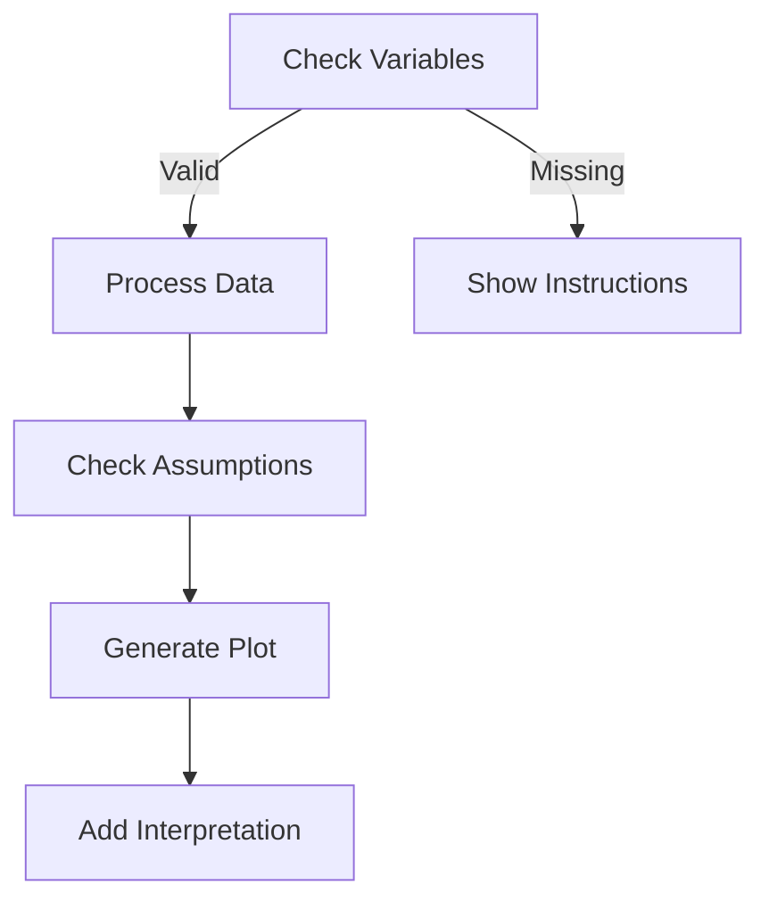
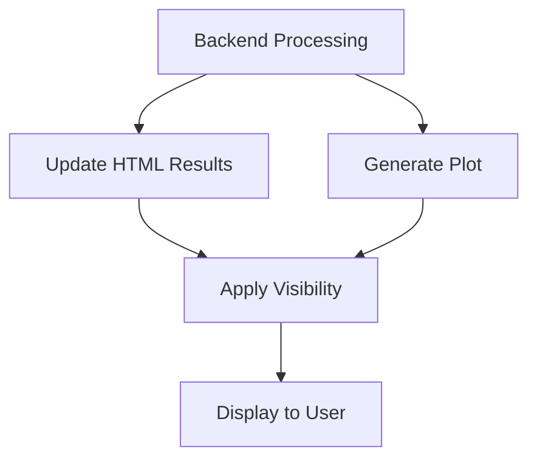

# jjdotplotstats Function Documentation

## 1. Overview

- **Function**: `jjdotplotstats`
- **Files**:
  - `jamovi/jjdotplotstats.u.yaml` — UI
  - `jamovi/jjdotplotstats.a.yaml` — Options
  - `R/jjdotplotstats.b.R` — Backend
  - `jamovi/jjdotplotstats.r.yaml` — Results
- **Summary**: This function creates dot plots for comparing continuous variables between groups using the ggstatsplot package. It provides comprehensive statistical analysis with customizable visualization options, clinical interpretation helpers, and guided analysis mode for researchers at all levels.

## 2. UI Controls → Options Map

| UI Control | Type | Label | Binds to Option | Default | Constraints | Visibility/Enable Rules |
|------------|------|-------|-----------------|---------|-------------|------------------------|
| dep | VariablesListBox | Dependent Variable | dep | - | maxItemCount: 1, numeric | Always visible |
| group | VariablesListBox | Grouping Variable | group | - | maxItemCount: 1, factor | Always visible |
| grvar | VariablesListBox | Split By (Optional) | grvar | - | maxItemCount: 1, factor | Always visible |
| typestatistics | ComboBox | Test Method | typestatistics | parametric | 4 options | Always visible |
| effsizetype | ComboBox | Effect Size | effsizetype | biased | 4 options | Always visible |
| testvalue | TextBox | Test Value | testvalue | 0 | number | Always visible |
| conflevel | TextBox | Confidence Level | conflevel | 0.95 | number, 0-1 | Always visible |
| bfmessage | CheckBox | Bayes Factor | bfmessage | false | - | Always visible |
| k | TextBox | Decimal Places | k | 2 | integer, 0-5 | Always visible |
| testvalueline | CheckBox | Reference Line | testvalueline | false | - | Always visible |
| centralityparameter | ComboBox | Central Line | centralityparameter | mean | 3 options | Always visible |
| centralityk | TextBox | Central Precision | centralityk | 2 | integer, 0-5 | Enable: ((centralityparameter:mean \|\| centralityparameter:median) && centralityplotting) |
| centralityplotting | CheckBox | Show Centrality | centralityplotting | false | - | Always visible |
| centralitytype | ComboBox | Centrality Type | centralitytype | parametric | 4 options | Enable: (centralityplotting) |
| resultssubtitle | CheckBox | Results Subtitle | resultssubtitle | false | - | Always visible |
| originaltheme | CheckBox | Original Theme | originaltheme | false | - | Always visible |
| mytitle | TextBox | Plot Title | mytitle | '' | string, large | Always visible |
| xtitle | TextBox | X-axis Label | xtitle | '' | string, large | Always visible |
| ytitle | TextBox | Y-axis Label | ytitle | '' | string, large | Always visible |
| plotwidth | TextBox | Plot Width | plotwidth | 650 | number, 300-1200 | Always visible |
| plotheight | TextBox | Plot Height | plotheight | 450 | number, 300-800 | Always visible |
| clinicalPreset | ComboBox | Clinical Presets | clinicalPreset | basic | 4 options | Always visible |
| guidedMode | CheckBox | Guided Mode | guidedMode | false | - | Always visible |

## 3. Options Reference (.a.yaml)

### Core Variables
- **dep** (Variable, continuous): Dependent continuous variable for dot plot distribution
  - Downstream: Used in ggdotplotstats() as x parameter, validated for numeric type
- **group** (Variable, factor): Grouping categorical variable for comparison
  - Downstream: Used in ggdotplotstats() as y parameter, determines plot groups
- **grvar** (Variable, factor, optional): Additional grouping for faceted plots
  - Downstream: Triggers grouped_ggdotplotstats() when present

### Statistical Options
- **typestatistics** (List, default: 'parametric'): Statistical test type
  - Options: parametric (t-test), nonparametric (Mann-Whitney), robust (trimmed means), bayes (Bayesian)
  - Downstream: Controls ggstatsplot type parameter and interpretation messages
- **effsizetype** (List, default: 'biased'): Effect size calculation method
  - Options: biased (Cohen's d), unbiased (Hedge's g), eta (eta-squared), omega (omega-squared)
  - Downstream: Controls effect size reporting in plot subtitle
- **testvalue** (Number, default: 0): Reference value for hypothesis testing
  - Downstream: Used for one-sample comparisons
- **conflevel** (Number, default: 0.95): Confidence interval level
  - Downstream: Controls CI calculation (95% standard)
- **bfmessage** (Bool, default: false): Display Bayes Factor interpretation
  - Downstream: Shows evidence strength for Bayesian analysis
- **k** (Integer, default: 2): Statistical precision decimal places
  - Downstream: Controls rounding of p-values and effect sizes

### Visualization Options
- **centralityplotting** (Bool, default: false): Show central tendency lines
  - Downstream: Adds mean/median lines to plot
- **centralitytype** (List, default: 'parametric'): Type of centrality measure
  - Options: parametric (mean), nonparametric (median), robust (trimmed mean), bayes (MAP)
- **centralityparameter** (List, default: 'mean'): Central line to display
  - Options: mean, median, none
- **centralityk** (Integer, default: 2): Decimal places for centrality values
- **testvalueline** (Bool, default: false): Show reference value line
- **resultssubtitle** (Bool, default: false): Show statistical results in subtitle
- **originaltheme** (Bool, default: false): Use ggstatsplot theme vs jamovi theme

### Labels & Dimensions
- **mytitle** (String, default: ''): Custom plot title
- **xtitle** (String, default: ''): X-axis label override
- **ytitle** (String, default: ''): Y-axis label override
- **plotwidth** (Integer, default: 650): Plot width in pixels
- **plotheight** (Integer, default: 450): Plot height in pixels

### Clinical Features
- **guidedMode** (Bool, default: false): Enable step-by-step guidance
  - Downstream: Shows guidedSteps and recommendations panels
- **clinicalPreset** (List, default: 'basic'): Analysis preset configuration
  - Options: basic, publication, clinical, custom
  - Downstream: Controls interpretation style and recommendations

## 4. Backend Usage (.b.R)

### Key Methods and Option Usage

**Initialization (.init)**
- Applies clinical preset via `private$.applyClinicalPreset()`
- Sets plot dimensions using `self$options$plotwidth` and `plotheight`
- Configures grouped plot size based on `self$options$grvar` levels

**Data Validation (.validateInputs)**
- Checks `self$options$dep` and `self$options$group` existence
- Validates variable presence in dataset
- Calls centrality validation helper

**Data Preparation (.prepareData)**
- Converts `self$options$dep` to numeric
- Performs NA omission
- Validates data quality and detects outliers
- Caches processed data with MD5 hash

**Options Processing (.prepareOptions)**
- Processes all visualization options
- Handles empty string defaults for titles
- Configures centrality plotting parameters
- Caches processed options

**Main Execution (.run)**
- Generates clinical interpretation if `dep` and `group` present
- Checks assumptions and provides recommendations
- Creates report sentence template
- Calls guided helpers if `guidedMode` enabled

**Plot Generation (.plot, .plot2)**
- Uses cached data and options
- Calls `ggstatsplot::ggdotplotstats()` with all parameters
- Applies theme based on `originaltheme` option
- `.plot2` handles grouped analysis when `grvar` present

**Clinical Helpers**
- `.applyClinicalPreset()`: Sets preset message based on `clinicalPreset`
- `.generateClinicalInterpretation()`: Creates interpretation HTML
- `.checkAssumptions()`: Evaluates data suitability
- `.generateGuidedSteps()`: Shows analysis workflow if `guidedMode`
- `.generateRecommendations()`: Preset-specific guidance

## 5. Results Definition (.r.yaml)

| Output ID | Type | Title | Visibility | Content Source |
|-----------|------|-------|------------|----------------|
| todo | Html | To Do | Always | Welcome message or processing status |
| plot2 | Image | `${dep} - {group} by {grvar}` | (grvar) | Grouped dot plots |
| plot | Image | `${dep} - {group}` | Always | Main dot plot |
| interpretation | Html | Clinical Interpretation | Always | Clinical interpretation text |
| assumptions | Html | Data Assessment & Recommendations | Always | Assumption checks |
| reportSentence | Html | Report Template | Always | Copy-ready report text |
| guidedSteps | Html | Analysis Steps | Always | Step-by-step guide |
| recommendations | Html | Next Steps | Always | Preset-specific recommendations |

**ClearWith Dependencies**: All results clear when any option changes (dep, group, grvar, typestatistics, effsizetype, centralityplotting, centralitytype, mytitle, xtitle, ytitle, originaltheme, resultssubtitle, testvalue, bfmessage, conflevel, k, testvalueline, centralityparameter, centralityk, plotwidth, plotheight, guidedMode, clinicalPreset)

## 6. Data Flow Diagram (UI → Options → Backend → Results)



## 7. Execution Sequence (User Action → Results)

### User Input Flow


### Decision Logic


### Result Processing


**Step-by-step execution flow:**

1. **User selects variables** → UI updates `dep` and `group` options
2. **Backend validation** → `.validateInputs()` checks prerequisites
3. **Data processing** → `.prepareData()` converts to numeric, handles NA
4. **Clinical preset application** → Sets interpretation style based on `clinicalPreset`
5. **Assumption checking** → Evaluates normality, sample size, outliers
6. **Analysis execution** → `ggdotplotstats()` with selected `typestatistics`
7. **Results population** → Updates all HTML panels with interpretations
8. **Plot generation** → Creates dot plot with statistical annotations
9. **Guided mode** → Shows workflow steps if `guidedMode` enabled
10. **Display application** → Shows visible results per `.r.yaml` rules

## 8. Change Impact Guide

### Key Option Impacts

**dep/group change**:
- Triggers full reanalysis
- Clears all results
- Recalculates assumptions
- Updates interpretations

**typestatistics change**:
- Changes statistical test used
- Updates interpretation text
- Modifies effect size calculation
- Affects assumption recommendations

**guidedMode toggle**:
- Shows/hides workflow steps
- Enables recommendations panel
- No impact on analysis

**clinicalPreset change**:
- Updates recommendation style
- Changes interpretation focus
- No impact on statistics

### Common Pitfalls
- Missing data causes analysis failure
- Non-numeric dep variable needs conversion
- Small sample sizes (<10) affect test validity
- Extreme outliers impact parametric tests

### Recommended Defaults
- **typestatistics**: 'parametric' for normal data
- **effsizetype**: 'unbiased' for small samples
- **conflevel**: 0.95 standard confidence
- **k**: 2 decimal places for readability

## 9. Example Usage

### Dataset Requirements
- **Dependent variable**: Continuous numeric (e.g., age, measurement)
- **Grouping variable**: Factor with 2+ levels (e.g., treatment groups)
- **Optional split**: Additional factor for faceting

### Example Option Payload
```yaml
dep: "Age"
group: "Treatment"
typestatistics: "nonparametric"
effsizetype: "unbiased"
centralityplotting: true
centralitytype: "nonparametric"
guidedMode: true
clinicalPreset: "clinical"
```

### Expected Outputs
- Dot plot showing Age distribution by Treatment groups
- Mann-Whitney U test results in subtitle
- Median lines on plot
- Clinical interpretation panel with sample sizes
- Assumption checks recommending nonparametric approach
- Clinical decision points in recommendations

## 10. Appendix (Schemas & Snippets)

### Result Panel Population
```r
# Clinical interpretation generation
self$results$interpretation$setContent(interpretation)

# Assumption checking
self$results$assumptions$setContent(assumptions_content)

# Report sentence
self$results$reportSentence$setContent(report_template)

# Guided steps (conditional)
if (self$options$guidedMode) {
  self$results$guidedSteps$setContent(steps)
  self$results$recommendations$setContent(recommendations)
}
```

### Plot Generation Core
```r
plot <- ggstatsplot::ggdotplotstats(
  data = mydata,
  x = !!rlang::sym(options_data$dep),
  y = !!rlang::sym(options_data$group),
  type = options_data$typestatistics,
  effsize.type = options_data$effsizetype,
  conf.level = options_data$conflevel,
  # ... additional parameters
)
```

### Preset-Based Recommendations
```r
recommendations <- switch(preset,
  "publication" = "Publication checklist HTML",
  "clinical" = "Clinical decision points HTML",
  "Default next steps HTML"
)
```

### Data Validation Pattern
```r
if (!(self$options$dep %in% names(self$data))) {
  stop(glue::glue('Variable "{self$options$dep}" not found'))
}
```