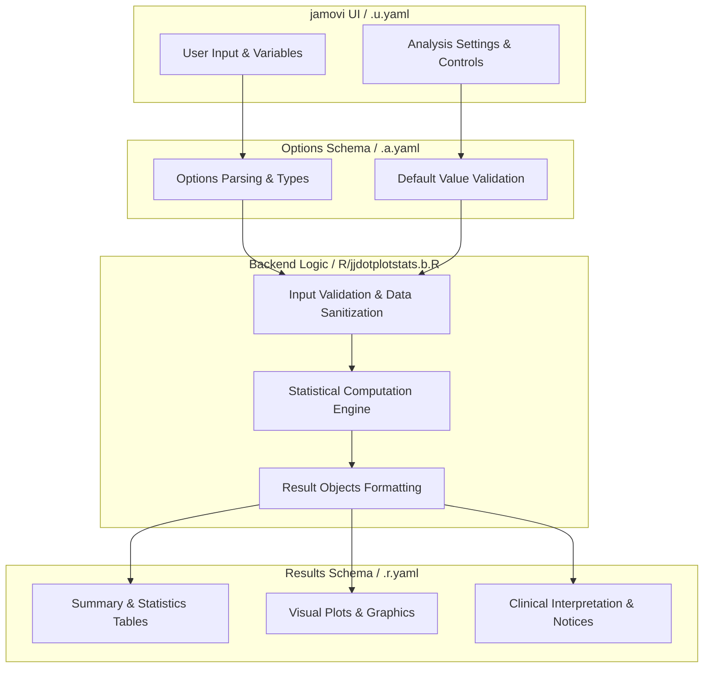
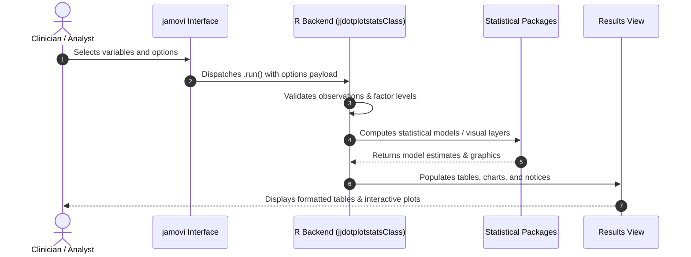

# Horizontal Box-Violin Comparison - Developer Documentation

## 1. Overview

- **Function**: `jjdotplotstats`
- **Title**: Horizontal Box-Violin Comparison
- **Module**: `JJStatsPlotT`
- **Files**:
  - `jamovi/jjdotplotstats.u.yaml` - User Interface Definition
  - `jamovi/jjdotplotstats.a.yaml` - Options & Schema Definition
  - `jamovi/jjdotplotstats.r.yaml` - Results Layout & Tables
  - `R/jjdotplotstats.b.R` - Backend Implementation
- **Summary**: Compares a continuous variable across groups and draws the comparison horizontally - values on the x axis, group labels down the y axis - with an optional vertical reference line. Wraps ggstatsplot::ggbetweenstats and ggstatsplot::grouped_ggbetweenstats, so the figure is a box-violin plot with the individual observations shown, and the test is a between-groups comparison using every observation.  This analysis was previously titled "Dot Chart", which described neither the figure nor the statistic: it draws violins and boxplots, not a dot chart, and it is a between-groups test rather than a one-sample one. For a genuine Cleveland dot chart - one summary point per label, tested against a reference value - use "Dot Chart (Summary vs Reference Value)", which wraps ggstatsplot::ggdotplotstats.  Prefer this over "Box-Violin Plots to Compare Between Groups" when the group labels are long or numerous, since the horizontal layout gives them room, or when a clinical threshold line is useful.

## 1a. Changelog

- **Date**: 2026-08-29
- **Summary**: Comprehensive documentation suite created & verified against active schemas and backend implementation.

## 2. Options Reference (`.a.yaml`)

| Option | Type | Default | Description |
| :--- | :--- | :--- | :--- |
| `data` | `Data` | `NULL` |  |
| `dep` | `Variable` | `NULL` | Dependent Variable |
| `group` | `Variable` | `NULL` | Grouping Variable |
| `grvar` | `Variable` | `NULL` | Split By (Optional) |
| `typestatistics` | `List` | `parametric` | Statistical Test Type |
| `effsizetype` | `List` | `biased` | Effect Size Measure |
| `centralityplotting` | `Bool` | `FALSE` | Central tendency lines |
| `centralitytype` | `List` | `parametric` | Central Tendency Measure |
| `mytitle` | `String` | `` | Plot Title |
| `xtitle` | `String` | `` | X-axis Label (Values) |
| `ytitle` | `String` | `` | Y-axis Label (Groups) |
| `originaltheme` | `Bool` | `FALSE` | Original ggstatsplot theme |
| `resultssubtitle` | `Bool` | `FALSE` | Statistical results in plot |
| `testvalue` | `Number` | `0` | Reference Line Value |
| `bfmessage` | `Bool` | `FALSE` | Bayes factor interpretation |
| `conflevel` | `Number` | `0.95` | Confidence Level |
| `k` | `Integer` | `2` | Statistical Precision (Decimal Places) |
| `testvalueline` | `Bool` | `FALSE` | Reference value line |
| `centralityparameter` | `List` | `mean` | Central Tendency Display |
| `centralityk` | `Integer` | `2` | Central Tendency Precision (no longer used) |
| `plotwidth` | `Integer` | `650` | Plot Width (pixels) |
| `plotheight` | `Integer` | `450` | Plot Height (pixels) |

## 3. Results Definition (`.r.yaml`)

| Output ID | Type | Title | Description |
| :--- | :--- | :--- | :--- |
| `todo` | `Html` | `To Do` |  |
| `notices` | `Html` | `Notices` |  |
| `plot2` | `Image` | ``${dep} - {group} by {grvar}`` |  |
| `plot` | `Image` | ``${dep} - {group}`` |  |

## 4. Architecture & Data Flow Diagram

```mermaid
flowchart TD
  subgraph UI[jamovi UI / .u.yaml]
    U1[User Input & Variables]
    U2[Analysis Settings & Controls]
  end

  subgraph Opts[Options Schema / .a.yaml]
    O1[Options Parsing & Types]
    O2[Default Value Validation]
  end

  subgraph Backend[Backend Logic / R/jjdotplotstats.b.R]
    B1[Input Validation & Data Sanitization]
    B2[Statistical Computation Engine]
    B3[Result Objects Formatting]
  end

  subgraph Res[Results Schema / .r.yaml]
    R1[Summary & Statistics Tables]
    R2[Visual Plots & Graphics]
    R3[Clinical Interpretation & Notices]
  end

  U1 --> O1
  U2 --> O2
  O1 --> B1
  O2 --> B1
  B1 --> B2
  B2 --> B3
  B3 --> R1
  B3 --> R2
  B3 --> R3
```

## 5. Execution Sequence

```mermaid
sequenceDiagram
  autonumber
  actor User as Clinician / Analyst
  participant UI as jamovi Interface
  participant Backend as R Backend (jjdotplotstatsClass)
  participant Engine as Statistical Packages
  participant Results as Results View

  User->>UI: Selects variables and options
  UI->>Backend: Dispatches .run() with options payload
  Backend->>Backend: Validates observations & factor levels
  Backend->>Engine: Computes statistical models / visual layers
  Engine-->>Backend: Returns model estimates & graphics
  Backend->>Results: Populates tables, charts, and notices
  Results-->>User: Displays formatted tables & interactive plots
```

## 6. Change Impact & Safety Guidelines

- **Data Filtering**: Ensure observations with missing values are handled gracefully according to analysis options.
- **Formula Conflicts**: Use isolated environment calls or base formula methods when interacting with `ggstatsplot` or formula parsers.
- **Safe Deparsing**: Use `deparse(val)` in syntax generation (`asSource()`) to escape column names with spaces or special symbols.

