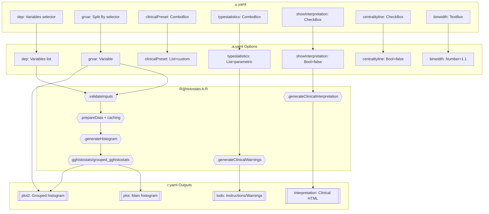
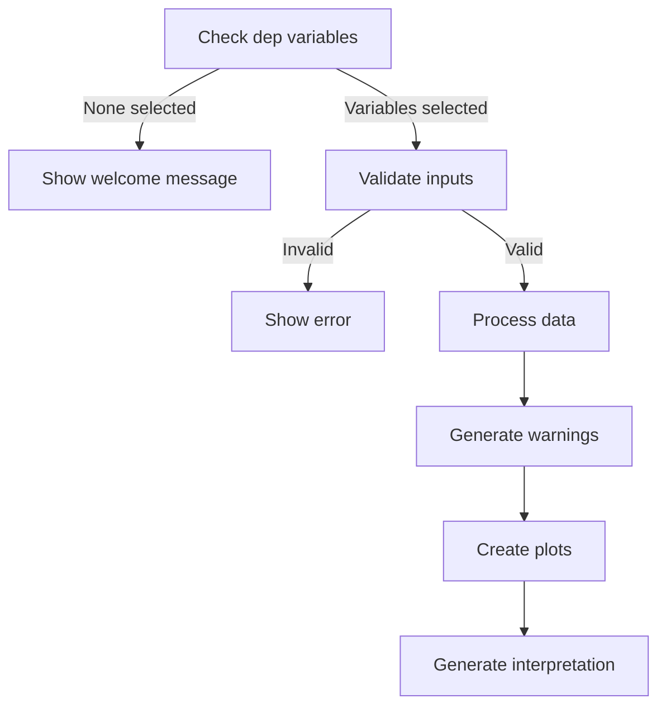
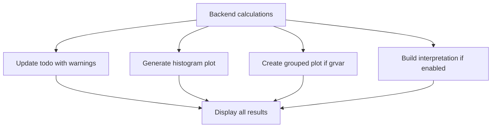
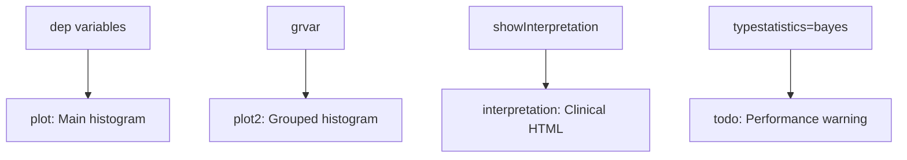

# jjhistostats Function Documentation

## 1. Overview

- **Function**: `jjhistostats`
- **Files**:
  - `jamovi/jjhistostats.u.yaml` — UI
  - `jamovi/jjhistostats.a.yaml` — Options
  - `R/jjhistostats.b.R` — Backend
  - `jamovi/jjhistostats.r.yaml` — Results
- **Summary**: The jjhistostats function creates statistical histograms with clinical interpretation for continuous variables. It wraps ggstatsplot functions to provide distribution analysis with normality tests, centrality measures, and clinical context for biomarker, lab value, and patient characteristic analysis.

## 2. UI Controls → Options Map

| UI Control | Type | Label | Binds to Option | Defaults & Constraints | Visibility/Enable Rules |
|------------|------|-------|----------------|----------------------|-------------------------|
| dep | VariablesListBox | Variables | dep | suggested: continuous, permitted: numeric | Always visible |
| grvar | VariablesListBox | Split By (Optional) | grvar | maxItemCount: 1, suggested: ordinal/nominal | Always visible |
| clinicalPreset | ComboBox | Clinical Presets | clinicalPreset | default: custom | Events: onChange_clinicalPreset |
| typestatistics | ComboBox | Statistical Analysis | typestatistics | default: parametric | Events: onChange_typestatistics |
| test.value | TextBox | Test Value | test.value | default: 0, format: number | Events: onChange_test_value |
| conf.level | TextBox | Confidence Level | conf.level | default: 0.95, min: 0, max: 1 | Events: onChange_conf_level |
| bf.message | CheckBox | Bayes Factor Message | bf.message | default: false | Always visible |
| digits | TextBox | Decimal Places | digits | default: 2, min: 0, max: 5 | Events: onChange_digits |
| title | TextBox | Plot Title | title | default: '', format: string | Always visible |
| subtitle | TextBox | Plot Subtitle | subtitle | default: '', format: string | Always visible |
| caption | TextBox | Plot Caption | caption | default: '', format: string | Always visible |
| xlab | TextBox | X-axis Label | xlab | default: '', format: string | Always visible |
| resultssubtitle | CheckBox | Statistical Results | resultssubtitle | default: false | Always visible |
| showInterpretation | CheckBox | Show Clinical Interpretation | showInterpretation | default: false | Always visible |
| changebinwidth | CheckBox | Change Bin Width | changebinwidth | default: false | Always visible |
| binwidth | TextBox | Bin Width | binwidth | default: 1.1, format: number | Enable: changebinwidth |
| binfill | TextBox | Bin Fill Color | binfill | default: 'skyblue' | Events: onChange_binfill |
| bincolor | TextBox | Bin Border Color | bincolor | default: 'black' | Always visible |
| binalpha | TextBox | Bin Transparency | binalpha | default: 0.7, min: 0, max: 1 | Events: onChange_binalpha |
| centralityline | CheckBox | Centrality Line | centralityline | default: false | Always visible |
| centralitytype | ComboBox | Centrality Type | centralitytype | default: default | Enable: centralityline |
| centralitylinecolor | TextBox | Centrality Line Color | centralitylinecolor | default: 'blue' | Enable: centralityline |
| centralitylinewidth | TextBox | Centrality Line Width | centralitylinewidth | default: 1, min: 0.1, max: 5 | Enable: centralityline |
| centralitylinetype | ComboBox | Centrality Line Type | centralitylinetype | default: dashed | Enable: centralityline |
| plotwidth | TextBox | Plot Width | plotwidth | default: 600, min: 300, max: 1200 | Events: onChange_plotwidth |
| plotheight | TextBox | Plot Height | plotheight | default: 450, min: 300, max: 800 | Events: onChange_plotheight |

## 3. Options Reference (.a.yaml)

| Name | Type | Default | Description | Downstream Effects |
|------|------|---------|-------------|-------------------|
| **data** | Data | — | The data frame | Source data for all analysis |
| **dep** | Variables | — | One or more continuous numeric variables for histograms | Determines number of plots, validated in `.validateInputs()`, iterated in `.plot()` |
| **grvar** | Variable | — | Optional grouping variable for comparison | Enables grouped_gghistostats, adjusts plot2 size in `.init()` |
| **typestatistics** | List | parametric | Statistical test type (parametric/nonparametric/robust/bayes) | Controls statistical methods in gghistostats, triggers performance warnings for bayes |
| **centralityline** | Bool | false | Display vertical line at central tendency | Passed to centrality.plotting in gghistostats |
| **changebinwidth** | Bool | false | Enable manual bin width control | Gates binwidth parameter usage |
| **binwidth** | Number | 1.1 | Manual bin width for histogram | Only used when changebinwidth=true |
| **resultssubtitle** | Bool | false | Display statistical results in plot subtitle | Passed to results.subtitle in gghistostats |
| **showInterpretation** | Bool | false | Generate clinical interpretation | Controls interpretation HTML output generation |
| **clinicalPreset** | List | custom | Predefined clinical configurations | Triggers events to set multiple options via JavaScript |
| **test.value** | Number | 0 | Value for one-sample test comparison | Passed to gghistostats for hypothesis testing |
| **conf.level** | Number | 0.95 | Confidence level for intervals | Used in statistical calculations (0-1 range) |
| **bf.message** | Bool | false | Display Bayes Factor in subtitle | Controls Bayesian statistics display |
| **digits** | Integer | 2 | Decimal places in statistics | Controls precision of displayed values |
| **xlab** | String | '' | Custom x-axis label | Overrides default variable name |
| **title** | String | '' | Plot title | Main title for histogram |
| **subtitle** | String | '' | Plot subtitle | Overrides statistical results if provided |
| **caption** | String | '' | Plot caption | Bottom text for plot |
| **centralitytype** | List | default | Central tendency measure type | Controls mean/median/trimmed mean display |
| **binfill** | String | skyblue | Histogram bin fill color | Aesthetic control via bin.args |
| **bincolor** | String | black | Histogram bin border color | Aesthetic control via bin.args |
| **binalpha** | Number | 0.7 | Bin transparency (0-1) | Aesthetic control via bin.args |
| **centralitylinecolor** | String | blue | Centrality line color | Aesthetic via centrality.line.args |
| **centralitylinewidth** | Number | 1 | Centrality line width | Aesthetic via centrality.line.args |
| **centralitylinetype** | List | dashed | Line type for centrality | Aesthetic via centrality.line.args |
| **plotwidth** | Integer | 600 | Plot width in pixels | Sets plot dimensions in `.init()` |
| **plotheight** | Integer | 450 | Plot height in pixels | Sets plot dimensions in `.init()` |

## 4. Backend Usage (.b.R)

### Key `self$options` References:

**self$options$dep** (lines 27, 53, 110, 498, 523, 594, 619, 630, 669)
- **Code Locations**: `.init()`, `.calculateOptionsHash()`, `.prepareData()`, `.run()`, `.plot()`, `.plot2()`
- **Logic Summary**: Primary variable selection, determines plot count, validation checks
- **Result Population**: Controls plot generation, interpretation content

**self$options$grvar** (lines 36, 40, 58, 280, 675, 696)
- **Code Locations**: `.init()`, `.calculateOptionsHash()`, `.generateClinicalWarnings()`, `.plot2()`
- **Logic Summary**: Optional grouping for comparative analysis
- **Result Population**: Enables plot2 output, adjusts dimensions

**self$options$typestatistics** (lines 59, 301, 466)
- **Code Locations**: `.calculateOptionsHash()`, `.generatePerformanceWarnings()`, `.prepareOptions()`
- **Logic Summary**: Controls statistical method selection, triggers Bayesian warnings
- **Result Population**: Affects subtitle content, performance messages in todo

**self$options$showInterpretation** (lines 339, 580)
- **Code Locations**: `.generateClinicalInterpretation()`, `.run()`
- **Logic Summary**: Gates clinical interpretation generation
- **Result Population**: Controls interpretation HTML output visibility

**self$options$changebinwidth** (lines 60, 221, 471)
- **Code Locations**: `.calculateOptionsHash()`, `.validateInputs()`, `.prepareOptions()`
- **Logic Summary**: Determines if manual binwidth is used
- **Result Population**: Affects histogram bin resolution

**self$options$binwidth** (lines 61, 222, 472)
- **Code Locations**: `.calculateOptionsHash()`, `.validateInputs()`, `.prepareOptions()`
- **Logic Summary**: Manual bin width value when enabled
- **Result Population**: Controls histogram granularity

### Cache System Implementation:
```r
# Lines 54-93: MD5 hash-based cache invalidation
.calculateOptionsHash = function() {
    options_to_hash <- list(dep, grvar, typestatistics, ...)
    digest::digest(options_to_hash, algo = "md5")
}
```

### Clinical Warnings System:
```r
# Lines 229-294: Clinical assumption checking
.generateClinicalWarnings = function(data, variables) {
    # Checks: sample size < 30, outliers > 3 MAD, constant values, few unique values
    # Group size warnings for grouped analysis
}
```

### Performance Warnings:
```r
# Lines 296-335: Bayesian analysis performance alerts
if (typestatistics == "bayes" && n_rows > 1000) {
    "SLOW COMPUTATION WARNING: may take several minutes"
}
```

## 5. Results Definition (.r.yaml)

| Output ID | Type | Title | Visibility | Schema/Content |
|-----------|------|-------|------------|----------------|
| **todo** | Html | To Do | Always visible | Instructions and warnings HTML |
| **plot** | Image | Histogram | requiresData: true | Main histogram image, renderFun: .plot |
| **plot2** | Image | Histogram Splitted by {grvar} | visible: (grvar), requiresData: true | Grouped histogram, renderFun: .plot2 |
| **interpretation** | Html | Clinical Interpretation | visible: (showInterpretation) | Clinical analysis HTML content |

### Population Entry Points:
- **todo**: Set via `self$results$todo$setContent()` at lines 102, 462, 502, 537, 543, 569
- **plot**: Rendered by `.plot()` method (lines 591-662)
- **plot2**: Rendered by `.plot2()` method (lines 666-744)
- **interpretation**: Set via `self$results$interpretation$setContent()` at line 583

## 6. Data Flow Diagram (UI → Options → Backend → Results)



## 7. Execution Sequence (User Action → Results)

### User Input Flow


### Decision Logic


### Result Processing


**Step-by-step execution flow:**

1. **User interacts with UI controls** → Variables selected in dep, optional grvar, preset chosen
2. **Backend validation** (`private$.validateInputs()`) → Check variables exist, data not empty, binwidth positive
3. **Data processing** (`private$.prepareData()`) → Convert to numeric if needed, exclude NA, cache results
4. **Clinical checks** (`private$.generateClinicalWarnings()`) → Sample size, outliers, constant values warnings
5. **Performance checks** (`private$.generatePerformanceWarnings()`) → Bayesian analysis timing alerts
6. **Analysis execution** → Call ggstatsplot functions with prepared parameters
7. **Results population** → 
   - `self$results$todo$setContent()` for warnings
   - `.plot()` renders main histogram
   - `.plot2()` renders grouped histogram if grvar
   - `self$results$interpretation$setContent()` if showInterpretation
8. **Display application** → Show visible results per `.r.yaml` rules



## 8. Change Impact Guide

### Key Option Changes:

**dep (Variables)**
- **If changed**: Entire analysis recalculates, plot count adjusts, new clinical warnings
- **Common pitfalls**: Non-numeric variables need conversion, empty selections show welcome
- **Recommended defaults**: Start with single variable for faster initial analysis

**typestatistics**
- **If changed**: Statistical method changes, Bayesian triggers performance warnings
- **Common pitfalls**: Bayesian very slow for large datasets (>1000 rows)
- **Recommended defaults**: parametric for normal data, nonparametric for skewed

**clinicalPreset**
- **If changed**: Multiple options auto-configured via JavaScript events
- **Common pitfalls**: Overrides manual settings
- **Recommended defaults**: custom for manual control, lab_values for clinical data

**showInterpretation**
- **If changed**: Toggles clinical interpretation generation
- **Performance implications**: Additional computation for statistics and text generation
- **Recommended defaults**: false for quick analysis, true for clinical reporting

**changebinwidth/binwidth**
- **If changed**: Manual histogram resolution control
- **Common pitfalls**: Too small creates noise, too large hides patterns
- **Recommended defaults**: Auto-calculation (changebinwidth=false)

## 9. Example Usage

**Example dataset requirements:**
- Continuous numeric variables (age, BMI, lab values, biomarkers)
- Optional categorical grouping variable (treatment group, disease stage)
- Minimum 30 observations for reliable parametric tests

**Example option payload:**
```yaml
dep: ["age_years", "tumor_size_mm"]
grvar: "treatment_group"
typestatistics: "parametric"
centralityline: true
showInterpretation: true
clinicalPreset: "lab_values"
```

**Expected outputs:**
- Main histogram showing age and tumor size distributions with mean lines
- Grouped histograms comparing distributions across treatment groups
- Clinical interpretation with distribution shape assessment
- Warnings for small sample sizes or extreme outliers

## 10. Appendix (Schemas & Snippets)

### Cache System Implementation
```r
# Lines 86-93: Cache invalidation check
.shouldRefreshCache = function() {
    current_hash <- private$.calculateOptionsHash()
    if (is.null(private$.optionsHash) || 
        private$.optionsHash != current_hash) {
        private$.optionsHash <- current_hash
        return(TRUE)
    }
    return(FALSE)
}
```

### Histogram Generation Core
```r
# Lines 148-195: Shared plot generation
.generateHistogram = function(data, x_var, options_data, 
                              aesthetics_data, grvar_sym = NULL) {
    base_args <- list(
        data = data,
        x = rlang::sym(x_var),
        type = options_data$typestatistics,
        centrality.plotting = options_data$centralityline,
        binwidth = options_data$binwidth,
        # ... aesthetic arguments
    )
    
    if (is.null(grvar_sym)) {
        do.call(ggstatsplot::gghistostats, base_args)
    } else {
        do.call(ggstatsplot::grouped_gghistostats, base_args)
    }
}
```

### Clinical Interpretation Builder
```r
# Lines 366-389: Distribution assessment
var_interpretation <- paste0(
    "<h4>", var, "</h4>",
    "<li><strong>Distribution shape:</strong> ",
    if (abs(skewness_val) < 0.5) {
        "Approximately symmetric (suitable for parametric tests)"
    } else if (skewness_val > 0.5) {
        "Right-skewed (consider nonparametric tests)"
    } else {
        "Left-skewed (consider nonparametric tests)"
    }
)
```

### Events System Integration
The function integrates with `jamovi/js/jjhistostats.events.js` for dynamic UI updates:
- `onChange_clinicalPreset`: Sets multiple options based on clinical context
- `onChange_typestatistics`: Adjusts centrality type and Bayes Factor display
- `onChange_binwidth`: Validates bin width with guidance
- Performance warnings for Bayesian analysis displayed dynamically