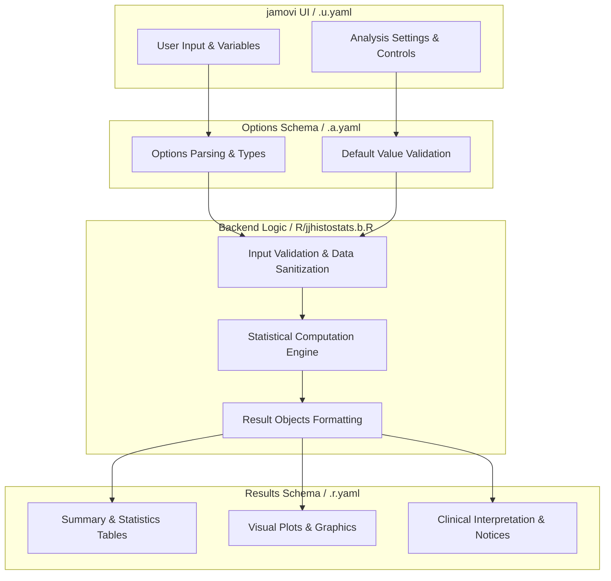
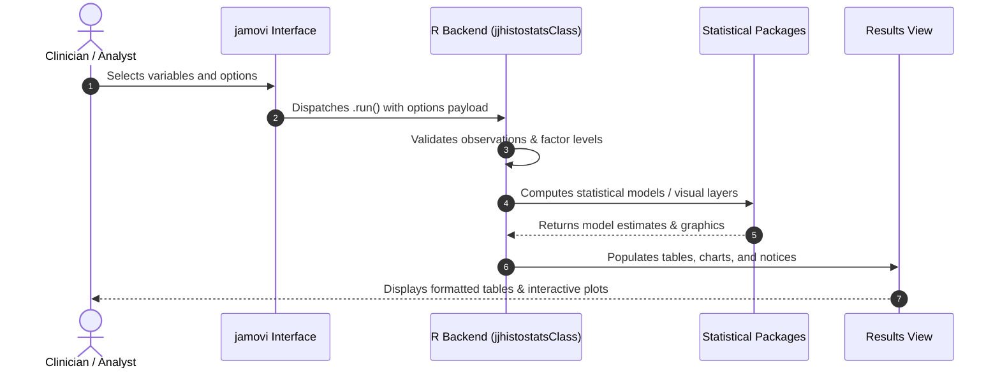

# Histogram - Developer Documentation

## 1. Overview

- **Function**: `jjhistostats`
- **Title**: Histogram
- **Module**: `JJStatsPlotT`
- **Files**:
  - `jamovi/jjhistostats.u.yaml` - User Interface Definition
  - `jamovi/jjhistostats.a.yaml` - Options & Schema Definition
  - `jamovi/jjhistostats.r.yaml` - Results Layout & Tables
  - `R/jjhistostats.b.R` - Backend Implementation
- **Summary**: 'Wrapper Function for ggstatsplot::gghistostats and ggstatsplot::grouped_gghistostats to generate Histogram.'

## 1a. Changelog

- **Date**: 2026-08-29
- **Summary**: Comprehensive documentation suite created & verified against active schemas and backend implementation.

## 2. Options Reference (`.a.yaml`)

| Option | Type | Default | Description |
| :--- | :--- | :--- | :--- |
| `data` | `Data` | `NULL` |  |
| `dep` | `Variables` | `NULL` | Variables |
| `grvar` | `Variable` | `NULL` | Split By (Optional) |
| `typestatistics` | `List` | `parametric` | Type of Statistic |
| `centralityline` | `Bool` | `FALSE` | Centrality line |
| `changebinwidth` | `Bool` | `FALSE` | Change bin width |
| `binwidth` | `Number` | `1.1` | Bin Width (Default is max(x) - min(x) / sqrt(N)) |
| `resultssubtitle` | `Bool` | `FALSE` | Statistical results |
| `showInterpretation` | `Bool` | `FALSE` | Clinical interpretation |
| `clinicalPreset` | `List` | `custom` | Clinical Analysis Preset |
| `enableOneSampleTest` | `Bool` | `FALSE` | One-sample test |
| `test.value` | `Number` | `0` | Test Value |
| `conf.level` | `Number` | `0.95` | Confidence Level |
| `bf.message` | `Bool` | `FALSE` | Bayes factor message |
| `digits` | `Integer` | `2` | Decimal Places |
| `xlab` | `String` | `` | X-axis Label |
| `title` | `String` | `` | Plot Title |
| `subtitle` | `String` | `` | Plot Subtitle |
| `caption` | `String` | `` | Plot Caption |
| `centralitytype` | `List` | `default` | Centrality Type |
| `binfill` | `String` | `skyblue` | Bin Fill Color |
| `bincolor` | `String` | `black` | Bin Border Color |
| `binalpha` | `Number` | `0.7` | Bin Transparency |
| `centralitylinecolor` | `String` | `blue` | Centrality Line Color |
| `centralitylinewidth` | `Number` | `1` | Centrality Line Width |
| `centralitylinetype` | `List` | `dashed` | Centrality Line Type |
| `plotwidth` | `Integer` | `600` | Plot Width |
| `plotheight` | `Integer` | `450` | Plot Height |
| `addGGPubrPlot` | `Bool` | `FALSE` | Add ggpubr histogram |
| `ggpubrPalette` | `String` | `#0073C2FF` | ggpubr Fill Color |
| `ggpubrAddDensity` | `Bool` | `FALSE` | Add density curve (ggpubr) |
| `ggpubrAddMean` | `Bool` | `FALSE` | Add mean line (ggpubr) |
| `addDistributionDiagnostics` | `Bool` | `FALSE` | Add distribution diagnostic plots |
| `ggpubrDensityColor` | `String` | `#0073C2FF` | Density Plot Fill Color |
| `ggpubrShowQQ` | `Bool` | `FALSE` | QQ plot |
| `ggpubrShowECDF` | `Bool` | `FALSE` | ECDF plot |

## 3. Results Definition (`.r.yaml`)

| Output ID | Type | Title | Description |
| :--- | :--- | :--- | :--- |
| `todo` | `Html` | `To Do` |  |
| `plot2` | `Image` | ``Histogram Splitted by {grvar}`` |  |
| `plot` | `Image` | `Histogram` |  |
| `interpretation` | `Html` | `Clinical Interpretation` |  |
| `ggpubrPlot` | `Image` | `Publication-Ready Histogram ggpubr` |  |
| `ggpubrPlot2` | `Image` | ``Publication-Ready Histogram ggpubr by ${grvar}`` |  |
| `densityPlot` | `Image` | `Density Plot ggpubr` |  |
| `qqPlot` | `Image` | `QQ Plot - Normality Assessment ggpubr` |  |
| `ecdfPlot` | `Image` | `Empirical CDF ggpubr` |  |

## 4. Architecture & Data Flow Diagram

```mermaid
flowchart TD
  subgraph UI[jamovi UI / .u.yaml]
    U1[User Input & Variables]
    U2[Analysis Settings & Controls]
  end

  subgraph Opts[Options Schema / .a.yaml]
    O1[Options Parsing & Types]
    O2[Default Value Validation]
  end

  subgraph Backend[Backend Logic / R/jjhistostats.b.R]
    B1[Input Validation & Data Sanitization]
    B2[Statistical Computation Engine]
    B3[Result Objects Formatting]
  end

  subgraph Res[Results Schema / .r.yaml]
    R1[Summary & Statistics Tables]
    R2[Visual Plots & Graphics]
    R3[Clinical Interpretation & Notices]
  end

  U1 --> O1
  U2 --> O2
  O1 --> B1
  O2 --> B1
  B1 --> B2
  B2 --> B3
  B3 --> R1
  B3 --> R2
  B3 --> R3
```

## 5. Execution Sequence

```mermaid
sequenceDiagram
  autonumber
  actor User as Clinician / Analyst
  participant UI as jamovi Interface
  participant Backend as R Backend (jjhistostatsClass)
  participant Engine as Statistical Packages
  participant Results as Results View

  User->>UI: Selects variables and options
  UI->>Backend: Dispatches .run() with options payload
  Backend->>Backend: Validates observations & factor levels
  Backend->>Engine: Computes statistical models / visual layers
  Engine-->>Backend: Returns model estimates & graphics
  Backend->>Results: Populates tables, charts, and notices
  Results-->>User: Displays formatted tables & interactive plots
```

## 6. Change Impact & Safety Guidelines

- **Data Filtering**: Ensure observations with missing values are handled gracefully according to analysis options.
- **Formula Conflicts**: Use isolated environment calls or base formula methods when interacting with `ggstatsplot` or formula parsers.
- **Safe Deparsing**: Use `deparse(val)` in syntax generation (`asSource()`) to escape column names with spaces or special symbols.

