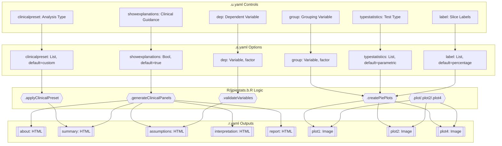
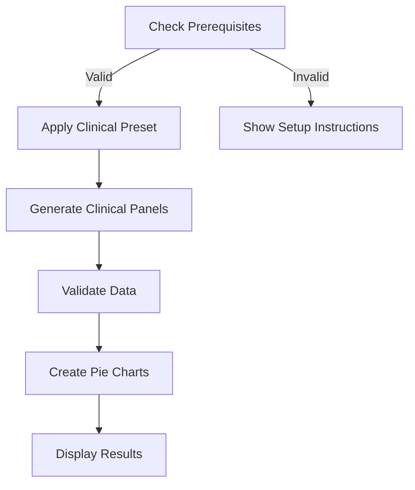
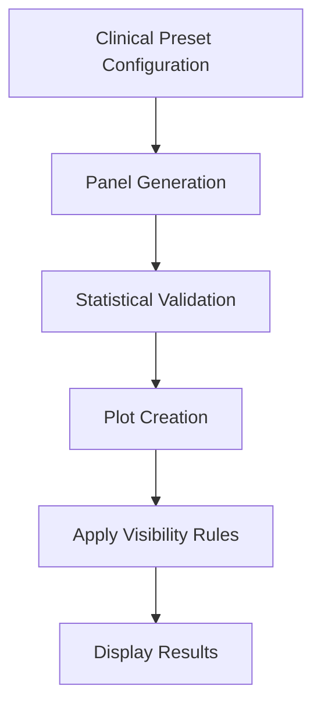
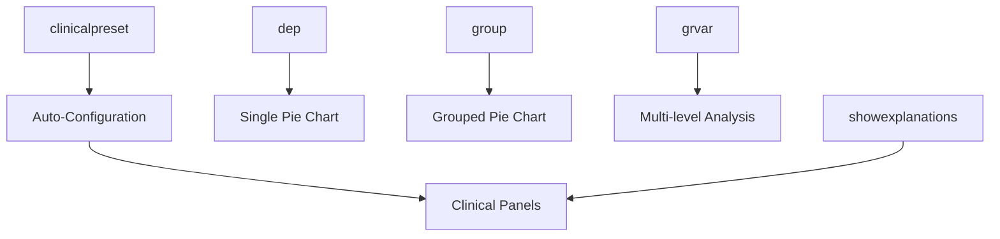

# jjpiestats Function Documentation

## 1. Overview

- **Function**: `jjpiestats`
- **Files**:
  - `jamovi/jjpiestats.u.yaml` — UI
  - `jamovi/jjpiestats.a.yaml` — Options
  - `R/jjpiestats.b.R` — Backend
  - `jamovi/jjpiestats.r.yaml` — Results

**Summary**: A comprehensive wrapper for `ggstatsplot::ggpiestats` and `ggstatsplot::grouped_ggpiestats` that generates statistical pie charts with clinical interpretation features. The function compares categorical variables across groups using various statistical tests (chi-square, Fisher's exact, Bayesian) with optional grouped analysis, while providing clinical context through preset configurations and interpretative panels.

## 1a. Changelog

- Date: 2025-01-20
- Summary: Enhanced function with clinical preset system and interpretation panels
- Changes:
  - Options: Added `clinicalpreset` and `showexplanations` with clinical defaults
  - Backend: Added 5 clinical interpretation methods and preset configuration system
  - Results schema: Added 5 new HTML panels (about, summary, assumptions, interpretation, report)
  - Diagrams: New comprehensive flow showing clinical enhancement integration

## 2. UI Controls → Options Map

| UI Control | Type | Label | Binds to Option | Default | Constraints | Visibility/Enable |
|------------|------|-------|----------------|---------|-------------|-------------------|
| `clinicalpreset` | ComboBox | Analysis Type | `clinicalpreset` | custom | 4 preset options | Always visible |
| `showexplanations` | CheckBox | Show Clinical Guidance | `showexplanations` | true | Boolean | Always visible |
| `dep` | VariablesListBox | Dependent Variable | `dep` | NULL | Single factor variable | Always visible |
| `group` | VariablesListBox | Grouping Variable: (Optional) | `group` | NULL | Single factor variable | Always visible |
| `grvar` | VariablesListBox | Split By (Optional) | `grvar` | NULL | Single factor variable | Always visible |
| `counts` | VariablesListBox | Frequency Counts (Optional) | `counts` | NULL | Single numeric variable | Always visible |
| `paired` | CheckBox | Paired/Matched Data (McNemar's Test) | `paired` | false | Boolean | Always visible |
| `typestatistics` | ComboBox | Test Type | `typestatistics` | parametric | 4 statistical types | Always visible |
| `proportiontest` | CheckBox | Include Proportion Tests | `proportiontest` | true | Boolean | Always visible |
| `bfmessage` | CheckBox | Show Bayes Factor (for Bayesian) | `bfmessage` | true | Boolean | Always visible |
| `conflevel` | TextBox | Confidence Level (0.50-0.99) | `conflevel` | 0.95 | 0.50-0.99 | Always visible |
| `ratio` | TextBox | Expected Proportions (e.g., 0.5,0.5) | `ratio` | '' | String format | Always visible |
| `originaltheme` | CheckBox | Use ggstatsplot Theme | `originaltheme` | false | Boolean | Always visible |
| `resultssubtitle` | CheckBox | Show Statistics in Plot Subtitle | `resultssubtitle` | false | Boolean | Always visible |
| `messages` | CheckBox | Show Console Messages | `messages` | false | Boolean | Always visible |
| `label` | ComboBox | Slice Label Type | `label` | percentage | 3 label types | Always visible |
| `digits` | TextBox | Decimal Places (Statistics) | `digits` | 2 | 0-5 integer | Always visible |

## 3. Options Reference (.a.yaml)

### Core Variables
- **dep** / Variable / NULL — Dependent variable for pie chart analysis (categorical/ordinal)
- **group** / Variable / NULL — Optional grouping variable for comparison (categorical/ordinal) 
- **grvar** / Variable / NULL — Optional splitting variable for grouped analysis
- **counts** / Variable / NULL — Optional frequency counts variable (numeric)

### Clinical Configuration
- **clinicalpreset** / List / custom — Predefined clinical analysis configurations:
  - `custom`: Manual configuration
  - `diagnostic`: 2×2 diagnostic test tables
  - `treatment`: Treatment response comparisons
  - `biomarker`: Biomarker distribution analysis
- **showexplanations** / Bool / true — Display clinical interpretation panels

### Data Handling
- **paired** / Bool / false — Use paired analysis (McNemar's test vs chi-square)

### Statistical Methods
- **typestatistics** / List / parametric — Statistical test type:
  - `parametric`: Chi-square test
  - `nonparametric`: Fisher's exact test or non-parametric alternatives
  - `robust`: Robust statistical methods
  - `bayes`: Bayesian analysis
- **proportiontest** / Bool / true — Include proportion tests
- **bfmessage** / Bool / true — Display Bayes Factor (Bayesian only)

### Advanced Parameters
- **conflevel** / Number / 0.95 — Confidence/credible interval level (0.50-0.99)
- **ratio** / String / '' — Expected proportions for tests (comma-separated)

### Presentation
- **originaltheme** / Bool / false — Use ggstatsplot theme
- **resultssubtitle** / Bool / false — Show statistics in plot subtitle
- **messages** / Bool / false — Display console messages
- **label** / List / percentage — Pie slice label display type (percentage/counts/both)
- **digits** / Integer / 2 — Decimal places for statistics (0-5)

## 4. Backend Usage (.b.R)

### Initialization (`.init`)
- **self$options$grvar, group**: Configure dynamic plot sizes based on group levels

### Clinical Enhancement (`.applyClinicalPreset`)
- **self$options$clinicalpreset**: Applies preset-specific parameter configurations
  - `diagnostic`: Enables statistical results display and proportion tests
  - `treatment`: Activates parametric methods with statistical results
  - `biomarker`: Sets robust statistics with both labels

### Clinical Panel Generation (`.generateClinicalPanels`)
- **self$options$showexplanations**: Triggers clinical interpretation panels:
  - `self$results$about$setContent()` — Analysis explanation
  - `self$results$summary$setContent()` — Analysis summary
  - `self$results$assumptions$setContent()` — Statistical assumptions and warnings
  - `self$results$interpretation$setContent()` — Results interpretation  
  - `self$results$report$setContent()` — Copy-ready report template

### Validation (`.validateVariables`, `.validateStatisticalRequirements`)
- **self$options$dep, group, grvar**: Variable existence and type checking
- **self$options$counts**: Numeric validation and negative value checks
- Statistical requirements validation with group size warnings

### Data Preparation (`.prepareData`)
- Uses caching system with MD5 hash verification for performance
- **self$options$excl**: Controls missing data handling (not exposed in UI)

### Plot Creation (`.plot1`, `.plot2`, `.plot4`)
- **self$options$ratio**: Parsed and validated via `.parseRatio()` helper method
- **Multiple options**: Mapped to ggstatsplot function arguments:
  - `typestatistics` → `type`
  - `paired` → `paired` 
  - `label` → `label`
  - `digits` → `digits`
  - `conflevel` → `conf.level`
  - `proportiontest` → `proportion.test`
  - `bfmessage` → `bf.message`
  - `resultssubtitle` → `results.subtitle`
  - `counts` → `counts` (processed as variable name)

### Performance Optimization
- **Plot theme caching**: `.getPlotTheme()` method caches theme objects
- **Data caching**: Advanced caching with hash-based invalidation

## 5. Results Definition (.r.yaml)

### HTML Outputs
- **about**: "About This Analysis" — Always visible clinical explanation panel
- **summary**: "Analysis Summary" — Conditional analysis summary (visible: dep)
- **assumptions**: "Statistical Assumptions & Warnings" — Real-time assumption validation (visible: always)
- **interpretation**: "Results Interpretation" — Context-specific interpretation guidance (visible: dep)
- **report**: "Copy-Ready Report" — Template for manuscript/report writing (visible: dep)
- **todo**: "Analysis Setup" — Welcome message and configuration guidance

### Image Outputs  
- **plot1**: "Pie Chart" — Single pie chart (`.plot1` renderFun, visible: dep)
- **plot2**: "Pie Chart" — Grouped pie chart (`.plot2` renderFun, visible: group)
- **plot4**: "${group} - {dep} by {grvar}" — Multi-level grouped analysis (`.plot4` renderFun, visible: grvar)

### Visibility Conditions
- Clinical panels (summary, interpretation, report): Conditional on `(dep)`
- plot2: Conditional on `(group)`
- plot4: Conditional on `(grvar)`
- about, todo, assumptions: Always visible

### Population Entry Points
- HTML panels: Populated in `.run()` when `showexplanations=true` via `.generateClinicalPanels()`
- Images: Rendered on-demand through respective `.plot()` methods
- Clear triggers: All results clear when any option in clearWith list changes

## 6. Data Flow Diagram



## 7. Execution Sequence

### User Input Flow


### Decision Logic



### Result Processing



**Step-by-step execution flow:**

1. **User configures analysis** → Selects variables, clinical preset, and display options
2. **Clinical preset application** → Auto-configures statistical methods and parameters based on clinical scenario
3. **Clinical panel generation** → Creates interpretative content when `showexplanations=true`
4. **Backend validation** → Checks variable types, missing data, statistical assumptions with contextual warnings
5. **Data preparation** → Handles missing data, validates counts variable, implements caching
6. **Statistical analysis** → Calls ggstatsplot with configured parameters and clinical context
7. **Results generation** → Creates pie charts and populates clinical interpretation panels
8. **Display update** → Shows relevant outputs based on visibility rules and user selections



## 8. Change Impact Guide

### Key Option Dependencies

**dep (Dependent Variable)**
- **If changed**: Recalculates all statistics, updates validation, refreshes clinical panels
- **Performance impact**: Minimal (single variable processing)
- **Common pitfalls**: Must be categorical, sufficient variation required

**group (Grouping Variable)**  
- **If changed**: New statistical comparisons, different group sizes affect tests
- **Performance impact**: Linear with number of groups
- **Common pitfalls**: Minimum 2 categories, adequate sample sizes per group

**clinicalpreset (Clinical Configuration)**
- **If changed**: Automatically reconfigures multiple related options
- **Performance impact**: Minimal (configuration only)
- **Recommended usage**: Start with preset, then customize as needed

**typestatistics (Statistical Method)**
- **If changed**: Different statistical tests, different assumptions, different interpretations
- **Performance impact**: Bayesian methods significantly slower
- **Recommendations**: Parametric for normal data, nonparametric for small samples, robust for outliers

**showexplanations (Clinical Guidance)**
- **If changed**: Shows/hides all interpretative panels
- **Performance impact**: Slight increase when enabled due to content generation
- **Recommendation**: Enable for learning/documentation, disable for routine analysis

**grvar (Grouping Variable for Splitting)**
- **If changed**: Adds/removes grouped analysis plots
- **Performance impact**: Exponential with number of split levels
- **Common pitfalls**: Can create many plots, memory intensive with large datasets

## 9. Example Usage

### Example Dataset Requirements
- **Categorical outcome variable**: treatment response (Complete Response/Partial Response/Stable Disease/Progressive Disease), tumor grade (G1/G2/G3)
- **Optional grouping variable**: treatment arm, patient group, biomarker status
- **Optional counts variable**: frequency data for pre-tabulated results
- **Optional splitting variable**: study site, hospital center

### Example Configuration (Diagnostic Preset)
```yaml
clinicalpreset: diagnostic
showexplanations: true
dep: test_result
group: patient_group  
typestatistics: parametric
resultssubtitle: true
conflevel: 0.95
```

### Expected Outputs
- **Single pie chart**: Proportional distribution with statistical test results
- **About panel**: Explanation of pie chart analysis and diagnostic test context
- **Summary panel**: Sample sizes, test method, confidence level
- **Assumptions panel**: Chi-square validity warnings, recommendations
- **Interpretation panel**: Clinical context and statistical guidance
- **Report template**: Copy-ready methods and results sections

### Example Configuration (Treatment Response Preset)
```yaml  
clinicalpreset: treatment
showexplanations: true
dep: response
group: treatment_arm
typestatistics: parametric
proportiontest: true
```

## 10. Appendix

### Clinical Preset Configurations

| Preset | Auto-Configured Options | Clinical Context |
|--------|-------------------------|------------------|
| diagnostic | resultssubtitle=true, proportiontest=true | Diagnostic test analysis, sensitivity/specificity context |
| treatment | typestatistics=parametric, resultssubtitle=true, proportiontest=true | Treatment comparisons with statistical results |
| biomarker | typestatistics=robust, resultssubtitle=true, label=both | Expression analysis with outlier resistance |

### Key Code Snippets

**Clinical Preset Application**:
```r
# Safe preset configuration with error handling
switch(self$options$clinicalpreset %||% "custom",
    "diagnostic" = {
        self$options$resultssubtitle <- TRUE
        self$options$proportiontest <- TRUE
        self$options$conflevel <- 0.95
    },
    "treatment" = {
        self$options$typestatistics <- "parametric"
        self$options$resultssubtitle <- TRUE
        self$options$proportiontest <- TRUE
    }
)
```

**Option Mapping to ggstatsplot**:
```r
# Comprehensive parameter mapping
plot1 <- ggstatsplot::ggpiestats(
    data = mydata,
    x = !!rlang::sym(dep),
    y = if(!is.null(group)) !!rlang::sym(group) else NULL,
    counts = counts_var,
    ratio = options_data$ratio,
    paired = options_data$paired,
    type = options_data$typestatistics,
    label = options_data$label,
    digits = options_data$digits,
    conf.level = options_data$conflevel,
    proportion.test = options_data$proportiontest,
    bf.message = options_data$bfmessage,
    results.subtitle = options_data$resultssubtitle
)
```

**Clinical Panel Population**:
```r
# Conditional clinical content generation
if (isTRUE(self$options$showexplanations)) {
    about_content <- private$.generateAboutContent()
    self$results$about$setContent(about_content)
    
    if (!is.null(self$options$dep)) {
        summary_content <- private$.generateSummaryContent()
        self$results$summary$setContent(summary_content)
        
        interpretation_content <- private$.generateInterpretationContent()
        self$results$interpretation$setContent(interpretation_content)
    }
}
```

**Performance Optimization**:
```r
# Plot theme caching for better performance
.getPlotTheme = function() {
    if (is.null(private$.plotTheme)) {
        private$.plotTheme <- if (!isTRUE(self$options$originaltheme)) {
            ggplot2::theme_bw()
        } else {
            ggstatsplot::theme_ggstatsplot()
        }
    }
    private$.plotTheme
}
```

This documentation provides a comprehensive reference for understanding and maintaining the `jjpiestats` function's enhanced clinical pie chart analysis capabilities with statistical testing and clinical interpretation features.