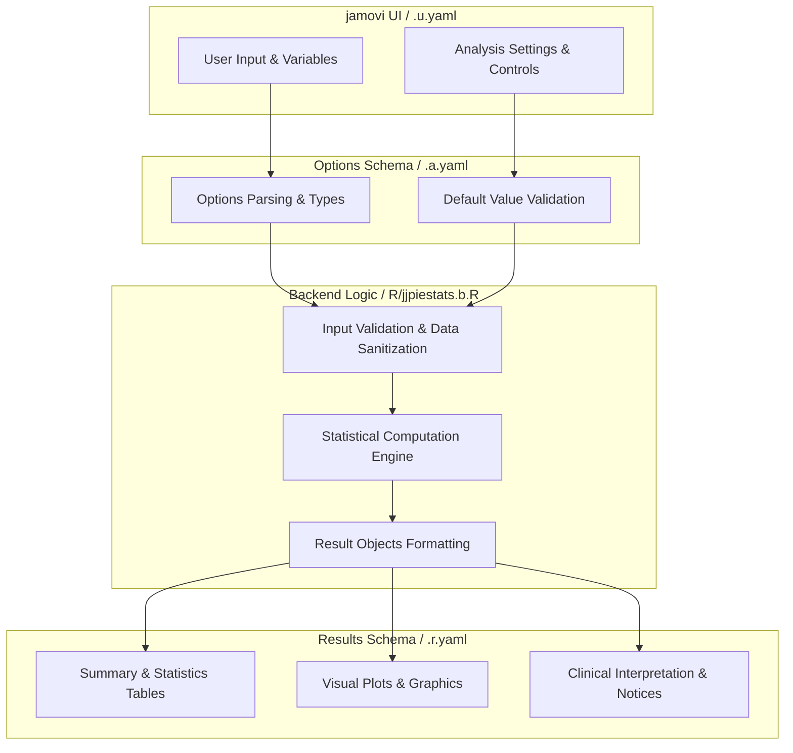
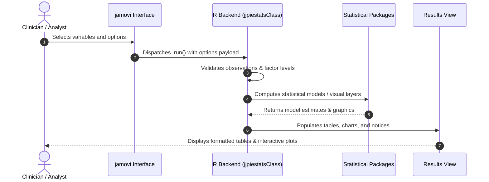

# Pie Charts - Developer Documentation

## 1. Overview

- **Function**: `jjpiestats`
- **Title**: Pie Charts
- **Module**: `JJStatsPlot`
- **Files**:
  - `jamovi/jjpiestats.u.yaml` - User Interface Definition
  - `jamovi/jjpiestats.a.yaml` - Options & Schema Definition
  - `jamovi/jjpiestats.r.yaml` - Results Layout & Tables
  - `R/jjpiestats.b.R` - Backend Implementation
- **Summary**: 'Wrapper Function for ggstatsplot::ggpiestats and ggstatsplot::grouped_ggpiestats to generate Pie Charts with statistical analysis.'

## 1a. Changelog

- **Date**: 2026-08-29
- **Summary**: Comprehensive documentation suite created & verified against active schemas and backend implementation.

## 2. Options Reference (`.a.yaml`)

| Option | Type | Default | Description |
| :--- | :--- | :--- | :--- |
| `data` | `Data` | `NULL` |  |
| `dep` | `Variable` | `NULL` | Dependent Variable |
| `group` | `Variable` | `NULL` | Grouping Variable: (Optional) |
| `grvar` | `Variable` | `NULL` | Split By (Optional) |
| `typestatistics` | `List` | `parametric` | Type of Statistic |
| `originaltheme` | `Bool` | `FALSE` | Add GGStatsPlot layer |
| `counts` | `Variable` | `NULL` | Counts Variable (Optional) |
| `ratio` | `String` | `` | Expected Proportions (Optional) |
| `paired` | `Bool` | `FALSE` | Paired/Repeated measures |
| `label` | `List` | `percentage` | Label Display |
| `digits` | `Integer` | `2` | Decimal Digits |
| `conflevel` | `Number` | `0.95` | Confidence Level |
| `proportiontest` | `Bool` | `FALSE` | Proportion test |
| `bfmessage` | `Bool` | `FALSE` | Bayes factor message |
| `messages` | `Bool` | `FALSE` | Console messages |
| `clinicalpreset` | `List` | `custom` | Clinical Analysis Preset |
| `showexplanations` | `Bool` | `FALSE` | Clinical explanations |
| `resultssubtitle` | `Bool` | `FALSE` | Statistical results |
| `showSummary` | `Bool` | `FALSE` | Analysis summary |
| `showAssumptions` | `Bool` | `FALSE` | Assumptions & warnings |
| `showInterpretation` | `Bool` | `FALSE` | Interpretation guide |
| `addGGPubrDonut` | `Bool` | `FALSE` | Add donut chart (ggpubr) |
| `ggpubrDonutPalette` | `List` | `jco` | Donut Chart Palette |

## 3. Results Definition (`.r.yaml`)

| Output ID | Type | Title | Description |
| :--- | :--- | :--- | :--- |
| `notices` | `Preformatted` | `Important Information` |  |
| `about` | `Html` | `About This Analysis` |  |
| `summary` | `Html` | `Analysis Summary` |  |
| `assumptions` | `Html` | `Statistical Assumptions & Warnings` |  |
| `interpretation` | `Html` | `Results Interpretation` |  |
| `report` | `Html` | `Copy-Ready Report` |  |
| `todo` | `Html` | `Analysis Setup` |  |
| `plot4` | `Image` | ``${group} - {dep} by {grvar}`` |  |
| `plot2` | `Image` | ``${group} - {dep}`` |  |
| `plot1` | `Image` | ``${dep}`` |  |
| `donutPlot` | `Image` | `Donut Chart` |  |

## 4. Architecture & Data Flow Diagram

```mermaid
flowchart TD
  subgraph UI[jamovi UI / .u.yaml]
    U1[User Input & Variables]
    U2[Analysis Settings & Controls]
  end

  subgraph Opts[Options Schema / .a.yaml]
    O1[Options Parsing & Types]
    O2[Default Value Validation]
  end

  subgraph Backend[Backend Logic / R/jjpiestats.b.R]
    B1[Input Validation & Data Sanitization]
    B2[Statistical Computation Engine]
    B3[Result Objects Formatting]
  end

  subgraph Res[Results Schema / .r.yaml]
    R1[Summary & Statistics Tables]
    R2[Visual Plots & Graphics]
    R3[Clinical Interpretation & Notices]
  end

  U1 --> O1
  U2 --> O2
  O1 --> B1
  O2 --> B1
  B1 --> B2
  B2 --> B3
  B3 --> R1
  B3 --> R2
  B3 --> R3
```

## 5. Execution Sequence

```mermaid
sequenceDiagram
  autonumber
  actor User as Clinician / Analyst
  participant UI as jamovi Interface
  participant Backend as R Backend (jjpiestatsClass)
  participant Engine as Statistical Packages
  participant Results as Results View

  User->>UI: Selects variables and options
  UI->>Backend: Dispatches .run() with options payload
  Backend->>Backend: Validates observations & factor levels
  Backend->>Engine: Computes statistical models / visual layers
  Engine-->>Backend: Returns model estimates & graphics
  Backend->>Results: Populates tables, charts, and notices
  Results-->>User: Displays formatted tables & interactive plots
```

## 6. Change Impact & Safety Guidelines

- **Data Filtering**: Ensure observations with missing values are handled gracefully according to analysis options.
- **Formula Conflicts**: Use isolated environment calls or base formula methods when interacting with `ggstatsplot` or formula parsers.
- **Safe Deparsing**: Use `deparse(val)` in syntax generation (`asSource()`) to escape column names with spaces or special symbols.

