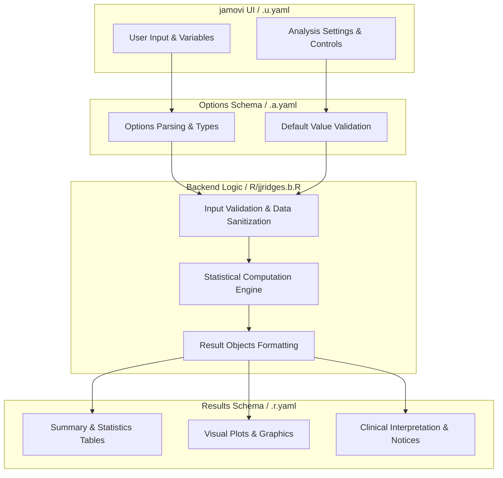
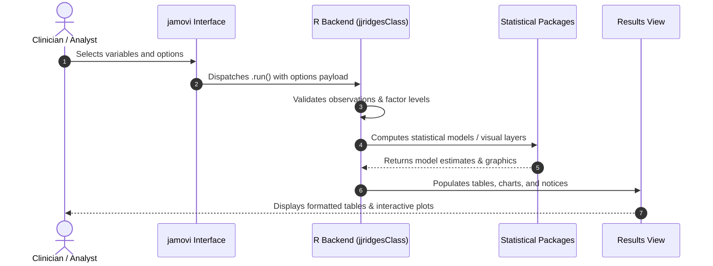

# Ridge Plot - Developer Documentation

## 1. Overview

- **Function**: `jjridges`
- **Title**: Ridge Plot
- **Module**: `JJStatsPlotT`
- **Files**:
  - `jamovi/jjridges.u.yaml` - User Interface Definition
  - `jamovi/jjridges.a.yaml` - Options & Schema Definition
  - `jamovi/jjridges.r.yaml` - Results Layout & Tables
  - `R/jjridges.b.R` - Backend Implementation
- **Summary**: 'Create advanced ridgeline plots. Visualize distributions across groups with multiple style options, annotations, statistical overlays, and publication-ready formatting. Supports both basic and complex ridge plots with inside plots, double ridgelines, and color gradients.'

## 1a. Changelog

- **Date**: 2026-08-29
- **Summary**: Comprehensive documentation suite created & verified against active schemas and backend implementation.

## 2. Options Reference (`.a.yaml`)

| Option | Type | Default | Description |
| :--- | :--- | :--- | :--- |
| `data` | `Data` | `NULL` |  |
| `x_var` | `Variable` | `NULL` | X Variable (Distribution) |
| `y_var` | `Variable` | `NULL` | Y Variable (Groups) |
| `fill_var` | `Variable` | `NULL` | Fill Variable (Optional) |
| `facet_var` | `Variable` | `NULL` | Facet Variable (Optional) |
| `plot_type` | `List` | `density_ridges` | Plot Type |
| `scale` | `Number` | `1` | Ridge Height Scale |
| `bandwidth` | `List` | `nrd0` | Bandwidth Method |
| `bandwidth_value` | `Number` | `1` | Custom Bandwidth |
| `binwidth` | `Number` | `1` | Histogram Bin Width |
| `add_boxplot` | `Bool` | `FALSE` | Boxplot inside |
| `add_points` | `Bool` | `FALSE` | Add data points |
| `point_alpha` | `Number` | `0.3` | Point Transparency |
| `add_quantiles` | `Bool` | `FALSE` | Quantile lines |
| `quantiles` | `String` | `0.25, 0.5, 0.75` | Quantile Values |
| `add_mean` | `Bool` | `FALSE` | Mean line |
| `add_median` | `Bool` | `FALSE` | Median line |
| `show_stats` | `Bool` | `FALSE` | Statistics |
| `test_type` | `List` | `parametric` | Statistical Test |
| `p_adjust_method` | `List` | `none` | P-value Adjustment |
| `effsize_type` | `List` | `d` | Effect Size Type |
| `alpha` | `Number` | `0.8` | Ridge Transparency |
| `color_palette` | `List` | `clinical_colorblind` | Color Palette |
| `custom_colors` | `String` | `#3498db,#e74c3c,#2ecc71,#f39c12` | Custom Colors |
| `gradient_low` | `String` | `#0000FF` | Gradient Low Color |
| `gradient_high` | `String` | `#FF0000` | Gradient High Color |
| `fill_ridges` | `Bool` | `TRUE` | Fill ridges |
| `reverse_order` | `Bool` | `FALSE` | Reverse Y order |
| `show_fill_legend` | `Bool` | `TRUE` | Fill legend |
| `show_facet_legend` | `Bool` | `TRUE` | Facet legend |
| `theme_style` | `List` | `theme_ridges` | Theme Style |
| `grid_lines` | `Bool` | `FALSE` | Grid lines |
| `expand_panels` | `Bool` | `TRUE` | Expand panels |
| `legend_position` | `List` | `none` | Legend Position |
| `plot_title` | `String` | `` | Plot Title |
| `plot_subtitle` | `String` | `` | Plot Subtitle |
| `plot_caption` | `String` | `` | Plot Caption |
| `x_label` | `String` | `` | X Axis Label |
| `y_label` | `String` | `` | Y Axis Label |
| `add_sample_size` | `Bool` | `FALSE` | Sample sizes |
| `add_density_values` | `Bool` | `FALSE` | Density values |
| `custom_annotations` | `String` | `` | Custom Annotations |
| `width` | `Number` | `800` | Plot Width |
| `height` | `Number` | `600` | Plot Height |
| `dpi` | `Number` | `300` | Plot DPI |
| `clinicalPreset` | `List` | `custom` | Clinical Preset |
| `showAboutPanel` | `Bool` | `FALSE` | About panel |
| `showAssumptions` | `Bool` | `FALSE` | Statistical assumptions |

## 3. Results Definition (`.r.yaml`)

| Output ID | Type | Title | Description |
| :--- | :--- | :--- | :--- |
| `notices` | `Preformatted` | `Important Information` |  |
| `warnings` | `Html` | `Preset Overrides` |  |
| `instructions` | `Html` | `Instructions` |  |
| `clinicalSummary` | `Html` | `Clinical Summary` |  |
| `reportSummary` | `Html` | `Report Summary (Copy-Ready)` |  |
| `aboutPanel` | `Html` | `About Ridge Plots` |  |
| `assumptionsPanel` | `Html` | `Statistical Assumptions & Caveats` |  |
| `plot` | `Image` | `Ridge Plot` |  |
| `statistics` | `Table` | `Statistical Summary` |  |
| `tests` | `Table` | `Statistical Tests` |  |
| `interpretation` | `Html` | `Interpretation` |  |

## 4. Architecture & Data Flow Diagram

## 5. Execution Sequence

## 6. Change Impact & Safety Guidelines

- **Data Filtering**: Ensure observations with missing values are handled gracefully according to analysis options.
- **Formula Conflicts**: Use isolated environment calls or base formula methods when interacting with `ggstatsplot` or formula parsers.
- **Safe Deparsing**: Use `deparse(val)` in syntax generation (`asSource()`) to escape column names with spaces or special symbols.

