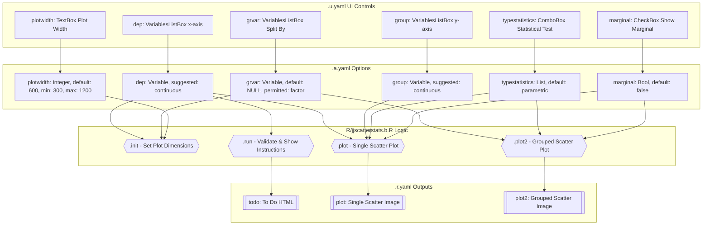
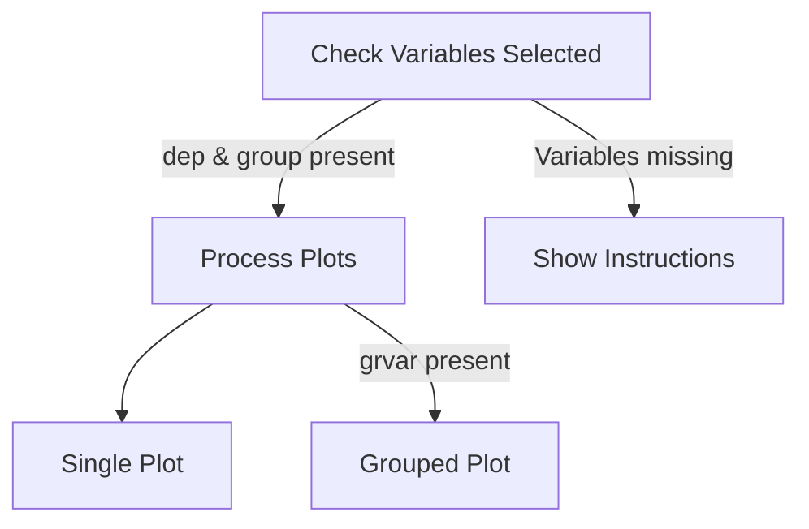
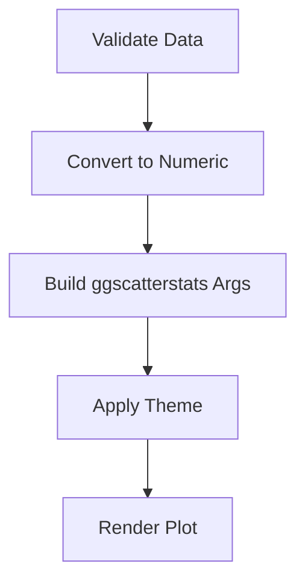
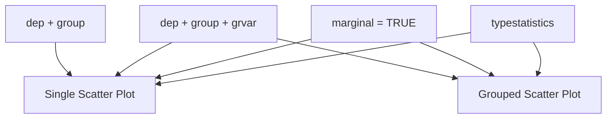

# jjscatterstats Function Documentation

## 1. Overview

- **Function**: `jjscatterstats`
- **Files**:
  - `jamovi/jjscatterstats.u.yaml` — UI
  - `jamovi/jjscatterstats.a.yaml` — Options
  - `R/jjscatterstats.b.R` — Backend
  - `jamovi/jjscatterstats.r.yaml` — Results
- **Summary**: A wrapper function for `ggstatsplot::ggscatterstats` and `ggstatsplot::grouped_ggscatterstats` that generates scatter plots with correlation analysis and optional marginal distributions. Supports both single scatter plots and grouped analyses with extensive customization options for points, regression lines, and marginal histograms.

## 2. UI Controls → Options Map

| UI Control | Type | Label | Binds to Option | Defaults & Constraints | Visibility/Enable Rules |
|------------|------|-------|----------------|----------------------|------------------------|
| `dep` | VariablesListBox | x-axis | `dep` | maxItemCount: 1, suggested: continuous, permitted: numeric | Always visible |
| `group` | VariablesListBox | y-axis | `group` | maxItemCount: 1, suggested: continuous, permitted: numeric | Always visible |
| `grvar` | VariablesListBox | Split By (Optional) | `grvar` | maxItemCount: 1, suggested: ordinal/nominal, permitted: factor | Always visible |
| `typestatistics` | ComboBox | Statistical Test Type | `typestatistics` | default: parametric, options: parametric/nonparametric/robust/bayes | In collapsed "Statistical Analysis" |
| `conflevel` | TextBox | Confidence Level | `conflevel` | default: 0.95, min: 0, max: 1, format: number | In collapsed "Statistical Analysis" |
| `bfmessage` | CheckBox | Bayes Factor Message | `bfmessage` | default: false | In collapsed "Statistical Analysis" |
| `k` | TextBox | Decimal Places | `k` | default: 2, min: 0, max: 5, format: number | In collapsed "Statistical Analysis" |
| `mytitle` | TextBox | Title | `mytitle` | default: "", format: string, width: large | In collapsed "Plot Appearance" |
| `xtitle` | TextBox | X-Title | `xtitle` | default: "", format: string, width: large | In collapsed "Plot Appearance" |
| `ytitle` | TextBox | Y-Title | `ytitle` | default: "", format: string, width: large | In collapsed "Plot Appearance" |
| `resultssubtitle` | CheckBox | Statistical Results | `resultssubtitle` | default: false | In collapsed "Plot Appearance" |
| `originaltheme` | CheckBox | Add GGStatsPlot Layer | `originaltheme` | default: false | In collapsed "Plot Appearance" |
| `pointsize` | TextBox | Point Size | `pointsize` | default: 3, min: 0.1, max: 10, format: number | In collapsed "Point Aesthetics" |
| `pointalpha` | TextBox | Point Transparency | `pointalpha` | default: 0.4, min: 0, max: 1, format: number | In collapsed "Point Aesthetics" |
| `smoothlinesize` | TextBox | Smooth Line Size | `smoothlinesize` | default: 1.5, min: 0.1, max: 5, format: number | In collapsed "Regression Line" |
| `smoothlinecolor` | TextBox | Smooth Line Color | `smoothlinecolor` | default: "blue", format: string, width: large | In collapsed "Regression Line" |
| `marginal` | CheckBox | Show Marginal Histograms | `marginal` | default: false | In collapsed "Marginal Histograms" |
| `xsidefill` | TextBox | X-axis Marginal Fill Color | `xsidefill` | default: "#009E73", format: string, width: large | enable: (marginal) |
| `ysidefill` | TextBox | Y-axis Marginal Fill Color | `ysidefill` | default: "#D55E00", format: string, width: large | enable: (marginal) |
| `plotwidth` | TextBox | Plot Width | `plotwidth` | default: 600, min: 300, max: 1200, format: number | In collapsed "Plot Configuration" |
| `plotheight` | TextBox | Plot Height | `plotheight` | default: 450, min: 300, max: 800, format: number | In collapsed "Plot Configuration" |

## 3. Options Reference (.a.yaml)

| Name | Type | Default | Description | Downstream Effects |
|------|------|---------|-------------|-------------------|
| **data** | Data | - | The data as a data frame | Used throughout `.b.R` as `self$data` |
| **dep** | Variable | - | First continuous variable for x-axis (biomarker levels, age, tumor size) | Used in `.plot()` and `.plot2()` as `self$options$dep`, passed to ggscatterstats |
| **group** | Variable | - | Second continuous variable for y-axis (expression levels, treatment response) | Used in `.plot()` and `.plot2()` as `self$options$group`, passed to ggscatterstats |
| **grvar** | Variable | NULL | Optional categorical variable to create grouped plots | Controls plot2 visibility, used in `.plot2()` for grouped_ggscatterstats |
| **typestatistics** | List | parametric | Statistical test type (parametric/nonparametric/robust/bayes) | Passed as `type` parameter to ggscatterstats functions |
| **mytitle** | String | "" | Custom plot title | Used in title logic in `.plot()` and `.plot2()` |
| **xtitle** | String | "" | Custom x-axis title | Used as `xlab` parameter in ggscatterstats |
| **ytitle** | String | "" | Custom y-axis title | Used as `ylab` parameter in ggscatterstats |
| **originaltheme** | Bool | false | Use ggstatsplot theme vs. theme_bw | Controls theme application in both plot functions |
| **resultssubtitle** | Bool | false | Show statistical results in subtitle | Passed as `results.subtitle` to ggscatterstats |
| **conflevel** | Number | 0.95 | Confidence level (0-1) | Passed as `conf.level` to ggscatterstats |
| **bfmessage** | Bool | false | Display Bayes Factor message | Passed as `bf.message` to ggscatterstats |
| **k** | Integer | 2 | Decimal places for statistics (0-5) | Passed as `k` to ggscatterstats |
| **marginal** | Bool | false | Show marginal histograms | Controls marginal plot inclusion and xsidefill/ysidefill usage |
| **xsidefill** | String | "#009E73" | X-axis marginal histogram fill color | Used as `xfill` when marginal is true |
| **ysidefill** | String | "#D55E00" | Y-axis marginal histogram fill color | Used as `yfill` when marginal is true |
| **pointsize** | Number | 3 | Scatter plot point size (0.1-10) | Passed as `point.size` to ggscatterstats |
| **pointalpha** | Number | 0.4 | Point transparency (0-1) | Passed as `point.alpha` to ggscatterstats |
| **smoothlinesize** | Number | 1.5 | Regression line width (0.1-5) | Used in `smooth.line.args` list |
| **smoothlinecolor** | String | "blue" | Regression line color | Used in `smooth.line.args` list |
| **plotwidth** | Integer | 600 | Plot width in pixels (300-1200) | Used in `.init()` to set plot dimensions |
| **plotheight** | Integer | 450 | Plot height in pixels (300-800) | Used in `.init()` to set plot dimensions |

## 4. Backend Usage (.b.R)

### `.init()` Method
- **Code Locations**: Lines 14-27
- **Logic Summary**: 
  - Sets plot dimensions using `self$options$plotwidth` and `self$options$plotheight`
  - If `self$options$grvar` is present, calculates grouped plot width based on factor levels
- **Result Population**: 
  - `self$results$plot$setSize(plotwidth, plotheight)`
  - `self$results$plot2$setSize(num_levels * plotwidth, plotheight)` (when grvar present)

### `.run()` Method
- **Code Locations**: Lines 31-62
- **Logic Summary**: 
  - Checks if `self$options$dep` and `self$options$group` are null
  - Displays welcome message or analysis confirmation
  - Validates data has rows
- **Result Population**: 
  - `self$results$todo$setContent(todo)` - sets HTML instructions/status

### `.plot()` Method
- **Code Locations**: Lines 66-133
- **Logic Summary**: 
  - Converts variables to numeric using `jmvcore::toNumeric()`
  - Builds title logic using `self$options$mytitle`, `self$options$xtitle`, `self$options$ytitle`
  - Constructs arguments list for `ggstatsplot::ggscatterstats`
  - Conditionally adds marginal colors when `self$options$marginal` is true
  - Applies theme based on `self$options$originaltheme`
- **Result Population**: Renders plot to `self$results$plot`

### `.plot2()` Method  
- **Code Locations**: Lines 137-206
- **Logic Summary**: 
  - Similar to `.plot()` but for grouped analysis using `self$options$grvar`
  - Uses `ggstatsplot::grouped_ggscatterstats` instead
  - Only executes when grvar is not null
- **Result Population**: Renders grouped plot to `self$results$plot2`

## 5. Results Definition (.r.yaml)

| Output ID | Type | Title | Visibility | Population Entry Points |
|-----------|------|-------|-----------|------------------------|
| **todo** | Html | "To Do" | Always visible | `.run()` method via `self$results$todo$setContent()` |
| **plot** | Image | "`${dep} vs {group}`" | requiresData: true | `.plot()` method renders ggscatterstats plot |
| **plot2** | Image | "`${dep} vs {group} by {grvar}`" | visible: (grvar), requiresData: true | `.plot2()` method renders grouped_ggscatterstats plot |

### clearWith Dependencies
Results clear when these options change: dep, group, grvar, originaltheme, typestatistics, conflevel, bfmessage, k, marginal, xsidefill, ysidefill, pointsize, pointalpha, smoothlinesize, smoothlinecolor, mytitle, xtitle, ytitle, resultssubtitle, plotwidth, plotheight

### References
- ggplot2
- ggstatsplot  
- ClinicoPathJamoviModule

## 6. Data Flow Diagram (UI → Options → Backend → Results)



## 7. Execution Sequence (User Action → Results)

### User Input Flow


### Decision Logic


### Result Processing


**Step-by-step execution flow:**

1. **User interacts with variable selectors** → UI updates `dep`, `group`, and optional `grvar` options
2. **Backend initialization** → `.init()` sets plot dimensions based on `plotwidth`/`plotheight` and calculates grouped plot size if `grvar` present
3. **Run validation** → `.run()` checks if required variables are selected, shows instructions or confirmation message
4. **Data processing** → Variables converted to numeric using `jmvcore::toNumeric()`
5. **Plot generation** → 
   - If only `dep`/`group`: `.plot()` calls `ggstatsplot::ggscatterstats` with user options
   - If `grvar` also present: `.plot2()` calls `ggstatsplot::grouped_ggscatterstats`
6. **Theme application** → Based on `originaltheme` option, applies either `theme_bw()` or `theme_ggstatsplot()`
7. **Results display** → Plots rendered to respective result objects, visibility controlled by variable presence



## 8. Change Impact Guide

### Key Option Changes:

**If `dep` or `group` changed**: 
- Recalculates all plots, updates axis labels, clears all results
- Performance: Moderate impact, requires data re-processing

**If `grvar` changed**:
- Shows/hides grouped plot (`plot2`), recalculates plot2 dimensions in `.init()`
- Performance: High impact when going from single to grouped analysis

**If `typestatistics` changed**:
- Changes correlation method (Pearson/Spearman/robust/Bayesian), updates statistical results in subtitle
- Performance: Low impact, affects only statistical calculations

**If `marginal` changed**:
- Enables/disables marginal histograms, shows/hides color controls
- Performance: Moderate impact, adds computational overhead for marginal plots

**If `plotwidth`/`plotheight` changed**:
- Triggers `.init()` to recalculate plot dimensions, affects both single and grouped plots
- Performance: Low impact, layout change only

### Common Pitfalls:
- **Invalid combinations**: Non-numeric variables for `dep`/`group` will cause conversion issues
- **NA handling**: Missing values handled by `jmvcore::toNumeric()` and ggstatsplot internally
- **Variable requirements**: Both `dep` and `group` must be selected for plots to generate

### Recommended Defaults:
- `typestatistics: "parametric"` - Most common for normally distributed clinical data
- `marginal: false` - Keeps plots simpler initially, can be enabled for distribution insights
- `pointsize: 3, pointalpha: 0.4` - Good balance of visibility without overcrowding

## 9. Example Usage

### Example Dataset Requirements:
- **Variables**: At least 2 numeric/continuous variables for correlation
- **Levels**: Optional categorical variable for grouping (2-6 levels recommended)
- **Sample Size**: Minimum 3 observations, ideally 30+ for reliable correlation

### Example Option Payload:
```yaml
dep: "Age"
group: "Ki_67_Percentage" 
typestatistics: "parametric"
conflevel: 0.95
k: 2
marginal: true
xsidefill: "#009E73"
ysidefill: "#D55E00"
pointsize: 3
resultssubtitle: true
```

### Expected Outputs:
- **Single scatter plot** with Age vs Ki-67 correlation
- **Statistical subtitle** showing Pearson correlation coefficient, p-value
- **Marginal histograms** on both axes with specified colors
- **Regression line** with confidence interval

## 10. Appendix (Schemas & Snippets)

### Result Schemas:

#### todo (Html)
- **Content**: HTML instructions and welcome messages
- **Population**: `self$results$todo$setContent(todo)`

#### plot (Image) 
- **Dimensions**: Dynamic based on `plotwidth` × `plotheight`
- **Content**: Single scatter plot with correlation analysis
- **Population**: Rendered by `.plot()` method

#### plot2 (Image)
- **Dimensions**: Dynamic `(num_levels × plotwidth) × plotheight` 
- **Content**: Grouped scatter plots by categorical variable
- **Visibility**: Only when `grvar` is selected
- **Population**: Rendered by `.plot2()` method

### Key Code Snippets:

#### Variable Access Pattern:
```r
# Basic option access
x_var <- self$options$dep
y_var <- self$options$group

# Conditional grouping
if (!is.null(self$options$grvar)) {
    grouping_var <- self$options$grvar
}
```

#### Result Population Pattern:
```r
# HTML content
self$results$todo$setContent(html_content)

# Plot sizing
self$results$plot$setSize(width, height)

# Theme application
if (!self$options$originaltheme) {
    plot <- plot + ggplot2::theme_bw()
} else {
    plot <- plot + ggstatsplot::theme_ggstatsplot()
}
```

#### ggstatsplot Arguments Construction:
```r
.args <- list(
    data = plotData,
    x = self$options$dep,
    y = self$options$group,
    type = self$options$typestatistics,
    conf.level = self$options$conflevel,
    marginal = self$options$marginal,
    point.size = self$options$pointsize
)

# Conditional marginal colors
if (self$options$marginal) {
    .args$xfill <- self$options$xsidefill
    .args$yfill <- self$options$ysidefill
}
```