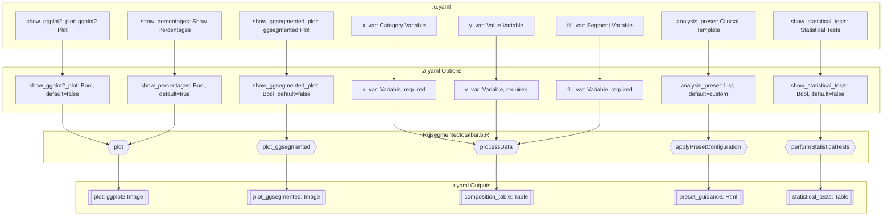
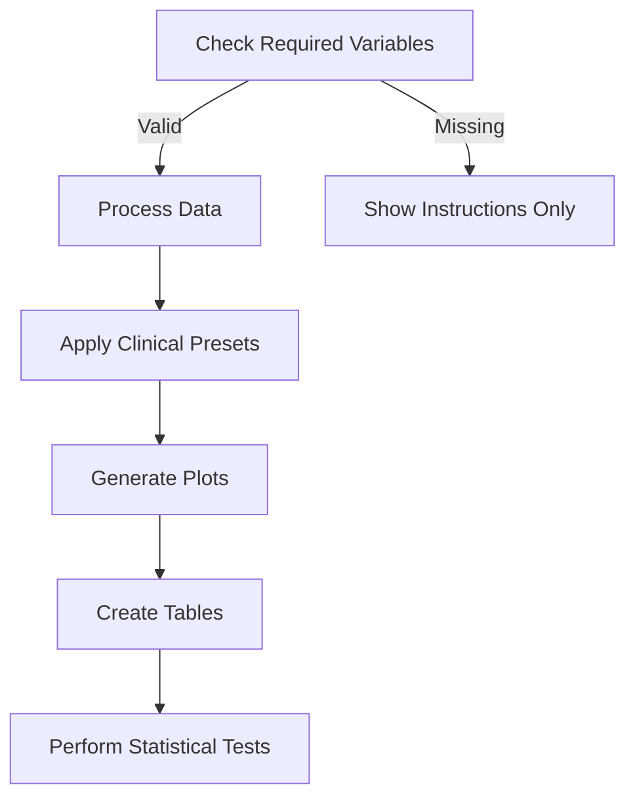
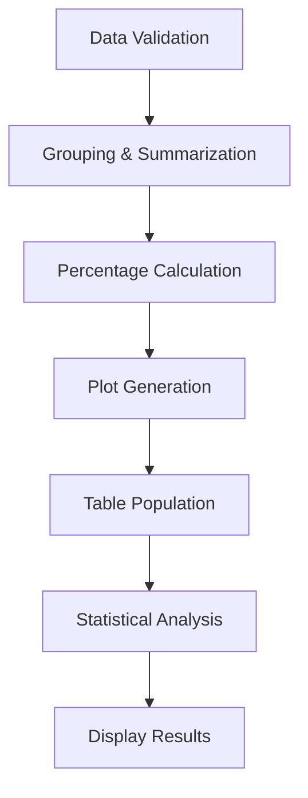
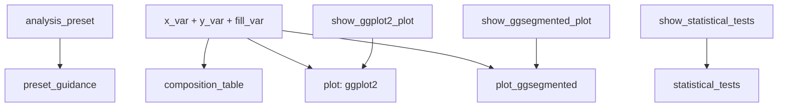

# jjsegmentedtotalbar Function Documentation

## 1. Overview

**Function**: `jjsegmentedtotalbar`

**Files**:
- `jamovi/jjsegmentedtotalbar.u.yaml` — UI
- `jamovi/jjsegmentedtotalbar.a.yaml` — Options
- `R/jjsegmentedtotalbar.b.R` — Backend
- `jamovi/jjsegmentedtotalbar.r.yaml` — Results

**Summary**: Creates segmented total bar charts (100% stacked bars) that show proportional breakdowns within categories. Perfect for displaying composition data where each bar represents 100% and segments show relative proportions. Ideal for clinical data analysis including treatment response rates, demographic distributions, biomarker patterns, and outcome proportions.

## 2. UI Controls → Options Map

| UI Control | Type | Label | Binds to Option | Defaults & Constraints | Visibility/Enable Rules |
|------------|------|-------|-----------------|------------------------|-------------------------|
| `x_var` | VariablesListBox | Category Variable (X-axis) | `x_var` | maxItemCount: 1, suggested: nominal/ordinal | Always visible |
| `y_var` | VariablesListBox | Value Variable (Y-axis) | `y_var` | maxItemCount: 1, suggested: continuous | Always visible |
| `fill_var` | VariablesListBox | Segment Variable (Fill) | `fill_var` | maxItemCount: 1, suggested: nominal/ordinal | Always visible |
| `facet_var` | VariablesListBox | Panel Variable (Optional) | `facet_var` | maxItemCount: 1, default: NULL | Always visible |
| `analysis_preset` | ComboBox | Clinical Analysis Template | `analysis_preset` | default: custom | Always visible |
| `show_ggplot2_plot` | CheckBox | Built-in ggplot2 Plot | `show_ggplot2_plot` | default: false | Always visible |
| `show_ggsegmented_plot` | CheckBox | ggsegmentedtotalbar Package Plot | `show_ggsegmented_plot` | default: false | Always visible |
| `ggsegmented_labels` | CheckBox | Show Labels in ggsegmentedtotalbar | `ggsegmented_labels` | default: true | enable: (show_ggsegmented_plot) |
| `ggsegmented_alpha` | TextBox | Background Transparency (0-1) | `ggsegmented_alpha` | default: 0.3, min: 0, max: 1 | enable: (show_ggsegmented_plot) |
| `chart_style` | ComboBox | Chart Style | `chart_style` | default: clinical | Always visible |
| `color_palette` | ComboBox | Color Palette | `color_palette` | default: clinical | Always visible |
| `show_percentages` | CheckBox | Show Percentages | `show_percentages` | default: true | Always visible |
| `percentage_format` | ComboBox | Percentage Format | `percentage_format` | default: integer | enable: (show_percentages) |
| `show_counts` | CheckBox | Show Raw Counts | `show_counts` | default: false | Always visible |
| `label_threshold` | TextBox | Min Segment Size for Labels | `label_threshold` | default: 5, min: 0, max: 50 | Always visible |
| `orientation` | ComboBox | Bar Orientation | `orientation` | default: vertical | Always visible |
| `sort_categories` | ComboBox | Sort Categories | `sort_categories` | default: none | Always visible |
| `show_statistical_tests` | CheckBox | Statistical Tests (Chi-square) | `show_statistical_tests` | default: false | Always visible |
| `confidence_level` | TextBox | Confidence Level | `confidence_level` | default: 0.95, min: 0.8, max: 0.99 | enable: (show_statistical_tests) |

## 3. Options Reference (.a.yaml)

| Name | Type | Default | Description | Downstream Effects |
|------|------|---------|-------------|-------------------|
| `data` | Data | - | The dataset for visualization | Used throughout data processing |
| `analysis_preset` | List | custom | Clinical analysis preset configuration | Sets color palette, chart style, guidance text |
| `x_var` | Variable | - | Categorical variable for x-axis categories | Primary grouping variable in data processing |
| `y_var` | Variable | - | Numeric variable for segment values | Aggregated to create bar heights |
| `fill_var` | Variable | - | Categorical variable for bar segments | Creates color-coded segments within bars |
| `facet_var` | Variable | NULL | Optional variable for creating panels | Controls faceting in plots |
| `show_ggplot2_plot` | Bool | false | Show built-in ggplot2 implementation | Controls plot visibility and rendering |
| `show_ggsegmented_plot` | Bool | false | Show ggsegmentedtotalbar package plot | Controls second plot visibility |
| `ggsegmented_labels` | Bool | true | Show labels in ggsegmentedtotalbar | Passed to ggsegmentedtotalbar function |
| `ggsegmented_alpha` | Number | 0.3 | Background transparency (0-1) | Controls annotation box transparency |
| `chart_style` | List | clinical | Overall visual style | Applies different theme configurations |
| `color_palette` | List | clinical | Color scheme for segments | Determines color mapping strategy |
| `show_percentages` | Bool | true | Display percentage labels | Controls label generation and display |
| `percentage_format` | List | integer | Format for percentage display | Controls decimal precision in labels |
| `show_counts` | Bool | false | Display raw count values | Adds count information to labels |
| `label_threshold` | Number | 5 | Minimum percentage for showing labels | Filters small segments from labeling |
| `orientation` | List | vertical | Bar orientation | Controls coord_flip() application |
| `sort_categories` | List | none | Category sorting method | Determines factor level ordering |
| `plot_title` | String | "" | Main chart title | Applied to plot titles |
| `legend_position` | List | right | Legend placement | Controls legend positioning |
| `bar_width` | Number | 0.8 | Width of bars (0.1-1.0) | Controls geom_col width parameter |
| `show_statistical_tests` | Bool | false | Perform chi-square tests | Controls statistical analysis execution |
| `confidence_level` | Number | 0.95 | Confidence level for tests | Used in statistical significance testing |

## 4. Backend Usage (.b.R)

### Core Data Processing (`self$options$x_var`, `self$options$y_var`, `self$options$fill_var`)
**Code Locations**: `.processData()`, `.run()`
**Logic Summary**: Primary variables extracted and validated; data grouped and summarized; percentages calculated within categories
**Result Population**: Updates `private$.processed_data` and `private$.composition_data`

### Plot Type Selection (`self$options$show_ggplot2_plot`, `self$options$show_ggsegmented_plot`)
**Code Locations**: `.init()`, `.plot()`, `.plot_ggsegmented()`
**Logic Summary**: Controls which plots are rendered and their visibility
**Result Population**: Sets visibility for `self$results$plot` and `self$results$plot_ggsegmented`

### Clinical Presets (`self$options$analysis_preset`)
**Code Locations**: `.applyPresetConfiguration()`, `.updatePresetGuidance()`
**Logic Summary**: Applies predefined configurations for common clinical analyses
**Result Population**: Updates `self$results$preset_guidance` with template-specific guidance

### Styling Options (`self$options$chart_style`, `self$options$color_palette`)
**Code Locations**: `.applyTheme()`, `.applyColorPalette()`, `.plot()`
**Logic Summary**: Applies visual themes and color schemes to plots
**Result Population**: Modifies plot appearance through ggplot2 theme and scale functions

### Label Configuration (`self$options$show_percentages`, `self$options$label_threshold`)
**Code Locations**: `.plot()` lines 758-799
**Logic Summary**: Controls percentage and count label display; filters small segments based on threshold
**Result Population**: Adds geom_text layers to plots with formatted labels

### Statistical Analysis (`self$options$show_statistical_tests`, `self$options$confidence_level`)
**Code Locations**: `.performStatisticalTests()`
**Logic Summary**: Performs chi-square tests for independence; calculates standardized residuals
**Result Population**: Populates `self$results$statistical_tests` table with test results and interpretation

### Data Sorting (`self$options$sort_categories`)
**Code Locations**: `.applySorting()`, `.plot()` lines 717-735
**Logic Summary**: Reorders categories based on total values, largest segments, or alphabetically
**Result Population**: Modifies factor levels in processed data affecting plot order

## 5. Results Definition (.r.yaml)

### Outputs Overview
| ID | Type | Title | Visibility | Population Entry Points |
|----|------|-------|------------|------------------------|
| `instructions` | Html | Instructions | Always visible | `.init()` - sets comprehensive usage instructions |
| `plot` | Image | Segmented Total Bar Chart (ggplot2) | Controlled by `show_ggplot2_plot` | `.plot()` - main ggplot2 rendering |
| `plot_ggsegmented` | Image | Segmented Total Bar Chart (ggsegmentedtotalbar) | Controlled by `show_ggsegmented_plot` | `.plot_ggsegmented()` - specialized package rendering |
| `summary` | Table | Chart Summary | Always visible | `.updateSummary()` |
| `composition_table` | Table | Composition Analysis | Always visible | `.updateComposition()` |
| `detailed_stats` | Table | Detailed Statistics | Always visible | `.updateDetailedStats()` |
| `interpretation` | Html | Chart Interpretation | Always visible | `.createInterpretation()` |
| `clinical_summary` | Html | Clinical Summary | Always visible | `.createClinicalSummary()` |
| `statistical_tests` | Table | Statistical Tests | Controlled by `show_statistical_tests` | `.performStatisticalTests()` |
| `preset_guidance` | Html | Template Guidance | Visible when preset != "custom" | `.updatePresetGuidance()` |

### Table Schemas

#### Summary Table
- `categories` (integer): Number of unique categories
- `segments` (integer): Number of unique segments  
- `total_observations` (integer): Sum of all observations
- `chart_type` (text): Fixed "Segmented Total Bar (100% Stacked)"

#### Composition Table
- `category` (text): Category name from x_var
- `segment` (text): Segment name from fill_var
- `count` (integer): Raw count for this category-segment combination
- `percentage` (number, pc format): Percentage within category
- `total_in_category` (integer): Total count for the category

#### Statistical Tests Table
- `test_name` (text): Name of statistical test performed
- `statistic` (number): Chi-square statistic value
- `df` (integer): Degrees of freedom
- `p_value` (number, pvalue format): Statistical significance
- `interpretation` (text): Plain-language interpretation of results

#### Detailed Statistics Table
- `measure` (text): Statistical measure name
- `value` (text): Calculated value as formatted string

### Clear Conditions
Most tables clear with changes to `x_var`, `y_var`, or `fill_var`. Statistical tests also clear when `show_statistical_tests` changes. Preset guidance clears when `analysis_preset` changes.

## 6. Data Flow Diagram (UI → Options → Backend → Results)



## 7. Execution Sequence (User Action → Results)

### User Input Flow


### Decision Logic


### Result Processing


### Step-by-step execution flow:

1. **User variable selection** → UI updates required options (`x_var`, `y_var`, `fill_var`)
2. **Backend initialization** → `.init()` sets plot visibility, applies clinical presets, shows instructions
3. **Data validation** → `.run()` checks for required variables and sufficient data
4. **Data processing** → `.processData()` groups data, calculates percentages, applies sorting
5. **Plot rendering** → `.plot()` and `.plot_ggsegmented()` create visualizations based on user selections
6. **Table updates** → Multiple methods populate summary, composition, and statistics tables
7. **Statistical analysis** → `.performStatisticalTests()` runs if enabled
8. **Display application** → Results become visible per `.r.yaml` visibility rules



## 8. Change Impact Guide

### Key Option Changes and Their Effects:

**`x_var`, `y_var`, `fill_var` Changes**:
- **If changed**: Complete data reprocessing, all tables cleared and repopulated, plots regenerated
- **Common pitfalls**: Ensure adequate sample sizes per category, check for missing values
- **Recommended defaults**: Use categorical variables with reasonable number of levels (2-10)

**`analysis_preset` Changes**:
- **If changed**: Updates color palette, chart style, shows/hides preset guidance
- **Common pitfalls**: Preset suggestions may not match actual variable types
- **Recommended defaults**: Use "custom" for full control, clinical presets for standard analyses

**`show_ggplot2_plot`/`show_ggsegmented_plot` Changes**:
- **If changed**: Plot visibility toggled, may require ggsegmentedtotalbar package installation
- **Performance implications**: Multiple plots increase rendering time
- **Recommended defaults**: Start with ggplot2, add ggsegmented for specialized layouts

**`show_statistical_tests` Changes**:
- **If changed**: Chi-square analysis performed/hidden, affects statistical_tests table
- **Common pitfalls**: Requires sufficient cell counts (>5 per combination)
- **Recommended defaults**: Enable for formal hypothesis testing, disable for exploratory analysis

**`sort_categories` Changes**:
- **If changed**: Category order recalculated, plot appearance may change significantly
- **Performance implications**: Minimal impact, sorting done in-memory
- **Recommended defaults**: "none" preserves data order, "total" highlights largest categories

## 9. Example Usage

### Example Dataset Requirements:
- **Categorical variables**: Treatment groups, response types, demographic categories
- **Numeric variable**: Patient counts, measurement values, occurrence frequencies
- **Minimum observations**: 5+ per category-segment combination for reliable percentages

### Example Option Payload:
```yaml
x_var: "treatment_group"
y_var: "patient_count"  
fill_var: "response_type"
analysis_preset: "treatment_response"
show_ggplot2_plot: true
show_percentages: true
percentage_format: "integer"
chart_style: "clinical"
color_palette: "clinical"
show_statistical_tests: true
```

### Expected Outputs:
- **Segmented bar chart**: 100% stacked bars showing response proportions by treatment
- **Composition table**: Detailed breakdown of counts and percentages
- **Statistical tests**: Chi-square test for treatment-response independence
- **Clinical summary**: Interpretation focusing on treatment efficacy patterns

## 10. Appendix (Schemas & Snippets)

### Complete Table Column Schemas:

**Summary Table Schema**:
```yaml
columns:
  - name: categories, type: integer, title: 'Categories'
  - name: segments, type: integer, title: 'Segments' 
  - name: total_observations, type: integer, title: 'Total Observations'
  - name: chart_type, type: text, title: 'Chart Type'
```

**Composition Analysis Schema**:
```yaml
columns:
  - name: category, type: text, title: 'Category'
  - name: segment, type: text, title: 'Segment'
  - name: count, type: integer, title: 'Count'
  - name: percentage, type: number, format: pc, title: 'Percentage'
  - name: total_in_category, type: integer, title: 'Category Total'
```

### Key Code Snippets:

**Data Processing**:
```r
# Core data grouping and percentage calculation
processed_data <- data %>%
    dplyr::group_by(!!rlang::sym(x_var), !!rlang::sym(fill_var)) %>%
    dplyr::summarise(value = sum(!!rlang::sym(y_var), na.rm = TRUE), .groups = 'drop') %>%
    dplyr::group_by(!!rlang::sym(x_var)) %>%
    dplyr::mutate(percentage = value / sum(value) * 100) %>%
    dplyr::ungroup()
```

**Plot Rendering**:
```r
# Basic 100% stacked bar chart
p <- ggplot2::ggplot(df, ggplot2::aes(x = !!rlang::sym(x_var), y = .data$value, fill = !!rlang::sym(fill_var))) +
    ggplot2::geom_col(position = "fill", width = self$options$bar_width)
```

**Result Population**:
```r
# Composition table population
self$results$composition_table$addRow(rowKey = i, values = list(
    category = as.character(data$category[i]),
    segment = as.character(data$segment[i]), 
    count = data$count[i],
    percentage = data$percentage[i] / 100  # Convert to proportion for percentage format
))
```