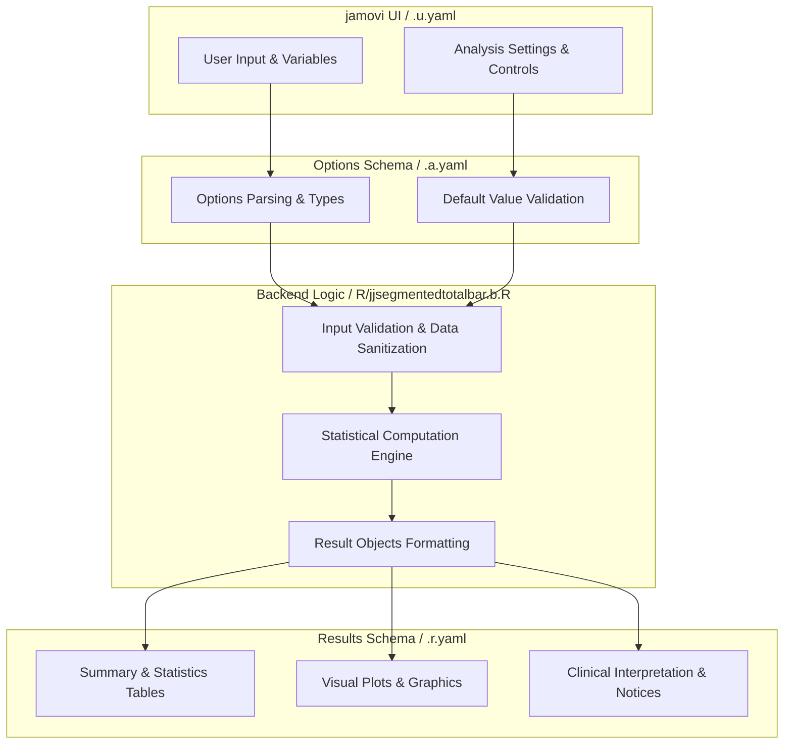
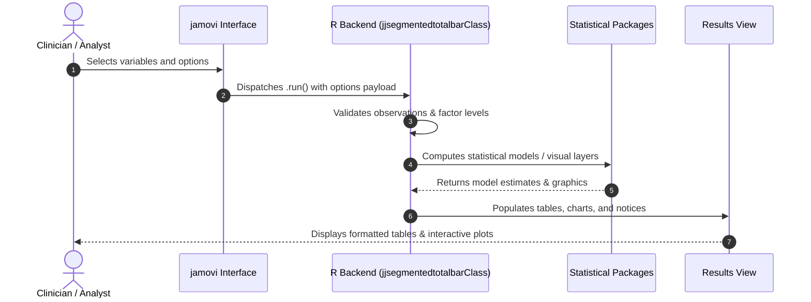

# Segmented Total Bar Charts - Developer Documentation

## 1. Overview

- **Function**: `jjsegmentedtotalbar`
- **Title**: Segmented Total Bar Charts
- **Module**: `JJStatsPlotT`
- **Files**:
  - `jamovi/jjsegmentedtotalbar.u.yaml` - User Interface Definition
  - `jamovi/jjsegmentedtotalbar.a.yaml` - Options & Schema Definition
  - `jamovi/jjsegmentedtotalbar.r.yaml` - Results Layout & Tables
  - `R/jjsegmentedtotalbar.b.R` - Backend Implementation
- **Summary**: Create segmented total bar charts (100 percent stacked bars) that show proportional  breakdowns within categories. Perfect for displaying composition data where  each bar represents 100 percent and segments show relative proportions.

## 1a. Changelog

- **Date**: 2026-08-29
- **Summary**: Comprehensive documentation suite created & verified against active schemas and backend implementation.

## 2. Options Reference (`.a.yaml`)

| Option | Type | Default | Description |
| :--- | :--- | :--- | :--- |
| `data` | `Data` | `NULL` |  |
| `analysis_preset` | `List` | `custom` | Clinical Analysis Preset |
| `x_var` | `Variable` | `NULL` | Category Variable (X-axis) |
| `y_var` | `Variable` | `NULL` | Value Variable (Y-axis) |
| `fill_var` | `Variable` | `NULL` | Segment Variable (Fill) |
| `facet_var` | `Variable` | `NULL` | Panel Variable (Optional) |
| `show_plot` | `Bool` | `FALSE` | Plot |
| `plot_type` | `List` | `stacked` | Plot Type |
| `chart_style` | `List` | `clinical` | Chart Style |
| `color_palette` | `List` | `clinical` | Color Palette |
| `show_percentages` | `Bool` | `FALSE` | Percentages |
| `percentage_format` | `List` | `integer` | Percentage Format |
| `show_counts` | `Bool` | `FALSE` | Raw counts |
| `label_threshold` | `Number` | `5` | Min Segment Size for Labels ( percent) |
| `orientation` | `List` | `vertical` | Bar Orientation |
| `sort_categories` | `List` | `none` | Sort Categories |
| `plot_title` | `String` | `` | Plot Title |
| `x_title` | `String` | `` | X-axis Title |
| `y_title` | `String` | `Percentage` | Y-axis Title |
| `legend_title` | `String` | `` | Legend Title |
| `legend_position` | `List` | `right` | Legend Position |
| `bar_width` | `Number` | `0.8` | Bar Width (0.1-1.0) |
| `plot_width` | `Number` | `10` | Plot Width |
| `plot_height` | `Number` | `6` | Plot Height |
| `add_outline` | `Bool` | `FALSE` | Segment outlines |
| `outline_color` | `List` | `white` | Outline Color |
| `export_ready` | `Bool` | `FALSE` | Export ready |
| `flerlage_show_labels` | `Bool` | `FALSE` | Value labels (flerlage) |
| `flerlage_label_size` | `Number` | `4` | Label Size (Flerlage) |
| `flerlage_label_color` | `List` | `black` | Label Color (Flerlage) |
| `flerlage_alpha` | `Number` | `0.3` | Background Transparency (Flerlage) |
| `flerlage_box_color` | `List` | `lightgrey` | Background Box Color (Flerlage) |
| `y_is_count` | `Bool` | `FALSE` | Value Variable counts cases |
| `show_statistical_tests` | `Bool` | `FALSE` | Statistical tests |
| `confidence_level` | `Number` | `0.95` | Confidence Level |
| `exclude_missing` | `Bool` | `TRUE` | Exclude missing values |
| `showExplanations` | `Bool` | `FALSE` | Explanations |

## 3. Results Definition (`.r.yaml`)

| Output ID | Type | Title | Description |
| :--- | :--- | :--- | :--- |
| `instructions` | `Html` | `Instructions` |  |
| `plot` | `Image` | `Segmented Total Bar Chart` |  |
| `summary` | `Table` | `Chart Summary` |  |
| `composition_table` | `Table` | `Composition Analysis` |  |
| `detailed_stats` | `Table` | `Detailed Statistics` |  |
| `interpretation` | `Html` | `Chart Interpretation` |  |
| `clinical_summary` | `Html` | `Clinical Summary` |  |
| `statistical_tests` | `Table` | `Statistical Tests` |  |
| `preset_guidance` | `Html` | `Template Guidance` |  |
| `warnings` | `Html` | `Warnings` |  |
| `explanations` | `Html` | `Explanations` |  |

## 4. Architecture & Data Flow Diagram

```mermaid
flowchart TD
  subgraph UI[jamovi UI / .u.yaml]
    U1[User Input & Variables]
    U2[Analysis Settings & Controls]
  end

  subgraph Opts[Options Schema / .a.yaml]
    O1[Options Parsing & Types]
    O2[Default Value Validation]
  end

  subgraph Backend[Backend Logic / R/jjsegmentedtotalbar.b.R]
    B1[Input Validation & Data Sanitization]
    B2[Statistical Computation Engine]
    B3[Result Objects Formatting]
  end

  subgraph Res[Results Schema / .r.yaml]
    R1[Summary & Statistics Tables]
    R2[Visual Plots & Graphics]
    R3[Clinical Interpretation & Notices]
  end

  U1 --> O1
  U2 --> O2
  O1 --> B1
  O2 --> B1
  B1 --> B2
  B2 --> B3
  B3 --> R1
  B3 --> R2
  B3 --> R3
```

## 5. Execution Sequence

```mermaid
sequenceDiagram
  autonumber
  actor User as Clinician / Analyst
  participant UI as jamovi Interface
  participant Backend as R Backend (jjsegmentedtotalbarClass)
  participant Engine as Statistical Packages
  participant Results as Results View

  User->>UI: Selects variables and options
  UI->>Backend: Dispatches .run() with options payload
  Backend->>Backend: Validates observations & factor levels
  Backend->>Engine: Computes statistical models / visual layers
  Engine-->>Backend: Returns model estimates & graphics
  Backend->>Results: Populates tables, charts, and notices
  Results-->>User: Displays formatted tables & interactive plots
```

## 6. Change Impact & Safety Guidelines

- **Data Filtering**: Ensure observations with missing values are handled gracefully according to analysis options.
- **Formula Conflicts**: Use isolated environment calls or base formula methods when interacting with `ggstatsplot` or formula parsers.
- **Safe Deparsing**: Use `deparse(val)` in syntax generation (`asSource()`) to escape column names with spaces or special symbols.

