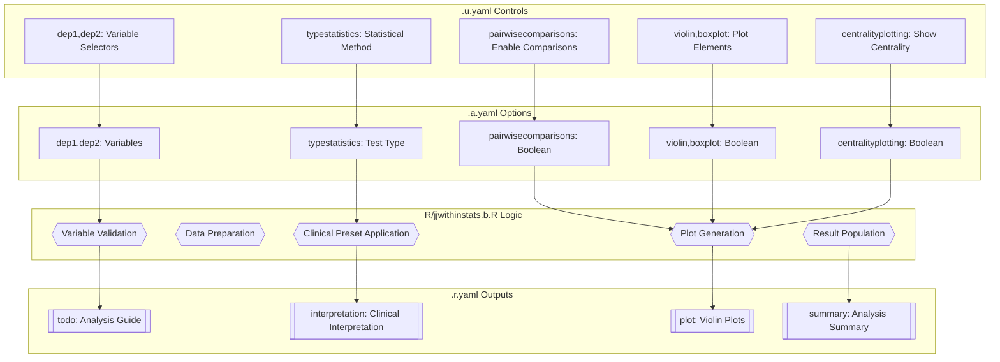
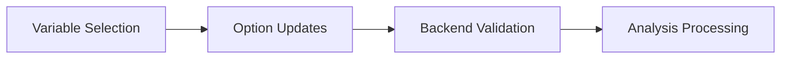
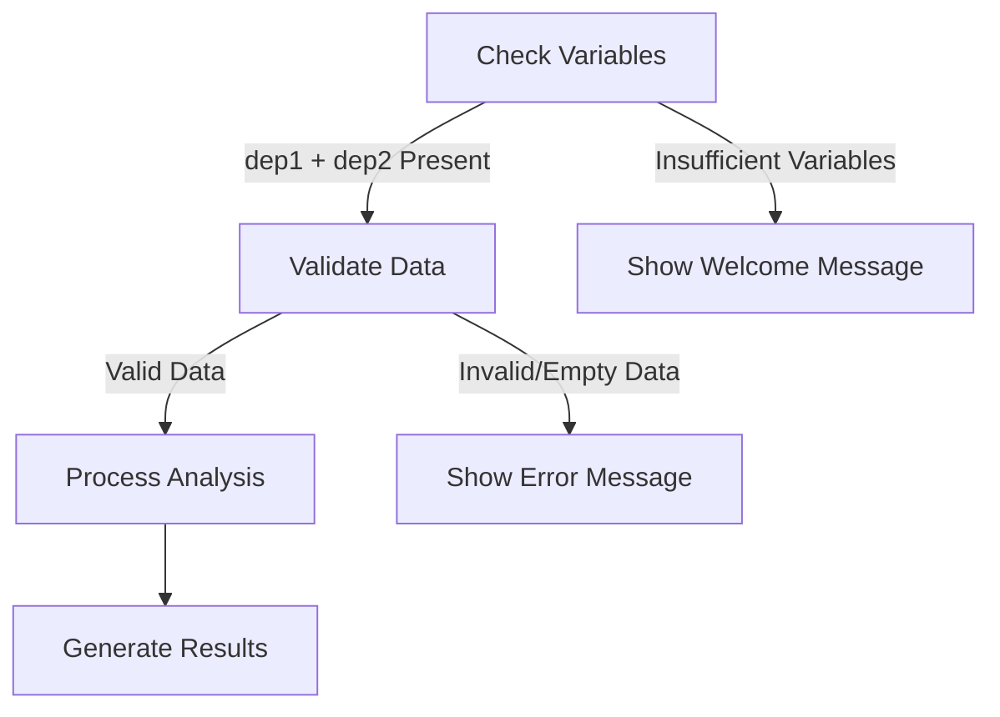
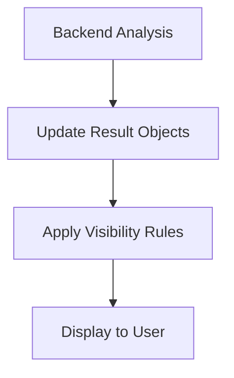
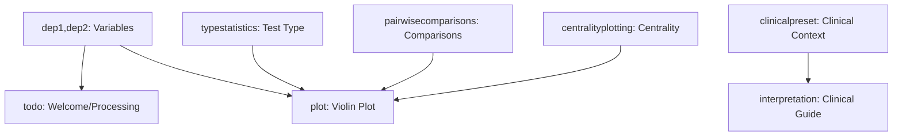

# jjwithinstats Function Documentation

## 1. Overview

- **Function**: `jjwithinstats`
- **Files**:
  - `jamovi/jjwithinstats.u.yaml` — UI
  - `jamovi/jjwithinstats.a.yaml` — Options  
  - `R/jjwithinstats.b.R` — Backend
  - `jamovi/jjwithinstats.r.yaml` — Results

**Summary**: The `jjwithinstats` function generates violin plots for within-subjects repeated measurements analysis using ggstatsplot. It provides comprehensive statistical testing (parametric, nonparametric, robust, Bayesian) with pairwise comparisons and clinical interpretation guidance, specifically designed for biomarker tracking, treatment response monitoring, and laboratory value analysis over time.

## 2. UI Controls → Options Map

| UI Control | Type | Label | Binds to Option | Default | Constraints | Visibility/Enable Rules |
|------------|------|--------|-----------------|---------|-------------|-------------------------|
| dep1 | VariablesListBox | First Measurement | dep1 | NULL | maxItemCount: 1, continuous/numeric | Always visible |
| dep2 | VariablesListBox | Second Measurement | dep2 | NULL | maxItemCount: 1, continuous/numeric | Always visible |
| dep3 | VariablesListBox | Third Measurement (Optional) | dep3 | NULL | maxItemCount: 1, continuous/numeric | Always visible |
| dep4 | VariablesListBox | Fourth Measurement (Optional) | dep4 | NULL | maxItemCount: 1, continuous/numeric | Always visible |
| clinicalpreset | ComboBox | Clinical Analysis Preset | clinicalpreset | custom | custom/biomarker/treatment/laboratory | Always visible |
| typestatistics | ComboBox | Statistical Test Type | typestatistics | parametric | parametric/nonparametric/robust/bayes | Always visible |
| effsizetype | ComboBox | Effect Size Type | effsizetype | biased | biased/unbiased/eta/omega | Always visible |
| pairwisecomparisons | CheckBox | Compare Each Time Point Pair | pairwisecomparisons | false | Boolean | Always visible |
| pairwisedisplay | ComboBox | Pairwise Display | pairwisedisplay | significant | significant/non-significant/everything | Enabled when pairwisecomparisons=true |
| padjustmethod | ComboBox | Adjustment Method | padjustmethod | holm | holm/hochberg/hommel/bonferroni/BH/BY/fdr/none | Enabled when pairwisecomparisons=true |
| violin | CheckBox | Violin Plot | violin | true | Boolean | Always visible |
| boxplot | CheckBox | Box Plot | boxplot | true | Boolean | Always visible |
| point | CheckBox | Points | point | false | Boolean | Always visible |
| pointpath | CheckBox | Show Point Path | pointpath | false | Boolean | Always visible |
| centralityplotting | CheckBox | Show Average Values | centralityplotting | false | Boolean | Always visible |
| centralitypath | CheckBox | Centrality Path | centralitypath | false | Boolean | Enabled when centralityplotting=true |
| centralitytype | ComboBox | Centrality Type | centralitytype | parametric | parametric/nonparametric/robust/bayes | Enabled when centralityplotting=true |
| resultssubtitle | CheckBox | Statistical Results | resultssubtitle | false | Boolean | Always visible |
| originaltheme | CheckBox | Add GGStatsPlot Layer | originaltheme | false | Boolean | Always visible |
| bfmessage | CheckBox | Bayes Factor Message | bfmessage | false | Boolean | Always visible |
| mytitle | TextBox | Title | mytitle | 'Within Group Comparison' | String | Always visible |
| xtitle | TextBox | X-Title | xtitle | '' | String | Always visible |
| ytitle | TextBox | Y-Title | ytitle | '' | String | Always visible |
| conflevel | TextBox | Confidence Level | conflevel | 0.95 | Number, 0-1 | Always visible |
| k | TextBox | Decimal Places | k | 2 | Integer, 0-5 | Always visible |
| plotwidth | TextBox | Plot Width | plotwidth | 650 | Integer, 300-1200 | Always visible |
| plotheight | TextBox | Plot Height | plotheight | 450 | Integer, 300-800 | Always visible |

## 3. Options Reference (.a.yaml)

### Core Variables
- **dep1** / Variable / NULL
  - Description: First measurement variable for within-subjects analysis
  - Downstream Effects: Required for analysis initialization; used in data preparation and plot generation

- **dep2** / Variable / NULL  
  - Description: Second measurement variable for within-subjects analysis
  - Downstream Effects: Required for analysis initialization; paired with dep1 for minimum viable analysis

- **dep3** / Variable / NULL
  - Description: Optional third measurement variable
  - Downstream Effects: Extends analysis to 3-timepoint comparison when provided

- **dep4** / Variable / NULL
  - Description: Optional fourth measurement variable  
  - Downstream Effects: Enables 4-timepoint analysis when provided with dep3

### Clinical Configuration
- **clinicalpreset** / List / custom
  - Description: Preset configurations for common clinical scenarios
  - Downstream Effects: Automatically configures typestatistics, pairwisecomparisons, and centralityplotting based on clinical context

### Statistical Method
- **typestatistics** / List / parametric
  - Description: Statistical test type selection (parametric/nonparametric/robust/bayes)
  - Downstream Effects: Determines underlying statistical method in ggwithinstats call

- **effsizetype** / List / biased  
  - Description: Effect size calculation method for parametric tests
  - Downstream Effects: Passed to ggstatsplot for effect size computation

### Pairwise Analysis
- **pairwisecomparisons** / Bool / false
  - Description: Enable pairwise comparisons between time points
  - Downstream Effects: Controls statistical annotation display and comparison calculations

- **pairwisedisplay** / List / significant
  - Description: Which pairwise comparisons to display
  - Downstream Effects: Filters comparison annotations on plot

- **padjustmethod** / List / holm
  - Description: Multiple comparison correction method
  - Downstream Effects: Applied to pairwise comparison p-values

### Plot Configuration  
- **violin** / Bool / true
  - Description: Show violin plot layer
  - Downstream Effects: Controls violin geom inclusion in plot

- **boxplot** / Bool / true
  - Description: Show box plot layer
  - Downstream Effects: Controls box plot geom inclusion

- **point** / Bool / false
  - Description: Show individual data points
  - Downstream Effects: Controls point geom inclusion

### Statistical Features
- **pointpath** / Bool / false
  - Description: Connect individual points across time
  - Downstream Effects: Enables path geom connecting individual trajectories

- **centralityplotting** / Bool / false
  - Description: Display mean/median trend lines
  - Downstream Effects: Controls centrality measure visualization

- **centralitytype** / List / parametric
  - Description: Type of centrality measure (mean/median/trimmed mean/MAP)
  - Downstream Effects: Determines centrality calculation method

- **centralitypath** / Bool / false
  - Description: Connect centrality points across time
  - Downstream Effects: Enables path connection for centrality measures

### Display Options
- **resultssubtitle** / Bool / false
  - Description: Show statistical results in plot subtitle
  - Downstream Effects: Controls subtitle display with statistical information

- **originaltheme** / Bool / false
  - Description: Apply ggstatsplot theme layer
  - Downstream Effects: Controls theme application in plot generation

- **bfmessage** / Bool / false
  - Description: Display Bayes Factor information (Bayesian analysis only)
  - Downstream Effects: Controls Bayes Factor display in subtitle

### Labels & Formatting
- **mytitle** / String / 'Within Group Comparison'
  - Description: Main plot title
  - Downstream Effects: Sets plot title text

- **xtitle** / String / ''
  - Description: X-axis label
  - Downstream Effects: Sets x-axis title (defaults to variable names if empty)

- **ytitle** / String / ''
  - Description: Y-axis label  
  - Downstream Effects: Sets y-axis title (defaults to variable names if empty)

- **conflevel** / Number / 0.95
  - Description: Confidence level for intervals
  - Downstream Effects: Controls confidence interval calculations

- **k** / Integer / 2
  - Description: Decimal places for statistical results
  - Downstream Effects: Controls statistical result formatting precision

- **plotwidth** / Integer / 650
  - Description: Plot width in pixels
  - Downstream Effects: Controls plot canvas width with automatic scaling for multiple measurements

- **plotheight** / Integer / 450
  - Description: Plot height in pixels
  - Downstream Effects: Controls plot canvas height with automatic scaling

## 4. Backend Usage (.b.R)

### Variable Validation
**Code Locations**: `.init()`, `.run()`, `.prepareData()`, `.validateInputs()`
- **Logic Summary**: Checks for minimum required variables (dep1 + dep2); validates dep3/dep4 sequence requirements
- **Result Population**: Controls welcome message display via `self$results$todo$setContent()`

### Clinical Preset Application  
**Code Locations**: `.applyClinicalPresets()`
- **Logic Summary**: Applies optimized configurations based on `self$options$clinicalpreset`
- **Result Population**: Updates internal option states for biomarker, treatment, and laboratory scenarios

### Data Preparation
**Code Locations**: `.prepareData()`
- **Logic Summary**: 
  - Validates dataset completeness (`nrow(mydata) == 0`)
  - Converts wide format to long format using `pivot_longer()`
  - Handles missing variable detection
  - Implements caching via MD5 hash comparison
- **Result Population**: Updates `self$results$todo` with processing messages or error states

### Plot Generation
**Code Locations**: `.plot()`, `.prepareOptions()`
- **Logic Summary**:
  - Constructs ggstatsplot function call with all option mappings
  - Handles conditional layer inclusion (violin, boxplot, points)
  - Manages statistical annotation based on pairwise settings
  - Applies clinical interpretation and error handling
- **Result Population**: 
  - Updates `self$results$plot` with generated visualization
  - Sets `self$results$interpretation` with clinical guidance
  - Controls visibility via `setVisible()` calls

### Analysis Flow Control
**Code Locations**: `.run()`
- **Logic Summary**:
  - Early validation prevents processing with insufficient variables
  - Generates welcome message for incomplete setups  
  - Manages output visibility based on analysis state
  - Provides clinical interpretation for valid analyses
- **Result Population**:
  - `self$results$todo`: Welcome messages, processing feedback
  - `self$results$interpretation`: Clinical guidance content
  - `self$results$summary`: Analysis summary information

## 5. Results Definition (.r.yaml)

### Outputs
- **todo** / Html / "Analysis Guide"  
  - **Visibility**: Always visible
  - **Population Entry Points**: `.init()`, `.run()` - Contains welcome message, processing status, or analysis guidance

- **interpretation** / Html / "Clinical Interpretation"
  - **Visibility**: Hidden when insufficient variables, shown during active analysis
  - **Population Entry Points**: `.run()` - Provides clinical context and interpretation guidance

- **plot** / Image / "Violin Plots"
  - **Visibility**: Hidden when insufficient variables, shown when analysis ready
  - **Population Entry Points**: `.plot()` - Main visualization output
  - **Schema**: Single image with `renderFun: .plot`, `requiresData: true`

- **summary** / Html / "Analysis Summary" 
  - **Visibility**: Hidden when insufficient variables, shown during active analysis
  - **Population Entry Points**: `.run()` - Contains analysis summary and technical details

### Clear Conditions
The analysis clears and recalculates when any of these options change:
- Core variables: dep1, dep2, dep3, dep4
- Statistical settings: clinicalpreset, typestatistics, pairwisecomparisons, pairwisedisplay, padjustmethod, effsizetype  
- Plot features: pointpath, centralityplotting, centralitytype, centralitypath, violin, boxplot, point
- Appearance: mytitle, xtitle, ytitle, originaltheme, resultssubtitle, bfmessage
- Advanced: conflevel, k, plotwidth, plotheight

## 6. Data Flow Diagram (UI → Options → Backend → Results)



## 7. Execution Sequence (User Action → Results)

### User Input Flow


### Decision Logic  


### Result Processing


**Step-by-step execution flow:**

1. **User interacts with variable selectors** → UI updates dep1, dep2, dep3, dep4 options
2. **Backend validation (.init(), .run())** → Check for minimum variables, validate data structure
3. **Data preparation (.prepareData())** → Convert wide to long format, handle missing values, cache results
4. **Clinical preset application** → Auto-configure options based on clinical scenario selection
5. **Plot generation (.plot())** → Construct ggstatsplot call with all option mappings
6. **Result population** → Update todo, interpretation, plot, summary objects
7. **Visibility management** → Show/hide results based on analysis state and data validity



## 8. Change Impact Guide

### Key Option Changes

**dep1, dep2 (Variables)**
- **If changed**: Complete analysis recalculation, data validation, format conversion
- **Common pitfalls**: Missing variables in dataset, non-numeric data, empty dataset
- **Recommended defaults**: Select continuous numeric variables with multiple time points

**typestatistics (Statistical Method)**  
- **If changed**: Statistical test method, effect size calculation, result interpretation
- **Common pitfalls**: Parametric assumptions not met, small sample sizes with Bayesian
- **Recommended defaults**: nonparametric for biomarker data, parametric for controlled studies

**pairwisecomparisons (Enable Comparisons)**
- **If changed**: Plot annotation density, statistical computation load, result complexity
- **Common pitfalls**: Overcrowded plots with many timepoints, multiple testing inflation
- **Recommended defaults**: true for clinical studies, false for exploratory analysis

**clinicalpreset (Clinical Context)**
- **If changed**: Automatic reconfiguration of multiple dependent options
- **Common pitfalls**: Overriding manual configurations, inappropriate preset for data type
- **Recommended defaults**: biomarker for laboratory values, treatment for intervention studies

**centralityplotting (Show Trends)**
- **If changed**: Plot visual complexity, centrality calculation overhead
- **Common pitfalls**: Obscured individual patterns, inappropriate centrality type
- **Recommended defaults**: true for group-level analysis, false for individual tracking

### Performance Implications
- **Heavy operations**: Data pivot transformation (cached), ggstatsplot generation, pairwise calculations
- **Optimization features**: MD5-based caching in `.prepareData()`, conditional plot layer inclusion
- **Resource scaling**: Plot dimensions auto-scale with measurement count

## 9. Example Usage

### Example Dataset Requirements
- **Format**: Wide format with one row per subject
- **Variables**: 2-4 continuous numeric measurement columns
- **Sample structure**:
```
Subject | Time1 | Time2 | Time3
--------|--------|-------|-------
   1    |  12.3  |  14.1 |  16.8
   2    |  10.7  |  11.2 |  13.4
```

### Example Option Payload (Clinical Biomarker Analysis)
```yaml
dep1: "Baseline_Biomarker"
dep2: "Month_3_Biomarker" 
dep3: "Month_6_Biomarker"
clinicalpreset: "biomarker"
typestatistics: "nonparametric"
pairwisecomparisons: true
pairwisedisplay: "significant"
centralityplotting: true
centralitytype: "nonparametric"
mytitle: "Biomarker Levels Over Treatment Period"
```

### Expected Outputs
- **Analysis Guide**: Welcome message → Processing status → Clinical interpretation guidance
- **Clinical Interpretation**: Biomarker-specific guidance with trend interpretation
- **Violin Plot**: Multi-timepoint comparison with statistical annotations, median trend lines
- **Analysis Summary**: Technical details of statistical methods and sample characteristics

## 10. Appendix (Schemas & Snippets)

### Result Schemas

**todo (Html)**
```yaml
name: todo
title: "Analysis Guide"  
type: Html
content: Dynamic welcome message, processing status, or clinical guidance
```

**interpretation (Html)**
```yaml
name: interpretation
title: "Clinical Interpretation"
type: Html  
content: Clinical context and analysis guidance based on scenario
```

**plot (Image)**
```yaml
name: plot
title: "Violin Plots"
type: Image
renderFun: .plot
requiresData: true
content: ggstatsplot-generated within-subjects visualization
```

**summary (Html)**  
```yaml
name: summary
title: "Analysis Summary"
type: Html
content: Technical analysis details and sample characteristics
```

### Key Code Snippets

**Variable Validation**
```r
if (is.null(self$options$dep1) || is.null(self$options$dep2)) {
    self$results$todo$setContent(welcome_message)
    self$results$plot$setVisible(visible = FALSE)
    return()
}
```

**Clinical Preset Application**
```r
switch(self$options$clinicalpreset,
    "biomarker" = {
        # Auto-configure for nonparametric biomarker analysis
        if (self$options$typestatistics == "parametric") {
            # Would update to nonparametric
        }
    }
)
```

**Data Preparation with Caching**
```r
vars <- Filter(Negate(is.null), c(self$options$dep1, self$options$dep2, 
                                 self$options$dep3, self$options$dep4))
current_hash <- digest::digest(list(
    dep1 = self$options$dep1, dep2 = self$options$dep2,
    # ... cache key components
), algo = "md5")
```

**Plot Generation**
```r
ggstatsplot::ggwithinstats(
    data = long_data,
    x = measurement,
    y = value, 
    type = self$options$typestatistics,
    pairwise.comparisons = self$options$pairwisecomparisons,
    # ... additional option mappings
)
```

**Result Population**
```r
self$results$plot$setVisible(visible = TRUE)
self$results$interpretation$setContent(clinical_guidance)
self$results$summary$setContent(analysis_summary)
```