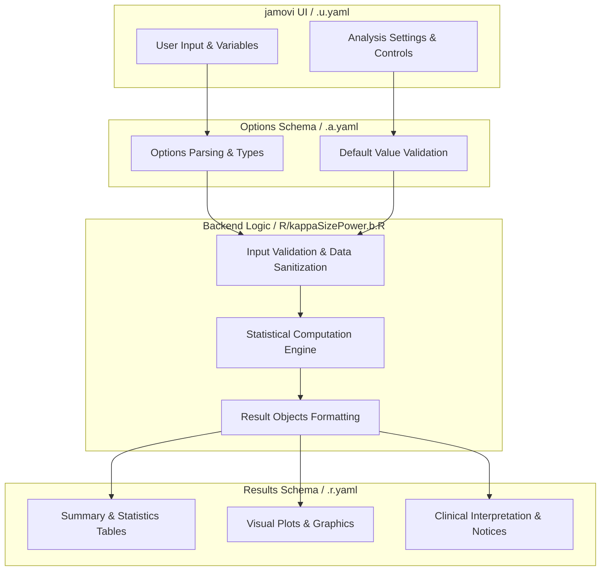
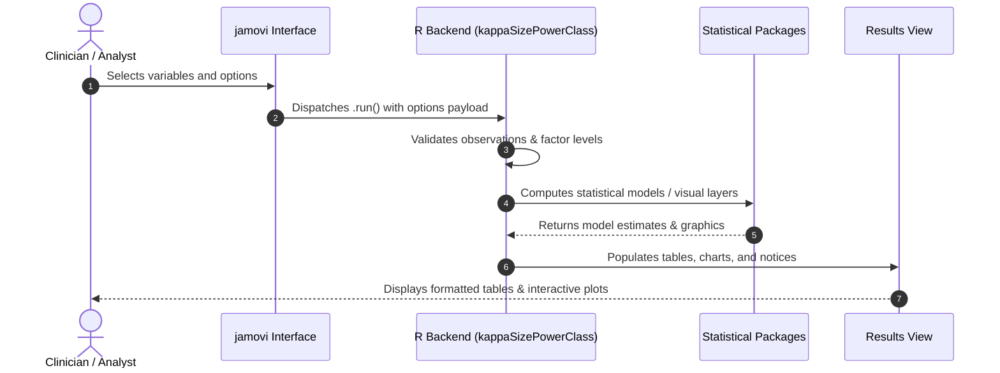

# Power Approach for the Number of Subjects Required - Developer Documentation

## 1. Overview

- **Function**: `kappaSizePower`
- **Title**: Power Approach for the Number of Subjects Required
- **Module**: `PowerT`
- **Files**:
  - `jamovi/kappaSizePower.u.yaml` - User Interface Definition
  - `jamovi/kappaSizePower.a.yaml` - Options & Schema Definition
  - `jamovi/kappaSizePower.r.yaml` - Results Layout & Tables
  - `R/kappaSizePower.b.R` - Backend Implementation
- **Summary**: Sample size for an interobserver agreement study sized to reject a null kappa (kappa0) in favour of an alternative kappa (kappa1) at a given two-sided significance level and power - the power approach of the kappaSize package. Use kappaSizeCI for a target confidence-interval width, and kappaSizeFixedN when the number of subjects is already fixed.

## 1a. Changelog

- **Date**: 2026-08-29
- **Summary**: Comprehensive documentation suite created & verified against active schemas and backend implementation.

## 2. Options Reference (`.a.yaml`)

| Option | Type | Default | Description |
| :--- | :--- | :--- | :--- |
| `outcome` | `List` | `2` | Number of outcome levels |
| `kappa0` | `Number` | `0.4` | kappa0 |
| `kappa1` | `Number` | `0.6` | kappa1 |
| `props` | `String` | `0.20, 0.80` | Expected proportion of cases in each category |
| `raters` | `List` | `2` | raters |
| `alpha` | `Number` | `0.05` | alpha |
| `power` | `Number` | `0.8` | power |

## 3. Results Definition (`.r.yaml`)

| Output ID | Type | Title | Description |
| :--- | :--- | :--- | :--- |
| `notices` | `Html` | `Notes` |  |
| `text1` | `Preformatted` | `Analysis result` |  |
| `text_summary` | `Preformatted` | `Summary` |  |
| `text2` | `Preformatted` | `Study Explanation` |  |

## 4. Architecture & Data Flow Diagram

## 5. Execution Sequence

## 6. Change Impact & Safety Guidelines

- **Data Filtering**: Ensure observations with missing values are handled gracefully according to analysis options.
- **Formula Conflicts**: Use isolated environment calls or base formula methods when interacting with `ggstatsplot` or formula parsers.
- **Safe Deparsing**: Use `deparse(val)` in syntax generation (`asSource()`) to escape column names with spaces or special symbols.

