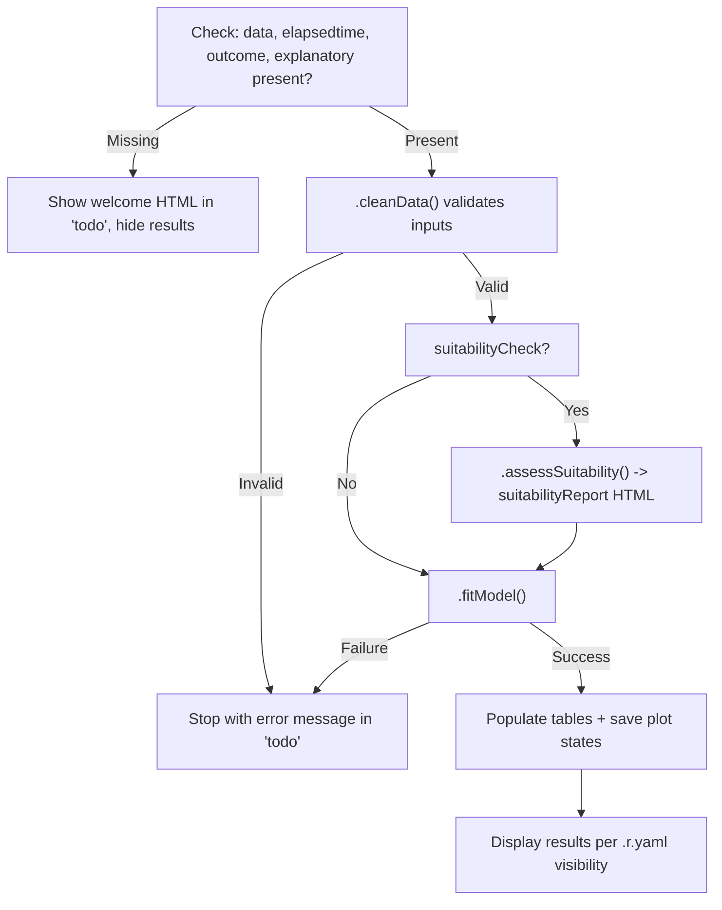
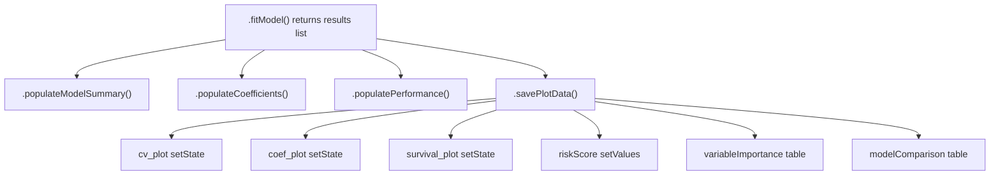

# Lasso-Cox Regression -- Developer Documentation

## 1. Overview

- **Function**: `lassocox`
- **Files**:
  - `jamovi/lassocox.u.yaml` -- UI
  - `jamovi/lassocox.a.yaml` -- Options
  - `R/lassocox.b.R` -- Backend
  - `jamovi/lassocox.r.yaml` -- Results
- **Menu**: SurvivalT > Penalized Cox Regression > LASSO Cox
- **Summary**: Performs L1-penalized (LASSO) Cox proportional hazards regression for automatic variable selection in survival analysis. Accepts a time variable, a binary outcome, and two or more candidate explanatory variables; fits a cross-validated LASSO model via `glmnet`; and returns selected variables with coefficients, model performance metrics (C-index, log-rank, hazard ratio), risk scores, and three plots (cross-validation, coefficient bar chart, risk-group survival curves). An advisory traffic-light data suitability assessment and optional educational outputs round out the module.

## 1a. Changelog

- Date: 2026-03-08
- Summary: Created canonical `lassocox-documentation.md` from existing `lassocox_documentation.md` baseline with full skill-spec sections.
- Changes:
  - Added full UI Controls to Options Map table (Section 2) with visibility/enable rules.
  - Added complete Options Reference (Section 3) with downstream effects.
  - Added Backend Usage (Section 4) with per-option code locations and result population calls.
  - Added Results Definition (Section 5) with full column schemas and visibility rules.
  - Added Data Flow Diagram (Section 6) and Execution Sequence (Section 7) with Mermaid diagrams.
  - Added Change Impact Guide (Section 8) and Example Usage (Section 9).
  - Added Appendix (Section 10) with table schemas and key code snippets.

---

## 2. UI Controls to Options Map

| UI Control (id / type) | Label | Binds to Option | Defaults & Constraints | Visibility / Enable Rules |
|---|---|---|---|---|
| `elapsedtime` / VariablesListBox | Time Elapsed | `elapsedtime` (Variable) | -- | Always visible; maxItemCount=1 |
| `outcome` / VariablesListBox | Outcome | `outcome` (Variable) | -- | Always visible; maxItemCount=1 |
| `outcomeLevel` / LevelSelector | Event Level | `outcomeLevel` (Level) | Levels from `outcome` | Enabled when `outcome` is set |
| `explanatory` / VariablesListBox | Explanatory Variables | `explanatory` (Variables) | -- | Always visible |
| `suitabilityCheck` / CheckBox | Data Suitability Assessment | `suitabilityCheck` (Bool) | default: `true` | Inside "Data Suitability" CollapseBox (expanded by default) |
| `lambda` / ComboBox | Lambda Selection | `lambda` (List) | default: `lambda.1se`; options: `lambda.min`, `lambda.1se` | Inside "Model Options" CollapseBox (collapsed) |
| `nfolds` / TextBox | Number of CV Folds | `nfolds` (Integer) | default: `10`; min: `3` | Inside "Model Options" CollapseBox (collapsed) |
| `standardize` / CheckBox | Standardize Variables | `standardize` (Bool) | default: `true` | Inside "Model Options" CollapseBox (collapsed) |
| `cv_plot` / CheckBox | Cross-validation Plot | `cv_plot` (Bool) | default: `true` | Inside "Plots" CollapseBox (collapsed) |
| `coef_plot` / CheckBox | Coefficient Plot | `coef_plot` (Bool) | default: `true` | Inside "Plots" CollapseBox (collapsed) |
| `survival_plot` / CheckBox | Risk Group Survival Plot | `survival_plot` (Bool) | default: `true` | Inside "Plots" CollapseBox (collapsed) |
| `riskScore` / Output | Add Risk Score to Data | `riskScore` (Output) | -- | Inside "Output Options" CollapseBox (collapsed) |
| `showExplanations` / CheckBox | Show Method Explanations | `showExplanations` (Bool) | default: `false` | Bottom LayoutBox, always visible |
| `showMethodologyNotes` / CheckBox | Detailed Methodology Notes | `showMethodologyNotes` (Bool) | default: `false` | Bottom LayoutBox, always visible |
| `includeClinicalGuidance` / CheckBox | Clinical Interpretation Guidance | `includeClinicalGuidance` (Bool) | default: `false` | Bottom LayoutBox, always visible |
| `showVariableImportance` / CheckBox | Variable Importance Analysis | `showVariableImportance` (Bool) | default: `false` | Bottom LayoutBox, always visible |
| `showModelComparison` / CheckBox | Model Comparison Analysis | `showModelComparison` (Bool) | default: `false` | Bottom LayoutBox, always visible |

---

## 3. Options Reference (.a.yaml)

| Name | Type | Default | Description | Downstream Effects (.b.R) |
|---|---|---|---|---|
| `data` | Data | -- | The input data frame | Accessed as `self$data` throughout |
| `elapsedtime` | Variable | -- | Numeric follow-up time | `.cleanData`: extracted, validated (non-negative, no NA); used to create `Surv()` object |
| `outcome` | Variable | -- | Binary event status (factor or numeric) | `.cleanData`: validated for exactly 2 levels; compared with `outcomeLevel` to create binary status |
| `outcomeLevel` | Level | -- | Which level of `outcome` = event | `.cleanData`: `status <- as.numeric(outcome == outcomeLevel)` |
| `explanatory` | Variables | -- | Candidate predictors (>=2 required) | `.cleanData`: checked for constants, create design matrix via `model.matrix()`; column count drives suitability checks |
| `lambda` | List | `lambda.1se` | Lambda selection method (`lambda.min` or `lambda.1se`) | `.fitModel`: `switch(self$options$lambda, ...)` selects optimal lambda from `cv.glmnet` |
| `nfolds` | Integer | `10` (min: 3) | Number of CV folds | `.fitModel`: capped at `n/3`; passed to `cv.glmnet(nfolds=...)` |
| `standardize` | Bool | `true` | Standardize predictors before fitting | `.cleanData`: if true, applies `scale()` and stores scaling info; `.fitModel` passes `standardize=FALSE` to glmnet (already done) |
| `suitabilityCheck` | Bool | `true` | Run data suitability assessment | `.run`: gates call to `.assessSuitability()` |
| `cv_plot` | Bool | `true` | Show cross-validation plot | `.savePlotData`: gates `setState` on `cv_plot` image; `.cvPlot` render function checks this flag |
| `coef_plot` | Bool | `true` | Show coefficient bar plot | `.savePlotData`: gates `setState` on `coef_plot` image; `.coefPlot` render function checks this flag |
| `survival_plot` | Bool | `true` | Show risk-group survival curves | `.savePlotData`: gates `setState` on `survival_plot` image; `.survivalPlot` render function checks this flag |
| `riskScore` | Output | -- | Save calculated risk scores to dataset | `.savePlotData`: `self$results$riskScore$setValues(full_risk_scores)` |
| `showExplanations` | Bool | `false` | Display LASSO methodology explanation | `.initializeExplanations`: gates `.populateLassoExplanation()`; `.savePlotData`: gates CV/reg-path/risk-score explanations |
| `showMethodologyNotes` | Bool | `false` | Display technical methodology notes | `.initializeExplanations`: gates `.populateMethodologyNotes()` |
| `includeClinicalGuidance` | Bool | `false` | Display clinical interpretation guidance | `.initializeExplanations`: gates `.populateClinicalGuidance()` |
| `showVariableImportance` | Bool | `false` | Display variable importance table | `.savePlotData`: gates `.populateVariableImportance(results)` |
| `showModelComparison` | Bool | `false` | Compare LASSO vs standard Cox | `.savePlotData`: gates `.populateModelComparison(results)` |

---

## 4. Backend Usage (.b.R)

### 4.1 `.init()`

- **Package check**: Verifies `glmnet`, `survival`, `survminer` are installed. On failure, writes error HTML to `self$results$todo`.
- **Welcome message**: If `elapsedtime`, `outcome`, or `explanatory` are null, writes an instructional HTML to `self$results$todo` and hides `modelSummary`, `coefficients`, `performance`, and all three plot outputs.
- **Explanation init**: Calls `private$.initializeExplanations()` which populates `lassoExplanation`, `methodologyNotes`, and `clinicalGuidance` HTML outputs based on their respective boolean options.

### 4.2 `.run()`

1. **Early exit** if data is null/empty or required variables are missing.
2. **Hide welcome** (`todo` set invisible); **show results** (`modelSummary`, `coefficients`, `performance` set visible).
3. **Pipeline** (inside `tryCatch`):
   - `private$.cleanData()` -- returns validated list or `NULL`
   - `private$.assessSuitability(data)` -- if `suitabilityCheck` is true
   - `private$.fitModel(data)` -- returns results list or `NULL`
   - `private$.populateModelSummary(results)`
   - `private$.populateCoefficients(results)`
   - `private$.populatePerformance(results)`
   - `private$.savePlotData(results)` -- sets plot states, populates explanations/importance/comparison, sets risk score output
4. **Error handling**: On error, writes message to `todo` HTML and makes it visible.

### 4.3 `.cleanData()`

| Option accessed | Logic |
|---|---|
| `self$options$elapsedtime` | Extract, `toNumeric()`, validate no NA/negative/zero |
| `self$options$outcome` | Extract, check exactly 2 levels |
| `self$options$outcomeLevel` | Validate against levels; create binary `status` vector |
| `self$options$explanatory` | Require >= 2 vars; check for constants; create design matrix via `model.matrix()` |
| `self$options$standardize` | If true, `scale(X)` and store center/scale info |

Returns: `list(time, status, X, n, n_events, n_censored, variable_names, original_variable_names, scaling_info, complete_cases)`

### 4.4 `.fitModel(data)`

| Option accessed | Logic |
|---|---|
| `self$options$nfolds` | Capped to `max(3, min(nfolds, n/3))`; passed to `cv.glmnet()` |
| `self$options$lambda` | `switch()` to pick `lambda.min` or `lambda.1se` from CV result |

Key steps:
1. `survival::Surv(data$time, data$status)` -- create survival object
2. `glmnet::cv.glmnet(x=data$X, y=y, family="cox", alpha=1, nfolds=nfolds)` -- cross-validated LASSO
3. `glmnet::glmnet(x=data$X, y=y, family="cox", alpha=1, lambda=lambda_optimal)` -- final model
4. Extract coefficients; if no variables selected, fall back to `lambda.min`
5. Calculate risk scores via `predict(..., type="link")`
6. Call `.calculatePerformanceMetrics()` for C-index, log-rank, hazard ratio

Returns: `list(cv_fit, final_model, coef_matrix, selected_vars, lambda_optimal, risk_scores, performance_metrics, var_importance, data)`

### 4.5 Result Population Methods

| Method | Result object | What it populates |
|---|---|---|
| `.populateModelSummary(results)` | `self$results$modelSummary` | 7 rows: Total Variables, Selected Variables, Selection Proportion, Optimal Lambda, Sample Size, Events, Censoring Rate |
| `.populateCoefficients(results)` | `self$results$coefficients` | One row per selected variable: variable name, coefficient, hazard ratio, importance. Adds scale note if standardized. |
| `.populatePerformance(results)` | `self$results$performance` | Up to 3 rows: C-index (with SE and interpretation), Log-rank p-value, Hazard Ratio (High vs Low Risk with 95% CI) |
| `.savePlotData(results)` | `cv_plot`, `coef_plot`, `survival_plot` states; `riskScore` output; plus `variableImportance` and `modelComparison` tables | Sets plain-numeric state for each plot; populates optional tables; writes risk score output |
| `.populateVariableImportance(results)` | `self$results$variableImportance` | One row per selected variable: variable, importance_score, selection_frequency (from regularization path), stability_rank |
| `.populateModelComparison(results)` | `self$results$modelComparison` | 2 rows: LASSO Cox and Standard Cox (all variables), comparing n_variables, cindex, AIC, log-likelihood |
| `.populateLassoExplanation()` | `self$results$lassoExplanation` | Static HTML explaining LASSO Cox concepts |
| `.populateMethodologyNotes()` | `self$results$methodologyNotes` | Static HTML with technical methodology details |
| `.populateClinicalGuidance()` | `self$results$clinicalGuidance` | Static HTML with clinical interpretation guidance |
| `.populateCrossValidationExplanation()` | `self$results$crossValidationExplanation` | Static HTML explaining the CV plot |
| `.populateRegularizationPathExplanation()` | `self$results$regularizationPathExplanation` | Static HTML explaining the coefficient plot |
| `.populateRiskScoreExplanation()` | `self$results$riskScoreExplanation` | Static HTML explaining risk scores and survival curves |
| `.assessSuitability(data)` | `self$results$suitabilityReport` (via `.generateSuitabilityHtml()`) | 6-check traffic-light HTML: EPV, Regularization Need, Sample Size, Event Rate, Multicollinearity, Data Quality |

### 4.6 Plot Render Functions

| Function | Image state keys | Package used |
|---|---|---|
| `.cvPlot(image, ggtheme, theme, ...)` | `lambda`, `cvm`, `cvsd`, `cvup`, `cvlo`, `lambda_min`, `lambda_1se` | `ggplot2` |
| `.coefPlot(image, ggtheme, theme, ...)` | `var_names`, `coef_values`, `var_importance` | `ggplot2` |
| `.survivalPlot(image, ggtheme, theme, ...)` | `time`, `status`, `risk_scores` | `survminer::ggsurvplot()`, fallback to base `plot()` |

All plot functions check their respective boolean option first and return early if disabled. They retrieve state from `image$state` and guard against null/empty/uniform states with informative `grid::grid.text()` warnings.

---

## 5. Results Definition (.r.yaml)

### 5.1 Outputs Summary

| Output id | Type | Title | Visibility | clearWith |
|---|---|---|---|---|
| `todo` | Html | To Do | (inferred) always, hidden by `.run()` when analysis proceeds | outcome, outcomeLevel, elapsedtime, explanatory |
| `suitabilityReport` | Html | Data Suitability Assessment | `(suitabilityCheck)` | outcome, outcomeLevel, elapsedtime, explanatory, suitabilityCheck |
| `modelSummary` | Table | Model Summary | (inferred) shown by `.run()` | outcome, outcomeLevel, elapsedtime, explanatory, lambda, nfolds, standardize |
| `coefficients` | Table | Selected Variables | (inferred) shown by `.run()` | same as modelSummary |
| `performance` | Table | Model Performance | (inferred) shown by `.run()` | same as modelSummary |
| `cv_plot` | Image | Cross-validation Plot | `(cv_plot)` | cv_plot + model options |
| `coef_plot` | Image | Coefficient Plot | `(coef_plot)` | coef_plot + model options |
| `survival_plot` | Image | Risk Group Survival Plot | `(survival_plot)` | survival_plot + model options |
| `riskScore` | Output | Add Risk Score to Data | -- | model options |
| `lassoExplanation` | Html | Understanding LASSO Cox Regression | `(showExplanations)` | showExplanations |
| `methodologyNotes` | Html | LASSO Cox Methodology Notes | `(showMethodologyNotes)` | showMethodologyNotes |
| `clinicalGuidance` | Html | Clinical Interpretation Guidance | `(includeClinicalGuidance)` | includeClinicalGuidance |
| `variableImportance` | Table | Variable Importance Analysis | `(showVariableImportance)` | showVariableImportance + input vars |
| `modelComparison` | Table | LASSO vs Standard Cox Regression | `(showModelComparison)` | showModelComparison + input vars |
| `regularizationPathExplanation` | Html | Understanding Regularization Path | `(showExplanations && coef_plot)` | showExplanations, coef_plot |
| `crossValidationExplanation` | Html | Understanding Cross-Validation Plot | `(showExplanations && cv_plot)` | showExplanations, cv_plot |
| `riskScoreExplanation` | Html | Understanding Risk Scores and Survival Curves | `(showExplanations && survival_plot)` | showExplanations, survival_plot |

### 5.2 Table Column Schemas

**modelSummary**

| Column | Title | Type |
|---|---|---|
| `statistic` | (empty) | text |
| `value` | Value | text |

**coefficients**

| Column | Title | Type |
|---|---|---|
| `variable` | Variable | text |
| `coefficient` | Coefficient | number |
| `hazardRatio` | Hazard Ratio | number |
| `importance` | Importance | number |

**performance**

| Column | Title | Type |
|---|---|---|
| `metric` | Metric | text |
| `value` | Value | text |
| `interpretation` | Interpretation | text |

**variableImportance**

| Column | Title | Type | Format |
|---|---|---|---|
| `variable` | Variable | text | -- |
| `importance_score` | Importance Score | number | zto |
| `selection_frequency` | Selection Frequency | number | pc |
| `stability_rank` | Stability Rank | integer | -- |

**modelComparison**

| Column | Title | Type | Format |
|---|---|---|---|
| `model_type` | Model Type | text | -- |
| `n_variables` | N Variables | integer | -- |
| `cindex` | C-index | number | zto |
| `aic` | AIC | number | zto |
| `log_likelihood` | Log-Likelihood | number | zto |

### 5.3 Image Specifications

| Image | renderFun | Width | Height | refs |
|---|---|---|---|---|
| `cv_plot` | `.cvPlot` | 600 | 400 | glmnet |
| `coef_plot` | `.coefPlot` | 600 | 400 | glmnet |
| `survival_plot` | `.survivalPlot` | 600 | 400 | survminer |

---

## 6. Data Flow Diagram (UI to Options to Backend to Results)

```mermaid
flowchart TD
  subgraph UI[".u.yaml Controls"]
    U_time["elapsedtime: Time Elapsed"]
    U_outcome["outcome: Outcome"]
    U_level["outcomeLevel: Event Level"]
    U_expl["explanatory: Explanatory Variables"]
    U_suit["suitabilityCheck: Data Suitability"]
    U_lambda["lambda: Lambda Selection"]
    U_nfolds["nfolds: Number of CV Folds"]
    U_std["standardize: Standardize Variables"]
    U_cvplot["cv_plot: Cross-validation Plot"]
    U_coefplot["coef_plot: Coefficient Plot"]
    U_survplot["survival_plot: Risk Group Survival"]
    U_risk["riskScore: Add Risk Score"]
    U_expl_opts["showExplanations / showMethodologyNotes / includeClinicalGuidance / showVariableImportance / showModelComparison"]
  end

  subgraph A[".a.yaml Options"]
    A_time["elapsedtime: Variable"]
    A_outcome["outcome: Variable"]
    A_level["outcomeLevel: Level"]
    A_expl["explanatory: Variables"]
    A_suit["suitabilityCheck: Bool=true"]
    A_lambda["lambda: List=lambda.1se"]
    A_nfolds["nfolds: Integer=10"]
    A_std["standardize: Bool=true"]
    A_cvplot["cv_plot: Bool=true"]
    A_coefplot["coef_plot: Bool=true"]
    A_survplot["survival_plot: Bool=true"]
    A_risk["riskScore: Output"]
    A_expl_opts["showExplanations...: Bool=false"]
  end

  subgraph B["R/lassocox.b.R"]
    B_clean{{".cleanData()"}}
    B_suit{{".assessSuitability()"}}
    B_fit{{".fitModel()"}}
    B_summary{{".populateModelSummary()"}}
    B_coefs{{".populateCoefficients()"}}
    B_perf{{".populatePerformance()"}}
    B_save{{".savePlotData()"}}
    B_explain{{".initializeExplanations()"}}
  end

  subgraph RY[".r.yaml Outputs"]
    R_todo[["todo: Html"]]
    R_suit[["suitabilityReport: Html"]]
    R_summary[["modelSummary: Table"]]
    R_coefs[["coefficients: Table"]]
    R_perf[["performance: Table"]]
    R_cv[["cv_plot: Image"]]
    R_coef[["coef_plot: Image"]]
    R_surv[["survival_plot: Image"]]
    R_risk[["riskScore: Output"]]
    R_explain[["lassoExplanation / methodologyNotes / clinicalGuidance: Html"]]
    R_varimp[["variableImportance: Table"]]
    R_compare[["modelComparison: Table"]]
  end

  U_time --> A_time --> B_clean
  U_outcome --> A_outcome --> B_clean
  U_level --> A_level --> B_clean
  U_expl --> A_expl --> B_clean
  U_suit --> A_suit --> B_suit
  U_lambda --> A_lambda --> B_fit
  U_nfolds --> A_nfolds --> B_fit
  U_std --> A_std --> B_clean

  B_clean --> B_suit --> B_fit
  B_fit --> B_summary --> R_summary
  B_fit --> B_coefs --> R_coefs
  B_fit --> B_perf --> R_perf
  B_fit --> B_save
  B_save --> R_cv
  B_save --> R_coef
  B_save --> R_surv
  B_save --> R_risk
  B_save --> R_varimp
  B_save --> R_compare

  U_cvplot --> A_cvplot --> B_save
  U_coefplot --> A_coefplot --> B_save
  U_survplot --> A_survplot --> B_save
  U_risk --> A_risk --> B_save
  U_expl_opts --> A_expl_opts --> B_explain --> R_explain
```



---

## 7. Execution Sequence (User Action to Results)

### User Input Flow


### Decision Logic



### Result Processing



### Step-by-step execution flow

1. **User interacts with UI controls** -- drags variables into target boxes, adjusts options in collapse panels.
2. **Backend validation (`.init()`)** -- checks package dependencies; if variables are missing, shows welcome message and hides result panes.
3. **Data cleaning (`.cleanData()`)** -- validates time (non-negative, no NA), outcome (binary), explanatory (>=2, no constants), creates design matrix, optionally standardizes.
4. **Suitability assessment (`.assessSuitability()`)** -- if enabled, runs 6 checks (EPV, regularization need, sample size, event rate, multicollinearity, data quality) and generates traffic-light HTML. Advisory only, never blocks analysis.
5. **Model fitting (`.fitModel()`)** -- runs `cv.glmnet()` with alpha=1, selects lambda, fits final model, extracts coefficients, calculates risk scores, computes performance metrics.
6. **Results population** -- fills `modelSummary` (7 rows), `coefficients` (per selected variable), `performance` (C-index, log-rank, HR). Saves protobuf-safe plot states. Populates optional tables and explanatory HTML.
7. **Plot rendering** -- jamovi calls `.cvPlot()`, `.coefPlot()`, `.survivalPlot()` with saved state; each builds a ggplot2 or survminer plot.
8. **Display** -- jamovi applies `.r.yaml` visibility rules to show/hide outputs.

### Option to Output Dependency Map

```mermaid
graph TD
  elapsedtime["elapsedtime"] --> modelSummary
  elapsedtime --> coefficients
  elapsedtime --> performance
  outcome["outcome"] --> modelSummary
  outcome --> coefficients
  outcome --> performance
  outcomeLevel["outcomeLevel"] --> modelSummary
  explanatory["explanatory"] --> modelSummary
  explanatory --> coefficients
  explanatory --> performance
  lambda["lambda"] --> modelSummary
  lambda --> coefficients
  lambda --> performance
  nfolds["nfolds"] --> modelSummary
  standardize["standardize"] --> modelSummary
  standardize --> coefficients
  suitabilityCheck["suitabilityCheck"] --> suitabilityReport["suitabilityReport"]
  cv_plot_opt["cv_plot"] --> cv_plot_img["cv_plot (Image)"]
  coef_plot_opt["coef_plot"] --> coef_plot_img["coef_plot (Image)"]
  survival_plot_opt["survival_plot"] --> survival_plot_img["survival_plot (Image)"]
  showExplanations["showExplanations"] --> lassoExplanation
  showExplanations --> regularizationPathExplanation
  showExplanations --> crossValidationExplanation
  showExplanations --> riskScoreExplanation
  showMethodologyNotes["showMethodologyNotes"] --> methodologyNotes
  includeClinicalGuidance["includeClinicalGuidance"] --> clinicalGuidance
  showVariableImportance["showVariableImportance"] --> variableImportance
  showModelComparison["showModelComparison"] --> modelComparison
```



---

## 8. Change Impact Guide

### Core Input Options

| Option | If changed | Recalculates | Performance implications |
|---|---|---|---|
| `elapsedtime` | Entire pipeline reruns | All tables, all plots | Full refit |
| `outcome` | Entire pipeline reruns | All tables, all plots | Full refit |
| `outcomeLevel` | Binary status recoded | All downstream | Full refit |
| `explanatory` | Design matrix rebuilt | All tables, all plots | Full refit; more variables = slower CV |

### Model Options

| Option | If changed | Recalculates | Notes |
|---|---|---|---|
| `lambda` | Only lambda selection changes | `modelSummary`, `coefficients`, `performance`, all plots | Fast (no re-CV); different variable selection |
| `nfolds` | Cross-validation rerun | All model outputs | More folds = slower but more stable; auto-capped at `n/3` |
| `standardize` | Design matrix rescaled | All model outputs | Should almost always be `true`; turning off risks unfair penalization |

### Display Options

| Option | If changed | Recalculates | Notes |
|---|---|---|---|
| `cv_plot` | Toggle only | Just the CV plot image | No refit |
| `coef_plot` | Toggle only | Just the coefficient plot image | No refit |
| `survival_plot` | Toggle only | Just the survival plot image | No refit |
| `suitabilityCheck` | Toggle only | Just the suitability HTML | No refit |
| `showExplanations` | Toggle only | Explanation HTML blocks | Static content, no refit |
| `showVariableImportance` | Toggle only | `variableImportance` table | Reads from already-fitted model |
| `showModelComparison` | Toggle only | `modelComparison` table | Fits additional standard Cox for comparison |

### Common Pitfalls

- **Fewer than 2 explanatory variables**: `.cleanData()` will stop with an error. LASSO requires >= 2 candidates.
- **Constant variables**: Detected and rejected in `.cleanData()`. Remove them before analysis.
- **Very few events (<5)**: Stops with an error. More events are needed for reliable estimation.
- **All coefficients shrunk to zero**: Can happen with `lambda.1se` on small data. The backend automatically falls back to `lambda.min`. If still zero, the coefficient plot shows nothing and the survival plot shows a warning.
- **High collinearity**: LASSO selects one variable from correlated groups arbitrarily. The suitability assessment warns about this. Consider Elastic Net for correlated predictors.
- **Protobuf serialization**: Plot states must contain only plain numerics/characters. The `.savePlotData()` method carefully extracts only `as.numeric()`/`as.integer()`/`as.data.frame()` values. Never store glmnet or cv.glmnet objects in state.
- **C-index direction**: `survival::concordance()` treats higher predictor = better prognosis by default. Since LASSO risk scores have higher = worse prognosis, `reverse=TRUE` is required. This is correctly implemented.

### Recommended Defaults

| Option | Recommended | Why |
|---|---|---|
| `lambda` | `lambda.1se` | More parsimonious; better generalization |
| `nfolds` | 10 | Standard; reduces to fewer folds automatically for small samples |
| `standardize` | `true` | Ensures fair penalization across variables with different scales |
| `suitabilityCheck` | `true` | Catches common issues before the user invests time interpreting results |

---

## 9. Example Usage

### Example Dataset Requirements

- **Minimum**: >= 10 complete observations, >= 5 events, >= 2 explanatory variables
- **Recommended**: >= 50 observations for stable CV, >= 20 events
- **Variables**: One continuous time variable (positive), one binary outcome (factor or numeric with 2 levels), two or more numeric/factor explanatory variables

### Example Option Payload (YAML)

```yaml
elapsedtime: "followup_months"
outcome: "death"
outcomeLevel: "1"
explanatory:
  - age
  - stage
  - grade
  - tumor_size
  - lymph_nodes
lambda: "lambda.1se"
nfolds: 10
standardize: true
suitabilityCheck: true
cv_plot: true
coef_plot: true
survival_plot: true
showExplanations: false
showMethodologyNotes: false
includeClinicalGuidance: false
showVariableImportance: false
showModelComparison: false
```

### Expected Outputs

- **suitabilityReport**: Traffic-light HTML assessing 6 dimensions of data suitability
- **modelSummary**: Table with 7 rows (total vars, selected vars, proportion, lambda, n, events, censoring rate)
- **coefficients**: Table with one row per selected variable (variable name, coefficient, HR, importance)
- **performance**: Table with C-index, log-rank p-value, hazard ratio (High vs Low Risk)
- **cv_plot**: ggplot2 showing partial likelihood deviance vs log(lambda) with error bars and vertical lines at lambda.min / lambda.1se
- **coef_plot**: ggplot2 horizontal bar chart of selected variable coefficients colored by direction (risk/protective)
- **survival_plot**: survminer Kaplan-Meier curves for Low Risk vs High Risk groups with risk table and p-value

### Available Test Datasets

| Dataset | File | Scenario |
|---|---|---|
| `lassocox_breast_cancer` | `data/lassocox_breast_cancer.rda` | Moderate-dimensional clinical data |
| `lassocox_lung_cancer` | `data/lassocox_lung_cancer.rda` | Standard survival data |
| `lassocox_cardiovascular` | `data/lassocox_cardiovascular.rda` | Cardiovascular outcomes |
| `lassocox_small_cohort` | `data/lassocox_small_cohort.rda` | Small sample edge case |

---

## 10. Appendix (Schemas & Snippets)

### A. Data Cleaning -- Key Snippet

```r
# Binary status creation from outcomeLevel
status <- as.numeric(outcome == self$options$outcomeLevel)

# Design matrix with factor handling
X <- model.matrix(~ ., data = predictors[complete,])[, -1]

# Optional standardization
if (self$options$standardize) {
    X_scaled <- scale(X)
    scaling_info <- list(
        center = attr(X_scaled, "scaled:center"),
        scale = attr(X_scaled, "scaled:scale")
    )
    X <- as.matrix(X_scaled)
}
```

### B. Model Fitting -- Key Snippet

```r
# Cross-validated LASSO Cox
set.seed(123456)
cv_fit <- glmnet::cv.glmnet(
    x = data$X, y = y,
    family = "cox", alpha = 1,
    nfolds = nfolds, standardize = FALSE
)

# Lambda selection
lambda_optimal <- switch(self$options$lambda,
    "lambda.min" = cv_fit$lambda.min,
    "lambda.1se" = cv_fit$lambda.1se,
    cv_fit$lambda.1se
)
```

### C. Protobuf-Safe State -- Key Snippet

```r
# CV plot: only plain numerics
cv_plot_data <- list(
    lambda = as.numeric(results$cv_fit$lambda),
    cvm = as.numeric(results$cv_fit$cvm),
    cvsd = as.numeric(results$cv_fit$cvsd),
    cvup = as.numeric(results$cv_fit$cvup),
    cvlo = as.numeric(results$cv_fit$cvlo),
    lambda_min = as.numeric(results$cv_fit$lambda.min),
    lambda_1se = as.numeric(results$cv_fit$lambda.1se)
)
self$results$cv_plot$setState(cv_plot_data)

# Survival plot: data.frame of numerics
survival_plot_data <- as.data.frame(list(
    time = as.numeric(results$data$time),
    status = as.integer(results$data$status),
    risk_scores = as.numeric(results$risk_scores)
))
self$results$survival_plot$setState(survival_plot_data)
```

### D. C-index with Correct Direction

```r
# Higher risk_scores = worse prognosis, so reverse=TRUE
cindex_result <- survival::concordance(y ~ risk_scores, reverse = TRUE)
```

### E. Suitability Assessment Thresholds

| Check | Green | Yellow | Red |
|---|---|---|---|
| Events-Per-Variable (EPV) | EPV >= 20 | 2 <= EPV < 20 | EPV < 2 |
| Regularization Need | p >= n/3 (LASSO indicated) | p <= 10 && EPV >= 20 (standard Cox may suffice) | -- |
| Sample Size | n >= 100 | 20 <= n < 100 | n < 20 |
| Event Rate | 20%-80% | 10%-20% or 80%-90% | <10% or >90% |
| Multicollinearity | max abs(r) < 0.7 | 0.7 <= max abs(r) < 0.99 | max abs(r) >= 0.99 |
| Data Quality | No issues | <5% missing | >5% missing or constant predictors |

Overall verdict: worst individual color, except if only regularization check is yellow and everything else is green, overall stays green.

### F. Dependencies

| Package | Usage |
|---|---|
| `glmnet` | `cv.glmnet()`, `glmnet()` -- LASSO fitting |
| `survival` | `Surv()`, `survfit()`, `survdiff()`, `coxph()`, `concordance()` |
| `survminer` | `ggsurvplot()` -- enhanced survival plots |
| `ggplot2` | CV and coefficient plots |
| `grid` | Fallback plot error/warning messages |
| `survcomp` | (optional) AUC calculation at time points |

### G. File Locations

| File | Path | Purpose |
|---|---|---|
| Analysis definition | `jamovi/lassocox.a.yaml` | Options/parameters |
| Results definition | `jamovi/lassocox.r.yaml` | Output items |
| UI definition | `jamovi/lassocox.u.yaml` | Interface layout |
| Backend | `R/lassocox.b.R` | Implementation (1705 lines) |
| Auto-generated header | `R/lassocox.h.R` | Compiled from YAML |
| Test data generator | `data-raw/create_lassocox_test_data.R` | Synthetic datasets |
