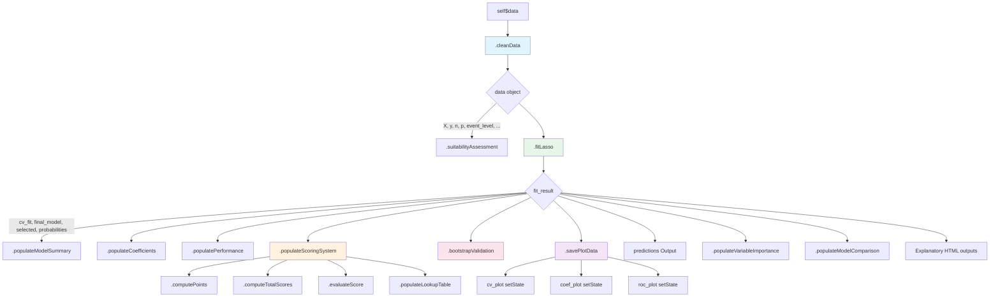

# LASSO Logistic Regression (`lassologistic`) -- Developer Documentation

> **Module:** meddecide (menuGroup: `meddecideT`)
> **Submenu:** Prediction Models
> **Version:** 0.0.37
> **Dependencies:** `glmnet`, `pROC`, `ggplot2`, `jmvcore`

---

## 1. Overview

`lassologistic` performs LASSO-penalized logistic regression for binary classification with automatic feature selection. It is designed for diagnostic pathology studies that need to build classifiers from IHC markers, morphologic features, and clinical variables (e.g., PanNET G3 vs PanNEC).

**Capabilities:**

| Feature | Description |
|---|---|
| Penalty types | LASSO (L1), Ridge (L2), Elastic Net |
| Lambda selection | Minimum CV error or 1SE rule (more parsimonious) |
| Scoring systems | Beta10, Schneeweiss, Sullivan/D'Agostino -- with compare mode |
| Lookup table | Maps total integer scores to predicted probabilities |
| Validation | Bootstrap optimism-corrected AUC and Brier score (Harrell method) |
| Diagnostics | Suitability assessment (EPV, sample size, class balance, collinearity) |
| Plots | Cross-validation, coefficient bar chart, ROC curve with DeLong CIs |
| Extras | Variable importance, model comparison (LASSO vs standard logistic) |

**File inventory:**

| File | Path | Purpose |
|---|---|---|
| Analysis definition | `jamovi/lassologistic.a.yaml` | 27 options, menu placement |
| Results definition | `jamovi/lassologistic.r.yaml` | 20 output items |
| UI definition | `jamovi/lassologistic.u.yaml` | 8 UI panels |
| Backend | `R/lassologistic.b.R` | R6 class, ~1242 lines |
| Header (auto) | `R/lassologistic.h.R` | Generated from YAML |
| Test data script | `data-raw/create_lassologistic_test_data.R` | Creates 2 datasets |
| Test data | `data/lassologistic_pannen.rda` | 120 rows, 16 cols |
| Test data | `data/lassologistic_small.rda` | 40 rows, 9 cols |
| Tests | `tests/testthat/test-lassologistic.R` | 7 test blocks |

---

## 2. UI Controls to Options Map

The UI (`.u.yaml`) is organized into 8 collapsible panels. The table below maps each UI widget to its underlying option name.

| UI Panel | Widget Type | Option Name | a.yaml Type |
|---|---|---|---|
| *(top level)* | VariablesListBox | `outcome` | Variable |
| *(top level)* | LevelSelector | `outcomeLevel` | Level |
| *(top level)* | VariablesListBox | `explanatory` | Variables |
| Data Suitability | CheckBox | `suitabilityCheck` | Bool |
| Model Options | ComboBox | `penalty` | List |
| Model Options | TextBox | `alpha` | Number |
| Model Options | ComboBox | `lambda` | List |
| Model Options | TextBox | `nfolds` | Integer |
| Model Options | CheckBox | `standardize` | Bool |
| Validation | CheckBox | `bootstrapValidation` | Bool |
| Validation | TextBox | `bootstrapN` | Integer |
| Scoring System | CheckBox | `scoringSystem` | Bool |
| Scoring System | ComboBox | `scoringMethod` | List |
| Scoring System | TextBox | `scoringMaxPoints` | Integer |
| Scoring System | CheckBox | `scoreLookupTable` | Bool |
| Plots | CheckBox | `cv_plot` | Bool |
| Plots | CheckBox | `coef_plot` | Bool |
| Plots | CheckBox | `roc_plot` | Bool |
| *(layout)* | TextBox | `random_seed` | Integer |
| Output Options | Output | `predictions` | Output |
| Explanatory Output | CheckBox | `showSummary` | Bool |
| Explanatory Output | CheckBox | `showExplanations` | Bool |
| Explanatory Output | CheckBox | `showMethodologyNotes` | Bool |
| Explanatory Output | CheckBox | `includeClinicalGuidance` | Bool |
| Explanatory Output | CheckBox | `showVariableImportance` | Bool |
| Explanatory Output | CheckBox | `showModelComparison` | Bool |

**Enable conditions (from `.u.yaml`):**

- `alpha` enabled when `penalty == 'elasticnet'`
- `bootstrapN` enabled when `bootstrapValidation == true`
- `scoringMethod`, `scoringMaxPoints`, `scoreLookupTable` enabled when `scoringSystem == true`
- `outcomeLevel` enabled when `outcome` is set

---

## 3. Options Reference (27 options)

| # | Name | Type | Default | Constraints | Description |
|---|---|---|---|---|---|
| 1 | `data` | Data | -- | -- | Input data frame |
| 2 | `outcome` | Variable | -- | suggested: ordinal/nominal; permitted: factor/numeric | Binary outcome to classify |
| 3 | `outcomeLevel` | Level | -- | variable: (outcome) | Positive class level; defaults to 2nd level for factors |
| 4 | `explanatory` | Variables | -- | suggested: nominal/ordinal/continuous; permitted: factor/numeric | Candidate predictors (min 2) |
| 5 | `penalty` | List | `lasso` | lasso, ridge, elasticnet | Regularization type |
| 6 | `alpha` | Number | 0.5 | [0.01, 0.99] | Elastic net mixing parameter |
| 7 | `lambda` | List | `lambda.1se` | lambda.min, lambda.1se | Lambda selection method |
| 8 | `nfolds` | Integer | 10 | min 3 | CV fold count; auto-reduced if n is small |
| 9 | `random_seed` | Integer | 123456 | [1, 999999] | Seed for reproducibility |
| 10 | `standardize` | Bool | true | -- | Pre-standardize predictors |
| 11 | `suitabilityCheck` | Bool | true | -- | Run data quality checks |
| 12 | `bootstrapValidation` | Bool | false | -- | Enable Harrell bootstrap validation |
| 13 | `bootstrapN` | Integer | 200 | [50, 1000] | Bootstrap iteration count |
| 14 | `cv_plot` | Bool | true | -- | Show CV deviance plot |
| 15 | `coef_plot` | Bool | true | -- | Show coefficient bar chart |
| 16 | `roc_plot` | Bool | true | -- | Show ROC curve |
| 17 | `scoringSystem` | Bool | false | -- | Generate integer scoring system |
| 18 | `scoringMethod` | List | `schneeweiss` | beta10, schneeweiss, sullivan, compare | Scoring conversion method |
| 19 | `scoringMaxPoints` | Integer | 10 | [3, 20] | Max points per feature (Beta10/Sullivan) |
| 20 | `scoreLookupTable` | Bool | true | -- | Generate score-to-probability lookup |
| 21 | `predictions` | Output | -- | -- | Save predicted probabilities to dataset |
| 22 | `showSummary` | Bool | false | -- | Natural-language results summary |
| 23 | `showExplanations` | Bool | false | -- | LASSO methodology explanation |
| 24 | `showMethodologyNotes` | Bool | false | -- | Technical regularization notes |
| 25 | `includeClinicalGuidance` | Bool | false | -- | Clinical interpretation guidance |
| 26 | `showVariableImportance` | Bool | false | -- | Variable importance across lambda path |
| 27 | `showModelComparison` | Bool | false | -- | Compare LASSO vs standard logistic |

---

## 4. Backend Architecture

### 4.1 Private Methods

| Method | Lines | Called From | Purpose |
|---|---|---|---|
| `.init()` | 16-52 | jamovi engine | Dependency check, welcome HTML, prediction init |
| `.run()` | 54-156 | jamovi engine | Main execution pipeline (12 steps) |
| `.cleanData()` | 161-278 | `.run()` step 1 | Outcome coding, constant removal, design matrix |
| `.suitabilityAssessment()` | 283-398 | `.run()` step 2 | Traffic-light HTML + Notice banners |
| `.fitLasso()` | 403-485 | `.run()` step 3 | `glmnet::cv.glmnet()` + coefficient extraction |
| `.populateModelSummary()` | 490-507 | `.run()` step 4 | 10-row summary table |
| `.populateCoefficients()` | 509-536 | `.run()` step 4 | Selected variables + odds ratios |
| `.populatePerformance()` | 538-618 | `.run()` step 4 | AUC, Brier, sensitivity, specificity, F1 |
| `.computePoints()` | 625-660 | `.populateScoringSystem()` | Core integer-point computation (3 methods) |
| `.computeTotalScores()` | 663-679 | `.populateScoringSystem()` | Sum points over variables per observation |
| `.evaluateScore()` | 682-721 | `.populateScoringSystem()` | Youden-optimal cutoff + AUC for score-based classifier |
| `.populateScoringSystem()` | 724-862 | `.run()` step 5 | Orchestrates scoring, comparison, lookup |
| `.populateLookupTable()` | 865-885 | `.populateScoringSystem()` | Score-to-probability mapping |
| `.bootstrapValidation()` | 890-979 | `.run()` step 6 | Harrell optimism correction |
| `.populateVariableImportance()` | 984-1011 | `.run()` step 9 | Inclusion proportion across lambda path |
| `.populateModelComparison()` | 1016-1059 | `.run()` step 10 | Refit standard GLM with selected vars |
| `.savePlotData()` | 1064-1100 | `.run()` step 7 | Extract plain numerics for protobuf safety |
| `.cvPlot()` | 1105-1135 | render callback | ggplot2 CV deviance plot |
| `.coefPlot()` | 1137-1156 | render callback | ggplot2 horizontal bar chart |
| `.rocPlot()` | 1158-1176 | render callback | base R `pROC::plot.roc()` |
| `.populateSummary()` | 1181-1195 | `.run()` step 11 | Natural-language HTML |
| `.populateExplanations()` | 1197-1212 | `.run()` step 11 | Static HTML about LASSO |
| `.populateMethodologyNotes()` | 1214-1225 | `.run()` step 11 | Technical methodology HTML |
| `.populateClinicalGuidance()` | 1227-1239 | `.run()` step 11 | Clinical interpretation HTML |

### 4.2 How Each Option is Consumed

| Option | Backend usage |
|---|---|
| `outcome` | `.cleanData()` -- extracts column, determines event coding |
| `outcomeLevel` | `.cleanData()` -- sets positive class; if NULL, uses 2nd factor level or max numeric |
| `explanatory` | `.cleanData()` -- builds predictor data frame, removes constants |
| `penalty` | `.fitLasso()` -- maps to alpha: lasso=1, ridge=0, elasticnet=user alpha |
| `alpha` | `.fitLasso()` -- used only when `penalty == "elasticnet"` |
| `lambda` | `.fitLasso()` -- selects `cv_fit$lambda.min` or `cv_fit$lambda.1se` |
| `nfolds` | `.fitLasso()` -- passed to `cv.glmnet()`; clamped to `[3, n-1]` |
| `random_seed` | `.run()` -- `set.seed()` at top of execution |
| `standardize` | `.cleanData()` -- `scale(X)` applied before model fitting; `glmnet(standardize=FALSE)` |
| `suitabilityCheck` | `.run()` gate -- calls `.suitabilityAssessment()` |
| `bootstrapValidation` | `.run()` gate -- calls `.bootstrapValidation()` |
| `bootstrapN` | `.bootstrapValidation()` -- loop iteration count |
| `cv_plot` | `.savePlotData()` + `.cvPlot()` render |
| `coef_plot` | `.savePlotData()` + `.coefPlot()` render |
| `roc_plot` | `.savePlotData()` + `.rocPlot()` render |
| `scoringSystem` | `.run()` gate -- calls `.populateScoringSystem()` |
| `scoringMethod` | `.populateScoringSystem()` -- selects primary method; `compare` triggers all three |
| `scoringMaxPoints` | `.computePoints()` -- cap for Beta10 and Sullivan methods |
| `scoreLookupTable` | `.populateScoringSystem()` gate -- calls `.populateLookupTable()` |
| `predictions` | `.run()` step 8 -- writes predicted probabilities to Output column |
| `showSummary` | `.run()` gate -- calls `.populateSummary()` |
| `showExplanations` | `.run()` gate -- calls `.populateExplanations()` |
| `showMethodologyNotes` | `.run()` gate -- calls `.populateMethodologyNotes()` |
| `includeClinicalGuidance` | `.run()` gate -- calls `.populateClinicalGuidance()` |
| `showVariableImportance` | `.run()` gate -- calls `.populateVariableImportance()` |
| `showModelComparison` | `.run()` gate -- calls `.populateModelComparison()` |

### 4.3 Plot State Management

Plots use `.savePlotData()` to extract plain numeric vectors/data frames from `glmnet` and `pROC` objects before calling `image$setState()`. This avoids protobuf serialization errors caused by S4/environment-bearing objects.

| Plot | State structure | Key fields |
|---|---|---|
| `cv_plot` | Named list | `lambda`, `cvm`, `cvsd`, `cvup`, `cvlo`, `lambda_min`, `lambda_1se`, `nzero` |
| `coef_plot` | Named list | `var_names` (character), `coef_values` (numeric) -- sorted by abs value |
| `roc_plot` | `data.frame` | `y` (integer 0/1), `probabilities` (numeric) |

**Render functions** receive `(image, ggtheme, theme, ...)` and read from `image$state`. They return `TRUE` on success, `FALSE` to skip rendering.

---

## 5. Results Definition (20 output items)

| # | Name | Type | Visibility | Columns |
|---|---|---|---|---|
| 1 | `todo` | Html | always | -- |
| 2 | `suitabilityReport` | Html | `suitabilityCheck` | -- |
| 3 | `modelSummary` | Table | always | `statistic` (text), `value` (text) |
| 4 | `coefficients` | Table | always | `variable` (text), `coefficient` (zto), `oddsRatio` (zto), `ci_lower` (zto), `ci_upper` (zto), `importance` (zto) |
| 5 | `performance` | Table | always | `metric` (text), `value` (text), `interpretation` (text) |
| 6 | `scoringTable` | Table | `scoringSystem` | `variable` (text), `oddsRatio` (zto), `direction` (text), `points_beta10` (int)\*, `points_schneeweiss` (int)\*, `points_sullivan` (int)\*, `points` (int) |
| 7 | `scoringPerformance` | Table | `scoringSystem` | `metric` (text), `value` (text) |
| 8 | `methodComparison` | Table | `scoringSystem && scoringMethod == 'compare'` | `method` (text), `auc` (zto), `accuracy` (zto), `info_loss` (zto), `reference` (text) |
| 9 | `lookupTable` | Table | `scoringSystem && scoreLookupTable` | `score` (int), `n_cases` (int), `n_events` (int), `probability` (zto), `risk_group` (text) |
| 10 | `validationTable` | Table | `bootstrapValidation` | `metric` (text), `apparent` (zto), `optimism` (zto), `corrected` (zto) |
| 11 | `cv_plot` | Image | `cv_plot` | 600x400, renderFun: `.cvPlot`, refs: glmnet |
| 12 | `coef_plot` | Image | `coef_plot` | 600x400, renderFun: `.coefPlot`, refs: glmnet |
| 13 | `roc_plot` | Image | `roc_plot` | 600x500, renderFun: `.rocPlot`, refs: pROC |
| 14 | `predictions` | Output | always | measureType: continuous |
| 15 | `summaryText` | Html | `showSummary` | -- |
| 16 | `lassoExplanation` | Html | `showExplanations` | -- |
| 17 | `methodologyNotes` | Html | `showMethodologyNotes` | -- |
| 18 | `clinicalGuidance` | Html | `includeClinicalGuidance` | -- |
| 19 | `variableImportance` | Table | `showVariableImportance` | `variable` (text), `importance_score` (zto), `selection_frequency` (pc), `stability_rank` (int) |
| 20 | `modelComparison` | Table | `showModelComparison` | `model_type` (text), `n_variables` (int), `auc` (zto), `aic` (zto), `brier` (zto) |

\*`points_beta10`, `points_schneeweiss`, `points_sullivan` columns have conditional visibility based on `scoringMethod`.

### clearWith dependencies

All core tables (3-5, 11-14) clear on: `outcome`, `outcomeLevel`, `explanatory`, `lambda`, `penalty`, `alpha`, `nfolds`, `standardize`, `random_seed`.

Scoring tables (6-9) additionally clear on: `scoringMaxPoints`, `scoringMethod`.

Validation table (10) additionally clears on: `bootstrapN`.

---

## 6. Data Flow Diagram



### Data object structure (returned by `.cleanData()`)

```
list(
  X              = matrix   -- design matrix (no intercept), optionally scaled
  y              = numeric  -- 0/1 binary response
  n              = integer  -- complete cases count
  n_events       = integer  -- sum(y == 1)
  n_nonevents    = integer  -- sum(y == 0)
  p              = integer  -- ncol(X)
  complete_idx   = integer  -- row indices in original data
  event_level    = character -- label of positive class
  ref_level      = character -- label of reference class
  explanatory_vars = character -- variable names after constant removal
  col_names      = character -- colnames(X), may include dummy-coded names
)
```

### Fit result structure (returned by `.fitLasso()`)

```
list(
  cv_fit         = cv.glmnet object
  final_model    = glmnet object (single lambda)
  lambda         = numeric  -- selected lambda value
  alpha          = numeric  -- effective alpha (1, 0, or user-specified)
  intercept      = numeric  -- model intercept
  beta           = named numeric -- all coefficients (including zeros)
  selected       = character -- names of non-zero coefficient variables
  selected_coefs = numeric  -- non-zero coefficient values
  probabilities  = numeric  -- predicted P(Y=1) for complete cases
  nfolds         = integer  -- effective fold count
)
```

---

## 7. Execution Sequence

```mermaid
sequenceDiagram
    participant U as User/jamovi
    participant I as .init()
    participant R as .run()
    participant CD as .cleanData()
    participant SA as .suitabilityAssessment()
    participant FL as .fitLasso()
    participant TB as Tables/HTML
    participant SC as .populateScoringSystem()
    participant BV as .bootstrapValidation()
    participant PL as .savePlotData()

    U->>I: Analysis created
    I->>I: Check glmnet dependency
    I->>I: Show welcome or init predictions

    U->>R: Options filled, run triggered
    R->>CD: Step 1: Clean data
    CD-->>R: data (list) or NULL

    alt suitabilityCheck == true
        R->>SA: Step 2: Assess suitability
        SA-->>R: HTML + optional Notice banners
    end

    R->>R: checkpoint()
    R->>FL: Step 3: Fit LASSO
    FL->>FL: cv.glmnet() with stratified folds
    FL->>FL: Extract coefficients at optimal lambda
    FL-->>R: fit_result (list)

    alt length(selected) == 0
        R->>R: Insert STRONG_WARNING Notice
    end

    R->>R: checkpoint()
    R->>TB: Step 4: Populate modelSummary, coefficients, performance

    alt scoringSystem == true
        R->>SC: Step 5: Generate scoring system
        SC->>SC: .computePoints() x3 methods
        SC->>SC: .computeTotalScores() + .evaluateScore()
        alt scoringMethod == 'compare'
            SC->>SC: Compare all 3 methods
        end
        alt scoreLookupTable == true
            SC->>SC: .populateLookupTable()
        end
    end

    R->>R: checkpoint()

    alt bootstrapValidation == true
        R->>BV: Step 6: Bootstrap validation
        BV->>BV: B iterations of cv.glmnet on resampled data
        BV-->>R: Apparent, optimism, corrected metrics
    end

    R->>PL: Step 7: Save plot data as plain numerics
    R->>R: Step 8: Write predictions Output
    R->>R: Steps 9-11: Variable importance, model comparison, explanatory text
    R->>R: Step 12: Insert INFO Notice (analysis complete)
```



---

## 8. Notice Catalog

The backend uses `jmvcore::Notice` objects inserted via `self$results$insert()`. There are 8 distinct notices.

| Name | Type | Trigger | Content |
|---|---|---|---|
| `dataError` | ERROR | `.cleanData()` throws | "Data preparation failed: {message}" |
| `modelError` | ERROR | `.fitLasso()` throws | "LASSO model fitting failed: {message}" |
| `noVarsSelected` | STRONG_WARNING | `length(selected) == 0` | Suggests lambda.min or more predictors |
| `suitabilityRed` | STRONG_WARNING | Any suitability check is red | Lists red items; suggests reducing predictors |
| `suitabilityYellow` | WARNING | Any suitability check is yellow (no reds) | Suggests enabling bootstrap validation |
| `overfitWarning` | STRONG_WARNING | AUC > 0.95 and N < 100 | Reports apparent AUC; suggests bootstrap |
| `poorDiscrimination` | WARNING | AUC < 0.7 | Suggests more informative predictors |
| `analysisComplete` | INFO | End of `.run()` | Reports selected/total predictors, penalty, lambda, N, events |

**Known limitation:** These use `self$results$insert()` with `jmvcore::Notice` objects, which contain function references that may fail protobuf serialization. See `CLAUDE.md` for the migration path to HTML-based notices.

---

## 9. Scoring System Methods

### 9.1 Beta10 (Zhang et al., Ann Transl Med 2017)

```
raw = coefs * max_points / max(|coefs|)
points = round(raw)
# ensure minimum 1 point for non-zero coefficients
```

### 9.2 Schneeweiss (Mehta et al., J Clin Epidemiol 2016)

```
min_abs = min(|coefs| where coef != 0)
raw = coefs / min_abs
points = round(raw)
```

### 9.3 Sullivan/D'Agostino (Statistics in Medicine 2004)

```
W = max(|coefs|)           # reference variable
raw = (coefs / W) * max_points
points = round(raw)
```

### 9.4 Compare Mode

When `scoringMethod == "compare"`, all three methods are computed. The `methodComparison` table shows AUC, accuracy, and information loss (%) relative to the full continuous LASSO model for each method. The full model row has `info_loss = 0` by definition.

### 9.5 Score computation for observations

For each variable with assigned points:
- **Binary columns** (all values in {0, 1}): add points when value > 0
- **Continuous columns**: add points when value > median

This means scoring is direction-aware: positive coefficients contribute positively, negative coefficients contribute negatively.

---

## 10. Change Impact Guide

| Change | Files to modify | Recompile? | Notes |
|---|---|---|---|
| Add new option | `.a.yaml`, `.u.yaml`, `.b.R` | Yes (`jmvtools::prepare()`) | `.h.R` regenerated |
| Add new table | `.r.yaml`, `.b.R` | Yes | Add populate method + clearWith |
| Add new plot | `.r.yaml`, `.b.R` (render + savePlotData) | Yes | Must save plain data to state |
| Change scoring formula | `.b.R` only (`.computePoints()`) | No | Backend-only change |
| Change suitability thresholds | `.b.R` only (`.suitabilityAssessment()`) | No | EPV/sample size/collinearity cutoffs |
| Change clearWith dependencies | `.r.yaml` | Yes | Controls when jamovi re-runs |
| Add new penalty type | `.a.yaml` (options list), `.u.yaml`, `.b.R` (`.fitLasso()` switch) | Yes | |
| Change default lambda | `.a.yaml` (default field) | Yes | |
| Convert Notices to HTML | `.r.yaml` (add Html item), `.b.R` (replace `insert()`) | Yes | Follow waterfall.b.R pattern |
| Add new scoring method | `.a.yaml` (scoringMethod options), `.b.R` (`.computePoints()`, `.populateScoringSystem()`) | Yes | |

---

## 11. Example Usage

### 11.1 From R Console

```r
data(lassologistic_pannen, package = "ClinicoPath")

# Basic LASSO with default settings
result <- lassologistic(
    data = lassologistic_pannen,
    outcome = "diagnosis",
    outcomeLevel = "PanNEC",
    explanatory = vars(p53_aberrant, rb1_loss, sstr2a_3plus,
                       ki67_pct, daxx_atrx_loss, organoid_pattern,
                       plasmacytoid_cells, interstitial_reaction,
                       mitotic_count, age_years, tumor_size_cm)
)

# View selected variables
result$coefficients$asDF

# View classification performance
result$performance$asDF
```

### 11.2 With Scoring System and Validation

```r
result <- lassologistic(
    data = lassologistic_pannen,
    outcome = "diagnosis",
    outcomeLevel = "PanNEC",
    explanatory = vars(p53_aberrant, rb1_loss, sstr2a_3plus,
                       ki67_pct, daxx_atrx_loss, mitotic_count),
    penalty = "lasso",
    lambda = "lambda.1se",
    scoringSystem = TRUE,
    scoringMethod = "compare",
    scoreLookupTable = TRUE,
    bootstrapValidation = TRUE,
    bootstrapN = 200
)

# View all three scoring methods side by side
result$scoringTable$asDF

# View scoring method AUC comparison
result$methodComparison$asDF

# View optimism-corrected AUC
result$validationTable$asDF

# View score-to-probability mapping
result$lookupTable$asDF
```

### 11.3 Small Sample (EPV stress test)

```r
data(lassologistic_small, package = "ClinicoPath")

# EPV = 20/8 = 2.5 -- should trigger suitability warnings
result <- lassologistic(
    data = lassologistic_small,
    outcome = "outcome",
    outcomeLevel = "pos",
    explanatory = vars(x1, x2, x3, x4, x5, x6, x7, x8),
    suitabilityCheck = TRUE
)
```

---

## 12. Appendix

### A. Table Schemas (detailed column types)

#### modelSummary

| Row | statistic | value |
|---|---|---|
| 1 | Total observations | "120" |
| 2 | Event class (positive) | "PanNEC (n=60)" |
| 3 | Reference class | "PanNET_G3 (n=60)" |
| 4 | Candidate predictors | "15" |
| 5 | Selected predictors | "4" |
| 6 | Penalty type | "lasso" |
| 7 | Alpha | "1.00" |
| 8 | Lambda (optimal) | "0.0432" |
| 9 | Lambda selection | "lambda.1se" |
| 10 | CV folds | "10" |

#### performance

| Row | metric | value | interpretation |
|---|---|---|---|
| 1 | AUC (apparent) | "0.953 (0.921-0.985)" | "Excellent" |
| 2 | Optimal threshold | "0.512" | "Youden index" |
| 3 | Accuracy | "0.908" | "" |
| 4 | Sensitivity (Recall) | "0.917" | "" |
| 5 | Specificity | "0.900" | "" |
| 6 | Precision (PPV) | "0.902" | "" |
| 7 | F1 Score | "0.909" | "" |
| 8 | Brier Score | "0.0712" | "Excellent calibration" |

AUC interpretation thresholds: >=0.9 Excellent, >=0.8 Good, >=0.7 Acceptable, <0.7 Poor.
Brier interpretation: <0.1 Excellent, <0.2 Good, >=0.2 Poor.

#### validationTable

| Row | metric | apparent | optimism | corrected |
|---|---|---|---|---|
| 1 | AUC | 0.953 | 0.028 | 0.925 |
| 2 | Brier Score | 0.071 | -0.012 | 0.083 |

Note: For Brier score, optimism is typically negative (apparent underestimates true Brier), so corrected = apparent - optimism yields a larger (worse) Brier score.

#### scoringTable (compare mode)

| variable | oddsRatio | direction | points_beta10 | points_schneeweiss | points_sullivan | points |
|---|---|---|---|---|---|---|
| p53_aberrantAberrant | 8.42 | Positive (+) | 10 | 4 | 10 | 4 |
| rb1_lossLost | 5.17 | Positive (+) | 8 | 3 | 8 | 3 |
| sstr2a_3plusPositive | 0.21 | Negative (-) | -7 | -3 | -7 | -3 |
| ki67_pct | 2.31 | Positive (+) | 4 | 2 | 4 | 2 |

#### variableImportance

| variable | importance_score | selection_frequency | stability_rank |
|---|---|---|---|
| p53_aberrantAberrant | 2.134 | 98% | 1 |
| rb1_lossLost | 1.643 | 95% | 2 |
| ... | ... | ... | ... |

- `importance_score`: max |coefficient| across all lambda values in the path
- `selection_frequency`: proportion of lambda path where coefficient is non-zero
- Table is capped at top 20 variables

### B. Suitability Checks

| Check | Green | Yellow | Red |
|---|---|---|---|
| Events per variable (EPV) | >= 10 | 5-10 | < 5 |
| Sample size (N) | >= 100 | 50-100 | < 50 |
| Class balance (minority %) | >= 30% | 10-30% | < 10% |
| Predictor count (n/p ratio) | p <= n/5 | p > n/5 | -- |
| Collinearity (max \|r\|) | < 0.7 | 0.7-0.9 | >= 0.9 |

### C. Test Dataset Reference

#### `lassologistic_pannen` (120 rows, 16 columns)

Simulates PanNET G3 vs PanNEC diagnostic classification (Kinowaki et al. study design).

| Column | Type | Description |
|---|---|---|
| `diagnosis` | factor | PanNET_G3 / PanNEC (60/60) |
| `p53_aberrant` | factor | Normal / Aberrant (10% NET, 80% NEC) |
| `rb1_loss` | factor | Retained / Lost (7% NET, 75% NEC) |
| `sstr2a_3plus` | factor | Negative / Positive |
| `ki67_pct` | numeric | Ki-67 index (%), ~3% missing |
| `ki67_above40` | factor | Above_40 / Below_40 |
| `daxx_atrx_loss` | factor | Retained / Lost (48% NET, 10% NEC) |
| `organoid_pattern` | factor | Absent / Present |
| `plasmacytoid_cells` | factor | Absent / Present |
| `interstitial_reaction` | factor | Absent / Present |
| `coexist_carcinoma` | factor | No / Yes |
| `mitotic_count` | integer | Mitoses per 10 HPF, ~3% missing |
| `age_years` | integer | Patient age |
| `tumor_size_cm` | numeric | Tumor diameter (cm), ~3% missing |
| `sex` | factor | Male / Female |
| `institution` | factor | Center_A through Center_E |

#### `lassologistic_small` (40 rows, 9 columns)

Small dataset for EPV stress testing (EPV = 20/8 = 2.5).

| Column | Type | Description |
|---|---|---|
| `outcome` | factor | neg / pos (20/20) |
| `x1`-`x8` | numeric | x1, x2 have signal; x3-x8 are noise |

### D. References

- Friedman J, Hastie T, Tibshirani R (2010). Regularization paths for generalized linear models via coordinate descent. *J Stat Softw*, 33(1):1-22. (glmnet)
- Robin X, Turck N, Hainard A, et al. (2011). pROC: an open-source package for R and S+ to analyze and compare ROC curves. *BMC Bioinformatics*, 12:77.
- Zhang Z, Kattan MW (2017). Drawing nomograms with R: applications to categorical outcome and survival data. *Ann Transl Med*, 5(10):211. (Beta10 scoring)
- Mehta HB, Mehta V, Girber CG, Dimou F, Tseng WH, Dhupar R, et al. (2016). Development and validation of the LASSO-PATTERNED post-operative NSCLC complication risk assessment tool. *J Clin Epidemiol*, 73:42-55. (Schneeweiss scoring)
- Sullivan LM, Massaro JM, D'Agostino RB Sr (2004). Presentation of multivariate data for clinical use: The Framingham Study risk score functions. *Stat Med*, 23(10):1631-60. (Sullivan scoring)
- Harrell FE Jr (2015). *Regression Modeling Strategies*. Springer. (Bootstrap optimism correction)
