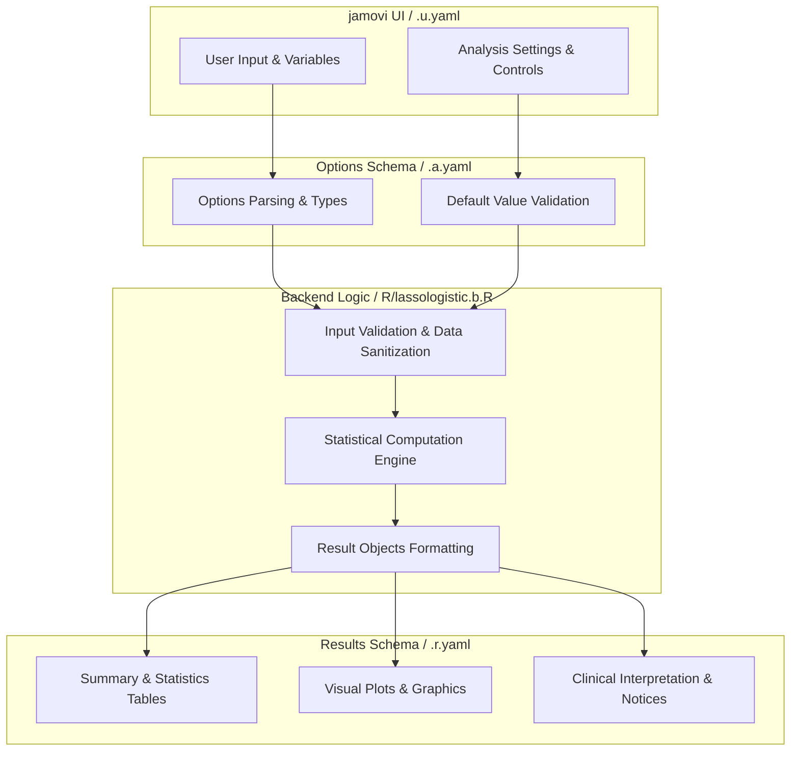
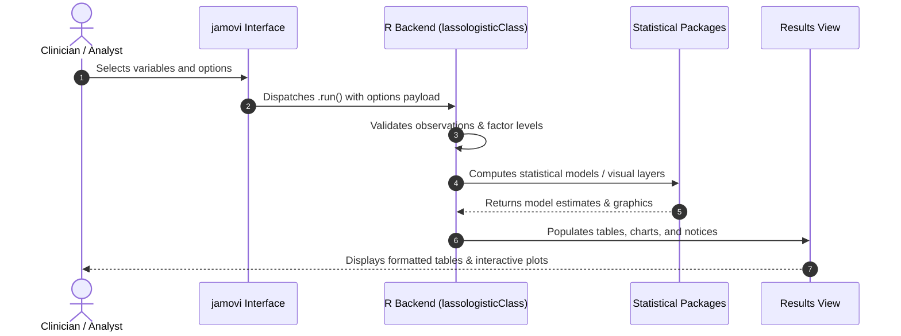

# LASSO Logistic Regression - Developer Documentation

## 1. Overview

- **Function**: `lassologistic`
- **Title**: LASSO Logistic Regression
- **Module**: `meddecide`
- **Files**:
  - `jamovi/lassologistic.u.yaml` - User Interface Definition
  - `jamovi/lassologistic.a.yaml` - Options & Schema Definition
  - `jamovi/lassologistic.r.yaml` - Results Layout & Tables
  - `R/lassologistic.b.R` - Backend Implementation
- **Summary**: Performs LASSO-penalized logistic regression for variable selection in binary classification problems. Ideal for diagnostic pathology studies that build classifiers (e.g., tumor type A vs B) with automatic feature selection.

## 1a. Changelog

- **Date**: 2026-08-29
- **Summary**: Comprehensive documentation suite created & verified against active schemas and backend implementation.

## 2. Options Reference (`.a.yaml`)

| Option | Type | Default | Description |
| :--- | :--- | :--- | :--- |
| `data` | `Data` | `NULL` |  |
| `outcome` | `Variable` | `NULL` | Binary Outcome |
| `outcomeLevel` | `Level` | `NULL` | Event Level |
| `explanatory` | `Variables` | `NULL` | Explanatory Variables |
| `penalty` | `List` | `lasso` | Penalty Type |
| `alpha` | `Number` | `0.5` | Elastic Net Mixing (0=Ridge, 1=LASSO) |
| `lambda` | `List` | `lambda.1se` | Lambda Selection Method |
| `nfolds` | `Integer` | `10` | Number of CV Folds |
| `random_seed` | `Integer` | `123456` | Random Seed |
| `standardize` | `Bool` | `TRUE` | Standardize variables |
| `suitabilityCheck` | `Bool` | `TRUE` | Data suitability assessment |
| `bootstrapValidation` | `Bool` | `FALSE` | Bootstrap internal validation |
| `bootstrapN` | `Integer` | `200` | Bootstrap Iterations |
| `cv_plot` | `Bool` | `TRUE` | Cross-validation plot |
| `coef_plot` | `Bool` | `TRUE` | Coefficient plot |
| `roc_plot` | `Bool` | `TRUE` | ROC curve |
| `scoringSystem` | `Bool` | `FALSE` | Scoring system |
| `scoringMethod` | `List` | `schneeweiss` | Scoring Method |
| `scoringMaxPoints` | `Integer` | `10` | Maximum Points per Feature |
| `scoreCutMethod` | `List` | `median` | Cut Point for Continuous Predictors |
| `scoreCutPoints` | `String` | `` | Manual Cut Points |
| `scoreLookupTable` | `Bool` | `TRUE` | Score-to-probability lookup table |
| `predictions` | `Output` | `NULL` | Add Predicted Probabilities |
| `showSummary` | `Bool` | `FALSE` | Results summary |
| `showExplanations` | `Bool` | `FALSE` | Method explanations |
| `showMethodologyNotes` | `Bool` | `FALSE` | Detailed methodology notes |
| `includeClinicalGuidance` | `Bool` | `FALSE` | Clinical interpretation guidance |
| `showVariableImportance` | `Bool` | `FALSE` | Variable importance analysis |
| `showModelComparison` | `Bool` | `FALSE` | Model comparison analysis |

## 3. Results Definition (`.r.yaml`)

| Output ID | Type | Title | Description |
| :--- | :--- | :--- | :--- |
| `todo` | `Html` | `To Do` |  |
| `notices` | `Html` | `Important Information` |  |
| `suitabilityReport` | `Html` | `Data Suitability Assessment` |  |
| `modelSummary` | `Table` | `Model Summary` |  |
| `coefficients` | `Table` | `Selected Variables` |  |
| `performance` | `Table` | `Classification Performance` |  |
| `scoringTable` | `Table` | `Scoring System` |  |
| `scoringPerformance` | `Table` | `Scoring System Performance` |  |
| `methodComparison` | `Table` | `Scoring Method Comparison` |  |
| `lookupTable` | `Table` | `Score-to-Probability Lookup` |  |
| `validationTable` | `Table` | `Bootstrap Internal Validation` |  |
| `cv_plot` | `Image` | `Cross-validation Plot` |  |
| `coef_plot` | `Image` | `Coefficient Plot` |  |
| `roc_plot` | `Image` | `ROC Curve` |  |
| `predictions` | `Output` | `Add Predicted Probabilities` |  |
| `summaryText` | `Html` | `Results Summary` |  |
| `lassoExplanation` | `Html` | `Understanding Penalized Logistic Regression` |  |
| `methodologyNotes` | `Html` | `Methodology Notes` |  |
| `clinicalGuidance` | `Html` | `Clinical Interpretation Guidance` |  |
| `variableImportance` | `Table` | `Variable Importance Analysis` |  |
| `modelComparison` | `Table` | `LASSO vs Unpenalized Logistic` |  |

## 4. Architecture & Data Flow Diagram

```mermaid
flowchart TD
  subgraph UI[jamovi UI / .u.yaml]
    U1[User Input & Variables]
    U2[Analysis Settings & Controls]
  end

  subgraph Opts[Options Schema / .a.yaml]
    O1[Options Parsing & Types]
    O2[Default Value Validation]
  end

  subgraph Backend[Backend Logic / R/lassologistic.b.R]
    B1[Input Validation & Data Sanitization]
    B2[Statistical Computation Engine]
    B3[Result Objects Formatting]
  end

  subgraph Res[Results Schema / .r.yaml]
    R1[Summary & Statistics Tables]
    R2[Visual Plots & Graphics]
    R3[Clinical Interpretation & Notices]
  end

  U1 --> O1
  U2 --> O2
  O1 --> B1
  O2 --> B1
  B1 --> B2
  B2 --> B3
  B3 --> R1
  B3 --> R2
  B3 --> R3
```

## 5. Execution Sequence

```mermaid
sequenceDiagram
  autonumber
  actor User as Clinician / Analyst
  participant UI as jamovi Interface
  participant Backend as R Backend (lassologisticClass)
  participant Engine as Statistical Packages
  participant Results as Results View

  User->>UI: Selects variables and options
  UI->>Backend: Dispatches .run() with options payload
  Backend->>Backend: Validates observations & factor levels
  Backend->>Engine: Computes statistical models / visual layers
  Engine-->>Backend: Returns model estimates & graphics
  Backend->>Results: Populates tables, charts, and notices
  Results-->>User: Displays formatted tables & interactive plots
```

## 6. Change Impact & Safety Guidelines

- **Data Filtering**: Ensure observations with missing values are handled gracefully according to analysis options.
- **Formula Conflicts**: Use isolated environment calls or base formula methods when interacting with `ggstatsplot` or formula parsers.
- **Safe Deparsing**: Use `deparse(val)` in syntax generation (`asSource()`) to escape column names with spaces or special symbols.

