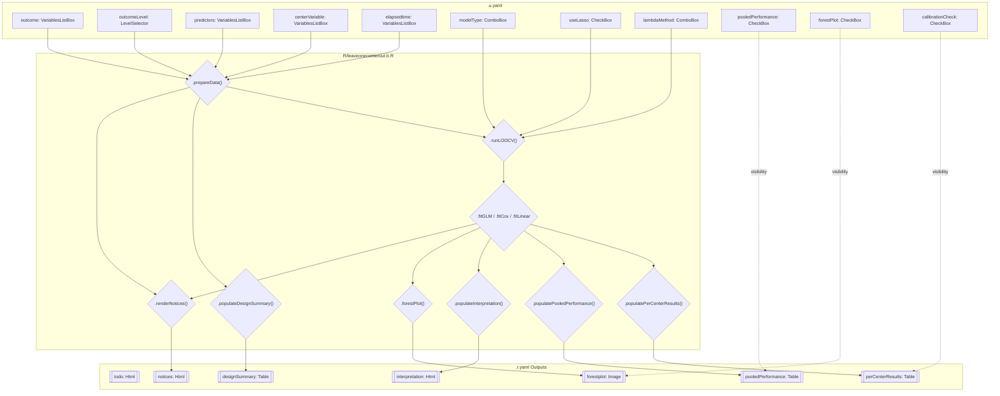
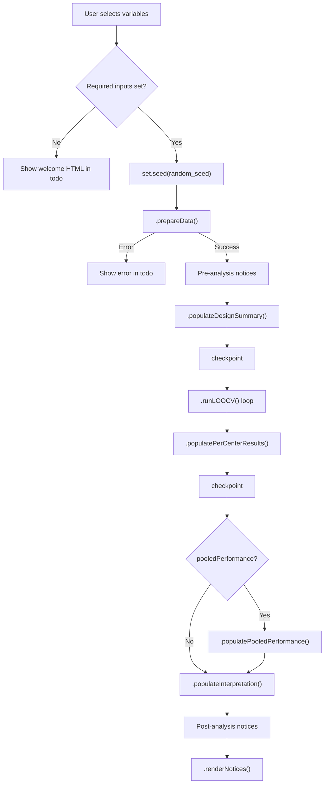

# Developer Documentation: leaveonecenterout

## 1. Overview

- **Function**: `leaveonecenterout`
- **Files**:
  - `jamovi/leaveonecenterout.u.yaml` -- UI
  - `jamovi/leaveonecenterout.a.yaml` -- Options
  - `R/leaveonecenterout.b.R` -- Backend
  - `jamovi/leaveonecenterout.r.yaml` -- Results
- **Summary**: Performs leave-one-center-out cross-validation (LOOCV) for multi-institutional prediction models. Trains on all-but-one center, evaluates on the held-out center, and repeats for each center. Supports logistic, Cox, and linear regression with optional LASSO regularization. Implements the internal-external validation framework recommended by TRIPOD (Debray et al., 2015).

## 2. UI Controls to Options Map

| UI Control | Type | Label | Binds to Option | Default | Enable/Visibility |
|---|---|---|---|---|---|
| outcome | VariablesListBox | Outcome Variable | `outcome` | (none) | -- |
| outcomeLevel | LevelSelector | Event Level | `outcomeLevel` | (auto) | `enable: (outcome)` |
| predictors | VariablesListBox | Predictor Variables | `predictors` | (none) | -- |
| centerVariable | VariablesListBox | Center / Institution Variable | `centerVariable` | (none) | -- |
| elapsedtime | VariablesListBox | Time Variable (Cox only) | `elapsedtime` | (none) | -- |
| modelType | ComboBox | Model Type | `modelType` | logistic | -- |
| useLasso | CheckBox | Use LASSO Regularization | `useLasso` | false | -- |
| lambdaMethod | ComboBox | Lambda Selection | `lambdaMethod` | lambda.1se | `enable: (useLasso)` |
| pooledPerformance | CheckBox | Show Pooled Performance | `pooledPerformance` | true | -- |
| forestPlot | CheckBox | Forest Plot | `forestPlot` | true | -- |
| calibrationCheck | CheckBox | Calibration Assessment | `calibrationCheck` | false | -- |
| random_seed | TextBox | Random Seed | `random_seed` | 42 | -- |

### UI Layout

```
VariableSupplier
  ├── Outcome Variable [outcome] + LevelSelector [outcomeLevel]
  ├── Predictor Variables [predictors]
  ├── Center / Institution Variable [centerVariable]
  └── Time Variable (Cox only) [elapsedtime]

CollapseBox: Model Options (expanded)
  ├── ComboBox [modelType]
  ├── CheckBox [useLasso]
  └── ComboBox [lambdaMethod] (enabled when useLasso=true)

CollapseBox: Output Options (collapsed)
  ├── CheckBox [pooledPerformance]
  ├── CheckBox [forestPlot]
  └── CheckBox [calibrationCheck]

TextBox [random_seed]
```

## 3. Options Reference (.a.yaml)

| Option | Type | Default | Constraints | Downstream Effects |
|---|---|---|---|---|
| `outcome` | Variable | -- | factor or numeric | Gates `.run()`; binary encoding for logistic/cox, numeric for linear |
| `outcomeLevel` | Level | (auto) | variable: (outcome) | Determines which factor level = event (coded as 1) |
| `predictors` | Variables | -- | factor or numeric | Model matrix columns; sanitized via `make.names()` |
| `centerVariable` | Variable | -- | factor | Defines CV folds; min 3 unique levels required |
| `elapsedtime` | Variable | -- | numeric | Survival time for Cox; required when modelType=cox |
| `modelType` | List | logistic | logistic/cox/linear | Routes to `.fitGLM`/`.fitCox`/`.fitLinear` (or LASSO variants) |
| `useLasso` | Bool | false | -- | Routes to LASSO fit methods; warning if linear+LASSO |
| `lambdaMethod` | List | lambda.1se | lambda.min/lambda.1se | Selects optimal lambda from `cv.glmnet` |
| `random_seed` | Integer | 42 | 1-999999 | `set.seed()` before LOOCV loop |
| `pooledPerformance` | Bool | true | -- | Controls pooled table visibility and computation |
| `forestPlot` | Bool | true | -- | Controls forest plot visibility |
| `calibrationCheck` | Bool | false | -- | Shows/hides Brier score column |

## 4. Backend Usage (.b.R)

### Execution Flow

1. **`.init()`** -- Shows welcome HTML if required variables not set
2. **`.run()`** -- Main orchestrator:
   - `.prepareData()` -- Encodes outcome, filters complete cases, validates centers
   - Pre-analysis notices (small centers, EPV, event level, LASSO+linear)
   - `.populateDesignSummary(prepared)` -- Study design table
   - `.runLOOCV(prepared)` -- Main CV loop over centers
   - `.populatePerCenterResults(cv_results)` -- Per-center results table
   - `.populatePooledPerformance(cv_results)` -- Pooled metrics (if enabled)
   - `.populateInterpretation(prepared, cv_results)` -- Rich HTML interpretation
   - Post-analysis notices (discrimination, heterogeneity, completion)
   - `.renderNotices()` -- Renders accumulated notices as HTML

### Model Fitting Methods

| Method | Model Type | LASSO | Evaluation |
|---|---|---|---|
| `.fitGLM()` | logistic | no | `.evaluateBinary()` via pROC |
| `.fitLassoLogistic()` | logistic | yes | `.evaluateBinary()` via pROC |
| `.fitCox()` | cox | no | `survival::concordance(reverse=TRUE)` |
| `.fitLassoCox()` | cox | yes | `survival::concordance(reverse=TRUE)` |
| `.fitLinear()` | linear | no | R-squared + RMSE |

### Notice System

Uses HTML-based notice pattern (protobuf-safe). Notices are accumulated via `.addNotice(type, content)` and rendered via `.renderNotices()` into the `notices` Html output.

| Notice | Type | Trigger |
|---|---|---|
| Small centers | warning | Any center with < 5 cases |
| Low EPV | strong_warning | Events per variable < 10 |
| Event level info | info | Always for logistic/cox |
| LASSO+linear | warning | useLasso=true + modelType=linear |
| Poor discrimination | strong_warning | Pooled AUC/C-index < 0.70 |
| Negative R-squared | strong_warning | Pooled R-squared < 0 (linear) |
| High heterogeneity | warning | SD across centers > 0.10 |
| Completion | info | Always |

## 5. Results Definition (.r.yaml)

| Output | Type | Title | Visibility | Populated By |
|---|---|---|---|---|
| `todo` | Html | To Do | always | `.init()`, `.run()` error handler |
| `notices` | Html | (untitled) | always | `.renderNotices()` |
| `designSummary` | Table | Study Design Summary | always | `.populateDesignSummary()` |
| `perCenterResults` | Table | Per-Center Results | always | `.populatePerCenterResults()` |
| `pooledPerformance` | Table | Pooled Performance | `(pooledPerformance)` | `.populatePooledPerformance()` |
| `forestplot` | Image | Center-Specific Performance | `(forestPlot)` | `.forestPlot()` |
| `interpretation` | Html | Interpretation | always | `.populateInterpretation()` |

### perCenterResults Column Schema

| Column | Title | Type | Visibility |
|---|---|---|---|
| `center` | Center (Test) | text | always |
| `n_train` | N Train | integer | always |
| `n_test` | N Test | integer | always |
| `n_events_test` | Events (Test) | integer | `(modelType:logistic \|\| modelType:cox)` |
| `auc` | Discrimination | number | always |
| `auc_ci_lower` | Lower (95% CI) | number | always |
| `auc_ci_upper` | Upper (95% CI) | number | always |
| `brier` | Brier | number | `(calibrationCheck)` |
| `accuracy` | Accuracy | number | `(modelType:logistic)` |
| `assessment` | Assessment | text | always |

### pooledPerformance Column Schema

| Column | Title | Type |
|---|---|---|
| `metric` | Metric | text |
| `mean_value` | Mean | number |
| `sd_value` | SD | number |
| `ci_lower` | Lower (95% CI) | number |
| `ci_upper` | Upper (95% CI) | number |
| `min_value` | Min | number |
| `max_value` | Max | number |

## 6. Data Flow Diagram



## 7. Execution Sequence



## 8. Change Impact Guide

| Option Changed | Recalculates | Affected Outputs | Notes |
|---|---|---|---|
| `outcome` | Everything | All outputs | Full recompute |
| `outcomeLevel` | Outcome encoding, all models | All outputs | Changes event/reference mapping |
| `predictors` | Model matrices, all folds | All except todo | More predictors = slower; EPV check |
| `centerVariable` | Fold structure, all models | All outputs | Must have 3+ unique levels |
| `elapsedtime` | Cox models only | perCenter, pooled, interpretation | Required only for modelType=cox |
| `modelType` | Model fitting method | All analysis outputs | Changes metric labels (AUC/C-index/R-squared) |
| `useLasso` | Model fitting method | perCenter, pooled, interpretation | Adds inner CV; slower |
| `lambdaMethod` | Lambda selection only | perCenter, pooled | Minimal impact |
| `random_seed` | LASSO inner CV randomness | perCenter, pooled | No effect without LASSO |
| `pooledPerformance` | Display only | pooledPerformance table | No recompute |
| `forestPlot` | Display only | forestplot image | No recompute |
| `calibrationCheck` | Display only | Brier column visibility | No recompute |

## 9. Example Usage

### Test Datasets

- `data/loocv_multicenter.rda` -- N=200, 5 centers, 12 variables (logistic, cox, linear)
- `data/loocv_small.rda` -- N=45, 3 centers, 9 variables (edge cases)

### R Wrapper Call

```r
leaveonecenterout(
    data = loocv_multicenter,
    outcome = "treatment_response",
    outcomeLevel = "Responder",
    predictors = c("age", "ki67_score", "tumor_size_mm", "grade"),
    centerVariable = "institution",
    elapsedtime = "os_time",
    modelType = "logistic",
    useLasso = TRUE,
    lambdaMethod = "lambda.1se",
    random_seed = 42,
    pooledPerformance = TRUE,
    forestPlot = TRUE,
    calibrationCheck = FALSE
)
```

### Expected Outputs

- **designSummary**: 9-10 rows showing N, centers, model type, EPV info
- **perCenterResults**: 5 rows (one per center), AUC with 95% CI, accuracy, assessment
- **pooledPerformance**: Up to 3 rows (AUC mean, Brier, Accuracy)
- **forestplot**: Forest plot with center-specific AUC and pooled line
- **interpretation**: Rich HTML with heterogeneity assessment and TRIPOD reference

## 10. Dependencies

| Package | Used For | Methods |
|---|---|---|
| `glmnet` | LASSO regularization | `cv.glmnet()`, `predict()` |
| `pROC` | AUC computation | `roc()`, `auc()`, `ci.auc()` |
| `survival` | Cox regression | `coxph()`, `Surv()`, `concordance()` |
