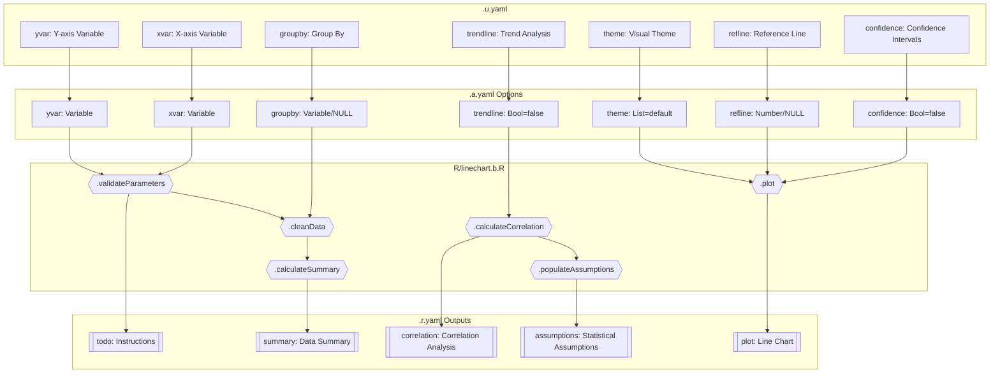
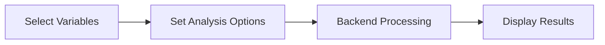
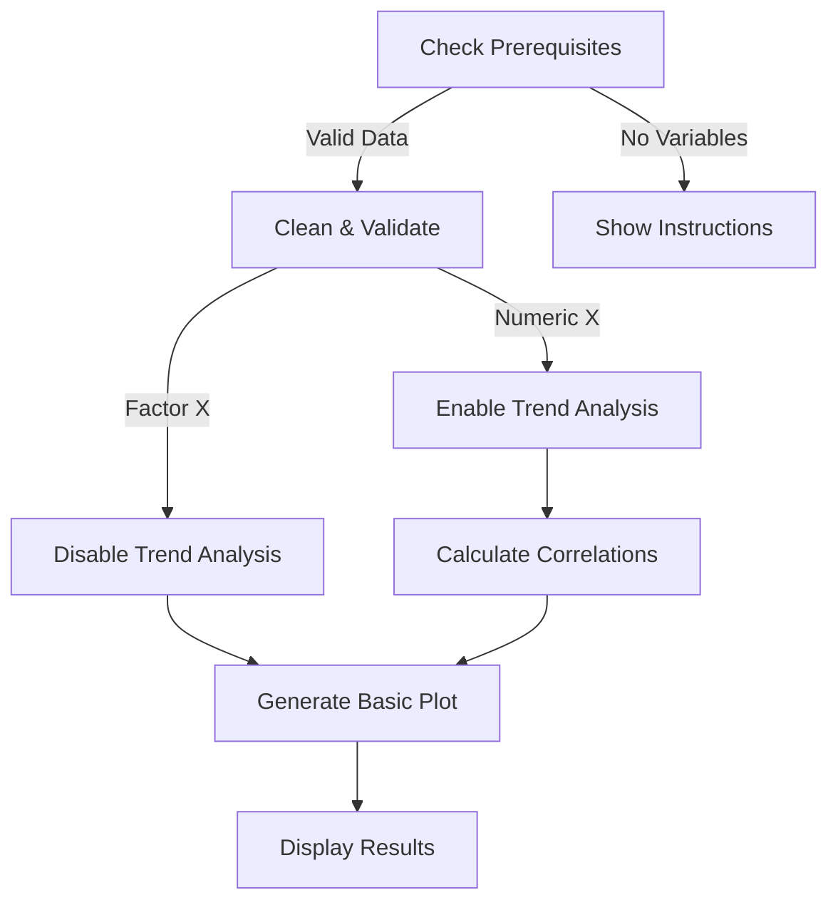
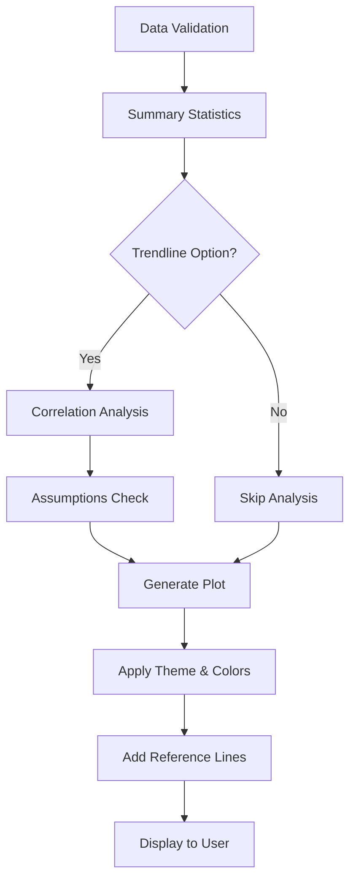

# Linechart Function Documentation

## 1. Overview

- **Function**: `linechart`
- **Files**:
  - `jamovi/linechart.u.yaml` — UI
  - `jamovi/linechart.a.yaml` — Options
  - `R/linechart.b.R` — Backend
  - `jamovi/linechart.r.yaml` — Results
- **Summary**: Creates line charts for time series analysis and trend visualization in clinical research. Supports multiple groups, confidence intervals, trend lines, and statistical overlays for analyzing longitudinal data, treatment responses, and biomarker trends over time.

## 2. UI Controls → Options Map

| UI Control | Type | Label | Binds to Option | Defaults & Constraints | Visibility/Enable Rules |
|------------|------|-------|-----------------|------------------------|-------------------------|
| xvar | VariablesListBox | X-axis Variable (Time/Sequence) | xvar | maxItemCount: 1, suggested: [continuous, ordinal] | Always visible |
| yvar | VariablesListBox | Y-axis Variable (Outcome) | yvar | maxItemCount: 1, suggested: [continuous] | Always visible |
| groupby | VariablesListBox | Group By (Optional) | groupby | maxItemCount: 1, suggested: [nominal, ordinal] | Always visible |
| points | CheckBox | Show Individual Data Points | points | default: true | Always visible |
| smooth | CheckBox | Smooth Trend Lines | smooth | default: false | Always visible |
| confidence | CheckBox | Show Confidence Intervals | confidence | default: false | Always visible |
| trendline | CheckBox | Add Linear Trend Analysis | trendline | default: false | Always visible |
| refline | TextBox | Reference Value | refline | format: number | Always visible |
| reflineLabel | TextBox | Reference Label | reflineLabel | format: string, default: "Reference" | Always visible |
| theme | ComboBox | Plot Theme | theme | options: [default, publication, minimal, classic], default: default | Always visible |
| colorPalette | ComboBox | Color Scheme | colorPalette | options: [clinical, default, colorblind, viridis], default: default | Always visible |
| title | TextBox | Chart Title | title | format: string | Always visible |
| xlabel | TextBox | X-axis Label | xlabel | format: string | Always visible |
| ylabel | TextBox | Y-axis Label | ylabel | format: string | Always visible |
| width | TextBox | Width (pixels) | width | format: number, default: 800, min: 300, max: 1200 | Always visible |
| height | TextBox | Height (pixels) | height | format: number, default: 600, min: 300, max: 1000 | Always visible |

## 3. Options Reference (.a.yaml)

| Name | Type | Default | Description | Downstream Effects |
|------|------|---------|-------------|-------------------|
| **xvar** | Variable | None | X-axis variable (time/sequence) | Used for x-axis plotting, correlation calculations, data validation |
| **yvar** | Variable | None | Y-axis variable (continuous) | Used for y-axis plotting, statistical analysis, data validation |
| **groupby** | Variable | None | Grouping variable for multiple lines | Creates separate lines per group, affects colors, legend generation |
| **confidence** | Bool | false | Display confidence intervals | Adds confidence bands around lines |
| **trendline** | Bool | false | Add trend line analysis | Triggers correlation analysis, linear regression, adds trend lines |
| **points** | Bool | true | Show individual data points | Adds/removes point markers on lines |
| **smooth** | Bool | false | Apply smoothing to lines | Uses loess smoothing for curved lines |
| **refline** | Number | None | Reference line value | Adds horizontal reference line at specified value |
| **reflineLabel** | String | "Reference" | Label for reference line | Text annotation for reference line |
| **colorPalette** | List | "default" | Color scheme selection | Determines plot color palette |
| **theme** | List | "default" | Overall visual theme | Controls plot appearance (grid, background, fonts) |
| **xlabel** | String | None | Custom X-axis label | Overrides default variable name |
| **ylabel** | String | None | Custom Y-axis label | Overrides default variable name |
| **title** | String | None | Custom plot title | Overrides auto-generated title |
| **width** | Integer | 800 | Plot width in pixels | Controls image dimensions |
| **height** | Integer | 600 | Plot height in pixels | Controls image dimensions |

## 4. Backend Usage (.b.R)

### Key Option Usage Patterns:

**self$options$xvar & self$options$yvar**
- **Code Locations**: `.init()`, `.run()`, `.cleanData()`, `.calculateSummary()`, `.calculateCorrelation()`, `.plot()`
- **Logic Summary**: Core variables for plotting; validated for existence, type compatibility, and completeness
- **Result Population**: Affects all outputs - todo, summary, correlation, assumptions, plot

**self$options$groupby**
- **Code Locations**: `.cleanData()`, `.calculateSummary()`, `.addGroupingAndLines()`, `.plot()`
- **Logic Summary**: When present, creates grouped analysis with separate lines and colors per group
- **Result Population**: Updates summary table with group information, affects plot aesthetics

**self$options$trendline**
- **Code Locations**: `.run()`, `.calculateCorrelation()`, `.addTrendlines()`, `.populateAssumptions()`
- **Logic Summary**: Triggers correlation analysis (Pearson, Spearman, R²), adds regression lines to plot
- **Result Population**: Populates correlation table, assumptions HTML, adds trend overlays to plot

**self$options$confidence**
- **Code Locations**: `.addGroupingAndLines()`, `.plot()`
- **Logic Summary**: Adds confidence interval bands using geom_smooth(se=TRUE)
- **Result Population**: Visual effect on plot only

**self$options$refline & self$options$reflineLabel**
- **Code Locations**: `.cleanData()`, `.addReferenceLines()`
- **Logic Summary**: Validates numeric value, adds horizontal reference line with label
- **Result Population**: Visual annotation on plot

**self$options$theme & self$options$colorPalette**
- **Code Locations**: `.plot()`, `.addLabelsAndTheme()`
- **Logic Summary**: Controls visual appearance through ggplot2 themes and color scales
- **Result Population**: Affects plot styling only

## 5. Results Definition (.r.yaml)

| Output ID | Type | Title | Visibility | Schema/Details |
|-----------|------|-------|------------|----------------|
| **todo** | Html | Instructions | Always visible | Welcome message, warnings, guidance |
| **summary** | Table | Data Summary | Always visible | Columns: statistic (text), value (text) |
| **correlation** | Table | Correlation Analysis | Visible when `trendline=true` | Columns: measure (text), value (number), interpretation (text) |
| **assumptions** | Html | Statistical Assumptions & Guidelines | Visible when `trendline=true` | HTML content with statistical test results |
| **plot** | Image | Line Chart: {yvar} by {xvar} | Always visible | 800x600 default, renderFun=".plot" |

### Population Entry Points:

- **todo**: `.showWelcomeMessage()`, `.checkDataQuality()`, `.generateNaturalSummary()`
- **summary**: `.run()` via summary table population
- **correlation**: `.run()` when trendline=true, populated with correlation statistics
- **assumptions**: `.populateAssumptions()` with linearity and normality checks
- **plot**: `.plot()` function generates ggplot2 object

## 6. Data Flow Diagram (UI → Options → Backend → Results)



## 7. Execution Sequence (User Action → Results)

### User Input Flow


### Decision Logic


### Result Processing


**Step-by-step execution flow:**

1. **User selects variables** → UI updates xvar, yvar, and optional groupby
2. **Backend validation** → Check for missing data, variable types, compatibility
3. **Data cleaning** → Remove NAs, convert types, validate ranges
4. **Summary calculation** → Compute n, mean, SD, range for selected variables
5. **Conditional analysis** → If trendline=true, calculate correlations and test assumptions
6. **Plot generation** → Build ggplot2 object with layers based on options
7. **Results population** → Update all result objects with computed values
8. **Display application** → Show visible results based on option states

## 8. Change Impact Guide

| Option | Impact When Changed | Common Pitfalls | Recommended Defaults |
|--------|-------------------|-----------------|---------------------|
| **xvar** | Recalculates all statistics, redraws plot | Non-ordered factors may produce unexpected sequences | Use time/sequence variables |
| **yvar** | Recalculates all statistics, redraws plot | Must be numeric; factors will cause errors | Use continuous outcomes |
| **groupby** | Creates multiple lines, affects color palette | Too many groups (>8) creates cluttered plot | Limit to 2-4 groups |
| **trendline** | Triggers correlation analysis, adds computational overhead | Only works with numeric X variables | Enable for dose-response or time trends |
| **confidence** | Adds confidence bands, slight performance impact | May obscure data points | Enable for small samples |
| **refline** | Adds reference line, no recalculation | Must be within Y-axis range to be visible | Use clinical thresholds |
| **theme** | Visual change only, instant update | Some themes may not print well | Use "default" for screen, "publication" for papers |

## 9. Example Usage

### Example Dataset Requirements:
- **X variable**: Numeric or ordered factor (e.g., time points, visits, doses)
- **Y variable**: Numeric continuous (e.g., lab values, scores, measurements)
- **Group variable** (optional): Factor with 2-8 levels (e.g., treatment arms)

### Example Option Payload:
```yaml
xvar: visit_month
yvar: hemoglobin_level
groupby: treatment_group
confidence: true
trendline: true
refline: 12.0
reflineLabel: "Normal Range Lower Limit"
theme: publication
colorPalette: clinical
title: "Hemoglobin Levels Over Time by Treatment"
```

### Expected Outputs:
- **Summary Table**: N=120, 6 time points, mean hemoglobin trends
- **Correlation Table**: Pearson r=0.42, p<0.05, positive trend
- **Assumptions Panel**: Linearity satisfied, residuals normal
- **Plot**: Publication-ready line chart with confidence bands and trend lines

## 10. Appendix (Schemas & Snippets)

### Summary Table Schema:
```yaml
columns:
  - name: statistic
    title: Statistic
    type: text
    values: ["N (observations)", "Time points", "Mean (Y)", "SD (Y)", "Range (Y)"]
  - name: value
    title: Value
    type: text
    format: character representation of numeric values
```

### Correlation Table Schema:
```yaml
columns:
  - name: measure
    title: Measure
    type: text
    values: ["Pearson Correlation", "Spearman Correlation", "R-squared", "Slope", "p-value"]
  - name: value
    title: Value
    type: number
    format: rounded to 3 decimal places
  - name: interpretation
    title: Interpretation
    type: text
    values: Clinical interpretation strings
```

### Key Code Bindings:

**Option Access Pattern:**
```r
# In .run() method
xvar <- self$options$xvar
yvar <- self$options$yvar
if (!is.null(self$options$groupby)) {
    # Handle grouped analysis
}
```

**Result Population Pattern:**
```r
# Populate summary table
table$addRow(rowKey = 1, values = list(
    statistic = "N (observations)",
    value = as.character(nrow(data))
))

# Set plot
image <- self$results$plot
image$setState(plot_object)
```

**Visibility Control:**
```r
# In .r.yaml
visible: (trendline)  # Shows only when trendline option is true
```

---

*Generated documentation for the ClinicoPath jamovi module linechart function.*